# Notes On Stable Maps And Quantum Cohomology

W. Fulton and R. Pandharipande

Dedicated to the memory of Claude Itzykson

# Contents

0. Introduction 1   
1. Stable maps and their moduli spaces 10   
2. Boundedness and a quotient approach 13   
3. A rigidification of ${ \overline { { \mathcal { M } } } } _ { g , n } ( \mathbf { P } ^ { r } , d )$ 14   
4. The construction of ${ \overline { { M } } } _ { g , n } ( \mathbf { P } ^ { r } , d )$ 18   
5. The construction of ${ \overline { { M } } } _ { g , n } ( X , { \beta } )$ 26   
6. The boundary of ${ \overline { { M } } } _ { 0 , n } ( X , { \beta } )$ 30   
7. Gromov-Witten invariants 33   
8. Quantum cohomology 36   
9. Applications to enumerative geometry 40   
10. Variations 47

References 51

# 0. Introduction

0.1. Overview. The aim of these notes is to describe an exciting chapter in the recent development of quantum cohomology. Guided by ideas from physics (see [W]), a remarkable structure on the solutions of certain rational enumerative geometry problems has been found: the solutions are coefficients in the multiplication table of a quantum cohomology ring. Associativity of the ring yields non-trivial relations among the enumerative solutions. In many cases, these relations suffice to solve the enumerative problem. For example, let $N _ { d }$ be the number of degree $d$ , rational plane curves passing through $3 d - 1$ general points in $\mathbf { P } ^ { 2 }$ . Since there is a unique line passing through 2 points, $N _ { 1 } = 1$ . The quantum cohomology ring of $\mathbf { P } ^ { 2 }$ yields the following beautiful associativity relation determining all $N _ { d }$ for $d \geq 2$ :

$$
N _ {d} = \sum_ {d _ {1} + d _ {2} = d, d _ {1}, d _ {2} > 0} N _ {d _ {1}} N _ {d _ {2}} \left(d _ {1} ^ {2} d _ {2} ^ {2} \binom {3 d - 4} {3 d _ {1} - 2} - d _ {1} ^ {3} d _ {2} \binom {3 d - 4} {3 d _ {1} - 1}\right).
$$

Similar enumerative formulas are valid on other homogeneous varieties. Viewed from classical enumerative geometry, the quantum ring structure is a complete surprise.

The path to quantum cohomology presented here follows the work of Kontsevich and Manin. The approach is algebro-geometric and involves the construction and geometry of a natural compactification of the moduli space of maps. The large and exciting conjectural parts of the subject of quantum cohomology are avoided here. We focus on a part of the story where the proofs are complete. We also make many assumptions that are not strictly necessary, but which simplify the presentation.

It should be emphasized that this is in no way a survey of quantum cohomology, or any attempt at evaluating various approaches. In particular, the symplectic point of view is not covered (see [R-T]). Another algebro-geometric approach, using a different compactification, can be found in [L-T 1].

These notes are based on a jointly taught course at the University of Chicago in which our main efforts were aimed at understanding the papers of Kontsevich and Manin. We thank R. Donagi for instigating this course. Thanks are due to D. Abramovich, P. Belorousski, I. Ciocan-Fontanine, C. Faber, T. Graber, S. Kleiman, A. Kresch, C. Procesi, K. Ranestad, H. Tamvakis, J. Thomsen, E. Tjøtta, and A. Vistoli for comments and suggestions. A seminar course at the Mittag-Leffler Institute has led to many improvements. Some related preprints that have appeared since the Santa Cruz conference are pointed out in footnotes.

0.2. Notation. In this exposition, for simplicity, we consider only homology classes of even dimension. To avoid doubling indices, we set, for a complete variety $X$ ,

$$
A _ {d} X = H _ {2 d} (X, \mathbb {Z}), \quad A ^ {d} X = H ^ {2 d} (X, \mathbb {Z}).
$$

When $X$ is nonsingular of dimension $n$ , identify $A ^ { d } X$ with $A _ { n - d } X$ by the Poincar´e duality isomorphism

$$
A ^ {d} X \stackrel {\sim} {\to} A _ {n - d} X, c \mapsto c \cap [ X ].
$$

In particular, a closed subvariety $V$ of $X$ of pure codimension $d$ determines classes in $A _ { n - d } X$ and $A ^ { d } X$ via the duality isomorphism. Both of these classes are denoted by $[ V ]$ . For homogeneous varieties, which are our main concern, the Chow groups coincide with the topological groups. Hence $A _ { d } X$ and $A ^ { d } X$ can be taken to be the Chow homology and cohomology groups for homogeneous varieties (see [F]).

If $X$ is complete, and $c$ is a class in the ring $A ^ { * } X = \oplus A ^ { d } X$ , and $\beta$ is a class in $A _ { k } X$ , we denote by $\textstyle \int _ { \beta } c$ the degree of the class of the zero cycle obtained by evaluating $c _ { k }$ on $\beta$ , where $c _ { k }$ is the component of $c$ in $A ^ { k } X$ . When $V$ is a closed, pure dimensional subvariety of $X$ , we write $\ j _ { V } c$ instead of $\int _ { [ V ] } c$ . We use cup product notation $\cup$ for the product in $A ^ { * } X$ .

We will be concerned only with varieties over $\mathbb { C }$ since the relevant moduli spaces have not yet been constructed in positive characteristic. Let $[ n ]$ denote the finite set of integers $\{ 1 , 2 , \ldots , n \}$ .

0.3. Compactifications of moduli spaces. An important feature of quantum cohomology is the use of intersection theory in a space of maps of curves into a variety, rather than in the variety itself. To carry this out, a good compactification of such a space is required. At least when $X$ is sufficiently positive, Kontsevich has constructed such a compactification. We start, in this section, by reviewing some

related moduli spaces with similar properties. Kontsevich’s space of stable maps will be introduced in section 0.4.

Algebraic geometers by now have become quite comfortable working with the moduli space $M _ { g }$ of projective nonsingular curves of genus $g$ , and its compactification $\overline { { M } } _ { g }$ , whose points correspond to projective, connected, nodal curves of arithmetic genus $g$ , satisfying a stability condition (due to Deligne and Mumford) that guarantees the curve has only a finite automorphism group. These moduli spaces are irreducible varieties of dimension $3 g - 3$ if $g \geq 2$ , smooth if regarded as (Deligne-Mumford) stacks, and with orbifold singularities if regarded as ordinary coarse moduli spaces.

Some related spaces have become increasingly important. The moduli space $M _ { g , n }$ parametrizes projective nonsingular curves $C$ of genus together with dis-$g$ $n$ tinct marked points $p _ { 1 } , \ldots , p _ { n }$ on $C$ . $M _ { g , n }$ has a compactification ${ \overline { { M } } } _ { g , n }$ whose points correspond to projective, connected, nodal curves $C$ , together with $n$ distinct, nonsingular, marked points, again with a stability condition equivalent to the finiteness of automorphism groups. $\overline { { M } } _ { g , 1 }$ is often called the universal curve over $\overline { { M } } _ { g }$ (although, as coarse moduli spaces, this is a slight abuse of language).

The first remarkable feature of the space $\overline { { M } } _ { g , n }$ is that it compactifies $M _ { g , n }$ without ever allowing the points to come together. When points on a smooth curve approach each other, in fact, the curve sprouts off one or more components, each isomorphic to the projective line, and the points distribute themselves at smooth points on these new components, in a way that reflects the relative rates of approach.

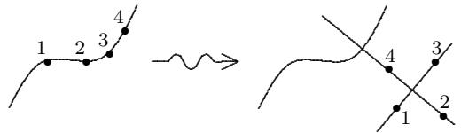

The spaces $\overline { { M } } _ { g , n }$ again are smooth stacks, or orbifold coarse moduli spaces, of dimension $3 g - 3 + n$ , as long as this integer is nonnegative. The case of genus zero plays a prominent role in our story. In this case, ${ \overline { { M } } } _ { 0 , n }$ is a fine moduli space and a nonsingular variety. A point in ${ \overline { { M } } } _ { 0 , n }$ corresponds to a curve which is a tree of projective lines meeting transversally, with $n$ distinct, nonsingular, marked points; the stability condition is that each component must have at least three special points, which are either the marked points or the nodes where the component meets the other components.

For $n = 3$ , of course, $M _ { 0 , 3 } = \overline { { M } } _ { 0 , 3 }$ is a point. For $n = 4$ , $M _ { 0 , 4 }$ parametrizes 4 distinct marked points on a projective line. Since, up to isomorphism, one can fix the first three of these points, say to be $0$ , 1, and $\infty$ , $M _ { 0 , 4 }$ is isomorphic to $\mathbf { P } ^ { 1 } \setminus \{ 0 , 1 , \infty \}$ . It is not hard to guess what $\overline { { M } } _ { 0 , 4 }$ must be. In fact, the three added points are represented by the following three marked curves:

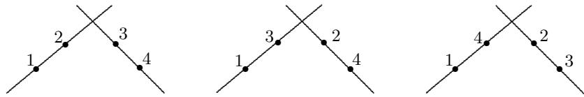

In general, the closures of the loci of trees of a given combinatorial type are smooth subvarieties of ${ \overline { { M } } } _ { 0 , n }$ , and all such loci meet transversally. There is a divisor $D ( A | B )$ in $\overline { { M } } _ { 0 , n }$ for each partition of $[ n ]$ into two disjoint sets $A$ and $B$ , each with at

least two elements. A generic point of $D ( A | B )$ is represented by two lines meeting transversally, with points labeled by $A$ and $B$ on each:

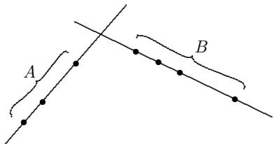

It is convenient to allow labeling by finite sets other than $[ n ]$ ; we write $\overline { { M } } _ { g , A }$ for the corresponding moduli space where $A$ is the labeling set. Let $B \subset A$ (if $g = 0$ , then let $| B | \ge 3$ ). It is a fundamental fact that there is a morphism $\overline { { { M } } } _ { g , A } \longrightarrow \overline { { { M } } } _ { g , B }$ which “forgets” the points marked in $A \backslash B$ . On the open locus $M _ { g , n }$ this map is the obvious one, but it is more subtle on the boundary: removing some points may make a component unstable, and such a component must be collapsed. For example, the map from $\overline { { M } } _ { 0 , 5 }$ to $\overline { { M } } _ { 0 , 4 }$ forgetting the point labeled 5 sends

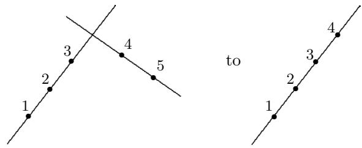

and

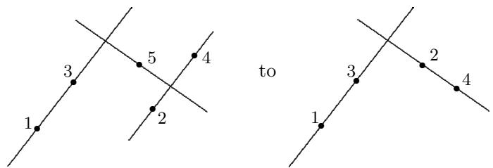

The algebra that shows this is a morphism is carried out in [Kn].

In particular, for any subset $\{ i , j , k , l \}$ of four integers in $[ n ]$ , we have a morphism from ${ \overline { { M } } } _ { 0 , n }$ to $\overline { { M } } _ { 0 , \{ i , j , k , l \} }$ . The inverse image of the point $P ( i , j \mid k , l )$

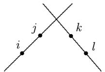

is a divisor on ${ \overline { { M } } } _ { 0 , n }$ . This inverse image is a multiplicity-free sum of divisors $D ( A | B )$ : the sum is taken over all partitions $A \cup B \ = \ [ n ]$ satisfying $i , j ~ \in ~ A$ and $k , l \in B$ . The fact that the three boundary points in ${ \overline { { M } } } _ { 0 , \{ i , j , k , l \} } \cong { \bf P } ^ { 1 }$ are linearly equivalent implies their inverse images in $\overline { { M } } _ { 0 , n }$ are linearly equivalent as well. Hence, the fundamental relation is obtained:

$$
\sum_ {i, j \in A k, l \in B} D (A | B) = \sum_ {i, k \in A j, l \in B} D (A | B) = \sum_ {i, l \in A j, k \in B} D (A | B) \tag {1}
$$

in $A ^ { 1 } ( \overline { { M } } _ { 0 , n } )$ . Keel [Ke] has shown that the classes of these divisors $D ( A | B )$ generate the Chow ring, and that the relations (1), together with the (geometrically obvious) relations $D ( A | B ) { \cdot } D ( A ^ { \prime } | B ^ { \prime } ) = 0$ if there are no inclusions among the sets $A$ , $B$ , $A ^ { \prime }$ , $B ^ { \prime }$ , give a complete set of relations.

0.4. The space of stable maps. In the remainder of the introduction, the basic ideas and constructions in quantum cohomology are introduced. The goal here is to give a precise overview with no proofs. The ideas introduced here are covered carefully (with proofs) in the main sections of these notes.

Let $X$ be a smooth projective variety, and let $\beta$ be an element in $A _ { 1 } X$ . Let $M _ { g , n } ( X , \beta )$ be the set of isomorphism classes of pointed maps $( C , p _ { 1 } , \ldots , p _ { n } , \mu )$ where $C$ is a projective nonsingular curve of genus $g$ , the markings $p _ { 1 } , \ldots , p _ { n }$ are distinct points of $C$ , and $\mu$ is a morphism from $C$ to $X$ satisfying $\mu _ { * } ( [ C ] ) = \beta$ . $( C , p _ { 1 } , \ldots , p _ { n } , \mu )$ is isomorphic to $( C ^ { \prime } , p _ { 1 } ^ { \prime } , \ldots , p _ { n } ^ { \prime } , \mu ^ { \prime } )$ if there is a scheme isomorphism $\tau : C \to C ^ { \prime }$ taking $p _ { i }$ to $p _ { i } ^ { \prime }$ , with $\mu ^ { \prime } \circ \tau = \mu$ . Of course, if $\beta \neq 0$ , $M _ { g , n } ( X , \beta )$ is empty unless $\beta$ is the class of a curve in $X$ . There are also other problems. For example, if $g = 0$ , which will be the case of interest to us, $M _ { g , n } ( X , \beta )$ is empty if $\beta \neq 0$ and $X$ contains no rational curves. To obtain a well-behaved space, one needs to make strong assumptions on $X$ . In general, there is a compactification

$$
M _ {g, n} (X, \beta) \subset \overline {{M}} _ {g, n} (X, \beta),
$$

whose points correspond to stable maps $( C , p _ { 1 } , \ldots , p _ { n } , \mu )$ where $C$ a projective, connected, nodal curve of arithmetic genus $g$ , the markings $p _ { 1 } , \ldots , p _ { n }$ are distinct nonsingular points of $C$ , and $\mu$ is a morphism from $C$ such that $\mu _ { * } ( [ C ] ) \ = \ \beta$ . Again, the stability condition (due to Kontsevich) is equivalent to finiteness of automorphisms of the map. Alternatively, $( C , p _ { 1 } , \ldots , p _ { n } , \mu )$ is a stable map if both of the following conditions hold for every irreducible component $E \subset C$ :

(1) If $E \cong \mathbf { P } ^ { 1 }$ and $E$ is mapped to a point by $\mu$ , then $E$ must contain at least three special points (either marked points or points where $E$ meets the other components of $C$ ).   
(2) If $E$ has arithmetic genus 1 and $E$ is mapped to a point by $\mu$ , then $E$ must contain at least one special point.

Condition (2) is relevant only in case $g = 1$ , $n = 0$ , and $\beta = 0$ (in other cases, (2) is automatically satisfied). From conditions (1) and (2), it follows that $\overline { { { M } } } _ { 1 , 0 } ( X , 0 ) =$ $\varnothing$ . Thus, in practice, (1) is the important condition.

When $X$ is a point, so $\beta = 0$ , one recovers the pointed moduli space of curves $\overline { { { M } } } _ { g , n } \cong \overline { { { M } } } _ { g , n } ( \mathrm { p o i n t } , 0 )$ . When $X \cong \mathbf { P } ^ { r }$ is a projective space, we write ${ \overline { { M } } } _ { g , n } ( \mathbf { P } ^ { r } , d )$ in place of $\overline { { { M } } } _ { g , n } ( { \bf P } ^ { r } , d [ \mathrm { l i n e } ] )$ .

The simplest example is ${ \overline { { M } } } _ { 0 , 0 } ( \mathbf { P } ^ { r } , 1 )$ , which is the Grassmannian ${ \bf G } ( { \bf P } ^ { 1 } , { \bf P } ^ { r } )$ . If $n \geq 1$ , ${ \overline { { M } } } _ { 0 , n } ( \mathbf { P } ^ { r } , 1 )$ is a locally trivial fibration over ${ \bf G } ( { \bf P } ^ { 1 } , { \bf P } ^ { r } )$ with the configuration space $\mathbf { P } ^ { \mathrm { 1 } } [ n ]$ of [F-M] as the fiber. Let us look at the space $\overline { { { M } } } _ { 0 , 0 } ( \mathbf { P } ^ { 2 } , 2 )$ . An open set in this space is the space of nonsingular conics, since to each such conic $D$ there is an isomorphism ${ \bf P } ^ { 1 } \stackrel { \sim } {  } D \subset { \bf P } ^ { 2 }$ , unique up to equivalence. Singular conics $D$ that are the unions of two lines are similarly the isomorphic image $C \stackrel { \sim } {  } D \subset { \bf P } ^ { 2 }$ , where $C$ is the union of two projective lines meeting transversally at a point. This gives:

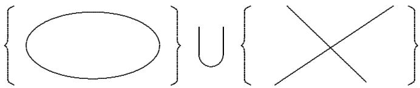

We also have maps from the same $C$ to $\mathbf { P } ^ { 2 }$ sending each line in the domain onto the same line in $\mathbf { P } ^ { 2 }$ . To determine this map up to isomorphism, however, the point that is the image of the intersection of the two lines must be specified, so the data for this is a line in $\mathbf { P } ^ { 2 }$ together with a point on it. Finally, there are maps from $\mathbf { P } ^ { 1 }$ to a line in the plane that are branched coverings of degree two onto a line in the plane. These are determined by specifying the line together with the two branch points. The added points consist of:

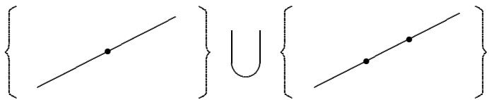

Thus, we recover the classical space of complete conics – but in quite a different realization from the usual one. The same discussion is valid when $\mathbf { P } ^ { 2 }$ is replaced by $\mathbf { P } ^ { r }$ , but this time the space is not the classical space of complete conics in space. The classical space specifies a plane together with a complete conic contained in the plane; Kontsevich’s space has blown down all the planes containing a given line.

Let $X$ be a complete nonsingular variety with tangent bundle $T _ { X }$ . $X$ is convex if, for every morphism $\mu : \mathbf { P } ^ { 1 } \to X$ ,

$$
H ^ {1} \left(\mathbf {P} ^ {1}, \mu^ {*} \left(T _ {X}\right)\right) = 0. \tag {2}
$$

Convexity is a very restrictive condition on $X$ . The main examples of convex varieties are homogeneous spaces $X = G / P$ , where $G$ is a Lie group and $P$ is a parabolic subgroup. Since $G$ acts transitively on $X$ , $T _ { X }$ is generated by global sections. Hence, $\mu ^ { * } ( T _ { X } )$ is globally generated for every morphism of $\mathbf { P } ^ { 1 }$ , and the vanishing (2) is obtained. Projective spaces, Grassmannians, smooth quadrics, flag varieties, and products of such varieties are all homogeneous. It is for homogeneous spaces that the theory of quantum cohomology takes its simplest form. The development of quantum cohomology in sections 7–10 is carried out only in the homogeneous case. Other examples of convex varieties include abelian varieties and projective bundles over curves of positive genus.

The genus 0 moduli space of stable maps is well-behaved in case $X$ is convex. In this case, ${ \overline { { M } } } _ { 0 , n } ( X , { \beta } )$ exists as a projective nonsingular stack or orbifold coarse moduli space, containing $M _ { 0 , n } ( X , \beta )$ as a dense open subset. When ${ \overline { { M } } } _ { 0 , n } ( X , { \beta } )$ is nonempty, its dimension is given by

$$
\dim \overline {{M}} _ {0, n} (X, \beta) = \dim X + \int_ {\beta} c _ {1} (T _ {X}) + n - 3.
$$

Here, $c _ { 1 } ( T _ { X } )$ is the first Chern class of the tangent bundle to $X$ . We assume always that the right side of this equation is nonnegative. In the stack or orbifold sense, this is a compactification with normal crossing divisors. When $X$ is projective space, ${ \overline { { M } } } _ { 0 , n } ( X , d )$ is irreducible. These assertions are Theorems 1–3 in these notes and are established in sections 1–6.

We will also write $\overline { { M } } _ { 0 , A } ( X , \beta )$ when the index set is a set $A$ instead of $[ n ]$ . These varieties also have forgetful morphisms $\overline { { { M } } } _ { 0 , A } ( X , \beta )  \overline { { { M } } } _ { 0 , B } ( X , \beta )$ when $B$

is a subset of $A$ . In addition, if $| { \cal A } | \geq 3$ , there are morphisms $\overline { { { M } } } _ { 0 , A } ( X , \beta )  \overline { { { M } } } _ { 0 , A }$ that forget the map $\mu$ . In both these cases, as before, one must collapse components that become unstable.

When $X$ is convex, the spaces ${ \overline { { M } } } _ { 0 , n } ( X , { \beta } )$ have fundamental boundary divisors analogous to the divisors $D ( A | B )$ on ${ \overline { { M } } } _ { 0 , n }$ . Let $n \geq 4$ . Let $A \cup B$ be a partition of $[ n ]$ . Let $\beta _ { 1 } + \beta _ { 2 } = \beta$ be a sum in $A _ { 1 } X$ . There is a divisor in ${ \overline { { M } } } _ { 0 , n } ( X , { \beta } )$ determined by:

$$
(3) \qquad D (A, B; \beta_ {1}, \beta_ {2}) = \overline {{M}} _ {0, A \cup \{\bullet \}} (X, \beta_ {1}) \times_ {X} \overline {{M}} _ {0, B \cup \{\bullet \}} (X, \beta_ {2}),
$$

$$
D (A, B; \beta_ {1}, \beta_ {2}) \subset \overline {{M}} _ {0, n} (X, \beta).
$$

A moduli point in $D ( A , B , \beta _ { 1 } , \beta _ { 2 } )$ corresponds to a map with a reducible domain $C = C _ { 1 } \cup C _ { 2 }$ where $\mu _ { * } ( [ C _ { 1 } ] ) = \beta _ { 1 }$ and $\mu _ { * } ( [ C _ { 2 } ] ) = \beta _ { 2 }$ . The points labeled by $A$ lie on $C _ { 1 }$ and points labeled by $B$ lie on $C _ { 2 }$ . The curves $C _ { 1 }$ and $C _ { 2 }$ are connected at the points labeled $\bullet$ .

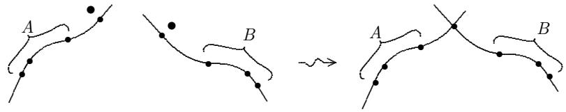

Finally, the fiber product in the definition (3) corresponds to the condition that the maps must take the same value in $X$ on the marked point $\bullet$ in order to be glued. This fiber product is defined via evaluation maps discussed in the next section.

For $i , j , k , l$ distinct in $[ n ]$ , set

$$
D (i, j \mid k, l) = \sum D (A, B; \beta_ {1}, \beta_ {2}).
$$

The sum is over all partitions $A \cup B = [ n ]$ with $i , j \in A$ and $k , l \in B$ and over all classes $\beta _ { 1 } , \beta _ { 2 } \in A _ { 1 } X$ satisfying $\beta _ { 1 } + \beta _ { 2 } = \beta$ . Using the projection ${ \overline { { M } } } _ { 0 , n } ( X , \beta ) \to$ $\overline { { M } } _ { 0 , \{ i , j , k , l \} } \cong { \bf P } ^ { 1 }$ , the fundamental linear equivalences

$$
D (i, j \mid k, l) = D (i, k \mid j, l) = D (i, l \mid j, k) \tag {4}
$$

on ${ \overline { { M } } } _ { 0 , n } ( X , { \beta } )$ are obtained via pull-back of the the 4-point linear equivalences on ${ \overline { { M } } } _ { 0 , \{ i , j , k , l \} }$ as in (1).

0.5. Gromov-Witten invariants and quantum cohomology. Let $X$ be a convex variety. For each marked point $1 \leq i \leq n$ , there is a canonical evaluation map

$$
\rho_ {i}: \overline {{M}} _ {0, n} (X, \beta) \to X
$$

defined for $\left[ C , p _ { 1 } , \ldots , p _ { n } , \mu \right]$ in ${ \overline { { M } } } _ { 0 , n } ( X , { \beta } )$ by:

$$
\rho_ {i} ([ C, p _ {1}, \dots , p _ {n}, \mu ]) = \mu (p _ {i}).
$$

Given classes $\gamma _ { 1 } , \dots , \gamma _ { n }$ in $A ^ { * } X$ , a product is determined in the ring $A ^ { * } ( { \overline { { M } } } _ { 0 , n } ( X , \beta ) )$ by:

$$
\rho_ {1} ^ {*} (\gamma_ {1}) \cup \dots \cup \rho_ {n} ^ {*} (\gamma_ {n}) \in A ^ {*} (\bar {M} _ {0, n} (X, \beta)). \tag {5}
$$

If $\begin{array} { r } { \sum \mathrm { c o d i m } ( \gamma _ { i } ) = \dim ( { \overline { { M } } } _ { 0 , n } ( X , \beta ) ) } \end{array}$ , the product (5) can be evaluated on the fundamental class of ${ \overline { { M } } } _ { 0 , n } ( X , { \beta } )$ . In this case, the Gromov-Witten invariant $I _ { \beta } ( \gamma _ { 1 } \cdots \gamma _ { n } )$

is defined by:

$$
I _ {\beta} \left(\gamma_ {1} \dots \gamma_ {n}\right) = \int_ {\overline {{M}} _ {0, n} (X, \beta)} \rho_ {1} ^ {*} \left(\gamma_ {1}\right) \cup \dots \cup \rho_ {n} ^ {*} \left(\gamma_ {n}\right). \tag {6}
$$

The multiplicative notation in the argument of $I _ { \beta }$ is used to indicate $I _ { \beta }$ is a symmetric function of the classes $\gamma _ { 1 } , \dots , \gamma _ { n }$ .

Let $X$ be a homogeneous space. Poincar´e duality and Bertini-type transversality arguments imply a relationship between the Gromov-Witten invariants and enumerative geometry. If $\gamma _ { i } = [ V _ { i } ]$ for a subvariety $V _ { i } ~ \subset ~ X$ , the Gromov-Witten invariant (6) equals the number of marked rational curves in $X$ with $i ^ { t h }$ marked point in $V _ { i }$ , suitably counted. For example, when $X = \mathbf { P } ^ { 2 }$ , $\beta = d [ \mathrm { l i n e } ]$ , $n = 3 d - 1$ , and each $V _ { i }$ is a point,

$$
N _ {d} = I _ {d} (\underbrace {\left[ p \right] \cdots \left[ p \right]} _ {3 d - 1}).
$$

The Gromov-Witten invariants are used to define the quantum cohomology ring. Associativity of this ring is established as a consequence of the 4-point linear equivalences (4). Associativity amounts to many equations among the Gromov-Witten invariants which often lead to a determination of all the invariants in terms of a few basic numbers.

Given $\gamma _ { 1 } , . . . , \gamma _ { n } \in H ^ { * } X$ (not necessarily of even degrees), there are more general Gromov-Witten invariants in $H ^ { * } \overline { { M } } _ { 0 , n }$ defined by

$$
I _ {0, n, \beta} ^ {X} \left(\gamma_ {1} \otimes \dots \otimes \gamma_ {n}\right) = \eta_ {*} \left(\rho_ {1} ^ {*} \left(\gamma_ {1}\right) \cup \dots \cup \rho_ {n} ^ {*} \left(\gamma_ {n}\right)\right)
$$

where $\eta : \overline { { { M } } } _ { 0 , n } ( X , \beta )  \overline { { { M } } } _ { 0 , n }$ is the projection. The set of multilinear maps

$$
\left\{I _ {0, n, \beta} ^ {X}: \left(H ^ {*} X\right) ^ {\otimes n} \rightarrow H ^ {*} \overline {{M}} _ {0, n} \right\}
$$

is called the Tree-Level System of Gromov-Witten Invariants. We will not need these generalities here.

The construction and proofs of the basic properties of ${ \overline { { M } } } _ { 0 , n } ( X , { \beta } )$ are undertaken in sections 1–6. The theory of Gromov-Witten invariants and quantum cohomology for homogeneous varieties is presented in sections 7–10 with the examples of $\mathbf { P } ^ { 2 }$ , $\mathbf { P } ^ { 3 }$ , and a smooth quadric 3-fold ${ \bf Q } ^ { 3 }$ worked out in detail. If Theorems 1–3 are taken for granted, sections 1–6 can be skipped. No originality is claimed for these notes except for some aspects of the proofs of Theorems 1–4. Constructions of Kontsevich’s moduli space of stable maps can also be found in [A], [K], [B-M]. In [A], a generalization to the case in which the domain is a surface is analyzed.

0.6. Calculation of $N _ { d }$ . We end this introduction by sketching how these moduli spaces of maps can be used to calculate the number $N _ { d }$ of degree $d$ rational plane curves passing through $3 d - 1$ general points in $\mathbf { P } ^ { 2 }$ . The formula (7) will be recovered in section 9 from the general quantum cohomology results, but it may be useful now to see a direct proof.

For $d = 1$ , $N _ { 1 } = 1$ is the number of lines through 2 points. $N _ { d }$ is determined for $d \geq 2$ by the recursion formula:

$$
\quad (7) \qquad N _ {d} = \sum_ {d _ {1} + d _ {2} = d, d _ {1}, d _ {2} > 0} N _ {d _ {1}} N _ {d _ {2}} \left(d _ {1} ^ {2} d _ {2} ^ {2} \binom {3 d - 4} {3 d _ {1} - 2} - d _ {1} ^ {3} d _ {2} \binom {3 d - 4} {3 d _ {1} - 1}\right).
$$

For example, (7) yields1 :

$$
N _ {2} = 1, N _ {3} = 1 2, N _ {4} = 6 2 0, N _ {5} = 8 7 3 0 4, N _ {6} = 2 6 3 1 2 9 7 6, \dots
$$

The strategy of proof is to utilize the fundamental linear relations (4) among boundary components of ${ \overline { { M } } } _ { 0 , n } ( \mathbf { P } ^ { 2 } , d )$ . Intersection of a curve $Y$ in this moduli space with the linear equivalence (4) will yield (7). We will take $n = 3 d$ (not $3 d - 1 )$ ) with $d \geq 2$ , so $n \geq 6$ . Label the marked points by the set

$$
\{1, 2, 3, \dots , n - 4, q, r, s, t \}.
$$

The forgetful morphism ${ \overline { { { M } } } _ { 0 , n } } ( { \bf P } ^ { 2 } , d ) \ \longrightarrow \ { \overline { { { M } } } _ { 0 , \{ q , r , s , t \} } }$ yields the relations (4) on ${ \overline { { M } } } _ { 0 , n } ( \mathbf { P } ^ { 2 } , d )$ :

(8) $D ( q , r \mid s , t ) = D ( q , s \mid r , t ) .$

Recall from section 0.4:

$$
D(q,r\mid s,t) = \sum_{q,r\in A,  s,t\in B,  d_{1} + d_{2} = d}D(A,B;d_{1},d_{2}).
$$

The curve $Y \subset { \overline { { M } } } _ { 0 , n } ( \mathbf { P } ^ { 2 } , d )$ is determined by a selection of general points and lines in $\mathbf { P } ^ { 2 }$ . More precisely, let $z _ { 1 } , \dotsc , z _ { n - 4 } , z _ { s } , z _ { t }$ be $n - 2$ general points in $\mathbf { P } ^ { 2 }$ and let $l _ { q } , l _ { r }$ be general lines. Let the curve $Y$ be defined by the intersection:

$$
Y = \rho_ {1} ^ {- 1} (z _ {1}) \cap \dots \cap \rho_ {n - 4} ^ {- 1} (z _ {n - 4}) \cap \rho_ {q} ^ {- 1} (l _ {q}) \cap \rho_ {r} ^ {- 1} (l _ {r}) \cap \rho_ {s} ^ {- 1} (z _ {s}) \cap \rho_ {t} ^ {- 1} (z _ {t}).
$$

${ \overline { { M } } } _ { 0 , n } ( \mathbf { P } ^ { 2 } , d )$ is a nonsingular, fine moduli space on the open set of automorphismfree maps (see section 1.2). It is not difficult to show the locus of maps with nontrivial automorphisms in ${ \overline { { M } } } _ { 0 , n } ( \mathbf { P } ^ { 2 } , d )$ is of codimension at least 2 if $( n , d ) \neq ( 0 , 2 )$ . Therefore, by Bertini’s theorem applied to each evaluation map and the generality of the points and lines, we conclude $Y$ is a nonsingular curve contained in the automorphism-free locus which intersects all the boundary divisors transversally at general points of the boundary. It remains only to compute the intersection of $Y$ with each side of the linear equivalence (8).

The points of

$$
Y \cap D (A, B; d _ {1}, d _ {2})
$$

correspond bijectively to maps $\mu : C = C _ { A } \cup C _ { B }  \mathbf { P } ^ { 2 }$ satisfying:

(a) $C _ { A } , C _ { B } \cong \mathbf { P } ^ { 1 }$ and meet transversally at a point.   
(b) The markings of $A$ , $B$ lie on $C _ { A }$ , $\zeta _ { B }$ respectively.   
(c) $\mu _ { * } ( [ C _ { A } ] ) = d _ { 1 } [ \mathrm { l i n e } ]$ , $\mu _ { * } ( [ C _ { B } ] ) = d _ { 2 } [ \mathrm { l i n e } ]$   
(d) $\forall 1 \leq i \leq n - 4$ , $\mu ( i ) = z _ { i }$   
(e) $\mu ( q ) \in l _ { q }$ , $\mu ( r ) \in l _ { r }$ , $\mu ( s ) = z _ { s }$ , $\mu ( t ) = z _ { t }$

Let $q , r \in A$ and $s , t \in B$ . $Y \cap \ D ( A , B ; 0 , d )$ is nonempty only when $A = \{ q , r \}$ . In this case, $C _ { A }$ is required to map to the point $l _ { q } \cap l _ { r }$ . The restriction $\mu : C _ { B } \to \mathbf { P } ^ { 2 }$ must map the $3 d - 2$ markings on $\zeta _ { B }$ to the $3 d - 2$ given points, and in addition, $\mu$ maps the point $C _ { A } \cap C _ { B }$ to $l _ { q } \cap l _ { r }$ . Therefore,

$$
\# Y \cap D (\{q, r \}, \{1, \dots , n - 4, s, t \}; 0, d) = N _ {d}.
$$

For $1 \leq d _ { 1 } \leq d - 1$ , $Y \cap D ( A , B ; d _ { 1 } , d _ { 2 } )$ is nonempty only when $| A | = 3 d _ { 1 } + 1$ . There are $\binom { 3 d - 4 } { 3 d _ { 1 } - 1 }$ partitions satisfying $q , r \in A$ , $s , t \in B$ , and $| A | = 3 d _ { 1 } + 1$ . A simple count of maps satisfying (a)-(e) yields

$$
\# Y \cap D (A, B; d _ {1}, d _ {2}) = N _ {d _ {1}} N _ {d _ {2}} d _ {1} ^ {3} d _ {2}
$$

for each partition. There are $N _ { d _ { 1 } }$ choices for the image of $C _ { A }$ and $N _ { d _ { 2 } }$ choices for the image of $\zeta _ { B }$ . The points labeled $q$ and $r$ map to any of the $d _ { 1 }$ intersection points of $\mu ( C _ { A } )$ with $l _ { q }$ and $l _ { r }$ respectively. Finally, there are $d _ { 1 } d _ { 2 }$ choices for the image of the intersection point $C _ { A } \cap C _ { B }$ corresponding to the intersection points of $\mu ( C _ { A } ) \cap \mu ( C _ { B } ) \subset \mathbf { P } ^ { 2 }$ . The last case is simple: $Y \cap \ D ( A , B ; d , 0 ) = \emptyset$ . Therefore,

$$
\#   Y \cap   D (q, r   |   s, t) = N _ {d} + \sum_ {d _ {1} + d _ {2} = d,   d _ {1} > 0,   d _ {2} > 0} N _ {d _ {1}} N _ {d _ {2}} d _ {1} ^ {3} d _ {2} \left( \begin{array}{c} 3 d - 4 \\ 3 d _ {1} - 1 \end{array} \right).
$$

Now consider the other side of the linear equivalence (8). Let the markings now satisfy $q , s \in A$ and $r , t \in B$ . $Y \cap \ D ( A , B ; 0 , d )$ and $Y \cap \ ( A , B ; d , 0 )$ are both empty. For $1 \leq d _ { 1 } \leq d - 1$ , $Y \cap \ ( A \cup B , d _ { 1 } , d _ { 2 } )$ is nonempty only when $| A | = 3 d _ { 1 }$ . There are $\binom { 3 d - 4 } { 3 d _ { 1 } - 2 }$ such partitions and

$$
\# Y \cap D (A, B; d _ {1}, d _ {2}) = N _ {d _ {1}} N _ {d _ {2}} d _ {1} ^ {2} d _ {2} ^ {2}
$$

for each. Therefore,

$$
\#   Y \cap   D (q, s   |   r, t) = \sum_ {d _ {1} + d _ {2} = d,   d _ {1} > 0,   d _ {2} > 0} N _ {d _ {1}} N _ {d _ {2}} d _ {1} ^ {2} d _ {2} ^ {2} \left( \begin{array}{c} 3 d - 4 \\ 3 d _ {1} - 2 \end{array} \right).
$$

The linear equivalence (8) implies

$$
\# Y \cap D (q, r \mid s, t) = \# Y \cap D (q, s \mid r, t).
$$

The recursion (7) follows immediately.

In the general development of quantum cohomology described in sections 8 and 9, these numerical relations obtained by intersection with the basic linear equivalences arise as ring associativity relations.

# 1. Stable maps and their moduli spaces

1.1. Definitions. An $n$ -pointed, genus $g$ , complex, quasi-stable curve

$$
(C, p _ {1}, \ldots , p _ {n})
$$

is a projective, connected, reduced, (at worst) nodal curve of arithmetic genus $g$ with $n$ distinct, nonsingular, marked points. Let $S$ be an algebraic scheme over $\mathbb { C }$ . A family of $n$ -pointed, genus $g$ , quasi-stable curves over $S$ is a flat, projective map $\pi : { \mathcal { C } }  S $ with $n$ sections $p _ { 1 } , \ldots , p _ { n }$ such that each geometric fiber $( \mathcal { C } _ { s } , \ p _ { 1 } ( s ) , \ldots , p _ { n } ( s ) )$ is an $n$ -pointed, genus $g$ , quasi-stable curve. Let $X$ be an algebraic scheme over $\mathbb { C }$ . A family of maps over $S$ from $n$ -pointed, genus $g$ curves to $X$ consists of the data ( $\pi : { \mathcal { C } }  S , \{ p _ { i } \} _ { 1 \leq i \leq n }$ , $\mu : { \mathcal { C } } \to X$ ):

(i) A family of $n$ -pointed, genus $g$ , quasi-stable curves $\pi : { \mathcal { C } }  S$ with $n$ sections $\{ p _ { 1 } , \ldots , p _ { n } \}$ .   
(ii) A morphism $\mu : { \mathcal { C } } \to X$ .

Two families of maps over $S$

$$
(\pi : \mathcal {C} \to S, \{p _ {i} \}, \mu), \quad (\pi^ {\prime}: \mathcal {C} ^ {\prime} \to S, \{p _ {i} ^ {\prime} \}, \mu^ {\prime}),
$$

are isomorphic if there exists a scheme isomorphism $\tau : { \mathcal { C } } \to { \mathcal { C } } ^ { \prime }$ satisfying: $\pi =$ $\pi ^ { \prime } \circ \tau$ , $p _ { i } ^ { \prime } = \tau \circ p _ { i }$ , $\mu = \mu ^ { \prime } \circ \tau$ . When $\pi : C \to \operatorname { S p e c } ( \mathbb { C } )$ is the structure map, ( $\pi : C \to { \mathrm { S p e c } } ( \mathbb { C } ) , \{ p _ { i } \} , \mu )$ is written as $( C , \{ p _ { i } \} , \mu )$ .

Let $( C , \{ p _ { i } \} , \mu )$ be a map from an $n$ -pointed quasi-stable curve to $X$ . The special points of an irreducible component $E \subset C$ are the marked points and the component intersections of $C$ that lie on $E$ . The map $( C , \{ p _ { i } \} , \mu )$ is stable if the following conditions hold for every component $E \subset C$ :

(1) If $E \cong \mathbf { P } ^ { 1 }$ and $E$ is mapped to a point by $\mu$ , then $E$ must contain at least three special points.   
(2) If $E$ has arithmetic genus 1 and $E$ is mapped to a point by $\mu$ , then $E$ must contain at least one special point.

A family of pointed maps ( $\pi : { \mathcal { C } } \to S , \{ p _ { i } \} , \mu )$ is stable if the pointed map on each geometric fiber of $\pi$ is stable.

If $X = \mathbf { P } ^ { r }$ , stability can be expressed in the following manner. Let $\omega _ { \mathcal { C } / S }$ denote the relative dualizing sheaf. A flat family of maps $\pi : { \mathcal { C } } \to S , \{ p _ { i } \} , \mu )$ is stable if and only if $\omega _ {  { \mathcal { C } } / S } ( p _ { 1 } + . . . + p _ { n } ) \otimes  { \mu ^ { * } } (  { \mathcal { O } } _ { \mathbf { P } ^ { r } } ( 3 ) )$ is $\pi$ -relatively ample.

Let $X$ be an algebraic scheme over $\mathbb { C }$ . Let $\beta \in A _ { 1 } X$ . A map $\mu : C \to X$ represents $\beta$ if the $\mu$ -push-forward of the fundamental class $[ C ]$ equals $\beta$ . Define a contravariant functor ${ \overline { { \mathcal { M } } } } _ { g , n } ( X , \beta )$ from the category of complex algebraic schemes to sets as follows. Let ${ \overline { { \mathcal { M } } } } _ { g , n } ( X , \beta ) ( S )$ be the set of isomorphism classes of stable families over $S$ of maps from $n$ -pointed, genus $g$ curves to $X$ representing the class $\beta$ .

1.2. Existence. Let $X$ be a projective, algebraic scheme over $\mathbb { C }$ . Projective coarse moduli spaces of maps exist for general $g$ . In the genus 0 case, if $X$ is a projective, nonsingular, convex variety, the coarse moduli spaces are normal varieties with finite quotient singularities.

Theorem 1. There exists a projective, coarse moduli space ${ \overline { { M } } } _ { g , n } ( X , { \boldsymbol { \beta } } )$

${ \overline { { M } } } _ { g , n } ( X , { \boldsymbol { \beta } } )$ is a scheme together with a natural transformation of functors

$$
\phi : \overline {{\mathcal {M}}} _ {g, n} (X, \beta) \to \mathcal {H o m} _ {S c h} (*, \overline {{\mathcal {M}}} _ {g, n} (X, \beta))
$$

satisfying properties:

(I) $\phi ( \mathrm { S p e c } ( \mathbb { C } ) ) : \overline { { \mathcal { M } } } _ { g , n } ( X , \beta ) ( \mathrm { S p e c } ( \mathbb { C } ) ) \to \mathcal { H } o m ( \mathrm { S p e c } ( \mathbb { C } ) , \overline { { \mathcal { M } } } _ { g , n } ( X , \beta ) )$ is a set bijection.   
(II) If $Z$ is a scheme and $\psi : { \overline { { \mathcal { M } } } } _ { g , n } ( X , \beta ) \to { \mathcal { H } } o m ( * , Z )$ is a natural transformation of functors, then there exists a unique morphism of schemes

$$
\gamma : \overline {{M}} _ {g, n} (X, \beta) \to Z
$$

such that $\psi = \tilde { \gamma } \circ \phi$ . $( \widetilde { \gamma } : \mathcal { H } o m ( * , \overline { { M } } _ { g , n } ( X , \beta ) )  \mathcal { H } o m ( * , Z )$ is the natural transformation induced by $\gamma$ .)

Let $( C , \{ p _ { i } \} , \mu )$ be a map of an $n$ -pointed, quasi-stable curve to $X$ . An automorphism of the map is an automorphism, $\tau$ , of the curve $C$ satisfying

$$
p _ {i} = \tau \left(p _ {i}\right), \quad \mu = \mu \circ \tau .
$$

It is straightforward to check that $( C , \{ p _ { i } \} , \mu )$ is stable if and only if $( C , \{ p _ { i } \} , \mu )$ has a finite automorphism group. Let $\overline { { M } } _ { g , n } ^ { * } ( X , \beta ) \subset \overline { { M } } _ { g , n } ( X , \beta )$ denote the open locus of stable maps with no non-trivial automorphisms.

A nonsingular variety $X$ is convex if for every map $\mu : \mathbf { P } ^ { 1 } \to X$ , $H ^ { 1 } ( { \bf P } ^ { 1 } , \mu ^ { * } ( T _ { X } ) ) =$ 0 (see section 0.4). The second and third theorems concern the convex, genus 0 case.

Theorem 2. Let $X$ be a projective, nonsingular, convex variety.

(i) ${ \overline { { M } } } _ { 0 , n } ( X , { \beta } )$ is a normal projective variety of pure dimension

$$
\dim (X) + \int_ {\beta} c _ {1} (T _ {X}) + n - 3.
$$

(ii) ${ \overline { { M } } } _ { 0 , n } ( X , { \beta } )$ is locally a quotient of a nonsingular variety by a finite group.   
(iii) $\overline { { M } } _ { 0 , n } ^ { * } ( X , \beta )$ is a nonsingular, fine moduli space (for automorphism-free stable maps) equipped with a universal family.

In part (i), ${ \overline { { M } } } _ { 0 , n } ( X , { \beta } )$ is not claimed in general to be irreducible (or even nonempty).

In fact, if the language of stacks is pursued, it can be seen that the moduli problem of stable maps from $n$ -pointed, genus 0 curves to a nonsingular, convex space $X$ determines a complete, nonsingular, algebraic stack. For simplicity, the stack theoretic view is not taken in these notes; the experienced reader will see how to make the required modifications.

The boundary of ${ \overline { { M } } } _ { 0 , n } ( X , { \beta } )$ is the locus corresponding to reducible domain curves. The boundary of the fine moduli space ${ \overline { { M } } } _ { 0 , n }$ is a divisor with normal crossings. In the coarse moduli spaces $\overline { { M } } _ { g }$ and ${ \overline { { M } } } _ { g , n }$ , the boundary is a divisor with normal crossings modulo a finite group. ${ \overline { { M } } } _ { 0 , n } ( X , { \beta } )$ has the same boundary singularity type as these moduli spaces of pointed curves.

Theorem 3. Let $X$ be a nonsingular, projective, convex variety. The boundary of ${ \overline { { M } } } _ { 0 , n } ( X , { \beta } )$ is a divisor with normal crossings (up to a finite group quotient).

The organization of the construction is as follows. First ${ \overline { { M } } } _ { g , n } ( \mathbf { P } ^ { r } , d )$ is explicitly constructed in sections 2–4. If $X \subset \mathbf { P } ^ { r }$ is a closed subscheme, it is not difficult to define a natural, closed subscheme

$$
\overline {{M}} _ {g, n} (X, d) \subset \overline {{M}} _ {g, n} (\mathbf {P} ^ {r}, d)
$$

of maps that factor through $X$ . ${ \overline { { M } } } _ { g , n } ( X , d )$ is a disjoint union of the spaces ${ \overline { { M } } } _ { g , n } ( X , { \boldsymbol { \beta } } )$ as $\beta$ varies in $A _ { 1 } X$ . By the universal property, it can be seen that the coarse moduli spaces ${ \overline { { M } } } _ { g , n } ( X , { \beta } )$ do not depend on the projective embedding of $X$ (see section 5). The deformation arguments required to deduce Theorem 2 from the convexity assumption are covered in section 5. The boundary of the space of maps is discussed in section 6.

1.3. Natural structures. The universal property of the moduli space of maps immediately yields geometric structures on ${ \overline { { M } } } _ { g , n } ( X , { \boldsymbol { \beta } } )$ . Consider first the marked points. The $n$ marked points induce $n$ canonical evaluation maps $\rho _ { 1 } , \ldots , \rho _ { n }$ on ${ \overline { { M } } } _ { g , n } ( X , { \boldsymbol { \beta } } )$ . For $1 \leq i \leq n$ , define a natural transformation

$$
\theta_ {i}: \overline {{\mathcal {M}}} _ {g, n} (X, \beta) \rightarrow \mathcal {H} o m (*, X)
$$

as follows. Let $\zeta = ( \pi : { \mathcal { C } } \to S , \ \{ p _ { i } \} , \ \mu )$ $\mu$ be an element of ${ \overline { { \mathcal { M } } } } _ { g , n } ( X , \beta ) ( S )$ . Let

$$
\theta_ {i} (S) (\zeta) = \mu \circ p _ {i} \in \mathcal {H} o m (S, X).
$$

$\theta _ { i }$ is easily seen to be a natural transformation. By Theorem 1, $\theta _ { i }$ induces a unique morphism of schemes $\rho _ { i } : \overline { { { M } } } _ { g , n } ( X , \beta )  X$ .

By the universal properties of the moduli spaces $\overline { { M } } _ { g , n }$ of $n$ -pointed Deligne-Mumford stable genus $g$ curves (in case $2 g \mathrm { ~ - ~ } 2 + n \mathrm { ~ > ~ } 0 .$ ), each element $\zeta \in \mathbf { \Xi }$ ${ \overline { { \mathcal { M } } } } _ { g , n } ( X , \beta ) ( S )$ naturally yields a morphism $S \to \overline { { M } } _ { g , n }$ ([Kn]). Therefore, there exist natural forgetful maps $\eta : \overline { { { M } } } _ { g , n } ( X , \beta )  \overline { { { M } } } _ { g , n }$ .

# 2. Boundedness and a quotient approach

2.1. Summary. In this section, the case $X \ = \mathbf { P } ^ { r }$ will be considered. The boundedness of the moduli problem of pointed stable maps is established. The arguments lead naturally to a quotient approach to the coarse moduli space. To set up the quotient approach, a result on equality loci of families of line bundles is required.

2.2. Equality of line bundles in families. Results on scheme theoretic equality loci are recalled. Let $\pi : { \mathcal { C } }  S $ be a flat family of quasi-stable curves. By the theorems of cohomology and base change (cf. $[ \mathrm { H } ]$ ), there is a canonical isomorphism $\mathcal { O } _ { S } \cong \pi _ { * } ( \mathcal { O } _ { C } )$ . Hence, for any line bundle $\mathcal { N }$ on $S$ , there is a canonical isomorphism $\mathcal { N } \cong \pi _ { * } \pi ^ { * } ( \mathcal { N } )$ . Suppose $\mathcal { L }$ and $\mathcal { M }$ are two line bundles on $\boldsymbol { \mathscr { C } }$ . The existence of a line bundle $\mathcal { N }$ on $S$ such that $\pmb { \mathscr { L } } \otimes \mathcal { M } ^ { - 1 } \cong \pi ^ { * } ( \mathcal { N } )$ is equivalent to the joint validity of (a) and (b):

(a) $\pi _ { * } ( \mathcal { L } \otimes \mathcal { M } ^ { - 1 } )$ is locally free.   
(b) The canonical map $\pi ^ { * } \pi _ { * } ( \mathcal { L } \otimes \mathcal { M } ^ { - 1 } )  \mathcal { L } \otimes \mathcal { M } ^ { - 1 }$ is an isomorphism.

Let $\mathcal { L } _ { s }$ be a line bundle on the geometric fiber $\mathit { \Delta } \mathit { \mathcal { C } } _ { s }$ of $\pi$ . The multidegree of $\mathcal { L } _ { s }$ assigns to each irreducible component of $\mathit { \mathcal { C } } _ { s }$ the degree of the restriction of $\mathcal { L } _ { s }$ to that component.

Proposition 1. Let $\mathcal { L }$ , $\mathcal { M }$ be line bundles on $c$ such that the multidegrees of $\mathcal { L } _ { s }$ and $\mathcal { M } _ { s }$ coincide on each geometric fiber $\mathit { \Delta } \mathit { \mathcal { C } } _ { s }$ . Then, there is a unique closed subscheme $T  S$ satisfying the following two properties:

(I) There is a line bundle $\mathcal { N }$ on $T$ such that $\mathcal { L } _ { T } \otimes \mathcal { M } _ { T } ^ { - 1 } \cong \pi ^ { * } ( \mathcal { N } )$   
(II) If (R → S, N ) is a pair of a morphism from $R$ to $S$ and a line bundle on $R$ such that $\mathcal { L } _ { R } \otimes \mathcal { M } _ { R } ^ { - 1 } \cong \pi ^ { * } ( \mathcal { N } )$ , then $R \to S$ factors through $T$ .

Proof. The proof of the Theorem of the Cube (II) in [M1] also establishes this proposition. The multidegree condition implies $\mathcal { L } _ { s } \cong \mathcal { M } _ { s }$ if and only if $h ^ { 0 } ( \mathcal { C } _ { s } , \mathcal { L } _ { s } \otimes$ $\mathcal { M } _ { s } ^ { - 1 } ) = 1$ . The multidegree condition is required for $T$ to be a closed subscheme.

□

2.3. Boundedness. Let $( C , \{ p _ { i } \} , \mu )$ be a stable map from an $n$ -pointed, genus $g$ curve to $\mathbf { P } ^ { r }$ . Let

$$
\mathcal {L} = \omega_ {C} \left(p _ {1} + \dots + p _ {n}\right) \otimes \mu^ {*} \left(\mathcal {O} _ {\mathbf {P} ^ {r}} (3)\right).
$$

$\mathcal { L }$ is ample on $C$ . A simple argument shows there exists an $f = f ( g , n , r , d ) > 0$ such that $\mathcal { L } ^ { f }$ is very ample on $C$ and $h ^ { 1 } ( C , \mathcal { L } ^ { f } ) = 0$ , so

$$
\begin{array}{l} \operatorname {d e g r e e} \left(\mathcal {L} ^ {f}\right) = f \cdot (2 g - 2 + n + 3 d) = e, \\ h ^ {0} (C, \mathcal {L} ^ {f}) = e - g + 1. \\ \end{array}
$$

Let $W \overset { \sim } { = } \mathbb { C } ^ { e - g + 1 }$ be a vector space. An isomorphism

$$
W ^ {*} \stackrel {\sim} {\to} H ^ {0} (C, \mathcal {L} ^ {f}) \tag {9}
$$

induces embeddings $\iota : C \hookrightarrow \mathbf { P } ( W )$ and $\gamma : C \hookrightarrow \mathbf { P } ( W ) \times \mathbf { P } ^ { r }$ where $\gamma = ( \iota , \mu )$ . The $n$ sections $\{ p _ { i } \}$ yield $n$ points $( \iota \circ p _ { i } , \mu \circ p _ { i } )$ of $\mathbf P ( W ) \times \mathbf P ^ { r }$ . Let $H$ be the Hilbert scheme of genus $g$ curves in $\mathbf P ( W ) \times \mathbf P ^ { r }$ of multidegree $( e , d )$ . Let $P _ { i } = \mathbf { P } ( W ) \times \mathbf { P } ^ { r }$ be the Hilbert scheme of a point in $\mathbf P ( W ) \times \mathbf P ^ { r }$ . Via the isomorphism (9), a point in $H \times P _ { 1 } \times \ldots \times P _ { n }$ is associated to the stable map $( C , \{ p _ { i } \} , \mu )$ .

The locus of points in $H \times P _ { 1 } \times \ldots \times P _ { n }$ corresponding to stable maps has a natural quasi-projective scheme structure. There is a natural closed incidence subscheme

$$
I \subset H \times P _ {1} \times P _ {2} \times \dots \times P _ {n}
$$

corresponding to the locus where the $n$ points lie on the curve. There is an open set $U \subset I$ satisfying the following:

(i) The curve $C$ is quasi-stable.   
(ii) The natural projection $C \to \mathbf { P } ( W )$ is a non-degenerate embedding.   
(iii) The $n$ points lie in the nonsingular locus of $C$ .   
(iv) The multidegree of $\mathcal { O } _ { \mathbf { P } ( W ) } ( 1 ) \otimes \mathcal { O } _ { \mathbf { P } ^ { r } } ( 1 ) | _ { C }$ equals the multidegree of

$$
\omega_ {C} ^ {f} \left(f p _ {1} + f p _ {2} + \dots + f p _ {n}\right) \otimes \mathcal {O} _ {\mathbf {P} ^ {r}} (3 f + 1) | _ {C}.
$$

By Proposition 1, there exists a natural closed subscheme $J \subset U$ where the line bundles of condition (iv) above coincide. $J$ corresponds to the locus of stable maps. The natural $P G L ( W )$ -action on $\mathbf P ( W ) \times \mathbf P ^ { r }$ yields $P G L ( W )$ -actions on $H$ , $P _ { i }$ , $I$ , $U$ , and $J$ . To each stable map from an $n$ -pointed, genus $g$ curve to $\mathbf { P } ^ { r }$ , we have associated a $P G L ( W )$ -orbit in $J$ . If two stable maps are associated to the same orbit, the two stable maps are isomorphic. The stability condition implies that a stable map has no infinitesimal automorphisms. It follows that the $P G L ( W )$ -action on $J$ has finite stabilizers.

2.4. Quotients. The moduli space of stable maps is $J / P G L ( W )$ . It may be possible to construct the quotient $J / P G L ( W )$ via Geometric Invariant Theory. Another method will be pursued here. The quotient will be first constructed as a proper, algebraic variety by using auxiliary moduli spaces of pointed curves. Projectivity will then be established via J. Koll´ar’s semipositivity approach.

# 3. A rigidification of ${ \overline { { \mathcal { M } } } } _ { g , n } ( \mathbf { P } ^ { r } , d )$

3.1. Review of Cartier divisors. An effective Cartier divisor $D$ on a scheme $Y$ is a closed subscheme that is locally defined by a non-zero-divisor. An effective Cartier divisor determines a line bundle ${ \mathcal { L } } = { \mathcal { O } } ( D )$ together with a section $s \in$ $H ^ { 0 } ( Y , { \mathcal { L } } )$ locally not a zero-divisor such that $D$ is the subscheme defined by $s =$ 0. (As an invertible sheaf, $\mathcal { O } ( D )$ can be constructed as the subsheaf of rational functions with at most simple poles along $D$ with $s$ equal to the function 1, see [M2].) Conversely, if the pair $( { \mathcal { L } } , s )$ satisfies:

(i) $\mathcal { L }$ is line bundle on $Y$ .   
(ii) $s \in H ^ { \mathrm { { 0 } } } ( Y , { \mathcal { L } } )$ is a section locally not a zero divisor.

then the zero scheme of $s$ is an effective Cartier divisor on $Y$ .

Lemma 1. Let the pairs $( { \mathcal { L } } , s )$ and $( \mathcal { L } ^ { \prime } , s ^ { \prime } )$ satisfy (i) and (ii) above. If the two pairs yield the same Cartier divisor, then there exists a unique isomorphism ${ \mathcal { L } } \to { \mathcal { L } } ^ { \prime }$ taking s to $s ^ { \prime }$ .

3.2. Definitions. We assume throughout the construction that $r > 0$ , $d > 0$ , and $( g , n , r , d ) \neq ( 0 , 0 , 1 , 1 )$ . If $r = 0$ , the functor of stable maps to $\mathbf { P } ^ { 0 }$ is coarsely represented by $\overline { { M } } _ { g , n }$ . If $d = 0$ , the functor $\overline { { \mathcal { M } } } _ { g , n } ( \mathbf { P } ^ { r } , 0 )$ is coarsely represented by $\overline { { M } } _ { g , n } \times \mathbf { P } ^ { r }$ and, $\overline { { M } } _ { 0 , 0 } ( 1 , 1 )$ is easily seen to be ${ \mathrm { S p e c } } ( \mathbb { C } )$ . For all other values, the construction of ${ \overline { { M } } } _ { g , n } ( X , { \beta } )$ will be undertaken.

Let $\mathbf { P } ^ { r } = \mathbf { P } ( V )$ . Then, $V ^ { * } = H ^ { \cup } ( { \bf P } ^ { r } , { \mathcal O } _ { { \bf P } ^ { r } } ( 1 ) )$ . Let $\hat { t } = ( t _ { 0 } , \ldots , t _ { r } )$ span a basis of $V ^ { * }$ . A $t$ -rigid stable family of degree $d$ maps from $n$ -pointed, genus $g$ curves to $\mathbf { P } ^ { r }$ consists of the data

$$
(\pi : \mathcal {C} \rightarrow S, \left\{p _ {i} \right\} _ {1 \leq i \leq n}, \left\{q _ {i, j} \right\} _ {0 \leq i \leq r, 1 \leq j \leq d}, \mu)
$$

where:

(i) $( \pi : { \mathcal { C } }  S , \ \{ p _ { i } \} , \mu )$ $\{ p _ { i } \} , \mu )$ is a stable family of degree $d$ maps from $n$ -pointed, genus curves to $\mathbf { P } ^ { r }$ . $g$   
(ii) (π : C → S, $\{ p _ { i } \} , \{ q _ { i , j } \} )$ is a flat, projective family of $n + d ( r + 1 )$ -pointed, genus $g$ , Deligne-Mumford stable curves with sections $\{ p _ { i } \}$ and $\{ q _ { i , j } \}$ .   
(iii) For $0 \leq i \leq r$ , there is an equality of Cartier divisors

$$
\mu^ {*} (t _ {i}) = q _ {i, 1} + q _ {i, 2} + \dots + q _ {i, d}.
$$

Condition (iii) implies each fibered map of the family intersects each hyperplane $( t _ { i } ) \subset \mathbf { P } ^ { r }$ transversally. Condition (ii) guarantees these hyperplane intersections are unmarked, nonsingular points.

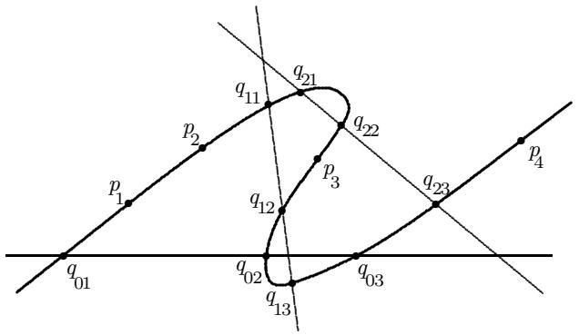

If $( g , n , r , d ) = ( 0 , 0 , 1 , 1 )$ , then $n + d ( r + 1 ) = 2$ . There are no Deligne-Mumford stable 2-pointed genus 0 curves. This is why $( 0 , 0 , 1 , 1 )$ is avoided.

Define a contravariant functor $\overline { { \mathcal { M } } } _ { g , n } ( \mathbf { P } ^ { r } , d , \overline { { t } } )$ from the category of complex algebraic schemes to sets as follows. Let $\overline { { \mathscr { M } } } _ { g , n } ( \mathbf { P } ^ { r } , d , \overline { { t } } ) ( S )$ be the set of isomorphism classes of $\bar { t }$ -rigid stable families over $S$ of degree $d$ maps from $n$ -pointed, genus $g$ curves to $\mathbf { P } ^ { r }$ . Note that the functor $\overline { { \mathcal { M } } } _ { g , n } ( \mathbf { P } ^ { r } , d , \overline { { t } } )$ depends only upon the spanning hyperplanes $( t _ { i } ) \subset \mathbf { P } ^ { r }$ and not upon the additional $\mathbb { C } ^ { * }$ -choices in the defining equations $t _ { i }$ of the hyperplanes. Nevertheless, it is natural for the following constructions to consider the equations of the hyperplanes $\overline { { t } } = ( t _ { 0 } , \ldots , t _ { r } )$ .

Proposition 2. There exists a quasi-projective coarse moduli space,

$$
\overline {{M}} _ {g, n} (\mathbf {P} ^ {r}, d, \overline {{t}}),
$$

and a natural transformation of functors

$$
\psi : \overline {{\mathcal {M}}} _ {g, n} (\mathbf {P} ^ {r}, d, \bar {t}) \rightarrow \mathcal {H o m} (*, \overline {{\mathcal {M}}} _ {g, n} (\mathbf {P} ^ {r}, d, \bar {t}))
$$

satisfying the analogous conditions (I) and (II) of Theorem 1.

The genus 0 case is simpler.

Proposition 3. $\overline { { { M } } } _ { 0 , n } ( \mathbf { P } ^ { r } , d , \overline { { { t } } } )$ represents the functor $\overline { { \mathcal { M } } } _ { 0 , n } ( \mathbf { P } ^ { r } , d , \overline { { t } } )$ and is a nonsingular algebraic variety.

3.3. Proofs. A complete proof of Proposition 3 will be given. The proof of Proposition 2 is almost identical. Remarks indicating the differences will be made. The dependence of the coarse and fine moduli property on the genus in Propositions 2 and 3 is a direct consequence of the fact that $\overline { { M } } _ { g , n }$ is a coarse moduli space for $g > 0$ and a fine moduli space for $g = 0$ .

The idea behind the construction is the following. Let $m = n + d ( r + 1 )$ . The data of the $\bar { t }$ -rigid stable family immediately yields a morphism of the base $S$ to $\overline { { M } } _ { g , m }$ . In fact, the image of $S$ lies in a universal, locally closed subscheme of $\overline { { M } } _ { g , m }$ . This subscheme is denoted by $B$ . The first step of the construction is to identify $B$ . The morphism $S  B$ does not contain all the data of the $\bar { t }$ -rigid stable family. Consider the case in which the base $S$ is a point. The corresponding point in $B$ records the domain curve $C$ , the marked points $\{ p _ { i } \}$ , and the pull-back divisors under $\mu$ of the hyperplanes in $\mathbf { P } ^ { r }$ determined by $\bar { t }$ . The map $\mu$ is determined by the pull-back divisors up to the diagonal torus action on $\mathbf { P } ^ { r }$ . The torus information is recorded in the total space of $r$ tautological $\mathbb { C } ^ { * }$ -bundles over $B$ . The $\bar { t }$ -rigid moduli space is expressed as the total space of these $r$ distinct $\mathbb { C } ^ { * }$ -bundles over $B$ . To canonically construct the universal family over the $\bar { t }$ -rigid moduli space, the equations $t _ { i }$ of the hyperplanes are needed. This is why the equations $t _ { i }$ (rather than the spanning hyperplanes (ti)) are explicitly chosen.

Proposition 3 is proved by an explicit construction of ${ \overline { { M } } } _ { 0 , n } ( \mathbf { P } ^ { r } , d , { \overline { { t } } } )$ together with a universal family of $\bar { t }$ -rigid stable maps. Let $\overline { { M } } _ { 0 , m }$ be the Mumford-Knudsen compactification of the moduli space of $m$ -pointed, genus 0 curves. Let $\pi : \overline { { U } } _ { 0 , m } $ $\overline { { M } } _ { 0 , m }$ be the universal curve with $m$ sections $\{ p _ { i } \} _ { 1 \leq i \leq n }$ and $\{ q _ { i , j } \} _ { 0 \leq i \leq r }$ , 1≤j≤d. Since $\overline { { U } } _ { 0 , m }$ is nonsingular and the sections are of codimension 1, there are canonically defined line bundles:

$$
\mathcal {H} _ {i} = \mathcal {O} _ {\overline {{U}} _ {0, m}} \left(q _ {i, 1} + q _ {i, 2} + \dots + q _ {i, d}\right),
$$

for $0 \leq i \leq r$ . Let $s _ { i } \in H ^ { 0 } ( \overline { { U } } _ { 0 , m } , \mathcal { H } _ { i } )$ be the canonical section representing the Cartier divisor $( q _ { i , 1 } + q _ { i , 2 } + . . . + q _ { i , d } )$ .

For any morphism $\gamma : X  \overline { { M } } _ { 0 , m }$ , consider the fiber product:

$$
\begin{array}{l} X \times_ {\overline {{M}} _ {0, m}} \overline {{U}} _ {0, m} \xrightarrow {\overline {{\gamma}}} \overline {{U}} _ {0, m} \\ \begin{array}{c c c} \Big {\downarrow} \pi_ {X} & & \Big {\downarrow} \pi \\ X & \xrightarrow {\gamma} \overline {{M}} _ {0, m} \end{array} \\ \end{array}
$$

We call the morphism $\gamma : X  \overline { { M } } _ { 0 , m }$ $\mathcal { H }$ -balanced if

(a) For $1 \leq i \leq r$ , $\pi _ { \boldsymbol { X } * } \overline { { \gamma } } ^ { * } ( \mathcal { H } _ { i } \otimes \mathcal { H } _ { 0 } ^ { - 1 } )$ is locally free.   
(b) For $1 \leq i \leq r$ , the canonical map

$$
\pi_ {X} ^ {*} \pi_ {X *} \bar {\gamma} ^ {*} (\mathcal {H} _ {i} \otimes \mathcal {H} _ {0} ^ {- 1}) \rightarrow \bar {\gamma} ^ {*} (\mathcal {H} _ {i} \otimes \mathcal {H} _ {0} ^ {- 1})
$$

is an isomorphism.

If $\gamma$ is $\mathcal { H }$ -balanced, the line bundles $\overline { { \gamma } } ^ { * } ( \mathcal { H } _ { i } )$ are isomorphic on the fibers of $\pi _ { X }$ . Let $B \subset \overline { { M } } _ { 0 , m }$ be the universal, locally closed subscheme satisfying the two following properties:

(i) The inclusion $\iota : B \hookrightarrow \overline { { M } } _ { 0 , m }$ is $\mathcal { H }$ -balanced.   
(ii) Every $\mathcal { H }$ -balanced morphism $\gamma : X  \overline { { M } } _ { 0 , m }$ factors (uniquely) through $B$ . By Proposition 1, $B$ exists. In fact, $B \subset \overline { { M } } _ { 0 , m }$ is a Zariski open subscheme. In the $g > 0$ case, the above constructions exist over the stacks $\overline { { M } } _ { g , m }$ and $\overline { { U } } _ { g , m }$ . $B _ { g , m }$ is a locally closed substack of $\overline { { M } } _ { g , m }$ of positive codimension.

Let $\mathcal { G } _ { i } = \pi _ { B * } \overline { { \iota } } ^ { * } ( \mathcal { H } _ { i } \otimes \mathcal { H } _ { 0 } ^ { - 1 } )$ for $1 \leq i \leq r$ . Let $\tau _ { i } : Y _ { i }  B$ be the total space of the canonical $\mathbb { C } ^ { * }$ -bundle associated to $\beta _ { i }$ . $Y _ { i }$ is the affine bundle associated to $\beta _ { i }$ minus the zero section. The pull-back $\tau _ { i } ^ { * } ( \mathcal { G } _ { i } )$ has a tautological non-vanishing section and hence is canonically trivial. Consider the product

$$
Y = Y _ {1} \times_ {B} \times Y _ {2} \times_ {B} \dots \times_ {B} Y _ {r}
$$

equipped with projections $\rho _ { i } : Y  Y _ { i }$ and a morphism $\tau : Y  B$ . Form the cartesian square:

$$
\begin{array}{l} \mathcal {U} \xrightarrow {\overline {{\tau}}} \quad \overline {{U}} _ {0, m} \\ \begin{array}{c c} \Biggl \downarrow \pi_ {Y} & \Biggl \downarrow \pi \end{array} \\ Y \xrightarrow {\tau} B \subset \overline {{M}} _ {0, m}. \\ \end{array}
$$

The line bundles $\overline { { \tau } } ^ { * } ( \mathcal { H } _ { i } )$ for $1 \leq i \leq r$ are canonically isomorphic to ${ \mathcal { L } } = { \overline { { \tau } } } ^ { * } ( { \mathcal { H } } _ { 0 } )$ on $\boldsymbol { \mathcal { U } }$ since

$$
\overline {{\tau}} ^ {*} (\mathcal {H} _ {i} \otimes \mathcal {H} _ {0} ^ {- 1}) \cong \pi_ {Y} ^ {*} \rho_ {i} ^ {*} \tau_ {i} ^ {*} (\mathcal {G} _ {i})
$$

and $\tau _ { i } ^ { * } ( \mathcal { G } _ { i } )$ is canonically trivial.

Via pull-back and the canonical isomorphisms, $\overline { { \tau } } ^ { * } ( s _ { i } )$ canonically corresponds to a section of $\mathcal { L }$ . Since these $r + 1$ sections do not vanish simultaneously, they define a morphism of $\mu : \mathcal { U } \to \mathbf { P } ^ { \prime }$ . The canonical method of obtaining $\mu$ is as follows. Define a vector space map $V ^ { * }  H ^ { \cup } ( { \mathcal { L } } )$ by sending $t _ { i }$ to $\overline { { \tau } } ^ { * } ( s _ { i } )$ . The induced surjection $V ^ { * } \otimes { \mathcal { O } } \to { \mathcal { L } }$ canonically yields a morphism

$$
\mu : \mathcal {U} \to \mathbf {P} ^ {r}.
$$

Note that the equations $t _ { i }$ are used to define the morphism $\mu$ . The sections $\{ p _ { i } \}$ , $\{ q _ { i , j } \}$ pull back to sections of $\pi _ { Y }$ . We claim that the family

$$
\left(\pi_ {Y}: \mathcal {U} \rightarrow Y, \left\{p _ {i} \right\}, \left\{q _ {i, j} \right\}, \mu\right) \tag {10}
$$

is a universal family of $\bar { t }$ -rigid stable maps, so $\overline { { { M } } } _ { 0 , n } ( \mathbf { P } ^ { r } , d , \overline { { { t } } } ) = Y$

The stability of the family of maps

$$
\left(\pi_ {Y}: \mathcal {U} \rightarrow Y, \left\{p _ {i} \right\}, \mu\right) \tag {11}
$$

is straightforward. Each fiber $C$ of $\pi _ { Y }$ is an $m$ -pointed, genus 0 stable curve with markings $\{ p _ { i } \}$ and $\{ q _ { i , j } \}$ . Let $E \subset C$ be an irreducible component. Suppose $\mathrm { d i m } ( \mu ( E ) ) = 0$ . By the transversality condition (iii), $E$ has no markings from the sections $\{ q _ { i , j } \}$ . Since $C$ is a stable $m$ -pointed curve and no $\{ q _ { i , j } \}$ markings lie on $E$ , $\deg _ { E } ( \omega _ { C } ( p _ { 1 } + . . . + p _ { n } ) ) > 0$ . Hence, condition (1) in the definition of map stability (section 1.1) holds for $E$ . Therefore (11) is a stable family of maps. By construction, it is a $\bar { t }$ -rigid stable family.

Finally, it must be shown (10) is universal. Let

$$
(\pi : \mathcal {C} \rightarrow S, \{p _ {i} \}, \{q _ {i, j} \}, \nu) \tag {12}
$$

be a family of $\bar { t }$ -rigid stable maps. Since (π : C → S, $\{ p _ { i } \} , \{ q _ { i , j } \} )$ is a flat family of $m$ - pointed, genus 0 stable curves, there is an induced map $\lambda : S  \overline { { M } } _ { 0 , m }$ such that the pull-back family $S \times _ { \overline { { M } } _ { 0 , m } } \overline { { U } } _ { 0 , m }$ is canonically isomorphic to $( \pi : { \mathcal { C } }  S , \{ p _ { i } \} , \{ q _ { i , j } \} )$ .

First we show $\lambda$ is $\mathcal { H } _ { i }$ -balanced. The pair $( \overline { { \lambda } } ^ { * } ( \mathcal { H } _ { i } ) , \overline { { \lambda } } ^ { * } ( s _ { i } ) )$ yields the Cartier divisor $q _ { i , 1 } + . . . + q _ { i , d }$ on $c$ . The map $\nu$ is induced by a vector space homomorphism $\psi : V ^ { * }  H ^ { \cup } ( \mathcal { C } , \nu ^ { * } ( \mathcal { O } _ { \mathbf { P } ( V ) } ( 1 ) ) )$ . Let $z _ { i } = \psi ( t _ { i } )$ . By condition (iii) of $\bar { t }$ -rigid stability, the pair $( \nu ^ { * } ( \mathcal { O } _ { \mathbf { P } ( V ) } ( 1 ) ) , z _ { i } )$ yields the Cartier divisor $q _ { i , 1 } + . . . + q _ { i , d }$ on $\boldsymbol { \mathscr { C } }$ . By Lemma $^ { 1 }$ , there are canonical isomorphisms

$$
\bar {\lambda} ^ {*} (\mathcal {H} _ {i}) \cong \nu^ {*} (\mathcal {O} _ {\mathbf {P} (V)} (1)) \tag {13}
$$

for all $_ i$ . Hence $\lambda$ is $\mathcal { H } _ { i }$ -balanced.

By the universal property of $B$ , $\lambda$ factors through $B$ : $\lambda : S  B$ . There are canonical isomorphisms

$$
\pi_ {*} \left(\bar {\lambda} ^ {*} \left(\mathcal {H} _ {i} \otimes \mathcal {H} _ {0} ^ {- 1}\right)\right) \cong \lambda^ {*} \left(\mathcal {G} _ {i}\right). \tag {14}
$$

The canonical isomorphisms (13) yield canonical sections of $\overline { { \lambda } } ^ { * } ( \mathcal { H } _ { i } \otimes \mathcal { H } _ { 0 } ^ { - 1 } )$ . The canonical isomorphisms (14) then yield nowhere vanishing sections of $\lambda ^ { * } ( \mathcal { G } _ { i } )$ over $S$ . Hence there is a canonical a map $S  Y$ . It is easily checked the pull-back of the universal family over $Y$ yields a $\bar { t }$ -rigid stable family of maps canonically isomorphic to (12).

# 4. The construction of ${ \overline { { M } } } _ { g , n } ( \mathbf { P } ^ { r } , d )$

4.1. Gluing. While a given pointed stable map $\mu : C \to \mathbf { P } ^ { r }$ may not be rigid for a given basis $\bar { t }$ of $V ^ { * } = H ^ { \cup } ( \mathbf { P } ^ { r } , { \mathcal { O } } _ { \mathbf { P } ^ { r } } ( 1 ) )$ , the map will be rigid (by Bertini’s theorem) for some choice of basis. The moduli space ${ \overline { { M } } } _ { g , n } ( \mathbf { P } ^ { r } , d )$ is obtained by gluing together quotients of $\overline { { { M } } } _ { g , n } ( \mathbf { P } ^ { r } , d , \overline { { { t } } } )$ for different choices of bases $\bar { t }$ .

For notational convenience, set ${ \overline { { M } } } ( { \overline { { t } } } ) = { \overline { { M } } } _ { g , n } ( \mathbf { P } ^ { r } , d , { \overline { { t } } } )$ . We write $\pi : \mathcal { U } \to$ $\overline { { { M } } } ( \overline { { { t } } } ) , \{ p _ { i } \} , \{ q _ { i , j } \} , \mu )$ for the universal family of $\bar { t }$ -rigid stable maps in the genus 0 case. If $g > 0$ , more care is required.

Let $\mathfrak { S } _ { d }$ denote the symmetric group on $d$ letters. The group

$$
G = G _ {d, r} = \mathfrak {S} _ {d} \times \dots \times \mathfrak {S} _ {d} (r + 1 \text {f a c t o r s})
$$

has a natural action on $\overline { { M } } ( \overline { { t } } )$ obtained by permuting the ordering in each of the $r + 1$ sets of sections $\{ q _ { i , 1 } , \ldots , q _ { i , d } \}$ , $0 \leq i \leq r$ . For any $\sigma \in G$ , the family

$$
(\pi : \mathcal {U} \rightarrow \overline {{M}} (\bar {t}), \{p _ {i} \}, \{q _ {i, \sigma (j)} \}, \mu) \tag {15}
$$

is also a $\bar { t }$ -rigid family over $\overline { { M } } ( \overline { { t } } )$ . By the universal property, the permuted family (15) induces an automorphism of $\overline { { M } } ( \overline { { t } } )$ . Since $\overline { { M } } ( \overline { { t } } )$ is quasi-projective and $G$ is finite, there is a quasi-projective quotient scheme ${ \overline { { M } } } ( { \overline { { t } } } ) / G$ .

Let $\bar { t }$ and $\overline { { t } } ^ { \prime }$ be distinct choices of bases of $V ^ { * }$ . Let $\mu : \mathcal { U } \to \mathbf { P } ^ { r }$ be the universal family over $\overline { { M } } ( \overline { { t } } )$ . Let

$$
\overline {{M}} (\bar {t}, \bar {t} ^ {\prime}) \subset \overline {{M}} (\bar {t})
$$

denote the open locus over which the divisors $\mu ^ { * } ( t _ { 0 } ^ { \prime } ) , \ldots , \mu ^ { * } ( t _ { r } ^ { \prime } )$ are ´etale, disjoint, and disjoint from the sections $\{ p _ { i } \}$ . The open set $\overline { { M } } ( \overline { { t } } , \overline { { t } } ^ { \prime } )$ is certainly $G$ -invariant. Let $\overline { { M } } ( \overline { { t } } , \overline { { t } } ^ { \prime } ) / G$ denote the quasi-projective quotient.

Proposition 4. There is a canonical isomorphism

$$
\overline {{M}} (\overline {{t}}, \overline {{t}} ^ {\prime}) / G \cong \overline {{M}} (\overline {{t}} ^ {\prime}, \overline {{t}}) / G.
$$

Proof. The divisors $\mu ^ { * } ( t _ { i } ^ { \prime } )$ define an ´etale Galois cover $\varepsilon$ of $\overline { { M } } ( \overline { { t } } , \overline { { t } } ^ { \prime } )$ with Galois group $G$ over which a $\overline { { t } } ^ { \prime }$ -rigid stable family is defined. The fiber of $\varepsilon$ over $( C , \{ p _ { i } \} , \{ q _ { i , j } \} , \mu )$ is the set of orderings $\{ q _ { i , j } ^ { \prime } \}$ of the points mapped by $\mu$ to the hyperplane ( $t _ { i } ^ { \prime } = 0$ ). Therefore there is a map

$$
\mathcal {E} \rightarrow \overline {{M}} \left(\bar {t} ^ {\prime}\right) \tag {16}
$$

which is easily seen be $G$ -equivariant for the Galois $G$ -action on $\varepsilon$ and the $\{ q _ { i , j } ^ { \prime } \}$ - permutation $G$ -action on the $\overline { { M } } ( \overline { { t } } ^ { \prime } )$ . Moreover (16) factors through $\overline { { M } } ( \overline { { t } } ^ { \prime } , \overline { { t } } )$ . Hence there exists a map of quotients

$$
\bar {M} \left(\bar {t}, \bar {t} ^ {\prime}\right) \cong \mathcal {E} / \text {G a l o i s} \rightarrow \bar {M} \left(\bar {t} ^ {\prime}, \bar {t}\right) / G. \tag {17}
$$

The map (17) is $G$ -invariant for the $\{ q _ { i , j } \}$ -permutation action on $\overline { { M } } ( \overline { { t } } , \overline { { t } } ^ { \prime } )$ . Therefore (17) descends to $\overline { { { M } } } ( \overline { { { t } } } , \overline { { { t } } } ^ { \prime } ) / G \to \overline { { { M } } } ( \overline { { { t } } } ^ { \prime } , \overline { { { t } } } ) / G$ . The inverse is obtained by interchanging $\bar { t }$ and $\overline { { t } } ^ { \prime }$ in the above construction. In fact, there is a natural action of $G \times G$ on $\varepsilon$ and canonical isomorphisms $\overline { { M } } ( \bar { t } , \bar { t } ^ { \prime } ) / G \overset { \sim } { = } \mathcal { E } / ( G \times G ) \overset { \sim } { = } \overline { { M } } ( \bar { t } ^ { \prime } , \bar { t } ) / G$ . □

In case $g > 0$ , the coarse moduli spaces $\overline { { { M } } } _ { g , n } ( \mathbf { P } ^ { r } , d , \overline { { { t } } } )$ do not (in general) have universal families. The permutation action of $G$ can be defined on a Hilbert scheme or a stack and then descended to $\overline { { { M } } } _ { g , n } ( \mathbf { P } ^ { r } , d , \overline { { { t } } } )$ . The open sets $\overline { { M } } ( \overline { { t } } ^ { \prime } , \overline { { t } } )$ and $\overline { { M } } ( \overline { { t } } , \overline { { t } } ^ { \prime } )$ are well defined for $g > 0$ and still satisfy Proposition 4.

The cocycle conditions on triple intersections are easily established. Hence, the schemes $\overline { { M } } ( \overline { { t } } ) / G$ canonically patch together along the open sets $\overline { { M } } ( \overline { { t } } , \overline { { t } } ^ { \prime } ) / G$ to form the scheme ${ \overline { { M } } } _ { g , n } ( \mathbf { P } ^ { r } , d )$ . The results on boundedness show ${ \overline { { M } } } _ { g , n } ( \mathbf { P } ^ { r } , d )$ is covered by a finite number of these open sets $\overline { { M } } ( \overline { { t } } ) / G$ . Hence, ${ \overline { { M } } } _ { g , n } ( \mathbf { P } ^ { r } , d )$ is an algebraic scheme of finite type over $\mathbb { C }$ . The universal properties of ${ \overline { { M } } } _ { g , n } ( \mathbf { P } ^ { r } , d )$ are easily obtained from the universal properties of the moduli spaces of $\bar { t }$ -rigid stable maps.

4.2. Separation and completeness. Let $( X , x )$ be a nonsingular, pointed curve. Let $\iota : X \setminus \{ x \} = U \hookrightarrow X$ . Let

$$
(\pi : \mathcal {C} \rightarrow X, \{p _ {i} \}, \mu) \tag {18}
$$

$$
\left(\pi^ {\prime}: \mathcal {C} ^ {\prime} \rightarrow X, \left\{p _ {i} ^ {\prime} \right\}, \mu^ {\prime}\right) \tag {19}
$$

be two families over $X$ of stable maps to $\mathbf { P } ^ { r } = \mathbf { P } ( V )$ .

Proposition 5. An isomorphism between the families (18) and (19) over $U$ extends to an isomorphism over $X$ .

Proof. Choose a basis $\hat { t } = ( t _ { 0 } , \ldots , t _ { r } )$ of $V ^ { * }$ that intersects the maps $\mu : { \mathcal { C } } _ { x } \to \mathbf { P } ^ { \prime }$ and $\mu ^ { \prime } : \mathcal { C } _ { x } ^ { \prime } \to \mathbf { P } ^ { r }$ transversally at unmarked, nonsingular points. Since it suffices to prove the isomorphism extends over a local ´etale cover of $( X , x )$ , it can be assumed that the Cartier divisors $\mu ^ { * } ( t _ { i } )$ and $\mu ^ { \prime } ^ { * } ( t _ { i } )$ split into sections $\{ q _ { i , j } \}$ and $\{ q _ { i , j } ^ { \prime } \}$ of $\pi$ and $\pi ^ { \prime }$ . Then $\boldsymbol { \mathscr { C } }$ , $\mathcal { C } ^ { \prime }$ are Deligne-Mumford stable $m = n + d ( r + 1 )$ pointed curves. Therefore, by the separation property of the functor of Deligne-Mumford stable pointed curves, there exists an isomorphism (of pointed curves) $\tau : { \mathcal { C } } \to { \mathcal { C } } ^ { \prime }$ over $X$ . Since $\tau \circ \mu ^ { \prime }$ and $\mu$ agree on an open set, $\tau \circ \mu ^ { \prime } = \mu$ . □

Proposition 5 and the valuative criterion show ${ \overline { { M } } } _ { g , n } ( X , { \boldsymbol { \beta } } )$ is a separated algebraic scheme.

Properness is also established by the valuative criterion. To complete 1 dimensional families of stable maps, semi-stable reduction techniques for curves are used (as in [K-K-M] and [Ha]).

Proposition 6. Let ${ \mathcal { F } } = ( \pi : { \mathcal { C } }  U , \ \{ p _ { i } \} , \ \mu )$ be a family of stable maps to $\mathbf { P } ^ { r }$ . There exists a base change $\gamma : ( Y , y )  ( X , x )$ satisfying:

(i) $\gamma _ { W } : Y \setminus \{ y \} = W \to U$ is ´etale.   
(ii) The pull-back family $\gamma _ { W } ^ { * } ( { \mathcal { F } } )$ extends to a stable family over $( Y , y )$ .

Proof. First, after restriction to a Zariski open subset of $U$ , it can be assumed that the fibers $\mathit { \Delta } \mathit { \mathcal { C } } _ { \xi }$ all have the same number of irreducible components. There may be non-trivial monodromy around the point $x \in X$ in the set of irreducible components of the fibers ${ \mathit { C } } _ { \xi }$ . After a base change (possibly ramified at $x$ ), this monodromy can be made trivial. It can therefore be assumed that $\mathcal { F }$ is a union of stable families $\mathcal { F } _ { j } = ( \pi _ { j } : \mathcal { C } _ { j } \to U , \ \{ p _ { i } ^ { j } \} , \{ p _ { i } ^ { c } \} , \ \mu _ { j } )$ where $\pi _ { j }$ is family of irreducible, nodal, projective curves. The markings $\{ p _ { i } ^ { \mathcal { I } } \}$ are the markings of $\boldsymbol { \mathscr { C } }$ that lie on $c _ { j }$ . The marking $\{ p _ { j } ^ { c } \}$ correspond to intersections of components in $\mathcal { F }$ . It suffices to prove Proposition 6 separately for each stable family ${ \mathcal { F } } _ { j }$ .

For technical reasons, it is convenient to consider families of nonsingular curves. After restriction, normalization, and base change of ${ \mathcal { F } } _ { j }$ , a family

$$
\tilde {\mathcal {F}} _ {j} = \left(\tilde {\pi} _ {j}: \tilde {\mathcal {C}} _ {j} \rightarrow U, \left\{p _ {i} ^ {j} \right\}, \left\{p _ {i} ^ {c} \right\}, \left\{p _ {i} ^ {n} \right\}, \tilde {\mu} _ {j}\right) \tag {20}
$$

can be obtained where $\tilde { \mathcal { F } } _ { j }$ is a family of stable maps of irreducible, nonsingular, projective curves. The additional markings $\{ p _ { i } ^ { n } \}$ correspond to the nodes. Consider the nodal locus in ${ \mathcal { F } } _ { j }$ . This locus consists of curves and isolated points. Via restriction of $U$ to a Zariski open set, it can be assumed the nodal locus (if nonempty) is of pure dimension 1. A normalization now separates the sheets along the nodal locus. A base change then may be required to make the separated points $\{ p _ { i } ^ { n } \}$ sections. If the normalized family $\tilde { \mathcal { F } } _ { j }$ is completed, ${ \mathcal { F } } _ { j }$ can be completed by identifying the nodal markings on ${ \bar { \mathcal { F } } } _ { j }$ . This nodal identification commutes with the map to $\mathbf { P } ^ { r }$ . It therefore suffices to prove Proposition 6 for these normalized families (20).

By the above reductions, it suffices to prove Proposition 6 for a family of stable maps of irreducible, nonsingular, projective curves. Let

$$
(\pi : \mathcal {C} \rightarrow U, \{p _ {i} \}, \mu) \tag {21}
$$

be such a family. Let $\pi : \mathcal { E }  X$ be a flat extension of $\pi : { \mathcal { C } }  U$ over the point $x \in X$ . After blow-ups in the special fiber of $\varepsilon$ , it can be assumed the map $\mu : { \mathcal { C } } \to \mathbf { P } ^ { r }$ extends to $\mu : { \mathcal { E } } \to \mathbf { P } ^ { \prime }$ . By Lemma 2 below applied to the flat extension $\pi : { \mathcal { E } } \to X$ , there exists a base change $\gamma : ( Y , y )  ( X , x )$ and a family of pointed curves

$$
\pi_ {Y}: \mathcal {C} _ {Y} \to (Y, y)
$$

satisfying conditions $( \mathrm { i } ) -$ (iii) of Lemma 2. Via $\tau : { \mathcal { C } } _ { Y } \to { \mathcal { E } }$ , $\mu$ naturally induces a map

$$
\mu_ {Y}: \mathcal {C} _ {Y} \to \mathbf {P} ^ {r}.
$$

The family ( $\pi _ { Y } : { \mathcal { C } } _ { Y } \longrightarrow ( Y , y ) , \{ p _ { i } \} , \mu _ { Y } )$ is certainly an extension of the family over $Y \setminus \{ y \}$ determined by the $\gamma$ pull-back of the stable family (21). The special

fiber is a map of a pointed quasi-stable curve to $\mathbf { P } ^ { r }$ . Unfortunately, the special fiber may not be stable. A stable family of maps is produced in two steps. First, unmarked, $\mu _ { Y }$ -collapsed, $^ { - 1 }$ -curves in the special fiber are sequentially blow-down. A multiple of the line bundle

$$
\omega_ {\pi_ {Y}} \left(\sum_ {i} p _ {i}\right) \otimes \mu_ {Y} ^ {*} \left(\mathcal {O} _ {\mathbf {P} ^ {r}} (3)\right) \tag {22}
$$

is then $\pi _ { Y }$ - relatively basepoint free. Second, as in [Kn], the relative morphism determined by a power of the line bundle (22) blows-down the remaining destabilizing $\mathbf { P } ^ { 1 }$ ’s to yield a stable extension over $( Y , y )$ . □

Lemma 2. Let $\pi _ { X } : { \mathcal { S } } _ { X } \to ( X , x )$ be a flat, projective family of curves with l sections $s _ { 1 } , \ldots , s _ { l }$ satisfying the following condition: $\forall \xi \neq x$ , $\pi ^ { - 1 } ( \xi ) = { \mathcal C } _ { \xi }$ is a projective nonsingular curve with $\it l$ distinct marked points $s _ { 1 } ( \xi ) , \ldots , s _ { l } ( \xi )$ . There exists a base change $\gamma : ( Y , y )  ( X , x )$ ´etale except possibly at $y$ with a family of l-pointed curves $\pi _ { Y } : { \cal S } _ { Y }  ( Y , y )$ and a diagram:

$$
\begin{array}{l} \begin{array}{c c c} \mathcal {S} _ {Y} & \stackrel {{\tau}} {{\longrightarrow}} & \mathcal {S} _ {X} \end{array} \\ \begin{array}{c c} \Bigg {\downarrow} \pi Y & \Bigg {\downarrow} \pi X \end{array} \\ (Y, y) \xrightarrow {\gamma} (X, x) \\ \end{array}
$$

satisfying the following properties:

(i) $S _ { Y }$ is a nonsingular surface. $\pi _ { Y } : { \cal S } _ { Y }  ( Y , y )$ is a flat, projective family of l-pointed quasi-stable curves.   
(ii) For each marking $1 \leq i \leq l$ , $\tau \circ s _ { i } = s _ { i } \circ \gamma$ .   
(iii) Over $W = Y \backslash \{ y \}$ , there is isomorphism $S _ { W } \stackrel { \sim } {  } \gamma _ { W } ^ { \ast } ( S _ { U } )$ , where $U = X \backslash \{ x \}$ The morphism $\tau | _ { \mathcal { S } _ { W } }$ is the composition

$$
\mathcal {S} _ {W} \stackrel {\sim} {\to} \gamma_ {W} ^ {*} (\mathcal {S} _ {U}) \to \mathcal {S} _ {U}
$$

where the second map is the natural projection.

Proof. The method is by standard semi-stable reduction (cf. [K-K-M], [Ha]). First, the singularities of $S _ { X }$ are resolved. Note that all singularities lie in the special fiber. Next, the surface $S _ { X }$ is blown-up sufficiently to ensure the reduced scheme supported on the special fiber has normal crossing singularities in $S _ { X }$ . The required blow-ups have point centers in the special fiber. Finally, the resulting surface is blown-up further (at points in the special fiber) to ensure the marking sections $s _ { 1 } , \ldots , s _ { l }$ do not intersect each other and do not pass through nodes of the reduced scheme supported on the special fiber. Let ${ \hat { \pi } } : { \hat { S } } _ { X } \to ( X , x )$ be the resulting nonsingular surface. The singularities of the morphism $\hat { \pi }$ are locally of the form $z _ { 1 } ^ { \alpha } z _ { 2 } ^ { \beta } = t$ β where $z _ { 1 }$ , $z _ { 2 }$ are coordinates on $\hat { S } _ { X }$ and $t$ is a coordinate on $X$ . Let $\{ \alpha _ { j } , \beta _ { j } \}$ be the set of exponents that occur at the singularities of $\hat { \pi }$ . Let $\gamma : ( Y , y )  ( X , x )$ be a base change whose ramification index over $x$ is divisible by all $\alpha _ { j }$ and $\beta _ { j }$ . Let $S _ { Y }$ be the normalization of $\gamma ^ { \ast } ( \hat { S } _ { X } )$ . A straightforward local analysis shows the family $\pi _ { Y } : S _ { Y } \to ( Y , y )$ has an $\it { \Delta } l$ -pointed, reduced, nodal special fiber. The surface $S _ { Y }$ has singularities of the local form $z _ { 1 } z _ { 2 } - t ^ { k }$ in the special fiber. Blowing-up $S _ { Y }$ yields a nonsingular surface with the required properties (i) $-$ (iii). □

By the valuative criterion, Propositions 5 and 6 prove ${ \overline { { M } } } _ { g , n } ( \mathbf { P } ^ { r } , d )$ is a separated and proper complex algebraic scheme.

4.3. Projectivity. The projectivity of the proper schemes ${ \overline { { M } } } _ { g , n } ( \mathbf { P } ^ { r } , d )$ is established here by a method due to J. Koll´ar ([Ko1]). Proofs of the projectivity of $\overline { { M } } _ { g , n } ( \mathbf { P } ^ { r } , \beta )$ can also be found in [A] and [C]. Koll´ar constructs ample line bundles on proper spaces via sufficiently nontrivial quotients of semipositive vector bundles. A vector bundle $E$ on an algebraic scheme $S$ is semipositive if for every morphism of a projective curve $f : C \to S$ , every quotient line bundle of $f ^ { * } ( E )$ has nonnegative degree on $C$ .

The first step is a semipositivity lemma. Let

$$
\mathcal {F} = (\pi : \mathcal {C} \rightarrow S, \{p _ {i} \}, \mu) \tag {23}
$$

be a stable family of maps over $S$ to $\mathbf { P } ^ { r }$ . Let

$$
E _ {k} (\pi) = \pi_ {*} \left(\omega_ {\pi} ^ {k} \left(\sum_ {i = 1} ^ {n} k p _ {i}\right) \otimes \mu^ {*} (\mathcal {O} (3 k))\right).
$$

Lemma 3. $E _ { k } ( \pi )$ is a semipositive vector bundle on $S$ for $k \geq 2$ .

Proof. A slight perturbation of the arguments in [Ko1] is required. It suffices to prove semipositivity in case the base is a nonsingular curve $X$ . Let $\gamma : Y  X$ be a flat base change. By map stability, Serre duality, and the base change theorems, it follows (for $k \geq 2$ ) $E _ { k }$ commutes with pull-back:

$$
E _ {k} \left(\pi_ {Y}\right) \cong \gamma^ {*} \left(E _ {k} \left(\pi_ {X}\right)\right)
$$

where $\pi _ { Y }$ is the pull-back family over $Y$ . It therefore suffices to prove semipositivity after base change.

Using the methods of section 4.2, it can be assumed (after base change) that $\mathcal { F }$ is a union of component stable families ${ \mathcal { F } } _ { j } = ( \pi _ { j } : { \mathcal { C } } _ { j } \to X , \ \{ p _ { i } ^ { j } \} , \{ p _ { i } ^ { c } \} ,$ µj) where $\pi _ { j }$ is family of stable maps and the generic element of ${ \mathcal { F } } _ { j }$ is a map of an irreducible, projective, nodal curve. The notation introduced in the proof of Proposition 6 is employed. After further base change and normalization of ${ \mathcal { F } } _ { j }$ , it can be assumed that

$$
\tilde {\mathcal {F}} _ {j} = \left(\tilde {\pi} _ {j}: \tilde {\mathcal {C}} _ {j} \rightarrow X, \{p _ {i} ^ {j} \}, \{p _ {i} ^ {c} \}, \{p _ {i} ^ {n} \}, \tilde {\mu} _ {j}\right) \tag {24}
$$

is a family of stable maps where the generic element is a map of an irreducible, projective, nonsingular curve.

A semipositivity result for the family $\tilde { \mathcal { F } } _ { j }$ is first established. Let $H _ { 1 }$ , $H _ { 2 }$ , $H _ { 3 } \subset \mathbf { P } ^ { r }$ be general hyperplanes. After base change, it can be assumed $\tilde { \mu } _ { j } ^ { * } ( H _ { l } )$ is a union of $d$ reduced sections for each $\it l$ . These $3 d$ sections are distinct from the sections $\{ p _ { i } ^ { j } \}$ , $\{ p _ { i } ^ { c } \}$ , $\{ p _ { i } ^ { n } \}$ . Therefore,

$$
\omega_ {\tilde {\pi} _ {j}} ^ {k} \left(\sum k p _ {i} ^ {j} + \sum (k - 1) p _ {i} ^ {c} + \sum (k - 1) p _ {i} ^ {n}\right) \otimes \tilde {\mu} _ {j} ^ {*} \left(\mathcal {O} _ {\mathbf {P} ^ {r}} (3 k)\right) \xrightarrow {\sim} \tag {25}
$$

$$
\omega_ {\tilde {\pi} _ {j}} ^ {k} (\sum \alpha_ {q} X _ {q})
$$

where $X _ { q }$ are distinct sections of $\tilde { \pi } _ { j }$ and $\alpha _ { q } \leq k$ . The surface $\tilde { \mathcal { C } } _ { j }$ has finitely many singularities of the form $z _ { 1 } z _ { 2 } - t ^ { \alpha }$ . These singularities are resolved by blow-up,

$$
\tau : \mathcal {S} _ {j} \to \bar {\mathcal {C}} _ {j}.
$$

Since the relative dualizing sheaf of the family $S _ { j }$ is trivial on the exceptional $\mathbf { P } ^ { 1 }$ ’s of $\tau$ , Lemma 4 below can be applied to deduce the semipositivity of $F _ { k } ( \tilde { \pi } _ { j } )$ for $k \geq 2$ where

$$
F _ {k} (\tilde {\pi} _ {j}) = \tilde {\pi} _ {j *} \left(\omega_ {\tilde {\pi} _ {j}} ^ {k} \left(\sum k p _ {i} ^ {j} + \sum (k - 1) p _ {i} ^ {c} + \sum (k - 1) p _ {i} ^ {n}\right) \otimes \mu^ {*} (\mathcal {O} (3 k))\right).
$$

For $k \geq 2$ , the restriction of the line bundle (25) to a fiber of ${ \ddot { C } } _ { j }$ is equal to

$$
\omega \otimes \omega^ {k - 1} \left(\sum (k - 1) p _ {i} ^ {j} + \sum (k - 1) p _ {i} ^ {c} + \sum (k - 1) p _ {i} ^ {n}\right) \otimes \tag {26}
$$

$$
\tilde {\mu} _ {j} ^ {*} \left(\mathcal {O} _ {\mathbf {P} ^ {r}} (3 k - 3)\right) \otimes \mu_ {j} ^ {*} \left(\mathcal {O} _ {\mathbf {P} ^ {r}} (3)\right) \left(\sum_ {i} p _ {i} ^ {j}\right)
$$

where $\omega$ is the dualizing sheaf of the fiber. By stability for the family ${ \bar { \mathcal { F } } } _ { j }$ , the product of the middle two factors in (26) is ample for $k \geq 2$ . The last factor in (26) is certainly of non-negative degree. By Serre duality, for $k \geq 2$ ,

$$
\left. \quad R ^ {1} \tilde {\pi} _ {j *} \left(\omega_ {\tilde {\pi} _ {j}} ^ {k} \left(\sum k p _ {i} ^ {j} + \sum (k - 1) p _ {i} ^ {c} + \sum (k - 1) p _ {i} ^ {n}\right) \otimes \mu^ {*} (\mathcal {O} (3 k))\right) = 0. \right. \tag {27}
$$

The semipositivity of $E _ { k } ( \pi )$ will be obtained from the semipositivity of $F _ { k } ( \tilde { \pi } _ { j } )$ . The $\left( k - 1 \right)$ -multiplicities will naturally arise in considering dualizing sheaves on nodal and reducible curves.

Let $\tilde { \pi } _ { \cup _ { j } } : \bigcup _ { j } \tilde { \mathcal { C } } _ { j }  X$ be the disjoint union of the families $\tilde { \mathcal { F } } _ { j }$ . There is natural morphism from the disjoint union to $\boldsymbol { \mathscr { C } }$

$$
\rho : \bigcup_ {j} \tilde {\mathcal {C}} _ {j} \to \mathcal {C}
$$

obtained by identifying nodal marked points and gluing components along intersection marked points. Consider the natural sequence of sheaves on $c$ :

$$
0 \rightarrow \rho_ {*} \left(\omega_ {\tilde {\pi} _ {\cup_ {j}}}\right)\rightarrow \omega_ {\pi} \rightarrow K \rightarrow 0. \tag {28}
$$

The quotient $K$ is easily identified as $\oplus _ { p _ { i } ^ { c } , p _ { i } ^ { n } } \mathcal { O } _ { p }$ where the sum is over all nodal and component intersection sections of the family $\mathcal { F }$ . Tensoring (28) with the line bundle $\omega _ { \pi } ^ { k - 1 } ( \sum k p _ { i } ) \otimes \mu ^ { * } ( { \mathcal { O } } _ { \mathbf { P } ( V ) } ( 3 k ) )$ yields the exact sequence:

$$
\begin{array}{l} 0 \to \rho_ {*} \Bigg (\omega_ {\tilde {\pi} _ {\cup_ {j}}} ^ {k} (\sum k p _ {i} + \sum (k - 1) p _ {i} ^ {c} + \sum (k - 1) p _ {i} ^ {n}) \otimes \mu^ {*} (\mathcal {O} _ {\mathbf {P} (V)} (3 k)) \Bigg) \to \\ \omega_ {\pi} ^ {k} (\sum_ {i} k p _ {i}) \otimes \mu^ {*} (\mathcal {O} _ {\mathbf {P} (V)} (3 k)) \to \bigoplus_ {p _ {i} ^ {c}, p _ {i} ^ {n}} \mathcal {O} _ {p} \otimes \mu^ {*} (\mathcal {O} _ {\mathbf {P} (V)} (3 k)) \to 0. \\ \end{array}
$$

Certainly $\tilde { \pi } _ { \cup _ { j ^ { * } } } = \pi _ { * } \rho _ { * }$ . Note the vanishing of $R ^ { 1 }$ determined in (27). These facts imply the $\pi$ direct image of the above sequence on $\boldsymbol { \mathscr { C } }$ yields an exact sequence on $X$ :

$$
0 \to \bigoplus_ {j} F _ {k} (\tilde {\pi} _ {j}) \to E _ {k} (\pi) \to \bigoplus_ {p _ {i} ^ {c}, p _ {i} ^ {n}} \mathcal {O} _ {X} \otimes \mu^ {*} (\mathcal {O} _ {\mathbf {P} (V)} (3 k)) \to 0.
$$

Finally, since an extension of semipositive bundles is semipositive ([Ko1]), $E _ { k } ( \pi )$ is semipositive. □

Lemma 4. Let $\pi : S  X$ be a map from a nonsingular projective surface to a nonsingular curve. Assume the general fiber of $\pi$ is nonsingular. Let $X _ { q }$ be a set of distinct sections of $\pi$ . Then

$$
\pi_ {*} (\omega_ {\mathcal {S} / X} ^ {k} (\sum \alpha_ {q} X _ {q}))
$$

is semipositive provided $k \geq 2$ and $\alpha _ { q } \leq k$ for all $q$ .

Proof. This is precisely Proposition 4.7 of [Ko1].

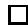

The second step is the construction of a non-trivial quotient. Let $\mathcal { F }$ be the family (23). Let $\mathbf { P } ( E _ { k } ^ { * } )$ be the projective bundle over $S$ obtained from the subspace projectivization of $E _ { k } ^ { * }$ . The condition of stability implies there is a canonical $S$ - embedding $\iota : { \mathcal { C } } \to \mathbf { P } ( E _ { f } ^ { * } )$ for some $f = f ( d , g , n , r )$ (see section 2.3). The morphism $\mu$ then yields a canonical $S$ -embedding:

$$
\gamma : \mathcal {C} \to \mathbf {P} (E _ {f} ^ {*}) \times_ {\mathbb {C}} \mathbf {P} ^ {r}.
$$

The $n$ sections $\{ p _ { i } \}$ yield $n$ sections $\{ ( \iota \circ p _ { i } , \mu \circ p _ { i } ) \}$ of $\mathbf { P } ( E _ { f } ^ { \ast } ) \times \mathbf { P } ^ { r }$ over $S$ . Let $S _ { i }$ denote the subscheme of $\mathbf { P } ( E _ { f } ^ { \ast } ) \times \mathbf { P } ^ { r }$ defined by the $i ^ { t h }$ section. Denote the projection of $\mathbf { P } ( E _ { f } ^ { * } ) \times \mathbf { P } ^ { r }$ to $S$ also by $\pi$ . Let $\mathcal { M } = \mathcal { O } _ { \mathbf { P } ( E _ { f } ^ { * } ) } ( 1 ) \otimes \mathcal { O } _ { \mathbf { P } ^ { r } } ( 1 )$ . $\mathcal { M }$ is an $\pi$ -relatively ample line bundle. Note $\pi _ { * } ( \mathcal { M } ^ { l } ) \cong \operatorname { S y m } ^ { l } ( E _ { f } ) \otimes \operatorname { S y m } ^ { l } ( \mathbb { C } ^ { r + 1 } )$ . By the stability of semipositivity under symmetric and tensor products ([Ko1]) and Lemma 3, $\pi _ { * } ( \mathcal { M } ^ { l } )$ is semipositive. Fix a choice of $\it l$ (depending only on $d$ , , , and $g$ $n$ $r$ ) large enough to ensure

$$
\pi_ {*} (\mathcal {M} ^ {l}) \oplus \bigoplus_ {i = 1} ^ {n} \pi_ {*} (\mathcal {M} ^ {l}) \rightarrow \pi_ {*} (\mathcal {M} ^ {l} \otimes \mathcal {O} _ {\mathcal {C}}) \oplus \bigoplus_ {i = 1} ^ {n} \pi_ {*} (\mathcal {M} ^ {l} \otimes \mathcal {O} _ {S _ {i}}) \rightarrow 0. \tag {29}
$$

Such a choice of $\it { \Delta } l$ is possible by the boundedness established in section 2.3. Let $Q$ be the quotient in (29). By boundedness and the vanishing of higher direct images, the quotient $Q$ is a vector bundle for large $\it { \Delta } l$ .

The quotient (29) is nontrivial in the following sense. Let $G = G L$ be the structure group of the bundle $E _ { f }$ . $G$ is naturally the structure group of $\pi _ { * } ( \mathcal { M } ^ { l } )$ . Let $W$ be the $G$ -representation inducing the bundle $\pi _ { * } ( { \mathcal { M } } ^ { l } ) \oplus \oplus _ { 1 } ^ { n } \pi _ { * } ( { \mathcal { M } } ^ { l } )$ . Let $q$ be the rank of the quotient bundle of (29). The quotient sequence (29) yields a set theoretic classifying map to the Grassmannian:

$$
\rho : S \to \mathbf {G r} (q, W ^ {*}) / G.
$$

Lemma 5. There exists a set theoretic injection

$$
\delta : \overline {{M}} _ {g, n} (\mathbf {P} ^ {r}, d) \to \mathbf {G r} (q, W ^ {*}) / G.
$$

Let $\lambda : S  \overline { { { M } } } _ { g , n } ( \mathbf { P } ^ { r } , d )$ be the map induced by the stable family (23). There is a (set theoretic) factorization $\rho = \delta \circ \lambda$ .

Proof. For large $\it l$ , the sequence (29) is equivalent to the data of a Hilbert point in $J$ (see section 2.3). Since the $G$ orbits of $J$ are exactly the stable maps, the lemma follows. □

Lemma 6. A stable map has a finite number of automorphisms.

Proof. As simple consequence of the definition of stability, there are no infinitesimal automorphisms. The total number is therefore finite. □

Suppose the map to moduli $\lambda : S  \overline { { { M } } } _ { g , n } ( \mathbf { P } ^ { r } , d )$ is a generically finite algebraic morphism. Then, in the terminology of [Ko1], Lemmas 5 and 6 show the classifying map $\rho$ is finite on an open set of $S$ .

Proposition 7. (Lemma 3.13, [Ko1]) Let the base $S$ of (23) be a normal projective variety. Suppose the classifying map is finite on an open set of $S$ . Then, the top self-intersection number of $D e t ( Q )$ on $S$ is positive.

If ${ \overline { { M } } } _ { g , n } ( \mathbf { P } ^ { r } , d )$ were a fine moduli space equipped with a universal family, $\mathrm { D e t } ( Q )$ would be well defined and ample (by Proposition 7 and the Nakai-Moishezon criterion) on ${ \overline { { M } } } _ { g , n } ( \mathbf { P } ^ { r } , d )$ . Since ${ \overline { { M } } } _ { 0 , n } ( \mathbf { P } ^ { r } , d )$ is expressed locally as a quotient of a fine moduli space by a finite group, it is easily seen ${ \mathrm { D e t } } ( Q ) ^ { k }$ is a well defined line bundle on ${ \overline { { M } } } _ { 0 , n } ( \mathbf { P } ^ { r } , d )$ for some sufficiently large $k$ . The exponent $k$ is taken to trivialize the $\mathbb { C } ^ { * }$ -representations at the fixed points. In the higher genus case, $\mathrm { D e t } ( Q )$ is a well defined line bundle on the Hilbert scheme $J$ or the stack. Since the moduli problem has finite automorphisms, ${ \mathrm { D e t } } ( Q ) ^ { k }$ is well defined on the coarse moduli space for some $k$ .

Since the moduli spaces ${ \overline { { M } } } _ { g , n } ( \mathbf { P } ^ { r } , d )$ are not fine, subvarieties are not equipped with stable families. Proposition (7) and the Nakai-Moishezon criterion do not directly establish the ampleness of ${ \mathrm { D e t } } ( Q ) ^ { k }$ . An alternative approach (due to J. Koll´ar) is followed. Recall the Hilbert scheme $J$ (of section 2.3) is equipped with a universal family and, therefore, a canonical map

$$
J \rightarrow \overline {{M}} _ {g, n} (\mathbf {P} ^ {r}, d).
$$

Let $X \subset { \overline { { M } } } _ { g , n } ( \mathbf { P } ^ { r } , d )$ be a subvariety. Using $J$ and the finite automorphism property of a stable map, a morphism $Y  X$ of algebraic schemes can be constructed satisfying

(i) $Y  X$ is finite and surjective.   
(ii) $Y$ is equipped with a stable family of maps such that $Y  X$ is the corresponding morphism to moduli.

The existence of $Y  X$ is exactly the conclusion of Proposition 2.7 in [Ko1] under slightly different assumptions. Nevertheless, the argument is valid in the present setting. The construction of $Y$ is subtle. First $Y$ is constructed as an algebraic space. Then, a lemma of Artin is used to find an algebraic scheme $Y$ . Since $Y$ has a universal family, Proposition 7 implies ${ \mathrm { D e t } } ( Q ) ^ { k }$ has positive top intersection on $Y$ and therefore on $X$ . The Nakai-Moishezon criterion can be applied to conclude the ampleness of ${ \mathrm { D e t } } ( Q ) ^ { k }$ on ${ \overline { { M } } } _ { g , n } ( \mathbf { P } ^ { r } , d )$ .

4.4. Automorphisms. We use the notation of sections 3.2 and 4.1. In the genus 0 case, $\overline { { M } } ( \overline { { t } } )$ is nonsingular. Therefore, the space ${ \overline { { M } } } _ { 0 , n } ( \mathbf { P } ^ { r } , d )$ is locally a quotient of a nonsingular variety by a finite group.

Lemma 7. Let $\xi \in \overline { { M } } ( \overline { { t } } )$ be a point at which the $G _ { d , r }$ action is not free. Then $\xi$ corresponds to a stable map with nontrivial automorphisms.

Proof. $G _ { d , r }$ acts by isomorphism on the stable maps of the universal family over $\overline { { M } } ( \overline { { t } } )$ . The $G _ { d , r }$ action is not free at $\xi \in \overline { { M } } ( \overline { { t } } )$ if and only if there exists a $1 \neq \gamma \in$

$G _ { d , r }$ fixing $\xi$ . The element $\gamma$ induces an automorphism of the map corresponding to $\xi$ . The automorphism is nontrivial on the marked points $\{ q _ { i , j } \}$ . □

Over the automorphism-free locus, the $G _ { d , r }$ -action on $\overline { { M } } ( \overline { { t } } )$ (and on the universal family over $\overline { { M } } ( \overline { { t } } )$ ) is free. It follows that the quotient over the automorphism-free locus is a nonsingular quasi-projective variety denoted by $\overline { { M } } _ { 0 , n } ^ { * } ( \mathbf { P } ^ { r } , d )$ . A universal family over $\overline { { M } } _ { 0 , n } ^ { * } ( \mathbf { P } ^ { r } , d )$ is obtained by patching. Theorems 1 and 2 have been established in the case $X \cong \mathbf { P } ^ { r }$ .

# 5. The construction of ${ \overline { { M } } } _ { g , n } ( X , { \boldsymbol { \beta } } )$

5.1. Proof of Theorem 1. Let $X$ be a projective algebraic variety. Existence of the coarse moduli space ${ \overline { { M } } } _ { g , n } ( X , { \boldsymbol { \beta } } )$ is established via a projective embedding $\iota : X \hookrightarrow \mathbf { P } ^ { r }$ . Let $\iota _ { * } ( \beta )$ be $d$ times the class of a line in $\mathbf { P } ^ { r }$ .

Lemma 8. There exists a natural closed subscheme

$$
\overline {{M}} _ {g, n} (X, \beta , \bar {t}) \subset \overline {{M}} _ {g, n} (\mathbf {P} ^ {r}, d, \bar {t})
$$

satisfying the following property. Let $( \pi : \mathcal { C } \to S , \{ p _ { i } \} , \{ q _ { i , j } \} , \mu )$ be a $\bar { t }$ -rigid stable family of genus $g$ , $n$ -pointed, degree $d$ maps to $\mathbf { P } ^ { r }$ . Then, the natural morphism $S  \overline { { { M } } } _ { g , n } ( \mathbf { P } ^ { r } , d , \overline { { { t } } } )$ factors through ${ \overline { { M } } } _ { g , n } ( X , \beta , { \overline { { t } } } )$ if and only if $\mu$ factors through ι and each geometric fiber of $\boldsymbol { \mathscr { u } }$ is a map to $X$ representing the homology class $\beta \in A _ { 1 } X$ .

Proof. The lemma is proved in case $g = 0$ . If $g > 0$ , then $\overline { { { M } } } _ { g , n } ( \mathbf { P } ^ { r } , d , \overline { { { t } } } )$ is not a fine moduli space and the argument is more technical.

Let

$$
(\pi_ {M}: \mathcal {U} \rightarrow \overline {{\mathcal {M}}} _ {0, n} (\mathbf {P} ^ {r}, d, \bar {t}), \{p _ {i} \}, \{q _ {i, j} \}, \mu)
$$

be the universal family over ${ \overline { { M } } } _ { 0 , n } ( \mathbf { P } ^ { r } , d , { \overline { { t } } } )$ . On a genus 0 curve, any vector bundle generated by global sections has no higher cohomology. Therefore, by this cohomology vanishing and the base change theorems, $\pi _ { M * } \mu ^ { * } \left( \mathcal { O } _ { \mathbf { P } ^ { r } } ( k ) \right)$ is a vector bundle for all $k > 0$ . (This argument must be modified in the $g > 0$ case since $\pi _ { M * } \mu ^ { * } ( \mathcal { O } _ { \mathbf { P } ^ { r } } ( k ) )$ need not be a vector bundle even on the Hilbert scheme $J$ or the stack. Nevertheless, it is not hard to define the closed subscheme determined by $X$ on the Hilbert scheme $J$ or the stack and then descend it to the coarse moduli space.) Let $\mathcal { T } _ { X }$ be the ideal sheaf of $X \subset \mathbf { P } ^ { r }$ . Let $I _ { X } ( k ) = H ^ { 0 } ( { \bf P } ^ { r } , { \mathcal L } _ { X } ( k ) )$ . Let $l > > 0$ be selected so that $\mathcal { T } _ { X } ( l )$ is generated by the global sections $I _ { X } ( l )$ . These sections $I _ { X } ( l )$ yield sections of the vector bundle $\pi _ { M * } \mu ^ { * } ( \mathcal { O } _ { \mathbf { P } ^ { r } } ( l ) )$ . Let $Z \subset { \overline { { M } } } _ { 0 , n } ( \mathbf { P } ^ { r } , d , { \overline { { t } } } )$ be the scheme-theoretic zero locus of these sections. The restriction of $\mu$ to $\pi _ { M } ^ { - 1 } ( Z )$ factors though $\iota$ . Since $Z$ is an algebraic scheme, $Z$ is a finite union of disjoint connected components. The homology class in $A _ { 1 } ( X ) = H _ { 2 } ( X , \mathbb { Z } )$ represented by a map with moduli point in $Z$ is a deformation invariant of the map. Therefore, the represented homology class is constant on each connected component of $Z$ . Let $Z _ { \beta } \subset Z$ be the union of components of $Z$ which consist of maps representing the class $\beta \in A _ { 1 } X$ . Let $\overline { { M } } _ { 0 , n } ( X , \beta , \overline { { t } } ) = Z _ { \beta }$ . The required properties are easily established. □

By the functorial property, $\overline { { M } } _ { g , n } ( X , \beta , \overline { { t } } )$ is invariant under the $G _ { d , r } \cong \mathfrak { S } _ { d } \times$ $\bullet \cdot \cdot \times \mathfrak { S } _ { d }$ action on $\overline { { { M } } } _ { g , n } ( \mathbf { P } ^ { r } , d , \overline { { { t } } } )$ . The quotient

$$
\overline {{M}} _ {g, n} (X, \beta , \bar {t}) / G _ {d, r}
$$

is an open set of ${ \overline { { M } } } _ { g , n } ( X , { \boldsymbol { \beta } } )$ . A patching argument identical to the patching argument of section 4.1 yields a construction of ${ \overline { { M } } } _ { g , n } ( X , { \boldsymbol { \beta } } )$ as a closed subscheme of ${ \overline { { M } } } _ { g , n } ( \mathbf { P } ^ { r } , d )$ . The functorial property of ${ \overline { { M } } } _ { g , n } ( X , { \boldsymbol { \beta } } )$ shows the construction is independent of the projective embedding of $X$ . Projectivity of ${ \overline { { M } } } _ { g , n } ( X , { \boldsymbol { \beta } } )$ is obtained from the projectivity of ${ \overline { { M } } } _ { g , n } ( \mathbf { P } ^ { r } , d )$ . This completes the proof of Theorem 1.

5.2. Proof of Theorem 2. Let $g = 0$ . Let $X$ be a projective, nonsingular, convex variety. Theorem 2 is certainly true in case $\beta = 0$ since $\overline { { { M } } } _ { 0 , n } ( X , 0 ) \ =$ ${ \overline { { M } } } _ { 0 , n } \times X$ . In general, a deformation study is needed to establish Theorem 2.

By the functorial property, the Zariski tangent space to the scheme ${ \overline { { M } } } _ { 0 , n } ( X , \beta , { \overline { { t } } } )$ at the point $( C , \{ p _ { i } \} , \{ q _ { i , j } \} , \mu : C \to X )$ is canonically isomorphic to the space of first order deformations of the pointed $\bar { t }$ -stable map $( C , \{ p _ { i } \} , \{ q _ { i , j } \} , \mu : C \to X )$ . The later deformation space corresponds bijectively to the space of first order deformations of the pointed stable map $( C , \{ p _ { i } \} , \mu : C \to X )$ .

Let $\operatorname { D e f } ( \mu )$ denote the space of first order deformations of the pointed stable map $( C , \{ p _ { i } \} , \mu : C \to X )$ . Consider first the case in which $C \cong \mathbf { P } ^ { 1 }$ . Let $\mathrm { D e f } _ { R } ( \mu )$ be the space of first order deformations of $( C , \{ p _ { i } \} , \mu : C \to X )$ with $C$ held rigid. There is an natural exact sequence:

$$
0 \to H ^ {0} (C, T _ {C}) \to \operatorname {D e f} _ {R} (\mu) \to \operatorname {D e f} (\mu) \to 0.
$$

Stability of $\mu$ implies the left map is injective. Let ${ \mathrm { H o m } } ( C , X )$ be the quasiprojective scheme of morphisms from $C$ to $X$ representing the class $\beta$ . ${ \mathrm { H o m } } ( C , X )$ is an open subscheme of the Hilbert scheme of graphs in $C \times X$ . The Zariski tangent space to ${ \mathrm { H o m } } ( C , X )$ is naturally identified:

$$
T _ {\operatorname {H o m} (C, X)} ([ \mu ]) \stackrel {{\sim}} {{=}} H ^ {0} (C, \mu^ {*} T _ {X})
$$

(see [Ko2]). There is an exact sequence:

$$
0 \to \operatorname {K e r} \to \operatorname {D e f} _ {R} (\mu) \to H ^ {0} (C, \mu^ {*} T _ {X}) \to 0
$$

where Ker corresponds to the deformations of the markings. Therefore, $\mathrm { d i m } _ { \mathbb { C } } \mathrm { K e r } =$ $n$ . Since $X$ is convex, the above sequences suffice to compute the dimension of $\operatorname { D e f } ( \mu )$ :

$$
\dim_ {\mathbb {C}} \operatorname {D e f} (\mu) = \dim (X) + \int_ {\beta} c _ {1} \left(T _ {X}\right) + n - 3.
$$

The dimension of the tangent space to $\overline { { M } } _ { 0 , n } ( X , \beta , \overline { { t } } )$ is established in case $C \cong \mathbf { P } ^ { 1 }$ .

Before proceeding further, the following deformation result is needed. A proof can be found in [Ko2].

Lemma 9. Let ${ \mathcal { C } } / S$ and ${ \boldsymbol { \chi } } / S$ be flat, projective schemes over $S$ . Let $s \in S$ be a geometric point. Let $C _ { s }$ , $X _ { s }$ be the fibers over s and let $f : C _ { s }  X _ { s }$ be a morphism. Assume the following conditions are satisfied:

(i) $C _ { s }$ has no embedded points.   
(ii) $X _ { s }$ is nonsingular.   
(iii) $S$ is equidimensional at s.

Then, the dimension of every component of the quasi-projective variety $H o m _ { S } ( { \mathcal { C } } , { \mathcal { X } } )$ at the point $[ f ]$ is at least

$$
\dim_ {\mathbb {C}} H ^ {0} \left(C _ {s}, f ^ {*} T _ {X _ {s}}\right) - \dim_ {\mathbb {C}} H ^ {1} \left(C _ {s}, f ^ {*} T _ {X _ {s}}\right) + \dim_ {s} S.
$$

Again, let $( C \ \cong \ \mathbf { P } ^ { 1 } , \{ p _ { i } \} , \{ q _ { i , j } \} , \mu : C \ \to \ X )$ correspond to a point of the space $\overline { { M } } _ { 0 , n } ( X , \beta , \overline { { t } } )$ . By Lemma 9 and the convexity of $X$ , every component of ${ \mathrm { H o m } } ( C , X )$ at $[ \mu ]$ has dimension at least $\mathrm { d i m } _ { \mathbb { C } } H ^ { \cup } ( C , \mu ^ { * } T _ { X } )$ . Therefore, every component of ${ \overline { { M } } } _ { 0 , n } ( X , \beta , { \overline { { t } } } )$ at $[ \mu ]$ has dimension at least $\begin{array} { r } { \mathrm { d i m } ( X ) + \int _ { \beta } c _ { 1 } ( T _ { X } ) + n - 3 } \end{array}$ . By the previous tangent space computation, it follows $[ \mu ]$ is a nonsingular point of ${ \overline { { M } } } _ { 0 , n } ( X , \beta , { \overline { { t } } } )$ . Before attacking the reducible case, a lemma is required.

Lemma 10. Let $X$ be a nonsingular, projective, convex space. Let $\mu : C \to X$ be a morphism of a projective, connected, reduced, nodal curve of arithmetic genus $\boldsymbol { \mathit { 0 } }$ to $X$ . Then,

$$
H ^ {1} \left(C, \mu^ {*} T _ {X}\right) = 0. \tag {30}
$$

and $\mu ^ { * } T _ { X }$ is generated by global sections on $C$ .

Proof. Let $E \subset C$ be an irreducible component of $C$ ; $E \cong \mathbf { P } ^ { 1 }$ . Let

$$
\mu^ {*} T _ {X} | _ {E} \cong \bigoplus \mathcal {O} _ {\mathbf {P} ^ {1}} (\alpha_ {i}).
$$

Suppose there exists $\alpha _ { i } < 0$ . The composition of a rational double cover of $E$ with $\mu$ would then violate the convexity of $X$ . It follows that:

$$
\forall i, \alpha_ {i} \geq 0. \tag {31}
$$

We will prove the following statement by induction on the number of components of $C$ :

$$
H ^ {1} \left(C, \mu^ {*} T _ {X} \otimes \mathcal {O} _ {C} (- p)\right) = 0 \tag {32}
$$

for any nonsingular point $p \in C$ . Equation (32) is true by condition (31) when $C \cong \mathbf { P } ^ { 1 }$ is irreducible. Assume now $C$ is reducible and $p \in E \widetilde { = } \mathbf { P } ^ { 1 }$ . Let $C = C ^ { \prime } \cup E$ ; let $\{ p _ { 1 } ^ { \prime } , . . . , p _ { q } ^ { \prime } \} = C ^ { \prime } \cap E$ . Since $C$ is a tree, $C ^ { \prime }$ has exactly $q$ connected components each intersecting $E$ in exactly 1 point. There is a component sequence:

$$
0 \to \mu^ {*} T _ {X} | _ {C ^ {\prime}} \otimes \mathcal {O} _ {C ^ {\prime}} (- \sum_ {j = 1} ^ {q} p _ {j} ^ {\prime}) \to \mu^ {*} T _ {X} \otimes \mathcal {O} _ {C} (- p) \to \mu^ {*} T _ {X} | _ {E} \otimes \mathcal {O} _ {E} (- p) \to 0.
$$

Equation (32) now follows from the inductive assumptions on $C ^ { \prime }$ and $E$ . The inductive assumption (32) is applied to every connected component of $C ^ { \prime }$ .

We now prove $H ^ { 1 } ( C , \mu ^ { * } T _ { X } ) = 0$ . If $C \cong \mathbf { P } ^ { 1 }$ , then the lemma is established by condition (31). Assume now $C = C ^ { \prime } \cup E$ where $E \cong \mathbf { P } ^ { 1 }$ . There is a component sequence

$$
0 \rightarrow \mu^ {*} T _ {X} | _ {C ^ {\prime}} \otimes \mathcal {O} _ {C ^ {\prime}} \left(- \sum_ {j = 1} ^ {q} p _ {j} ^ {\prime}\right)\rightarrow \mu^ {*} T _ {X} \rightarrow \mu^ {*} T _ {X} | _ {E} \rightarrow 0. \tag {33}
$$

Equation (30) now follows from (32) applied to every connected component of $C ^ { \prime }$ .

Finally, an analysis of sequence (33) also yields the global generation result. $\mu ^ { * } T _ { X } | _ { E }$ is generated by global sections by (31). Sequence (33) is exact on global sections by (32). Hence $\mu ^ { * } T _ { X }$ is generated by global sections on $E$ . But, every point of $C$ lies on some component $E \cong \mathbf { P } ^ { 1 }$ . □

In sections 7 and 8, the following related lemma will be required:

Lemma 11. Let $\mu : \mathbf { P } ^ { 1 } \to X$ be a non-constant morphism to a nonsingular, projective, convex space $X$ . Then $\begin{array} { r } { \int _ { \mu _ { * } [ \mathbf { P } ^ { 1 } ] } c _ { 1 } ( T _ { X } ) \geq 2 } \end{array}$ .

Proof. Since $\mu$ is non-constant, the differential

$$
d \mu : T _ {\mathbf {P} ^ {1}} \rightarrow \mu^ {*} (T _ {X})
$$

is nonzero. Let $s \in H ^ { 0 } ( \mathbf { P } ^ { 1 } , T _ { \mathbf { P } ^ { 1 } } )$ be a vector field with two distinct zeros $p _ { 1 } , p _ { 2 } \in \mathbf { P } ^ { 1 }$ . Then, $d \mu ( s ) \in H ^ { 0 } ( \mathbf { P } ^ { 1 } , \mu ^ { * } ( T _ { x } ) ) \neq 0$ and $d \mu ( s )$ vanishes (at least) at $p _ { 1 }$ and $p _ { 2 }$ . By the proof of Lemma 10, $\mu ^ { * } ( T _ { X } ) \tilde { = } \oplus \mathcal { O } _ { \mathbf { P } ^ { 1 } } ( \alpha _ { i } )$ where $\alpha _ { i } \geq 0$ for all $_ i$ . The existence of $d \mu ( s )$ implies that $\alpha _ { j } \geq 2$ for some $j$ . □

Let $C$ now be a reducible curve. $C$ must be a tree of $\mathbf { P } ^ { 1 }$ ’s. Let $q$ be the number of nodes of $C$ . Again, let $\operatorname { D e f } ( \mu )$ be the first order deformation space of the pointed stable map $\mu$ . The dual graph of a pointed curve $C$ of arithmetic genus 0 consists of vertices and edges corresponding bijectively to the irreducible components and nodes of $C$ respectively. The valence of a vertex in the dual graph is the numbers of edges incident at that vertex. Let $\operatorname { D e f } _ { G } ( \mu ) \subset \operatorname { D e f } ( \mu )$ be the first order deformation space of the pointed stable map $\mu$ preserving the dual graph. $\operatorname { D e f } _ { G } ( \mu )$ is a linear subspace of codimension at most $q$ . Let $\mathrm { D e f } _ { G } ( C )$ be the space of first order deformations of the curve $C$ which preserve the dual graph. A simple calculation yields

$$
\dim_{\mathbb{C}}\operatorname{Def}_{G}(C) = \sum_{|\nu |\geq 4}|\nu | - 3
$$

where the sum is taken over vertices $\nu$ of the dual graph of valence at least 4.

The natural linear map $\operatorname { D e f } _ { G } ( \mu ) \to \operatorname { D e f } _ { G } ( C )$ is now analyzed. Let $S$ be the nonsingular universal base space of deformations of $C$ preserving the dual graph. Let $c$ be the universal deformation over $S$ . Let ${ \mathcal { X } } = X \times S$ . Let $s _ { 0 } \in S$ correspond to $C$ . By Lemmas 9 and 10, every component of ${ \mathrm { H o m } } _ { S } ( { \mathcal { C } } , { \mathcal { X } } )$ at $[ \mu ]$ has dimension at least $\begin{array} { r } { \mathrm { d i m } ( X ) + \int _ { \beta } c _ { 1 } ( T _ { X } ) + \mathrm { d i m } ( S ) } \end{array}$ . The tangent space to the fiber of ${ \mathrm { H o m } } _ { S } ( { \mathcal { C } } , { \mathcal { X } } )$ over $s _ { o }$ at $[ \mu ]$ is canonically $H ^ { 0 } ( C , \mu ^ { * } T _ { X } )$ . The latter space has dimension $\begin{array} { r } { \mathrm { d i m } ( X ) + \int _ { \beta } c _ { 1 } ( T _ { X } ) } \end{array}$ . Hence, ${ \mathrm { H o m } } _ { S } ( { \mathcal { C } } , { \mathcal { X } } )$ is nonsingular at $[ \mu ]$ of dimension $\begin{array} { r } { \mathrm { d i m } ( X ) + \int _ { \beta } c _ { 1 } ( T _ { X } ) + \mathrm { d i m } ( S ) } \end{array}$ and the projection morphism to $S$ is smooth at $[ \mu ]$ . Therefore, $\operatorname { D e f } _ { G } ( \mu ) \to \operatorname { D e f } _ { G } ( C )$ is surjective.

The above definitions and results yield a natural exact sequence:

$$
0 \to \operatorname {D e f} _ {C} (\mu) \to \operatorname {D e f} _ {G} (\mu) \to \operatorname {D e f} _ {G} (C) \to 0
$$

where $\operatorname { D e f } _ { C } ( \mu )$ is the space of first order deformations of the pointed stable map $\mu$ which restrict to the trivial deformation of $C$ . As in the case where $C \cong \mathbf { P } ^ { 1 }$ , $\operatorname { D e f } _ { C } ( \mu )$ differs from $\mathrm { D e f } _ { R } ( \mu )$ only by the tangent fields obtained from automorphisms:

$$
0 \to H ^ {0} (C, T _ {C} ^ {\text {a u t o}}) \to \operatorname {D e f} _ {R} (\mu) \to \operatorname {D e f} _ {C} (\mu) \to 0.
$$

$H ^ { 0 } ( C , T _ { C } ^ { a u t o } )$ is the space of tangent fields on the components of $C$ that vanish at C all the nodes of $C$ . Note $\begin{array} { r } { H ^ { 0 } ( C , T _ { C } ^ { a u t o } ) = \sum _ { | \nu | \leq 3 } 3 - | \nu | } \end{array}$ . Finally, there is an exact sequence containing $\mathrm { D e f } _ { R } ( \mu )$ and the tangent space to ${ \mathrm { H o m } } ( C , X )$ :

$$
0 \to \mathrm {K e r} \to \mathrm {D e f} _ {R} (\mu) \to H ^ {0} (C, \mu^ {*} T _ {X}) \to 0.
$$

From these exact sequences, Lemma 10, and some arithmetic, it follows

$$
\dim_ {\mathbb {C}} \operatorname {D e f} _ {G} (\mu) = \dim (X) + \int_ {\beta} c _ {1} \left(T _ {X}\right) + n - 3 - q. \tag {34}
$$

Let $\boldsymbol { \mathscr { C } }$ be a smoothing of the reducible curve $C$ over a base $S$ and let $\mathcal { X } = X \times S$ . A simple application of Lemma 9 shows that $[ \mu ] \in \overline { { M } } _ { 0 , n } ( X , \beta , \overline { { t } } )$ lies in the closure

of the locus of maps with irreducible domains. Since the irreducible domain locus is pure dimensional of dimension $\mathrm { d i m } ( X ) + \ J _ { \beta } c _ { 1 } ( T _ { X } ) + n - 3$ ,

$$
\dim_ {\mathbb {C}} \operatorname {D e f} (\mu) \geq \dim (X) + \int_ {\beta} c _ {1} \left(T _ {X}\right) + n - 3. \tag {35}
$$

It follows from (34) and (35) that $\operatorname { D e f } _ { G } ( \mu )$ is of maximal codimension $q$ in $\operatorname { D e f } ( \mu )$ and that the inequality in (35) is an equality. Since $\operatorname { D e f } ( \mu )$ is of dimension $\dim ( X ) +$ $\begin{array} { r } { \int _ { \beta } c _ { 1 } ( T _ { X } ) + n - 3 } \end{array}$ , $[ \mu ]$ is a nonsingular point of $\overline { { M } } _ { 0 , n } ( X , \beta , \overline { { t } } )$ . Since $\overline { { M } } _ { 0 , n } ( X , \beta , \overline { { t } } )$ is nonsingular of pure dimension $\begin{array} { r } { \mathrm { d i m } ( X ) + \int _ { \beta } c _ { 1 } ( T _ { X } ) + n - 3 } \end{array}$ , parts (i) and (ii) of Theorem 2 are established. Part (iii) follows from the corresponding result in the case $X \cong \mathbf { P } ^ { r }$ .

# 6. The boundary of ${ \overline { { M } } } _ { 0 , n } ( X , { \beta } )$

6.1. Definitions. Let $X$ be nonsingular, projective, and convex. Let the genus $g = 0$ . The boundary of ${ \overline { { M } } } _ { 0 , n } ( X , \beta )$ is the locus corresponding to reducible domain curves. Boundary properties of the Mumford-Knudsen space $\overline { { M } } _ { 0 , m }$ (where $m = n { + } d ( r { + } 1 ) ,$ ) are passed to ${ \overline { { M } } } _ { 0 , n } ( \mathbf { P } ^ { r } , d )$ by the local quotient construction. The boundary locus of $\overline { { M } } _ { 0 , m }$ is a divisor with normal crossings. Since ${ \overline { { M } } } _ { 0 , n } ( \mathbf { P } ^ { r } , d , { \overline { { t } } } )$ is a product of $\mathbb { C } ^ { * }$ -bundles over an open set of $\overline { { M } } _ { 0 , m }$ , the boundary locus of ${ \overline { { M } } } _ { 0 , n } ( \mathbf { P } ^ { r } , d , { \overline { { t } } } )$ is certainly a divisor with normal crossing. ${ \overline { { M } } } _ { 0 , n } ( \mathbf { P } ^ { r } , d )$ is locally the $G _ { d , r }$ -quotient of ${ \overline { { M } } } _ { 0 , n } ( \mathbf { P } ^ { r } , d , { \overline { { t } } } )$ . The boundary of ${ \overline { { M } } } _ { 0 , n } ( \mathbf { P } ^ { r } , d )$ is therefore a union of subvarieties of pure codimension 1. Over the automorphism-free locus, the boundary of ${ \overline { { M } } } _ { 0 , n } ( \mathbf { P } ^ { r } , d )$ is a divisor with normal crossings.

Let $X$ be a nonsingular, projective, convex variety. The corresponding boundary results for ${ \overline { { M } } } _ { 0 , n } ( X , { \beta } )$ are consequences of the deformation analysis of section 5.2. The boundary locus of ${ \overline { { M } } } _ { 0 , n } ( X , \beta , { \overline { { t } } } )$ is a divisor with normal crossing singularities. A pointed map $\mu : C \to X$ such that $C$ has $q$ nodes lies in the intersection of $q$ branches of the boundary. The dimension computation

$$
\dim_ {\mathbb {C}} \operatorname {D e f} _ {G} (\mu) = \dim \overline {{M}} _ {0, n} (X, \beta , \bar {t}) - q
$$

shows these branches intersect transversally at $[ \mu ]$ . This completes the proof of Theorem 3. In particular ${ \overline { { M } } } _ { 0 , n } ( X , { \beta } )$ has the same boundary singularity type as $\overline { { M } } _ { g }$ and $\overline { { M } } _ { g , n }$ .

A class $\beta \in H _ { 2 } ( X , \mathbb { Z } )$ is effective if $\beta$ is represented by some genus 0 stable map to $X$ . If $n = 0$ , the boundary of $\overline { { M } } _ { 0 , 0 } ( X , \beta )$ decomposes into a union of divisors which are in bijective correspondence with effective partitions $\beta _ { 1 } + \beta _ { 2 } =$ $\beta$ . For general $n$ , the boundary decomposes into a union of divisors in bijective correspondence with data of weighted partitions $( A , B ; \beta _ { 1 } , \beta _ { 2 } )$ where

(i) $A \cup B$ is a partition of $[ n ] = \{ 1 , 2 , \dots , n \}$ .   
(ii) $\beta _ { 1 } + \beta _ { 2 } = \beta$ , $\beta _ { 1 }$ and $\beta _ { 2 }$ are effective .   
(iii) If $\beta _ { 1 } = 0$ (resp. $\beta _ { 2 } = 0$ ), then $| { \cal A } | \geq 2$ (resp. $| B | \ge 2$ ).

$D ( A , B ; \beta _ { 1 } , \beta _ { 2 } )$ , the divisor corresponding to the data $( A , B ; \beta _ { 1 } , \beta _ { 2 } )$ , is defined to be the locus of maps $\mu : C _ { A } \cup C _ { B }  X$ satisfying the following conditions:

(a) $C$ is a union of two quasi-stable curves $C _ { A }$ , $\zeta _ { B }$ of genus 0 meeting in a point.   
(b) The markings of $A$ (resp. $B$ ) lie on $C _ { A }$ (resp. $\zeta _ { B }$   
(c) The map $\mu _ { A } = \mu | _ { C _ { A } }$ (resp. $\mu _ { B }$ ) represents $\beta _ { 1 }$ (resp. $\beta _ { 2 }$ ).

The deformation results of section 5 show the locus maps satisfying (a)−(c) and $C _ { A } \cong C _ { B } \cong \mathbf { P } ^ { 1 }$ is dense in $D ( A , B ; \beta _ { 1 } , \beta _ { 2 } )$ . If $X = \mathbf { P } ^ { r }$ , then it is easily seen that $D ( A , B ; \beta _ { 1 } , \beta _ { 2 } )$ is irreducible. In general, we do not claim the divisor $D ( A , B ; \beta _ { 1 } , \beta _ { 2 } )$ is irreducible, although that is the case in all the examples we have seen.

6.2. Boundary divisors. The boundary divisor of ${ \overline { { M } } } _ { 0 , n }$ corresponding to the marking partition $A \cup B = [ n ]$ is naturally isomorphic (by gluing) to the product

$$
\overline {{M}} _ {0, A \cup \{\bullet \}} \times \overline {{M}} _ {0, B \cup \{\bullet \}}.
$$

An analogous construction exists for the boundary divisor $D ( A , B ; \beta _ { 1 } , \beta _ { 2 } )$ of the space ${ \overline { { M } } } _ { 0 , n } ( X , { \beta } )$ .

Let $K = D ( A , B ; \beta _ { 1 } , \beta _ { 2 } )$ be a boundary divisor of ${ \overline { { M } } } _ { 0 , n } ( X , { \beta } )$ . Let ${ \overline { { M } } } _ { A } \ =$ ${ \overline { { M } } } _ { 0 , A \cup \{ \bullet \} } ( X , \beta _ { 1 } )$ and $\overline { { M } } _ { B } = \overline { { M } } _ { 0 , B \cup \{ \bullet \} } ( X , \beta _ { 2 } )$ . Let $e _ { A } : { \overline { { M } } } _ { A } \to X$ and $e _ { B } : \overline { { M } } _ { B } \to$ $X$ be the evaluation maps obtained from the additional marking $\bullet$ . Let $\tau _ { A }$ , $\tau _ { B }$ be the projections of $\overline { { M } } _ { A } \times \overline { { M } } _ { B }$ to the first and second factors respectively. Let $\dot { K } = \overline { { M } } _ { A } \times _ { X } \overline { { M } } _ { B }$ be the fiber product with respect to the evaluation maps $e _ { A }$ , $e _ { B }$ . $\dot { K } \subset \overline { { M } } _ { A } \times _ { \mathbb { C } } \overline { { M } } _ { B }$ is the closed subvariety $( e _ { A } \times _ { \mathbb { C } } e _ { B } ) ^ { - 1 } ( \Delta )$ where $\Delta \subset X \times X$ is the diagonal.

Properties of $\ddot { K }$ can be deduced from the local quotient constructions of $\overline { { M } } _ { A }$ and $\overline { { M } } _ { B }$ . It will be shown that $\ddot { K }$ is a normal projective variety of pure dimension with finite quotient singularities. Let $\overline { { M } } _ { A } ( X , \overline { { t } } _ { A } )$ , $\overline { { M } } _ { B } ( X , \overline { { t } } _ { B } )$ be the $\overline { { t } } _ { A }$ , $\bar { t } _ { B }$ -rigid moduli spaces. $\tilde { K }$ is the $G _ { A } \times G _ { B }$ -quotient of the corresponding subvariety

$$
\tilde {K} (X, \bar {t} _ {A}, \bar {t} _ {B}) \subset \overline {{M}} _ {A} (X, \bar {t} _ {A}) \times \overline {{M}} _ {B} (X, \bar {t} _ {B}),
$$

$$
\tilde {K} (X, \bar {t} _ {A}, \bar {t} _ {B}) = \left(e _ {A} \times_ {\mathbb {C}} e _ {B}\right) ^ {- 1} (\Delta).
$$

The differential of $e _ { A }$ at a point $[ \mu ]$ of $\overline { { M } } _ { A } ( X , \overline { { t } } _ { A } )$ is determined in the following manner. The case in which the domain $C \cong \mathbf { P } ^ { 1 }$ is irreducible is most straightforward. Then, there are natural linear maps:

(36) $\operatorname { D e f } ( \mu ) \to H ^ { 0 } ( \mu ^ { * } T _ { X } / T _ { C } ( - p _ { \bullet } ) ) \to T _ { X } ( \mu ( p _ { \bullet } ) ) .$

The first map in (36) is the natural surjection of $\operatorname { D e f } ( \mu )$ onto the deformation space of the moduli problem obtained by forgetting all the markings except $\bullet$ . The natural fiber evaluation $H ^ { 0 } ( \mu ^ { * } T _ { X } ) \to T _ { X } ( \mu ( p _ { \bullet } ) )$ is well defined on the space $H ^ { 0 } ( \mu ^ { * } T _ { X } / T _ { C } ( - p _ { \bullet } ) )$ . This is the second map in (36). The composition of maps in (36) is simply the differential of $e _ { A }$ at $[ \mu ]$ . Since $\mu ^ { * } T _ { X }$ is generated by global sections by Lemma 10, it follows that the differential of $e _ { A }$ is surjective at $[ \mu ]$ . A similar argument shows the differential of $e _ { A }$ is surjective for each $[ \mu ] \in \overline { { M } } _ { A } ( X , \overline { { t } } _ { A } )$ . The differential of $e _ { B }$ is therefore also surjective. The surjectivity of the differentials of $e _ { A }$ and $e _ { B }$ imply $\tilde { K } ( X , \overline { { t } } _ { A } , \overline { { t } } _ { B } )$ is nonsingular. Thus $\tilde { K }$ is a normal projective variety of pure dimension with finite quotient singularities.

By gluing the universal families over $\overline { { M } } _ { A } ( \overline { { t } } _ { A } )$ and $\overline { { M } } _ { B } ( \overline { { t } } _ { B } )$ along the markings $\bullet$ , a natural family of Kontsevich stable maps exists over $\tilde { K } ( X , \overline { { t } } _ { A } , \overline { { t } } _ { B } )$ . The induced map

$$
\tilde {K} (X, \bar {t} _ {A}, \bar {t} _ {B}) \to K
$$

is seen to be $G _ { A } \times G _ { B }$ invariant. Therefore, a natural map $\psi : \tilde { K } \to K$ is obtained.

Lemma 12. Results on the morphism $\psi$ :

(i) If $A \neq \emptyset$ and $B \neq \emptyset$ , then $\psi : \tilde { K } \to K$ is an isomorphism.   
(ii) If $A \neq \emptyset$ , or $B \neq \varnothing$ , or $\beta _ { A } \neq \beta _ { B }$ , then $\psi$ is birational.

(iii) If $A = B = \emptyset$ ( $n = 0$ ) and $\beta _ { A } = \beta _ { B } = \beta / 2$ then $\psi$ is generically 2 to 1.

Proof. First part (i) is proven. Let $q _ { A } \in A$ and $q _ { B } \in B$ be fixed markings (whose existence is guaranteed by the assumptions of (i)). Let $\mathcal { L }$ be a very ample line bundle on $X$ against which all degrees of maps are computed. Let $d _ { A }$ , $d _ { B }$ be the degrees of $\beta _ { A }$ , $\beta _ { B }$ respectively. Let $K = ( A \cup B , \beta _ { A } , \beta _ { B } )$ . Let $\mu : C \to \mathbf { P } ^ { r }$ correspond to a moduli point $[ \mu ] \in K$ . Let $C = \cup C _ { i }$ be the union of irreducible components. Let $q _ { A } \in C _ { 1 }$ , $q _ { B } \in C _ { l }$ where $1 \neq { \mathit { l } }$ and let

$$
C _ {1}, C _ {2}, \ldots , C _ {l}
$$

be the unique minimal path from $C _ { 1 }$ to $C _ { l }$ which exists since $C$ is a tree of components. For $1 \leq i \leq l - 1$ , let $x _ { i } = C _ { i } \cap C _ { i + 1 }$ . Each node $x _ { i }$ divides $C$ into two connected curves

$$
C = C _ {A, i} \cup C _ {B, i}
$$

labeled by the points $q .$ , $q _ { B }$ . Let $d _ { i }$ be the degree of $\mu$ restricted to $C _ { A , i }$ . The degrees $d _ { i }$ increase monotonically. Since $[ \mu ] \in K$ , $d _ { i } = d _ { A }$ for some $i$ . Let $j$ be the minimal value satisfying $d _ { j } = d _ { A }$ . If $d _ { j + 1 } > d _ { A }$ , then $\psi ^ { - 1 } [ \mu ]$ is the unique point determined by cutting at the node $x _ { j }$ . If $d _ { j + 1 } = d _ { A }$ , then the subcurve

$$
C \backslash \left(C _ {A, j} \cup C _ {B, j + 1}\right)
$$

must contain (by stability) a nonempty set of marked points $P _ { j + 1 }$ . Let $k$ be maximal index satisfying $d _ { j + k } = d _ { A }$ . The analogously defined marked point sets

$$
P _ {j + 1}, \dots , P _ {j + k}
$$

are all nonempty. There must be a index $t$ satisfying $P _ { j + t ^ { \prime } } \subset A$ for $1 \leq t ^ { \prime } \leq t$ and $P _ { j + t ^ { \prime } } \subset B$ for $t < t ^ { \prime } \leq k$ . $\psi ^ { - 1 } [ \mu ]$ is then the unique point determined by cutting at the node $x _ { j + t }$ . Therefore, $\psi$ is bijective in case $A$ and $B$ are nonempty.

Let $\overline { { M } } _ { 0 , n } ( X , \beta , \overline { { t } } )$ be a locally rigidified moduli space containing the point $[ \mu ] \in K$ . If $| A | , | B | \ge 1$ , a similar argument shows the boundary components of ${ \overline { { M } } } _ { 0 , n } ( X , \beta , { \overline { { t } } } )$ lying over $K$ are disjoint. Therefore, $K$ is normal. In case $A$ and $B$ are nonempty, $\psi$ is a bijective morphism of normal varieties and hence an isomorphism.

Note, for example, that the component $K = D ( \emptyset , \emptyset ; 2 , 3 )$ of ${ \overline { { { M } } } _ { 0 , 0 } } ( { \mathbf { P } } ^ { r } , 5 )$ is not normal. $K$ intersects itself along the codimension 2 locus of moduli points $[ \mu ]$ of the form:

$$
\mu : C _ {1} \cup C _ {2} \cup C _ {3} \rightarrow \mathbf {P} ^ {r}
$$

with restricted degrees $d _ { 1 } = 2$ , $d _ { 2 } = 1$ , $d _ { 3 } = 2$ . In this case, $\psi : \dot { K } \to K$ is a normalization.

Parts (ii) and (iii) follow simply from the defining properties (a) $-$ (c) of $K$ .

The fundamental relations among the Gromov-Witten invariants will come from the following linear equivalences among boundary components in ${ \overline { { M } } } _ { 0 , n } ( X , { \beta } )$ .

Proposition 8. For $i , j , k , l$ distinct in $[ n ]$ , set

$$
D (i, j \mid k, l) = \sum D (A, B; \beta_ {1}, \beta_ {2}),
$$

the sum over all partitions such that i and $j$ are in $A$ , $k$ and l are in $B$ , and $\beta _ { 1 }$ and $\beta _ { 2 }$ are effective classes in $A _ { 1 } X$ such that $\beta _ { 1 } + \beta _ { 2 } = \beta$ . Then, we have the linear equivalence of divisors

$$
D (i, j \mid k, l) \sim D (i, l \mid j, k)
$$

on ${ \overline { { M } } } _ { 0 , n } ( X , { \beta } )$

Proof. The proof is obtained by examining the map

$$
\overline {{M}} _ {0, n} (X, \beta) \to \overline {{M}} _ {0, n} \to \overline {{M}} _ {0, \{i, j, k, l \}} \cong \mathbf {P} ^ {1},
$$

and noting that the divisor $D ( i , j \mid k , l ) \subset { \overline { { M } } } _ { 0 , n } ( X , \beta )$ is the multiplicity-free inverse image of the point $D ( i , j \mid k , l ) \in \overline { { M } } _ { 0 , \{ i , j , k , l \} }$ . The deformation methods of section 5 can be used to prove that the inverse image of the point $D ( i , j \mid k , l ) \in \overline { { M } } _ { 0 , \{ i , j , k , l \} }$ is multiplicity-free. Since points are linearly equivalent on $\mathbf { P } ^ { 1 }$ , the linear equivalence on ${ \overline { { M } } } _ { 0 , n } ( X , { \beta } )$ is established. □

# 7. Gromov-Witten invariants

In sections 7–10, unless otherwise stated, $X$ will denote a homogeneous variety and the genus $g$ will be zero. Since the the tangent bundle of $X$ is generated by global sections, $X$ is convex. The moduli spaces ${ \overline { { M } } } _ { 0 , n } ( X , \beta )$ are therefore available with the properties proved in sections 1–6. In addition, the cohomology of $X$ has a natural basis of algebraic cycles (classes of Schubert varieties), so $A ^ { i } X = H ^ { 2 i } X$ can be identified with the Chow group of cycle classes of codimension $i$ . The effective classes $\beta$ in $A _ { 1 } X$ (see section 6.1) are non-negative linear combinations of the Schubert classes of dimension 1. Each 1-dimensional Schubert class is represented by an embedding $\mathbf { P } ^ { 1 } \subset X$ .

The varieties ${ \overline { { M } } } _ { 0 , n } ( X , { \beta } )$ come equipped with $n$ morphisms $\rho _ { 1 } , \ldots , \rho _ { n }$ to $X$ , where $\rho _ { i }$ takes the point $[ C , p _ { 1 } , \dots , p _ { n } , \mu ] \in { \overline { { M } } } _ { 0 , n } ( X , \beta )$ to the point $\mu ( p _ { i } )$ in $X$ . Given arbitrary classes $\gamma _ { 1 } , \dots , \gamma _ { n }$ in $A ^ { * } X$ , we can construct the cohomology class

$$
\rho_ {1} ^ {*} (\gamma_ {1}) \cup \dots \cup \rho_ {n} ^ {*} (\gamma_ {n})
$$

on ${ \overline { { M } } } _ { 0 , n } ( X , { \beta } )$ , and we can evaluate its homogeneous component of the top codimension on the fundamental class, to produce a number, called a Gromov-Witten invariant, that we denote by $I _ { \beta } ( \gamma _ { 1 } \cdots \gamma _ { n } )$ :

$$
I _ {\beta} \left(\gamma_ {1} \dots \gamma_ {n}\right) = \int_ {\overline {{M}} _ {0, n} (X, \beta)} \rho_ {1} ^ {*} \left(\gamma_ {1}\right) \cup \dots \cup \rho_ {n} ^ {*} \left(\gamma_ {n}\right). \tag {37}
$$

If the classes $\gamma _ { i }$ are homogeneous, this will be a nonzero number only if the sum of their codimensions is the dimension of ${ \overline { { M } } } _ { 0 , n } ( X , { \beta } )$ , that is,

$$
\sum \mathrm {c o d i m} (\gamma_ {i}) = \dim X + \int_ {\beta} c _ {1} (T _ {X}) + n - 3.
$$

It follows from the definition that $I _ { \beta } ( \gamma _ { 1 } \cdots \gamma _ { n } )$ is invariant under permutations of the classes $\gamma _ { 1 } , \dots , \gamma _ { n }$ .

The conventions of [K-M] require $n \geq 3$ . However, it will be convenient for us to take $n \geq 0$ . A 0-pointed invariant occurs when the moduli space $\overline { { M } } _ { 0 , 0 } ( X , \beta )$ is of dimension 0. In this case $I _ { \beta } = \big \{ \frac { \ d } { M } _ { 0 , 0 } ( X , \beta ) \big \} ^ { 1 }$ . By Lemma 11, $\overline { { M } } _ { 0 , 0 } ( X , \beta )$ is of dimension 0 if and only if $\dim ( X ) = 1$ and $\int _ { \beta } c _ { 1 } ( X ) = 2$ . Hence, for homogeneous varieties, 0-pointed invariants only occur on $X \cong \mathbf { P } ^ { 1 }$ . In this case, $I _ { 1 } = 1$ is the unique 0-pointed invariant.

Let $M _ { 0 , n } ^ { * } ( X , \beta ) = M _ { 0 , n } ( X , \beta ) \cap \overline { { { M } } } _ { 0 , n } ^ { * } ( X , \beta )$ . We start with a simple lemma.

Lemma 13. If $n \geq 1$ , then $M _ { 0 , n } ^ { * } ( X , \beta ) \subset \overline { { { M } } } _ { 0 , n } ( X , \beta )$ is a dense open set.

Proof. If $\beta ~ = ~ 0$ , then ${ \overline { { M } } } _ { 0 , n } ( X , 0 )$ is nonempty only if $n \geq 3$ . The equality $\overline { { { M } } } _ { 0 , n } ^ { * } ( X , 0 ) \ = \ \overline { { { M } } } _ { 0 , n } ( X , 0 )$ is deduced from the corresponding equality for ${ \overline { { M } } } _ { 0 , n }$ . Assume $\beta \neq 0$ . By Theorem 3, $M _ { 0 , n } ( X , \beta ) \subset \overline { { { M } } } _ { 0 , n } ( X , \beta )$ is a dense open set. Let $( { \bf P } ^ { 1 } , \{ p _ { i } \} , \mu )$ be a point in $M _ { 0 , n } ( X , \beta )$ . It suffices to show that $( { \bf P } ^ { 1 } , \{ p _ { i } ^ { \prime } \} , \mu )$ is automorphism-free for general points $p _ { 1 } ^ { \prime } , \ldots , p _ { n } ^ { \prime } \in \mathbf { P } ^ { 1 }$ . The automorphism group $A$ of the unpointed map $\mu : \mathbf { P } ^ { 1 } \to X$ is finite since $\beta \neq 0$ . There exists a (nonempty) open set of $\mathbf { P } ^ { 1 }$ consisting of points with trivial $A$ -stabilizers. If $p _ { 1 } ^ { \prime } , \ldots , p _ { n } ^ { \prime }$ belong to this open subset, the pointed map $( { \bf P } ^ { 1 } , \{ p _ { i } ^ { \prime } \} , \mu )$ is automorphism-free. □

Let $X = G / P$ , so $G$ acts transitively on $X$ . Let $\Gamma _ { 1 } , \ldots , \Gamma _ { n }$ be pure dimensional subvarieties of $X$ . Let $[ \gamma _ { i } ] \in A ^ { * } X$ be the corresponding classes (see our notational conventions in section 0.2). Assume

$$
\sum_ {i = 1} ^ {n} \operatorname {c o d i m} (\Gamma_ {i}) = \dim (X) + \int_ {\beta} c _ {1} (T _ {X}) + n - 3.
$$

Let $g \Gamma _ { i }$ denote the $g$ -translate of $\Gamma _ { i }$ for $g \in G$ .

Lemma 14. Let $n \geq 0$ . Let $g _ { 1 } , \dotsc , g _ { n } \in G$ be general elements. Then, the scheme theoretic intersection

$$
\rho_ {1} ^ {- 1} \left(g _ {1} \Gamma_ {1}\right) \cap \dots \cap \rho_ {n} ^ {- 1} \left(g _ {n} \Gamma_ {n}\right) \tag {38}
$$

is a finite number of reduced points supported in $M _ { 0 , n } ( X , \beta )$ and

$$
I _ {\beta} \left(\gamma_ {1} \dots \gamma_ {n}\right) = \# \rho_ {1} ^ {- 1} \left(g _ {1} \Gamma_ {1}\right) \cap \dots \cap \rho_ {n} ^ {- 1} \left(g _ {n} \Gamma_ {n}\right).
$$

Proof. If $n = 0$ , $I _ { 1 } = 1$ on $\mathbf { P } ^ { 1 }$ is the only case and the lemma holds since $\overline { { { M } } } _ { 0 , 0 } ( \mathbf { P } ^ { 1 } , 1 )$ is a nonsingular point. Assume $n \geq 1$ . $M _ { 0 , n } ^ { * } ( X , \beta ) \subset \overline { { { M } } } _ { 0 , n } ( X , \beta )$ is a dense open set by Lemma 13. By simple transversality arguments (with respect to the $G$ -action), it follows that the intersection (38) is supported in $M _ { 0 , n } ^ { * } ( X , \beta )$ . By Theorem 2, $M _ { 0 , n } ^ { * } ( X , \beta )$ is nonsingular. An application of Kleiman’s Bertini theorem ([Kl]) now shows that the intersection (38) is a finite set of reduced points. To see that the number of points in (38) agrees with the intersection number, consider the fiber diagram:

$$
\begin{array}{c c c} \cap_ {i = 1} ^ {n} \rho_ {i} ^ {- 1} \left(g _ {i} \Gamma_ {i}\right) & \longrightarrow & \overline {{M}} \times \prod_ {i = 1} ^ {n} g _ {i} \Gamma_ {i} \\ \downarrow & & \downarrow \\ \overline {{M}} & \xrightarrow {\iota} & \overline {{M}} \times X ^ {n} \end{array} \tag {39}
$$

where ${ \overline { { M } } } = { \overline { { M } } } _ { 0 , n } ( X , \beta )$ and $\iota$ is the graph of the morphism $( \rho _ { 1 } , \ldots , \rho _ { n } )$ . From (39), one sees that

$$
\prod_ {i = 1} ^ {n} \rho_ {i} ^ {*} [ g _ {i} \Gamma_ {i} ] \cap [ \overline {{M}} ] = \iota^ {*} [ \overline {{M}} \times \prod_ {i = 1} ^ {n} g _ {i} \Gamma_ {i} ] = [ \cap_ {i = 1} ^ {n} \rho_ {i} ^ {- 1} (g _ {i} \Gamma_ {i}) ]
$$

in $A _ { 0 } ( \overline { { M } } )$ , which is the required assertion.

Lemma 14 relates the Gromov-Witten invariants to enumerative geometry. We see $I _ { \beta } ( \gamma _ { 1 } \cdots \gamma _ { n } )$ equals the number of pointed maps from $\mathbf { P } ^ { 1 }$ to $X$ representing $\mu$ the class $\beta \in A _ { 1 } X$ and satisfying $\mu ( p _ { i } ) \in g _ { i } \Gamma _ { i }$ . We will need three basic properties satisfied by the Gromov-Witten invariants:

(I) $\beta = 0$ . In this case, $\overline { { { M } } } _ { 0 , n } ( X , \beta ) = \overline { { { M } } } _ { 0 , n } \times X$ , and the mappings $\rho _ { i }$ are all equal to the projection $p$ onto the second factor. Since

$$
\rho_ {1} ^ {*} (\gamma_ {1}) \cup \dots \cup \rho_ {n} ^ {*} (\gamma_ {n}) = p ^ {*} (\gamma_ {1} \cup \dots \cup \gamma_ {n}),
$$

$$
\begin{array}{l} I _ {\beta} \left(\gamma_ {1} \dots \gamma_ {n}\right) = \int_ {\overline {{M}} _ {0, n} \times X} p ^ {*} \left(\gamma_ {1} \cup \dots \cup \gamma_ {n}\right) \\ = \int_ {p _ {*} [ \overline {{M}} _ {0, n} \times X ]} \gamma_ {1} \cup \dots \cup \gamma_ {n}. \\ \end{array}
$$

Note that ${ \overline { { M } } } _ { 0 , n }$ is empty if $0 \leq n \leq 2$ . If $n > 3$ , $p _ { * } [ \overline { { { M } } } _ { 0 , n } \times X ] = 0$ , since the fibers of $p$ have positive dimension. The only way the number $I _ { \beta } ( \gamma _ { 1 } \cdots \gamma _ { n } )$ can be nonzero is when $n = 3$ , so that ${ \overline { { M } } } _ { 0 , n }$ is just a point. In this case, $I _ { \beta } ( \gamma _ { 1 } { \cdot } \gamma _ { 2 } { \cdot } \gamma _ { 3 } )$ is the classical intersection number $\int _ { X } \gamma _ { 1 } \cup \gamma _ { 2 } \cup \gamma _ { 3 }$ .

(II) $\gamma _ { 1 } = 1 \in A ^ { 0 } X$ . If $\beta \neq 0$ , then the product ${ \rho _ { 1 } } ^ { * } ( \gamma _ { 1 } ) \cup \cdots \cup \rho _ { n } ^ { * } ( \gamma _ { n } )$ is the pullback of a class on ${ \overline { { M } } } _ { 0 , n - 1 } ( X , \beta )$ by the map from ${ \overline { { M } } } _ { 0 , n } ( X , { \beta } )$ to ${ \overline { { M } } } _ { 0 , n - 1 } ( X , \beta )$ that forgets the first point. Since the fibers of this map have positive dimension, the evaluation $I _ { \beta } ( \gamma _ { 1 } { \cdot } \cdot \cdot \gamma _ { n } )$ must vanish. Therefore, by (I), $I _ { \beta } ( \gamma _ { 1 } \cdots \gamma _ { n } )$ vanishes unless $\beta = 0$ and $n = 3$ . In this case, $I _ { 0 } ( 1 { \cdot } \gamma _ { 2 } { \cdot } \gamma _ { 3 } ) = \int _ { X } \gamma _ { 2 } \cup \gamma _ { 3 }$ .

(III) $\gamma _ { 1 } \in A ^ { 1 } X$ and $\beta \neq 0$ . In this case,

$$
I _ {\beta} \left(\gamma_ {1} \dots \gamma_ {n}\right) = \left(\int_ {\beta} \gamma_ {1}\right) \cdot I _ {\beta} \left(\gamma_ {2} \dots \gamma_ {n}\right). \tag {40}
$$

For a map $\mu : C \to X$ with $\mu _ { * } [ C ] = \beta$ , there are $\left( \int _ { \beta } \gamma _ { 1 } \right)$ choices for the point $p _ { 1 }$ in $C$ to map to a point in $\Gamma _ { 1 }$ , where $\Gamma _ { 1 }$ is a variety representing . Equation (40) is $\gamma _ { 1 }$ therefore a consequence of Lemma 14.

For a formal intersection-theoretic proof of (40), consider the mapping

$$
\psi : \overline {{M}} _ {0, n} (X, \beta) \rightarrow X \times \overline {{M}} _ {0, n - 1} (X, \beta)
$$

which is the product of $\rho _ { 1 }$ and the map that forgets the first point. By the K¨unneth formula, we can write $\psi _ { * } [ \overline { { { M } } } _ { 0 , n } ( X , \beta ) ] = \beta ^ { \prime } \times [ \overline { { { M } } } _ { 0 , n - 1 } ( X , \beta ) ] + \alpha$ , where $\beta ^ { \prime }$ is a class in $A _ { 1 } X$ , and $\alpha$ is some homology class that is supported over a proper closed subset of ${ \overline { { M } } } _ { 0 , n - 1 } ( X , \beta )$ . The class $\beta ^ { \prime }$ can be calculated by restricting to what happens over a generic point of ${ \overline { { M } } } _ { 0 , n - 1 } ( X , \beta )$ . Representing such a point by $( C , p _ { 2 } , \ldots , p _ { n } , \mu )$ with $C \cong \mathbf { P } ^ { 1 }$ , one sees that the fiber over this point is isomorphic to $C$ and $\beta ^ { \prime } =$ $\mu _ { * } \vert C \vert = \beta$ . Using the projection formula as in (I) and (II), it follows that

$$
\begin{array}{l} I _ {\beta} (\gamma_ {1} \dots \gamma_ {n}) = \int_ {\beta \times [ \overline {{M}} _ {0, n - 1} (X, \beta) ]} \gamma_ {1} \times \rho_ {2} ^ {*} (\gamma_ {2}) \cup \dots \cup \rho_ {n} ^ {*} (\gamma_ {n}) \\ = \int_ {\beta} \gamma_ {1} \cdot \int_ {\overline {{M}} _ {0, n - 1} (X, \beta)} \rho_ {2} ^ {*} (\gamma_ {2}) \cup \dots \cup \rho_ {n} ^ {*} (\gamma_ {n}), \\ \end{array}
$$

as asserted.

It should be noted that the generic element of $\overline { { M } } _ { 0 , 0 } ( X , \beta )$ may not be a birational map of $\mathbf { P } ^ { 1 }$ to $X$ . This is seen immediately for $X \cong \mathbf { P } ^ { 1 }$ where the generic element of $\overline { { M } } _ { 0 , 0 } ( \mathbf { P } ^ { 1 } , d )$ is a $d$ -fold branched covering of $\mathbf { P } ^ { 1 }$ . This phenomenon occurs in higher dimensions. For example, let $X$ be the complete flag variety

$\mathbf { F l } ( \mathbb { C } ^ { 3 } )$ (the space of pairs $( p , l )$ satisfying $p \in \mathcal { l }$ where $p$ and $\it l$ are a point and a line in $\mathbf { P } ^ { 2 }$ ). Let $\beta \in A _ { 1 } \mathbf { F } \mathbf { l } ( \mathbb { C } ^ { 3 } )$ be the class of the curve $\mathbf { P } ^ { 1 } \subset \mathbf { F } \mathbf { l } ( \mathbb { C } ^ { 3 } )$ determined by all pairs $( p , l )$ for a fixed line $\it l$ . One computes $\begin{array} { r } { \int _ { \beta } c _ { 1 } \big ( T _ { \mathbf { F l } ( \mathbb { C } ^ { 3 } ) } \big ) = 2 } \end{array}$ , so the dimension of $\overline { { M } } _ { 0 , 0 } ( \mathbf { F l } ( \mathbb { C } ^ { 3 } ) , \beta )$ is $3 + 2 - 3 = 2$ by Theorem 2. Directly, one sees that $\overline { { M } } _ { 0 , 0 } ( \mathbf { F l } ( \mathbb { C } ^ { 3 } ) , \beta )$ is isomorphic to the space of lines in $\mathbf { P } ^ { 2 }$ . In particular, $\overline { { M } } _ { 0 , 0 } ( \mathbf { F l } ( \mathbb { C } ^ { 3 } ) , \beta )$ has no boundary. As in the case of $\mathbf { P } ^ { 1 }$ , it is seen that every element of $M _ { 0 , 0 } ( { \bf F l } ( \mathbb { C } ^ { 3 } ) , 2 \beta )$ corresponds to a double cover of an element of $\overline { { M } } _ { 0 , 0 } ( \mathbf { F l } ( \mathbb { C } ^ { 3 } ) , \beta )$ . The boundary of $\overline { { M } } _ { 0 , 0 } ( \mathbf { F l } ( \mathbb { C } ^ { 3 } ) , 2 \beta )$ consists of degenerate double covers. Note also that every element of $\overline { { M } } _ { 0 , 0 } ( \mathbf { F l } ( \mathbb { C } ^ { 3 } ) , 2 \beta )$ has a nontrivial automorphism. Since the space of image curves of maps in $\overline { { M } } _ { 0 , 0 } ( \mathbf { F l } ( \mathbb { C } ^ { 3 } ) , 2 \beta )$ is only 2-dimensional, it follows that all Gromov-Witten invariants of $\mathbf { F l } ( \mathbb { C } ^ { 3 } )$ of the form $I _ { 2 \beta } ( \gamma _ { 1 } \cdots \gamma _ { n } )$ vanish.

# 8. Quantum cohomology

We keep the notation of section 7. Let $T _ { 0 } = 1 \in A ^ { 0 } X$ , let $T _ { 1 } , \dots , T _ { p }$ be a basis of $A ^ { 1 } X$ , and let $T _ { p + 1 } , \ldots , T _ { m }$ be a basis for the other cohomology groups. The classes of Schubert varieties form the natural basis for homogeneous varieties. The fundamental numbers counted by the Gromov-Witten invariants are the numbers

$$
N \left(n _ {p + 1}, \dots , n _ {m}; \beta\right) = I _ {\beta} \left(T _ {p + 1} ^ {n _ {p + 1}} \dots T _ {m} ^ {n _ {m}}\right) \tag {41}
$$

for $n _ { i } ~ \geq ~ 0$ . The invariant (41) is nonzero only when $\begin{array} { r } { \sum n _ { i } \left( \mathrm { c o d i m } ( T _ { i } ) - 1 \right) \ = } \end{array}$ $\mathrm { d i m } X + \mit { J } _ { \beta } c _ { 1 } ( T _ { X } ) \ : - \ : 3$ . In this case, it is the number of pointed rational maps meeting $n _ { i }$ general representatives of $T _ { i }$ for each $_ i$ , $p + 1 \leq i \leq m$ .

Define the numbers $g _ { i j } , 0 \le i , j \le m$ , by the equations

$$
g _ {i j} = \int_ {X} T _ {i} \cup T _ {j}. \tag {42}
$$

(If the $T _ { i }$ are the Schubert classes, then for each $i$ there is a unique $j$ such that $g _ { i j } \neq 0$ . For this $j$ , $g _ { i j } = 1$ .)

Define $\left( g ^ { i j } \right)$ to be the inverse matrix to the matrix $g _ { i j }$ ). Equivalently, the class of the diagonal $\Delta$ in $X \times X$ is given by the formula

$$
[ \Delta ] = \sum_ {e f} g ^ {e f} T _ {e} \otimes T _ {f} \tag {43}
$$

in $A ^ { * } ( X \times X ) = A ^ { * } X \otimes A ^ { * } X$ . The following equations hold:

$$
T _ {i} \cup T _ {j} = \sum_ {e, f} \left(\int_ {X} T _ {i} \cup T _ {j} \cup T _ {e}\right) g ^ {e f} T _ {f} = \sum_ {e, f} I _ {0} \left(T _ {i} \cdot T _ {j} \cdot T _ {e}\right) g ^ {e f} T _ {f}. \tag {44}
$$

The idea is to define a “quantum deformation” of the cup multiplication of (44) by allowing nonzero classes $\beta$ . Here enters a key idea from physics – to write down a “potential function” that carries all the enumerative information.

Define, for a class in $A ^ { * } X$ , $\gamma$

$$
\Phi (\gamma) = \sum_ {n \geq 3} \sum_ {\beta} \frac {1}{n !} I _ {\beta} \left(\gamma^ {n}\right), \tag {45}
$$

where $\gamma ^ { n }$ denotes $\gamma \cdot \cdot \cdot \gamma$ ( $n$ times).

Lemma 15. For a given integer $n$ , there are only finitely many effective classes $\beta \in A _ { 1 } X$ such that $I _ { \beta } ( \gamma ^ { n } )$ is not zero.

Proof. Since $X$ is a homogeneous space, the effective classes in $A _ { 1 } X$ are the nonnegative linear combination of finitely many (nonzero) effective classes $\beta _ { 1 } , \ldots , \beta _ { p }$ . By Lemma 11, $\textstyle \int _ { \beta _ { i } } c _ { 1 } ( T _ { X } ) \geq 2$ . Hence, for a given integer $N$ , there are only a finite number of effective $\beta$ for which $\begin{array} { r } { \int _ { \beta } c _ { 1 } ( T _ { X } ) \le N } \end{array}$ . If $I _ { \beta } ( \gamma ^ { n } )$ is nonzero, then

$$
\dim M _ {0, n} (X, \beta) \leq n \cdot \dim X
$$

which implies that $\begin{array} { r } { \int _ { \beta } c _ { 1 } ( T _ { X } ) \leq ( n - 1 ) \cdot \dim X + 3 - n . } \end{array}$ .

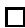

Let $\gamma = \sum y _ { i } T _ { i }$ . By Lemma 15, $\Phi ( \gamma ) = \Phi ( y _ { 0 } , \dots , y _ { m } )$ becomes a formal power series in $\mathbb { Q } [ [ y ] ] = \mathbb { Q } [ [ y _ { 0 } , \dots , y _ { m } ] ]$ :

$$
\Phi \left(y _ {0}, \dots , y _ {m}\right) = \sum_ {n _ {0} + \dots + n _ {m} \geq 3} \sum_ {\beta} I _ {\beta} \left(T _ {0} ^ {n _ {0}} \dots T _ {m} ^ {n _ {m}}\right) \frac {y _ {0} ^ {n _ {0}}}{n _ {0} !} \dots \frac {y _ {m} ^ {n _ {m}}}{n _ {m} !}. \tag {46}
$$

Define $\Phi _ { i j k }$ to be the partial derivative:

$$
\Phi_ {i j k} = \frac {\partial^ {3} \Phi}{\partial y _ {i} \partial y _ {j} \partial y _ {k}}, 0 \leq i, j, k \leq m. \tag {47}
$$

A simple formal calculation, using (46), gives the following equivalent formula:

$$
\Phi_ {i j k} = \sum_ {n \geq 0} \sum_ {\beta} \frac {1}{n !} I _ {\beta} \left(\gamma^ {n} \cdot T _ {i} \cdot T _ {j} \cdot T _ {k}\right). \tag {48}
$$

Now we define a new “quantum” product $^ *$ by the rule:

$$
T _ {i} * T _ {j} = \sum_ {e, f} \Phi_ {i j e} g ^ {e f} T _ {f}. \tag {49}
$$

The product in (49) is extended $\mathbb { Q } [ [ y ] ]$ -linearly to the $\mathbb { Q } [ [ y ] ]$ -module $A ^ { * } X \otimes _ { \mathbb { Z } } \mathbb { Q } [ [ y ] ]$ , thus making it a $\mathbb { Q } [ [ y ] ]$ -algebra. One thing is evident from this remarkable definition: this product is commutative, since the partial derivatives are symmetric in the subscripts.

It is less obvious, but not difficult, to see $T _ { 0 } = 1$ is a unit for the $^ *$ -product. In fact, it follows from property (I) of section 7, together with (48), that

$$
\Phi_ {0 j k} = I _ {0} (T _ {0} \cdot T _ {j} \cdot T _ {k}) = \int_ {X} T _ {j} \cup T _ {k} = g _ {j k},
$$

and from this we see that $\begin{array} { r } { T _ { 0 } { * } T _ { j } = \sum g _ { j e } g ^ { e f } T _ { f } = T _ { j } } \end{array}$ .

The essential point, however, is the associativity:

Theorem 4. This definition makes $A ^ { * } X \otimes \mathbb { Q } [ [ y ] ]$ into a commutative, associative Q[[y]]-algebra, with unit $T _ { 0 }$ .

We start the proof by writing down what associativity says:

$$
\left(T _ {i} * T _ {j}\right) * T _ {k} = \sum_ {e, f} \Phi_ {i j e} g ^ {e f} T _ {f} * T _ {k} = \sum_ {e, f} \sum_ {c, d} \Phi_ {i j e} g ^ {e f} \Phi_ {f k c} g ^ {c d} T _ {d},
$$

$$
T _ {i} * (T _ {j} * T _ {k}) = \sum_ {e, f} \Phi_ {j k e} g ^ {e f} T _ {i} * T _ {f} = \sum_ {e, f} \sum_ {c, d} \Phi_ {j k e} g ^ {e f} \Phi_ {i f c} g ^ {c d} T _ {d}.
$$

Since the matrix $\left( g ^ { c d } \right)$ is nonsingular, the equality of $( T _ { i } * T _ { j } ) * T _ { k }$ and $T _ { i } * \left( T _ { j } * T _ { k } \right)$ is equivalent to the equation

$$
\sum_ {e, f} \Phi_ {i j e} g ^ {e f} \Phi_ {f k l} = \sum_ {e, f} \Phi_ {j k e} g ^ {e f} \Phi_ {i f l}
$$

for all $\it { \Delta } l$ . If we set

$$
F (i, j \mid k, l) = \sum_ {e, f} \Phi_ {i j e} g ^ {e f} \Phi_ {f k l}, \tag {50}
$$

and use the symmetry $\Phi _ { i f l } = \Phi _ { f i l }$ , we see that the associativity is equivalent to the equation

$$
F (i, j \mid k, l) = F (j, k \mid i, l). \tag {51}
$$

It follows from (48) that

$$
(5 2) \qquad F (i, j \mid k, l) = \sum \frac {1}{n _ {1} ! n _ {2} !} I _ {\beta_ {1}} (\gamma^ {n _ {1}} \cdot T _ {i} \cdot T _ {j} \cdot T _ {e}) g ^ {e f} I _ {\beta_ {2}} (\gamma^ {n _ {2}} \cdot T _ {k} \cdot T _ {l} \cdot T _ {f}),
$$

where the sum is over all nonnegative $n _ { 1 }$ and $n _ { 2 }$ , over all $\beta _ { 1 }$ and $\beta _ { 2 }$ in $A _ { 1 } X$ , and over all $e$ and $f$ from 0 to $m$ . We need the following lemma. Recall from section 6, the divisor $D ( A , B ; \beta _ { 1 } , \beta _ { 2 } )$ . In case $A$ and $B$ are nonempty,

$$
D (A, B; \beta_ {1}, \beta_ {2}) = \overline {{M}} _ {0, A \cup \{\bullet \}} (X, \beta_ {1}) \times_ {X} \overline {{M}} _ {0, B \cup \{\bullet \}} (X, \beta_ {2}).
$$

Lemma 16. Let ι denote the natural inclusion of $D ( A , B ; \beta _ { 1 } \beta _ { 2 } )$ in the Cartesian product $\overline { { M } } _ { 0 , A \cup \{ \bullet \} } ( X , \beta _ { 1 } ) \ \times \ \overline { { M } } _ { 0 , B \cup \{ \bullet \} } ( X , \beta _ { 2 } )$ , and let $\alpha$ be the embedding of $D ( A , B ; \beta _ { 1 } , \beta _ { 2 } )$ as a divisor in ${ \overline { { M } } } _ { 0 , n } ( X , { \beta } )$ , with $\beta = \beta _ { 1 } + \beta _ { 2 }$ . Then for any classes $\gamma _ { 1 } , \ldots , \gamma _ { n }$ in $A ^ { * } X$ ,

$$
\iota_ {*} \circ \alpha^ {*} \left(\rho_ {1} ^ {*} \left(\gamma_ {1}\right) \cup \dots \cup \rho_ {n} ^ {*} \left(\gamma_ {n}\right)\right) =
$$

$$
\sum_ {e, f} g ^ {e f} \left(\prod_ {a \in A} \rho_ {a} ^ {*} (\gamma_ {a}) \cdot \rho_ {\bullet} ^ {*} (T _ {e})\right) \times \left(\prod_ {b \in B} \rho_ {b} ^ {*} (\gamma_ {b}) \cdot \rho_ {\bullet} ^ {*} (T _ {f})\right).
$$

Proof. Let $M _ { 1 } = { \overline { { M } } } _ { 0 , A \cup \{ \bullet \} } ( X , \beta _ { 1 } )$ , $M _ { 2 } = M _ { 0 , B \cup \{ \bullet \} } ( X , \beta _ { 2 } )$ , $M = \overline { { { M } } } _ { 0 , n } ( X , \beta )$ , and $D = D ( A , B ; \beta _ { 1 } \beta _ { 2 } )$ . From the identification of $D$ with $M _ { 1 } ~ \times _ { X } ~ M _ { 2 }$ , we have a commutative diagram, with the right square a fiber square:

$$
\begin{array}{c c c c} M & \xleftarrow {\alpha} & D & \xrightarrow {\iota} M _ {1} \times M _ {2} \\ \rho \Big \downarrow & & \eta \Big \downarrow & \Big \downarrow \rho^ {\prime} \\ X ^ {n} & \xleftarrow [ p ]{} & X ^ {n + 1} & \xrightarrow [ \delta ]{} X ^ {n + 2} \end{array} \tag {53}
$$

Here $\rho$ is the product of the evaluation maps denoted $\rho _ { i }$ , $\rho ^ { \prime }$ is the product of maps $\rho _ { i }$ and the two others denoted $\rho _ { \bullet }$ , $\delta$ is the diagonal embedding that repeats the last factor, and $p$ is the projection that forgets the last factor. Then we have

$$
\begin{array}{l} \iota_ {*} \circ \alpha^ {*} \left(\rho_ {1} ^ {*} \left(\gamma_ {1}\right) \cup \dots \cup \rho_ {n} ^ {*} \left(\gamma_ {n}\right)\right) = \quad \iota_ {*} \circ \alpha^ {*} \circ \rho^ {*} \left(\gamma_ {1} \times \dots \times \gamma_ {n}\right) \\ = \iota_ {*} \circ \eta^ {*} \circ p ^ {*} (\gamma_ {1} \times \dots \times \gamma_ {n}) \\ = \iota_ {*} \circ \eta^ {*} (\gamma_ {1} \times \dots \times \gamma_ {n} \times [ X ]) \\ = \rho^ {\prime *} \circ \delta_ {*} (\gamma_ {1} \times \dots \times \gamma_ {n} \times [ X ]) \\ = \rho^ {\prime *} \left(\gamma_ {1} \times \dots \times \gamma_ {n} \times [ \Delta ]\right) \\ = \sum_ {e, f} g ^ {e f} \rho^ {\prime *} (\gamma_ {1} \times \ldots \times \gamma_ {n} \times T _ {e} \times T _ {f}) \\ = \sum_ {e, f} g ^ {e f} \left(\prod_ {a \in A} \rho_ {a} ^ {*} (\gamma_ {a}) \cdot \rho_ {\bullet} ^ {*} (T _ {e})\right) \times \left(\prod_ {b \in B} \rho_ {b} ^ {*} (\gamma_ {b}) \cdot \rho_ {\bullet} ^ {*} (T _ {f})\right). \\ \end{array}
$$

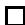

Fix $\beta \in A _ { 1 } X$ and $\gamma _ { 1 } , \ldots , \gamma _ { n } \in A ^ { * } X$ , and fix four distinct integers $q , r , s$ , and $t$ in $[ n ]$ . Set

$$
G (q, r \mid s, t) = \sum g ^ {e f} I _ {\beta_ {1}} \left(\prod_ {a \in A} \gamma_ {a} \cdot T _ {e}\right) \cdot I _ {\beta_ {2}} \left(\prod_ {b \in B} \gamma_ {b} \cdot T _ {f}\right), \tag {54}
$$

where the sum is over all partitions of $[ n ]$ into two sets $A$ and $B$ such that $q$ and $r$ are in $A$ and $s$ and $t$ are in $B$ , and over all $\beta _ { 1 }$ and $\beta _ { 2 }$ that sum to $\beta$ , and over $e$ and $f$ between 0 and $m$ . It follows from Lemma 16 that

$$
G (q, r \mid s, t) = \sum \int_ {D (A, B; \beta_ {1}, \beta_ {2})} \rho_ {1} ^ {*} \gamma_ {1} \cup \dots \cup \rho_ {n} ^ {*} \gamma_ {n},
$$

the sum over $A$ and $B$ and $\beta _ { 1 }$ and $\beta _ { 2 }$ as above. Now Proposition 8 from section 7 implies

$$
G (q, r \mid s, t) = G (r, s \mid q, t). \tag {55}
$$

Apply (55) in the following case :

$$
\gamma_ {i} = \gamma , \quad \text {f o r} 1 \leq i \leq n - 4,
$$

$$
\gamma_ {n - 3} = T _ {i}, \quad \gamma_ {n - 2} = T _ {j}, \quad \gamma_ {n - 1} = T _ {k}, \quad \gamma_ {n} = T _ {l},
$$

$$
q = n - 3, r = n - 2, s = n - 1, t = n.
$$

Then (54) becomes

$$
G(q,r\mid s,t) = \sum \binom {n - 4}{n_{1} - 2}g^{ef}I_{\beta_{1}}(\gamma^{n_{1} - 2}\cdot T_{i}\cdot T_{j}\cdot T_{e})\cdot I_{\beta_{2}}(\gamma^{n_{2} - 2}\cdot T_{k}\cdot T_{l}\cdot T_{f}),
$$

the sum over $n _ { 1 }$ and $n _ { 2 }$ , each at least 2, adding to $n$ , and $\beta _ { 1 }$ and $\beta _ { 2 }$ adding to $\beta$ ; the binomial coefficient is the number of partitions $A$ and $B$ for which $A$ has $n _ { 1 }$ elements, and $B$ has $n _ { 2 }$ elements. This can be rewritten

$$
G (q, r \mid s, t) = n! \sum \frac {1}{n _ {1} ! n _ {2} !} g ^ {e f} I _ {\beta_ {1}} \left(\gamma^ {n _ {1}} \cdot T _ {i} \cdot T _ {j} \cdot T _ {e}\right) \cdot I _ {\beta_ {2}} \left(\gamma^ {n _ {2}} \cdot T _ {k} \cdot T _ {l} \cdot T _ {f}\right), \tag {56}
$$

the sum over nonnegative $n _ { 1 }$ and $n _ { 2 }$ adding to $n - 4$ , and $\beta _ { 1 }$ and $\beta _ { 2 }$ adding to $\beta$ .

The required equality (51) then follows immediately from (55) and (56), together with (52). This completes the proof of Theorem 4.

While the definition of the quantum cohomology ring depends upon a choice of basis $T _ { 0 } , \ldots , T _ { m }$ of $A ^ { * } X$ , the rings obtained from different basis choices are canonically isomorphic. The variables $y _ { 0 } , \ldots , y _ { m }$ should be identified with the dual basis to $T _ { 0 } , \ldots , T _ { m }$ . If $T _ { 0 } ^ { \prime } , \ldots , T _ { m } ^ { \prime }$ is another basis of $A ^ { * } X$ and $\begin{array} { r } { T _ { i } ^ { \prime } = \sum a _ { i j } T _ { j } } \end{array}$ is the change of coordinates, let

$$
y _ {i} = \sum a _ {j i} y _ {j} ^ {\prime} \tag {57}
$$

be the dual coordinate change. Relation (57) yields an isomorphism of $\mathbb { Q }$ -vector spaces

$$
A ^ {*} X \otimes \mathbb {Q} [ [ y ] ] \cong A ^ {*} X \otimes \mathbb {Q} [ [ y ^ {\prime} ] ].
$$

It is easy to check that the quantum products defined respectively on the left and right by the $T$ and $T ^ { \prime }$ bases agree with this identification.

Let $V$ denote the underlying free abelian group of $A ^ { * } X$ . Let $\mathbb { Q } [ [ V ^ { * } ] ]$ be the completion of the graded polynomial ring $\begin{array} { r l } { \bigoplus _ { i = 0 } ^ { \infty } S y m ^ { i } ( V ^ { * } ) \otimes \mathbb { Q } } & { { } } \end{array}$ at the unique maximal graded ideal. The quantum product defines a canonical ring structure on

the free $\mathbb { Q } [ [ V ^ { * } ] ]$ -module $V \otimes _ { \mathbb { Z } } \mathbb { Q } [ [ V ^ { * } ] ]$ . Let $Q H ^ { * } X = ( V \otimes _ { \mathbb { Z } } \mathbb { Q } [ [ V ^ { * } ] ] , * )$ denote the quantum cohomology ring. There is a canonical injection of abelian groups

$$
\iota : A ^ {*} X \hookrightarrow Q H ^ {*} X
$$

determined by $\iota ( v ) = v \otimes 1$ for $v \in V$ . The injection $\iota$ is not compatible with the ∪ and $^ *$ products.

It is worth noting that the quantum cohomology ring $Q H ^ { * } X$ is not in general a formal deformation of $A ^ { * } X$ over the local ring $\mathbb { Q } [ [ V ^ { * } ] ]$ . It can be seen directly from the definitions that the $^ *$ -product does not specialize to the $\cup$ -product when the formal parameters are set to 0. At the end of section 9, a presentation of $Q H ^ { * } \mathbf { P } ^ { 2 }$ shows explicitly the difference between $A ^ { * } \mathbf { P } ^ { 2 }$ and the specialization of $Q H ^ { * } \mathbf { P } ^ { 2 }$ . In section 10, a ring deformation of $A ^ { * } X$ will be constructed via a smaller quantum cohomology ring.

# 9. Applications to enumerative geometry

We write the potential function as a sum:

$$
\Phi (y _ {0}, \ldots , y _ {m}) = \Phi_ {\mathrm {c l a s s i c a l}} (y) + \Phi_ {\mathrm {q u a n t u m}} (y).
$$

The classical part has the terms for $\beta = 0$ :

$$
\Phi_ {\mathrm {c l a s s i c a l}} (y) = \sum_ {n _ {0} + \ldots + n _ {m} = 3} \int_ {X} \left(T _ {0} ^ {n _ {0}} \cup \dots \cup T _ {m} ^ {n _ {m}}\right) \frac {y _ {0} ^ {n _ {0}}}{n _ {0} !} \dots \frac {y _ {m} ^ {n _ {m}}}{n _ {m} !}.
$$

Since the associativity equations involve only third derivatives, we can modify $\Phi$ by any terms of degree at most 2. Using properties (I)–(III) of section 7, we see that $\Phi _ { \mathrm { q u a n t u m } } ( y )$ can be replaced by $\Gamma ( y )$ :

$$
\Gamma (y) = \sum_ {n _ {p + 1} + \ldots + n _ {m} \geq 0} \sum_ {\beta \neq 0} N (n _ {p + 1}, \ldots , n _ {m}; \beta) \prod_ {i = 1} ^ {p} e ^ {\left(\int_ {\beta} T _ {i}\right) y _ {i}} \prod_ {i = p + 1} ^ {m} \frac {y _ {i} ^ {n _ {i}}}{n _ {i} !},
$$

where $N ( n _ { p + 1 } , \ldots , n _ { m } ; \beta ) \ = \ I _ { \beta } ( T _ { p + 1 } { } ^ { n _ { p + 1 } } \cdot \cdot \cdot T _ { m } { } ^ { n _ { m } } )$ . The partial derivatives of $\Phi _ { \mathrm { c l a s s i c a l } }$ involve only the numbers $\int _ { X } T _ { i } \cup T _ { j } \cup T _ { k }$ , while $\Gamma$ involves the interesting enumerative geometry numbers. From this form of $\Gamma$ , it is easy to read off its partial derivatives.

Let us look again at the projective plane from this point of view. Take the obvious basis: $T _ { 0 } = 1$ , $T _ { 1 }$ the class of a line, and $T _ { 2 }$ the class of a point. Note that $g _ { i j }$ is $1$ if $i + j = 2$ , and 0 otherwise, so the same is true for $g ^ { i j }$ . Therefore,

$$
T _ {i} * T _ {j} = \Phi_ {i j 0} T _ {2} + \Phi_ {i j 1} T _ {1} + \Phi_ {i j 2} T _ {0}.
$$

For example,

$$
T _ {1} * T _ {1} = T _ {2} + \Gamma_ {1 1 1} T _ {1} + \Gamma_ {1 1 2} T _ {0},
$$

$$
T _ {1} * T _ {2} = \Gamma_ {1 2 1} T _ {1} + \Gamma_ {1 2 2} T _ {0},
$$

$$
T _ {2} * T _ {2} = \Gamma_ {2 2 1} T _ {1} + \Gamma_ {2 2 2} T _ {0}.
$$

Therefore,

$$
\left(T _ {1} * T _ {1}\right) * T _ {2} = \left(\Gamma_ {2 2 1} T _ {1} + \Gamma_ {2 2 2} T _ {0}\right) + \Gamma_ {1 1 1} \left(\Gamma_ {1 2 1} T _ {1} + \Gamma_ {1 2 2} T _ {0}\right) + \Gamma_ {1 1 2} T _ {2},
$$

$$
T _ {1} * \left(T _ {1} * T _ {2}\right) = \Gamma_ {1 2 1} \left(T _ {2} + \Gamma_ {1 1 1} T _ {1} + \Gamma_ {1 1 2} T _ {0}\right) + \Gamma_ {1 2 2} T _ {1}.
$$

The fact that the coefficients of $T _ { 0 }$ must be equal in these last two expressions gives the equation:

$$
\Gamma_ {2 2 2} = \Gamma_ {1 1 2} ^ {2} - \Gamma_ {1 1 1} \Gamma_ {1 2 2}. \tag {58}
$$

If $\beta = d [ \mathrm { l i n e } ]$ , the number $N ( n , \beta )$ is nonzero only when $n = 3 d - 1$ , when it is the number $N _ { d }$ of plane rational curves of degree $d$ passing through $3 d - 1$ general points. So,

$$
\Gamma (y) = \sum_ {d \geq 1} N _ {d} e ^ {d y _ {1}} \frac {y _ {2} ^ {3 d - 1}}{(3 d - 1) !}.
$$

From this we read off the partial derivatives:

$$
\Gamma_ {2 2 2} = \sum_ {d \geq 2} N _ {d} e ^ {d y _ {1}} \frac {y _ {2} ^ {3 d - 4}}{(3 d - 4) !}
$$

$$
\Gamma_ {1 1 2} = \sum_ {d \geq 1} d ^ {2} N _ {d} e ^ {d y _ {1}} \frac {y _ {2} ^ {3 d - 2}}{(3 d - 2) !}
$$

$$
\Gamma_ {1 1 1} = \sum_ {d \geq 1} d ^ {3} N _ {d} e ^ {d y _ {1}} \frac {y _ {2} ^ {3 d - 1}}{(3 d - 1) !}
$$

$$
\Gamma_ {1 2 2} = \sum_ {d \geq 1} d N _ {d} e ^ {d y _ {1}} \frac {y _ {2} ^ {3 d - 3}}{(3 d - 3) !}.
$$

Therefore,

$$
\Gamma_ {1 1 2} ^ {2} = \sum_ {d \geq 2} \sum_ {d _ {1} + d _ {2} = d} d _ {1} ^ {2} N _ {d _ {1}} d _ {2} ^ {2} N _ {d _ {2}} e ^ {d y _ {1}} \frac {y _ {2} ^ {3 d - 4}}{(3 d _ {1} - 2) ! (3 d _ {2} - 2) !},
$$

$$
\Gamma_ {1 1 1} \Gamma_ {1 2 2} = \sum_ {d \geq 2} \sum_ {d _ {1} + d _ {2} = d} d _ {1} ^ {3} N _ {d _ {1}} d _ {2} N _ {d _ {2}} e ^ {d y _ {1}} \frac {y _ {2} ^ {3 d - 4}}{(3 d _ {1} - 1) ! (3 d _ {2} - 3) !}.
$$

In all these sums, $d _ { 1 }$ and $d _ { 2 }$ are positive. Equating the coefficients of

$$
e ^ {d y _ {1}} y _ {2} ^ {3 d - 4} / (3 d - 4)!,
$$

we get the identity ( $d \geq 2$ ):

$$
N _ {d} = \sum_ {d _ {1} + d _ {2} = d} N _ {d _ {1}} N _ {d _ {2}} \left[ d _ {1} ^ {2} d _ {2} ^ {2} \binom {3 d - 4} {3 d _ {1} - 2} - d _ {1} ^ {3} d _ {2} \binom {3 d - 4} {3 d _ {1} - 1} \right]. \tag {59}
$$

Here a binomial coefficient $\textstyle { \binom { n } { m } }$ is defined to be zero if any of $n$ , $m$ , or $n - m$ is negative. This is the recursion formula discussed in the introduction.

Note that the quantum formalism has removed any necessity to be clever. One simply writes down the associativity equations, and reads off enumerative information. One can organize the information in these associativity equations more systematically as follows (see [DF-I]). Let $F ( i , j \mid k , l )$ be defined by (50). For $0 \leq i , j , k , l \leq m$ , define:

$$
\begin{array}{l} A (i, j, k, l) = F (i, j \mid k, l) - F (j, k \mid i, l) \\ = \sum_ {e, f} \Phi_ {i j e} g ^ {e f} \Phi_ {f k l} - \Phi_ {j k e} g ^ {e f} \Phi_ {f i l}. \\ \end{array}
$$

Associativity (Theorem 4) amounts to the equations $A ( i , j , k , l ) = 0$ for all $i , j , k , l$ . The symmetry of $\Phi _ { i j k }$ in the subscripts and $g ^ { e f }$ in the superscripts and the basic facts about $\Phi _ { 0 j k }$ imply:

(i) $A ( k , j , i , l ) = - A ( i , j , k , l )$ ,   
(ii) $A ( l , k , j , i ) = A ( i , j , k , l )$ ,   
(iii) $A ( i , j , k , l ) = 0$ if $i = k$ or $j = l$ or if any of the indices $i , j , k , l$ equals 0.

We consider equations equivalent if they differ by sign. For distinct $i , j , k , l$ , the 24 possible equations divide into 3 groups of 8. The equation $A ( i , j , k , l ) = 0$ that says $F ( i , j \mid k , l ) = F ( j , k \mid i , l )$ can be labelled by a duality diagram from topological field theory (see [DF-I]):

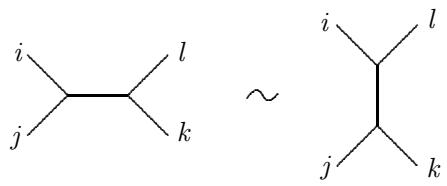

This diagram corresponds to the equations:

$$
\begin{array}{l} A (i, j, k, l) = A (j, i, l, k) = A (k, l, i, j) = A (l, k, j, i) = 0 \\ - A (i, l, k, j) = - A (k, j, i, l) = - A (l, i, j, k) = - A (j, k, l, i) = 0. \\ \end{array}
$$

To obtain the equations, read the labels around the left or right diagram (either clockwise or counterclockwise, but always reading two grouped together at an end first). The other sixteen equations correspond similarly to the diagrams:

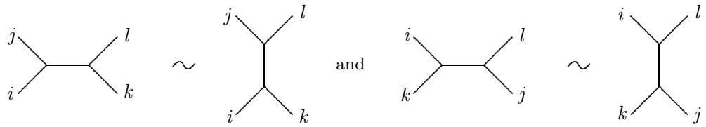

In practice, one only needs to write down one equation for each such diagram.

When 3 of the 4 labels are distinct, say $i , i , j , k$ , there is only 1 equation up to sign (which occurs 8 times). It corresponds to:

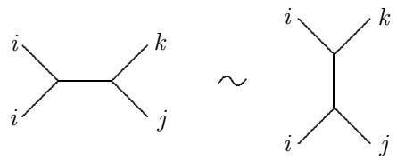

When two labels are distinct, there is again only 1 equation up to sign (occurring 4 times):

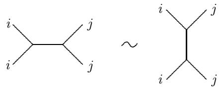

The symmetry in these diagrams reflects the symmetry in the equations. Taking just one equation for each diagram, one sees that the number $N ( m )$ of equations

for $\operatorname { r a n k } ( A ^ { * } X ) = m + 1$ is

$$
N (m) = 3 \binom {m} {4} + m \binom {m - 1} {2} + \binom {m} {2} = \frac {m (m - 1) (m ^ {2} - m + 2)}{8},
$$

so $N ( 2 ) = 1$ , $N ( 3 ) = 6$ , $N ( 4 ) = 2 1$ , $N ( 5 ) = 5 5$ , $N ( 6 ) = 1 2 0$ , and $N ( 7 ) = 2 3 1$ . For the complete flag manifold $\mathbf { F l } ( \mathbb { C } ^ { n } )$ , $m = n ! - 1$ . The number of equations for $\mathbf { F l } ( \mathbb { C } ^ { 4 } )$ is $N ( 2 3 ) = 3 0 8 6 1$ .

Let us work this out for the two varieties $X = \mathbf { P } ^ { 3 }$ and $X = \mathbf { Q } ^ { 3 }$ (a smooth quadric 3-fold), which have very similar classical cohomology rings. Each has a basis :

$$
\begin{array}{l} T _ {0} = 1, \\ T _ {1} = \text {h y p e r p l a n e c l a s s}, \\ T _ {2} = \text {l i n e c l a s s}, \\ T _ {3} = \text {p o i n t c l a s s}. \\ \end{array}
$$

The difference in the classical product is that $T _ { 1 } \cup T _ { 1 } = T _ { 2 }$ for $\mathbf { P } ^ { 3 }$ but $T _ { 1 } \cup T _ { 1 } = 2 T _ { 2 }$ for ${ \bf Q } ^ { 3 }$ . Let $c = 1$ for $\mathbf { P } ^ { 3 }$ and $c = 2$ for ${ \bf Q } ^ { 3 }$ . The $N ( 3 ) = 6$ equations are:

$$
\begin{array}{l} \begin{array}{l} _ {1} ^ {1} \times_ {2} ^ {2} \\ 2 \Gamma_ {1 2 3} - c \Gamma_ {2 2 2} = \Gamma_ {1 1 1} \Gamma_ {2 2 2} - \Gamma_ {1 1 2} \Gamma_ {1 2 2} \end{array} \\ \begin{array}{c} ^ {1} _ {1} \times^ {3} _ {2} \\ \Gamma_ {1 3 3} - c \Gamma_ {2 2 3} = \Gamma_ {1 1 1} \Gamma_ {2 2 3} - \Gamma_ {1 1 3} \Gamma_ {1 2 2} \end{array} \\ \begin{array}{c} ^ {1} _ {1} \times^ {3} _ {3} \\ c \Gamma_ {2 3 3} = 2 \Gamma_ {1 1 3} \Gamma_ {1 2 3} - \Gamma_ {1 1 2} \Gamma_ {1 3 3} - \Gamma_ {1 1 1} \Gamma_ {2 3 3} \end{array} \\ \begin{array}{c} \Gamma_ {2 3 3} = \Gamma_ {1 1 3} \Gamma_ {2 2 2} - \Gamma_ {1 1 2} \Gamma_ {2 2 3} \\ \end{array} \\ \begin{array}{c} \left. _ {3} ^ {1} \right\rangle_ {3} ^ {2} \\ \Gamma_ {3 3 3} = \Gamma_ {1 2 3} ^ {2} - \Gamma_ {1 2 2} \Gamma_ {1 3 3} + \Gamma_ {1 1 3} \Gamma_ {2 2 3} - \Gamma_ {1 1 2} \Gamma_ {2 3 3} \end{array} \\ \begin{array}{l} _ {3} ^ {3} \times_ {2} ^ {2} \\ 0 = \Gamma_ {1 3 3} \Gamma_ {2 2 2} - 2 \Gamma_ {1 2 3} \Gamma_ {2 2 3} + \Gamma_ {1 2 2} \Gamma_ {2 3 3} \end{array} \\ \end{array}
$$

The function $\Gamma$ has the form:

$$
\Gamma = \sum N _ {a, b} e ^ {d y _ {1}} \frac {y _ {2} ^ {a}}{a !} \frac {y _ {3} ^ {b}}{b !}. \tag {60}
$$

For $\mathbf { P } ^ { 3 }$ the sum in (60) is over non-negative $a , b$ satisfying $a + 2 b = 4 d$ , $d \geq 1$ . A crucial difference is that for ${ \bf Q } ^ { 3 }$ , the sum in (60) is over $a + 2 b = 3 d$ , $d \geq 1$ reflecting the fact that $c _ { 1 } ( T _ { \mathbf { P } ^ { 3 } } ) = 4 T _ { 1 }$ while $c _ { 1 } ( T _ { \mathbf { Q } ^ { 3 } } ) = 3 T _ { 1 }$ . In each case, $N _ { a , b }$ is the number of degree $d$ rational curves in $X$ meeting $a$ general lines and $b$ general points of $X$ .

Each of the six differential equations above yields a recursion among the $N _ { a , b }$ :

(1) $\begin{array} { r } { \mathrm { F o r } a \geq 3 , b \geq 0 , 2 d N _ { a - 2 , b + 1 } - c N _ { a , b } = } \end{array}$

$$
\sum N _ {a _ {1}, b _ {1}} N _ {a _ {2}, b _ {2}} \left( \begin{array}{c} b \\ b _ {1} \end{array} \right) \left(d _ {1} ^ {3} \binom {a - 3} {a _ {1}} - d _ {1} ^ {2} d _ {2} \binom {a - 3} {a _ {1} - 1}\right)
$$

(2) $\begin{array} { r } { \mathrm { F o r } a \geq 2 , b \geq 1 , d N _ { a - 2 , b + 1 } - c N _ { a , b } = } \end{array}$

$$
\sum N _ {a _ {1}, b _ {1}} N _ {a _ {2}, b _ {2}} \binom {a - 2} {a _ {1}} \left(d _ {1} ^ {3} \binom {b - 1} {b _ {1}} - d _ {1} ^ {2} d _ {2} \binom {b - 1} {b _ {1} - 1}\right)
$$

(3) $\mathrm { F o r } ~ a \geq 1 , ~ b \geq 2 , ~ c N _ { a , b } =$

$$
\sum N _ {a _ {1}, b _ {1}} N _ {a _ {2}, b _ {2}} \left(2 d _ {1} ^ {2} d _ {2} \binom {a - 1} {a _ {1}} \binom {b - 2} {b _ {1} - 1}\right) - d _ {1} ^ {2} d _ {2} \binom {a - 1} {a _ {1} - 1} \binom {b - 2} {b _ {1}}
$$

$$
- d _ {1} ^ {3} \left( \begin{array}{c} a - 1 \\ a _ {1} \end{array} \right) \left( \begin{array}{c} b - 2 \\ b _ {1} \end{array} \right)\Bigg)
$$

(4) For a ≥ 3, b ≥ 1, Na−2,b+1 =

$$
\sum N _ {a _ {1}, b _ {1}} N _ {a _ {2}, b _ {2}} d _ {1} ^ {2} \Bigg (\left( \begin{array}{c} a - 3 \\ a _ {1} \end{array} \right) \left( \begin{array}{c} b - 1 \\ b _ {1} - 1 \end{array} \right) - \left( \begin{array}{c} a - 3 \\ a _ {1} - 1 \end{array} \right) \left( \begin{array}{c} b - 1 \\ b _ {1} \end{array} \right) \Bigg)
$$

(5) For a ≥ 2, b ≥ 2, Na−2,b+1 =

$$
\begin{array}{l} \sum N _ {a _ {1}, b _ {1}} N _ {a _ {2}, b _ {2}} \left(d _ {1} d _ {2} \binom {a - 2} {a _ {1} - 1} \binom {b - 2} {b _ {1} - 1}\right) - d _ {1} d _ {2} \binom {a - 2} {a _ {1} - 2} \binom {b - 2} {b _ {1}} \\ + d _ {1} ^ {2} \left( \begin{array}{c} a - 2 \\ a _ {1} \end{array} \right) \left( \begin{array}{c} b - 2 \\ b _ {1} - 1 \end{array} \right) - d _ {1} ^ {2} \left( \begin{array}{c} a - 2 \\ a _ {1} - 1 \end{array} \right) \left( \begin{array}{c} b - 2 \\ b _ {1} \end{array} \right) \\ \end{array}
$$

(6) For a ≥ 3, b ≥ 2, 0 =

$$
\begin{array}{l} \sum N _ {a _ {1}, b _ {1}} N _ {a _ {2}, b _ {2}} d _ {1} \left(\left( \begin{array}{c} a - 3 \\ a _ {1} \end{array} \right) \left( \begin{array}{c} b - 2 \\ b _ {1} - 2 \end{array} \right) - 2 \left( \begin{array}{c} a - 3 \\ a _ {1} - 1 \end{array} \right) \left( \begin{array}{c} b - 2 \\ b _ {1} - 1 \end{array} \right)\right. \\ + \left( \begin{array}{c} a - 3 \\ a _ {1} - 2 \end{array} \right) \left( \begin{array}{c} b - 2 \\ b _ {1} \end{array} \right) \Bigg) \\ \end{array}
$$

In these formulas, the sum is over non-negative $a _ { 1 } , a _ { 2 } , b _ { 1 } , b _ { 2 }$ satisfying

(i) $a _ { 1 } + a _ { 2 } = a $ , $b _ { 1 } + b _ { 2 } = b$   
(ii) $a + 2 b = 4 d$ , $a _ { i } + 2 b _ { i } = 4 d _ { i }$ , $d _ { i } > 0$ for $\mathbf { P } ^ { 3 }$ ,

$$
a + 2 b = 3 d, a _ {i} + 2 b _ {i} = 3 d _ {i}, d _ {i} > 0 \text {f o r} \mathbf {Q} ^ {3}.
$$

For $\mathbf { P } ^ { 3 }$ , one starts with the $N _ { 0 , 2 } = 1$ for the number of lines through two points. For ${ \bf Q } ^ { 3 }$ , $N _ { 1 , 1 } = 1$ is not hard to compute directly. In each case, the six recursions are more than enough to solve for all the other $N _ { a , b }$ . These numbers for $\mathbf { P } ^ { 3 }$ include the classical results: there are $N _ { 4 , 0 } = 2$ lines meeting 4 general lines, $N _ { 8 , 0 } = 9 2$ conics meeting 8 general lines, and $N _ { 1 2 , 0 } = 8 0 1 6 0$ twisted cubics meeting 12 general lines. See [DF-I] for more of these numbers2. For ${ \bf Q } ^ { 3 }$ , computations yield:

$$
\begin{array}{l} N _ {1 0, 1} = 8 1 4 8, N _ {1 2, 0} = 4 6 2 3 0 \\ N _ {9, 3} = 7 1 1 7 8, N _ {1 1, 2} = 4 5 7 7 8 8, N _ {1 3, 1} = 3 1 3 6 2 8 4, \\ N _ {1 5, 0} = 2 2 7 3 1 8 1 0. \\ \end{array}
$$

The reader is invited to work out the equations for some other simple homogeneous spaces such as $\mathbf { P } ^ { 4 }$ , $\mathbf { P } ^ { 1 } \times \mathbf { P } ^ { 1 }$ , $\mathbf { G r } ( 2 , 4 )$ , or the incidence variety $\mathbf { F l } ( \mathbb { C } ^ { 3 } )$ of points on lines in the plane. For very pleasant excursions along these paths, see [DF-I].

There is a simple method of obtaining a presentation of $Q H ^ { * } X$ from $\Phi$ and a presentation of $A ^ { * } X$ . It will be convenient to consider $A ^ { * } X _ { \mathbb { Q } } = H ^ { * } ( X , \mathbb { Q } )$ , the cohomology ring of $X$ with rational coefficients. Following the notation of section 8, let $Q H ^ { * } X = ( V \otimes _ { Z } \mathbb { Q } \lfloor \lfloor V ^ { * } \rfloor \rfloor , * )$ . There is a canonical embedding:

$$
\iota_ {\mathbb {Q}}: A ^ {*} X _ {\mathbb {Q}} \hookrightarrow Q H ^ {*} X
$$

of $\mathbb { Q }$ -vector spaces. In the discussion below, $A ^ { * } X _ { \mathbb { Q } }$ is viewed as a $\mathbb { Q }$ -subspace of $Q H ^ { * } X$ via $\iota _ { \mathbb { Q } }$ . The results relating presentations of $A ^ { * } X _ { \mathbb { Q } }$ and $Q H ^ { * } X$ are established in Propositions 9 and 10.

Proposition 9. Let $z _ { 1 } , . . . , z _ { r }$ be homogeneous elements of positive codimension that generate $A ^ { * } X _ { \mathbb { Q } }$ as a $\mathbb { Q }$ -algebra. Then, $z _ { 1 } , \dots , z _ { r }$ generate $Q H ^ { * } X$ as a $\mathbb { Q } [ [ V ^ { * } ] ]$ - algebra.

The proof requires a lemma. Note that for $\gamma \in \mathbb { Q } [ [ V ^ { * } ] ]$ there is a well-defined constant term $\gamma ( 0 ) \in \mathbb { Q }$ .

Lemma 17. Let $T _ { 0 } , \ldots , T _ { m }$ be any homogeneous $\mathbb { Q }$ -basis of $A ^ { * } X _ { \mathbb { Q } }$ . Let $w _ { 1 } , w _ { 2 } \in$ $A ^ { * } X _ { \mathbb { Q } }$ be homogeneous elements. Let

$$
w _ {1} \cup w _ {2} = \sum_ {k = 0} ^ {m} c _ {k} T _ {k}, \quad c _ {k} \in \mathbb {Q},
$$

$$
w _ {1} * w _ {2} = \sum_ {k = 0} ^ {m} \gamma_ {k} T _ {k}, \quad \gamma_ {k} \in \mathbb {Q} [ [ V ^ {*} ] ],
$$

be the unique expansions in $A ^ { * } X _ { \mathbb { Q } }$ and $Q H ^ { * } X$ respectively.

(i) $I f \mathrm { c o d i m } ( T _ { k } ) > \mathrm { c o d i m } ( w _ { 1 } ) + \mathrm { c o d i m } ( w _ { 2 } )$ , then $\gamma _ { k } ( 0 ) = 0$ .   
(ii) I $f \mathrm { c o d i m } ( T _ { k } ) = \mathrm { c o d i m } ( w _ { 1 } ) + \mathrm { c o d i m } ( w _ { 2 } )$ , then $\gamma _ { k } ( 0 ) = c _ { k }$

Proof. By linearity of the $^ *$ -product, it can be assumed that $w _ { 1 }$ and $w _ { 2 }$ are basis elements $T _ { i }$ and $T _ { j }$ respectively. In the basis $T _ { 0 } , \ldots , T _ { m }$ of $A _ { \mathbb { Q } } ^ { * } X$ , the $^ *$ -product is determined by:

$$
T _ {i} * T _ {j} = T _ {i} \cup T _ {j} + \sum_ {i = 1} ^ {m} \Gamma_ {i j l} g ^ {l k} T _ {k}
$$

where the dual coordinates $y _ { 0 } , \ldots , y _ { m }$ are taken in $V ^ { * } \otimes \mathbb { Q }$ . $\begin{array} { r } { \Gamma _ { i j l } ( 0 ) = \sum _ { \beta \neq 0 } I _ { \beta } ( T _ { i } . } \end{array}$ $T _ { j } \cdot T _ { l } )$ . Therefore, if $\Gamma _ { i j l } ( 0 ) \not = 0$ , there must exist a nonzero effective class $\beta \in A _ { 1 } X$ such that

$$
\dim \overline {{M}} _ {0, 3} (X, \beta) = \operatorname {c o d i m} \left(T _ {i}\right) + \operatorname {c o d i m} \left(T _ {j}\right) + \operatorname {c o d i m} \left(T _ {l}\right).
$$

Since $X$ is homogeneous, $\int _ { \beta } c _ { 1 } ( X ) \geq 2$ by Lemma 11. By the dimension formula,

(61) $\mathrm { c o d i m } ( T _ { i } ) + \mathrm { c o d i m } ( T _ { j } ) + \mathrm { c o d i m } ( T _ { l } ) \geq \mathrm { d i m } ( X ) + 2 .$

Equation (61) yields $\mathrm { c o d i m } ( T _ { l } ) \geq \mathrm { d i m } ( X ) - \mathrm { c o d i m } ( T _ { i } ) - \mathrm { c o d i m } ( T _ { j } ) + \frac { \tau } { 2 }$ 2. For $g ^ { l k }$ to be nonzero, it follows that $\mathrm { c o d i m } ( T _ { k } ) \leq \mathrm { c o d i m } ( T _ { i } ) + \mathrm { c o d i m } ( T _ { j } ) - 2$ . The lemma is proven. □

We will apply Lemma 17 to products in a basis of $A ^ { * } X _ { \mathbb { Q } }$ consisting of monomials $z ^ { I } = z _ { 1 } ^ { i _ { 1 } } \cup \cdot \cdot \cdot \cup z _ { r } ^ { i _ { r } }$ . Let

$$
z ^ {* I} = \underbrace {z _ {1} * \cdots * z _ {1}} _ {i _ {1}} * \underbrace {z _ {2} * \cdots * z _ {2}} _ {i _ {2}} * \dots * \underbrace {z _ {r} * \cdots * z _ {r}} _ {i _ {r}}
$$

denote the corresponding monomial in $Q H ^ { * } X$ . Let

(62) $\{ z ^ { I } \mid I \in { \mathcal { S } } \}$

be a monomial $\mathbb { Q }$ -basis of $A ^ { * } X _ { \mathbb { Q } }$ . Choose an ordering of the set $\boldsymbol { S }$ so that $\mathrm { c o d i m } ( z ^ { I } ) \leq$ $\operatorname { c o d i m } ( z ^ { J } )$ for $I < J$ . Let

$$
z ^ {* I} = \sum_ {J \in \mathcal {S}} \gamma_ {I J} z ^ {J}, \quad \gamma_ {I J} \in \mathbb {Q} [ [ V ^ {*} ] ]
$$

be the unique expansion in $Q H ^ { * } X$ . An inductive application of Lemma 17 yields:

(i) If $J > I$ , then $\gamma _ { I J } ( 0 ) = 0$   
(ii) $\gamma _ { I I } ( 0 ) = 1$

Therefore, the matrix $( \gamma _ { I J } ( 0 ) )$ is invertible over $\mathbb { Q }$ . It follows that the matrix $\left( \gamma _ { I J } \right)$ is invertible over $\mathbb { Q } [ [ V ^ { * } ] ]$ . In particular, $\{ z ^ { * I } \mid I \in S \}$ is a $\mathbb { Q } [ [ V ^ { * } ] ]$ -basis of $Q H ^ { * } X$ . Proposition 9 is proved.

Let $K$ be the kernel of the surjection

$$
\phi : \mathbb {Q} [ Z ] = \mathbb {Q} [ Z _ {1}, \dots , Z _ {r} ] \to A ^ {*} X _ {\mathbb {Q}}
$$

determined by $\phi ( Z _ { i } ) = z _ { i }$ . Let $K ^ { \prime }$ be the kernel of the corresponding surjection

$$
\phi^ {\prime}: \mathbb {Q} [ [ V ^ {*} ] ] [ Z ] \to Q H ^ {*} X
$$

determined by $\phi ^ { \prime } ( Z _ { i } ) = z _ { i }$ Using our choice (62) of monomial basis, there is a method of constructing elements of $K ^ { \prime }$ from elements of $K$ . Let $f \in K$ . The polynomial $f$ is also an element of $\mathbb { Q } [ [ V ^ { * } ] ] [ Z ]$ . There is a unique expansion:

$$
\phi^ {\prime} (f) = \sum_ {I \in \mathcal {S}} \xi_ {I} z ^ {* I}, \xi_ {I} \in \mathbb {Q} [ [ V ^ {*} ] ].
$$

Then, $\begin{array} { r } { f ^ { \prime } = f ( Z _ { 1 } , \dots , , Z _ { r } ) - \sum _ { I \in \mathcal { S } } \xi _ { I } Z ^ { I } } \end{array}$ is in $K ^ { \prime }$ .

The ideal $K$ is homogeneous provided the degree of $Z _ { i }$ is taken to be the codimension of $z _ { i }$ . We need the following fact.

Lemma 18. Let $f \in K$ be homogeneous of degree d and let $I \in S$ . If $\deg ( Z ^ { I } ) \geq$ $d$ , then $\xi _ { I } ( 0 ) = 0$ .

Proof. If $d > \dim ( X )$ , the statement is vacuous. Assume $d \ \leq \ \dim ( X )$ . Let $\begin{array} { r } { \phi ^ { \prime } ( f ) = \sum _ { I \in \mathcal { S } } \tilde { \xi } _ { I } z ^ { I } , \tilde { \xi } _ { I } \in \mathbb { Q } [ [ V ^ { * } ] ] } \end{array}$ be the unique expansion. Apply Lemma 17 repeatedly to the monomials of $f$ in the basis $\{ z ^ { I } \mid I \in S \}$ of $A ^ { * } X _ { \mathbb { Q } }$ . It follows that if $\deg ( Z ^ { I } ) \geq d$ , then $\tilde { \xi } _ { I } ( 0 ) = 0$ . The change of basis relations (i) and (ii) for the $\mathbb { Q } [ [ V ^ { * } ] ]$ -basis $\{ z ^ { * I } \mid I \in S \}$ now imply the lemma. □

Now suppose the elements $f _ { 1 } , \ldots , f _ { s }$ are homogeneous generators of $K$ , so

$$
A ^ {*} X _ {\mathbb {Q}} = \mathbb {Q} [ Z ] / (f _ {1}, \dots , f _ {s})
$$

is a presentation of the cohomology ring.

Proposition 10. The ideal $K ^ { \prime }$ is generated by $f _ { 1 } ^ { \prime } , \ldots , f _ { s } ^ { \prime }$ , so

$$
Q H ^ {*} X = \mathbb {Q} [ [ V ^ {*} ] ] [ Z ] / (f _ {1} ^ {\prime}, \dots , f _ {s} ^ {\prime})
$$

is a presentation of the quantum cohomology ring.

Proof. Since we have a surjection

$$
\mathbb {Q} \left[\left[ V ^ {*} \right]\right] [ Z ] / \left(f _ {1} ^ {\prime} \dots , f _ {s} ^ {\prime}\right)\rightarrow Q H ^ {*} X
$$

and $Q H ^ { * } X$ is a free $\mathbb { Q } [ [ V ^ { * } ] ]$ -module with basis $\{ z ^ { * I } \mid I \in S \}$ , it suffices to show that the monomials $\{ Z ^ { I } \mid I \in { \cal S } \}$ span the $\mathbb { Q } [ [ V ^ { * } ] ]$ -module on the left. By Nakayama’s lemma, it suffices to show that these monomials generate the $\mathbb { Q }$ -vector space

$$
\mathbb {Q} \left[ \left[ V ^ {*} \right] \right] [ Z ] / \left(f _ {1} ^ {\prime}, \dots , f _ {s} ^ {\prime}, \mathfrak {m}\right), \tag {63}
$$

where ${ \mathfrak { m } } \subset \mathbb { Q } [ [ V ^ { * } ] ]$ is the maximal ideal. Let $f _ { i } ^ { \prime } = f _ { i } - \sum \xi _ { i I } Z ^ { I }$ . Define $\overline { { f } } _ { i } ^ { \prime } \in \mathbb { Q } [ Z ]$ by $\overline { { f } } _ { i } ^ { \prime } = f _ { i } - \sum \xi _ { i I } ( 0 ) Z ^ { I }$ . The $\mathbb { Q }$ -algebra (63) can be identified with

$$
\mathbb {Q} [ Z ] / (\overline {{f}} _ {1} ^ {\prime}, \dots , \overline {{f}} _ {s} ^ {\prime}).
$$

By Lemma 18, all the terms $\xi _ { i I } ( 0 ) Z ^ { I }$ have strictly lower degree than $f _ { i }$ . It is then a simple induction on the degree to see that the same monomials $\{ Z ^ { I } \}$ that span modulo $( f _ { 1 } , \dots , f _ { s } )$ will also span modulo $( \overline { { f } } _ { 1 } ^ { \prime } , \ldots , \overline { { f } } _ { s } ^ { \prime } )$ . □

For example, let $X \ = \ \mathbf { P } ^ { 2 }$ . Let $Z \ = \ Z _ { 1 }$ and let $A _ { \mathbb { Q } } ^ { * } { \bf P } ^ { 2 } = \mathbb { Q } [ Z ] / Z ^ { 3 }$ be the standard presentation with the monomial basis $1 , Z , Z ^ { 2 }$ . A presentation of $Q H ^ { * } \mathbf { P } ^ { 2 }$ is obtained:

$$
Q H ^ {*} \mathbf {P} ^ {2} \stackrel {{\sim}} {{\to}} \mathbb {Q} \left[ \left[ y _ {0}, y _ {1}, y _ {2} \right] \right] [ Z ] / \left(Z ^ {3} - \Gamma_ {1 1 1} Z ^ {2} - 2 \Gamma_ {1 1 2} Z - \Gamma_ {1 2 2}\right) \tag {64}
$$

where $\Gamma$ is the quantum potential of $\mathbf { P } ^ { 2 }$ . By (64) and the determination of $\Gamma$ ,

$$
Q H ^ {*} \mathbf {P} ^ {2} \otimes_ {\mathbb {Q} [ [ V ^ {*} ] ]} \mathbb {Q} [ [ V ^ {*} ] ] / \mathfrak {m} = \mathbb {Q} [ Z ] / (Z ^ {3} - 1).
$$

Note that $Q H ^ { * } \mathbf { P } ^ { 2 }$ does not specialize to $A ^ { * } \mathbf { P } ^ { 2 }$ .

# 10. Variations

The algebra $Q H ^ { * } X = A ^ { * } X \otimes \mathbb { Q } [ [ V ^ { * } ] ]$ may be regarded as the “big” quantum cohomology ring. There is also a “small” quantum cohomology ring, $Q H _ { s } ^ { * } X$ , that incorporates only the 3-point Gromov-Witten invariants in its product. $Q H _ { s } ^ { * } X$ is obtained by restricting the $^ *$ -product to the formal deformation parameters of the divisor classes. Most computations of quantum cohomology rings have been of this small ring, which is often easier to describe; the small ring is often denoted $Q H ^ { * } X$ .

It is simplest to define $Q H _ { s } ^ { * } X$ in the Schubert basis $T _ { 0 } , \ldots , T _ { m }$ . Let

$$
\overline {{\Phi}} _ {i j k} = \Phi_ {i j k} \left(y _ {0}, y _ {1}, \dots , y _ {p}, 0, \dots , 0\right) = \int_ {X} T _ {i} \cup T _ {j} \cup T _ {k} + \overline {{\Gamma}} _ {i j k}. \tag {65}
$$

The modified quantum potential $\overline { { \Gamma } } _ { i j k }$ is determined by

$$
\overline {{\Gamma}} _ {i j k} = \sum_ {n \geq 0} \frac {1}{n !} \sum_ {\beta \neq 0} I _ {\beta} (\gamma^ {n} \cdot T _ {i} \cdot T _ {j} \cdot T _ {k})
$$

where $\gamma = y _ { 1 } T _ { 1 } + . . . + y _ { p } T _ { p }$ . By the divisor property (III) of section 7,

$$
\overline {{\Gamma}} _ {i j k} = \sum_ {\beta \neq 0} I _ {\beta} \left(T _ {i} \cdot T _ {j} \cdot T _ {k}\right) q _ {1} ^ {\int_ {\beta} T _ {1}} \dots q _ {p} ^ {\int_ {\beta} T _ {p}}, \tag {66}
$$

where $q _ { i } = e ^ { y _ { i } }$ . Note that only 3-point invariants occur. Let $\mathbb { Z } [ q ] = [ q _ { 1 } , \dots , q _ { p } ]$ By Theorem 4, the product

$$
T _ {i} * T _ {j} = \sum_ {e, f} \overline {{\Phi}} _ {i j e} g ^ {e f} T _ {f} = T _ {i} \cup T _ {j} + \sum_ {e, f} \overline {{\Gamma}} _ {i j e} g ^ {e f} T _ {f}
$$

then makes the $\mathbb { Z } [ q ]$ -module $A ^ { * } X \otimes _ { \mathbb { Z } } \mathbb { Z } [ q ]$ into a commutative, associative $\mathbb { Z } [ q ]$ - algebra with unit $T _ { 0 }$ . From equation (66), it easily follows that the small quantum cohomology is a deformation of $A ^ { * } X$ is the usual sense: $A ^ { * } X$ is recovered by setting the variables $q _ { i } = 0$ .

For example, let $X = \mathbf { P } ^ { r }$ . Then, $q = q _ { 1 }$ . If $T _ { i }$ is the class of a linear subspace of codimension $i$ and $\beta$ is $d$ times the class of a line, then the number $I _ { \beta } ( T _ { i } { \cdot } T _ { j } { \cdot } T _ { k } )$ can be nonzero only if $i + j + k = r + ( r + 1 ) d$ ; this can happen only for $d = 0$ or $d = 1$ , and in each case the number is 1. It follows that,

(i) if $i + j \le r$ , then $T _ { i } * T _ { j } = T _ { i + j }$ ;   
(ii) if $r + 1 \leq i + j \leq 2 r$ , then ${ \cal T } _ { i } * { \cal T } _ { j } = q { \cal T } _ { i + j - r - 1 }$

Therefore the small quantum cohomology ring is:

$$
Q H _ {s} ^ {*} \mathbf {P} ^ {r} = \mathbb {Z} [ T, q ] / (T ^ {r + 1} - q),
$$

where $T = T _ { 1 }$ is the class of a hyperplane.

The following variation of Proposition 10 is valid for the small quantum cohomology ring (cf. [S-T]). As before let $z _ { 1 } , \dots , z _ { r }$ be homogenous elements of positive codimension that generate $A ^ { * } X$ . (We use integer coefficients but rational coefficients could be used as well). Let $\mathbb { Z } [ Z ] = \mathbb { Z } [ Z _ { 1 } , \dots , Z _ { r } ]$ , and let

$$
A ^ {*} X = \mathbb {Z} [ Z ] / (f _ {1}, \dots , f _ {s})
$$

be a presentation with arbitrary homogeneous generators $f _ { 1 } , \ldots , f _ { s }$ for the ideal of relations. Let $\mathbb { Z } [ q , Z ] = \mathbb { Z } [ q _ { 1 } , \dots , q _ { p } , Z _ { 1 } , \dots , Z _ { r } ]$ . The variables $q _ { i } , Z _ { j }$ are graded by the following degrees: $\begin{array} { r } { \deg ( q _ { i } ) = \int _ { \beta _ { i } } c _ { 1 } ( T _ { X } ) } \end{array}$ where $\beta _ { i }$ is the class of the Schubert variety dual to $T _ { i }$ and $\deg ( Z _ { j } ) = \operatorname { c o d i m } ( z _ { j } )$ . Let $Q H _ { s } ^ { * } X = A ^ { * } X \otimes \mathbb { Z } [ q ]$ with the quantum product.

Proposition 11. Let $f _ { 1 } ^ { \prime } , \ldots , f _ { s } ^ { \prime }$ be any homogeneous elements in $\mathbb { Z } [ q , Z ]$ such that:

(i) $f _ { i } ^ { \prime } ( 0 , \ldots , 0 , Z _ { 1 } , \ldots , Z _ { r } ) = f _ { i } ( Z _ { 1 } , \ldots , Z _ { r } )$ in $\mathbb { Z } [ q , Z ]$ ,   
(ii) $f _ { i } ^ { \prime } ( q _ { 1 } , \dots , q _ { p } , Z _ { 1 } , \dots , Z _ { r } ) = 0$ in $Q H _ { s } ^ { * } X$ .

Then, the canonical map

$$
\mathbb {Z} [ q, Z ] / \left(f _ {1} ^ {\prime}, \dots , f _ {s} ^ {\prime}\right)\rightarrow Q H _ {s} ^ {*} X \tag {67}
$$

is an isomorphism.

Proof. The proof is by a Nakayama-type induction. As the arguments are similiar to the proof of Proposition 10, we will be brief. The fact that each $q _ { i }$ has positive degree implies the following statement. If $\psi : { \cal M }  { \cal N }$ is a homogeneous map of finitely generated $\mathbb { Z } [ q , Z ]$ -modules that is surjective modulo the ideal $( q ) = ( q _ { 1 } , \ldots , q _ { p } )$ , then $\psi$ is surjective. Hence, by (i), the map (67) is surjective. Similarly, if $\tilde { T } _ { 0 } , \ldots , \tilde { T } _ { m }$ are homogeneous lifts to $\mathbb { Z } [ Z ]$ of a basis of $A ^ { * } X$ , an easy induction shows that their images in $\mathbb { Z } [ q , Z ] / ( f _ { 1 } ^ { \prime } , \ldots , f _ { s } ^ { \prime } )$ generate this $\mathbb { Z } [ q ]$ -module. Since $Q H _ { s } ^ { * } X$ is free over $\mathbb { Z }$ of rank $m { + 1 }$ , the map (67) must be an isomorphism.

A similar calculation, as in [S-T], yields the small quantum cohomology ring of the Grassmannian $X = \mathbf { G r } ( p , n )$ of $p$ -dimensional subspaces of $\mathbb { C } ^ { n }$ . Let $k = n - p$ , let $0 \to S \to \mathbb { C } ^ { n } x \to Q \to 0$ be the universal exact sequence of bundles on $X$ , and let $\sigma _ { i } = c _ { i } ( Q )$ . Set $S _ { r } ( \sigma ) = \operatorname* { d e t } \left( \sigma _ { 1 + j - i } \right) _ { 1 \le i , j \le r }$ , and let $q = q _ { 1 }$ .

Proposition 12. The small quantum cohomology ring of $\mathbf { G r } ( p , n )$ is

$$
\mathbb {Z} [ \sigma_ {1}, \ldots , \sigma_ {k}, q ] / \left(S _ {p + 1} (\sigma), S _ {p + 2} (\sigma), \ldots , S _ {n - 1} (\sigma), S _ {n} (\sigma) + (- 1) ^ {k} q\right).
$$

Proof. We use some standard facts about the Grassmannian. In particular, the cohomology has an additive basis of Schubert classes $\sigma _ { \lambda }$ , as $\lambda$ varies over partitions with $k \geq \lambda _ { 1 } \geq . . . \geq \lambda _ { p } \geq 0$ ; $\sigma _ { \lambda } = [ \Omega _ { \lambda } ]$ is the class of a Schubert variety

$$
\Omega_ {\lambda} = \{L \in X: \dim L \cap V _ {k + i - \lambda_ {i}} \geq i \text {f o r} 1 \leq i \leq p \},
$$

where $V _ { 1 } \subset V _ { 2 } \subset . . . \subset V _ { n } = \mathbb { C } ^ { n }$ is a given flag of subspaces. In $A ^ { * } ( X )$ , $S _ { r } ( \sigma )$ represents the $r ^ { \mathrm { t } h }$ Chern class of $S ^ { \vee }$ , from which we have

$$
A ^ {*} (X) = \mathbb {Z} [ \sigma_ {1}, \dots , \sigma_ {k} ] / (S _ {p + 1} (\sigma), \dots , S _ {n} (\sigma)).
$$

By Proposition 11, it suffices to show that the relations displayed in the proposition are valid in $Q H _ { s } ^ { * } X$ .

Since $c _ { 1 } ( T _ { X } ) = n \sigma _ { 1 }$ , a number $I _ { \beta } ( \gamma _ { 1 } \cdot \gamma _ { 2 } \cdot \gamma _ { 3 } )$ can be nonzero only if the sum of the codimensions of the $\gamma _ { i }$ is equal to $\mathrm { d i m } X + n d$ , where $\beta$ is $d$ times the class of a line. If $d \geq 1$ , all such numbers vanish when $\mathrm { c o d i m } ( \gamma _ { 1 } ) + \mathrm { c o d i m } ( \gamma _ { 2 } ) < n$ . In particular, the relations $S _ { i } ( \sigma ) = 0$ for $p < i < n$ remain valid in $Q H _ { s } ^ { * } X$ . From the formal identity

$$
S _ {n} (\sigma) - \sigma_ {1} S _ {n - 1} (\sigma) + \sigma_ {2} S _ {n - 2} (\sigma) - \dots + (- 1) ^ {k} \sigma_ {k} S _ {n - k} (\sigma) = 0,
$$

we therefore have $S _ { n } ( \sigma ) = ( - 1 ) ^ { k - 1 } \sigma _ { k } S _ { n - k } ( \sigma )$ in $Q H _ { s } ^ { * } X$ . Since $S _ { n - k } ( \sigma ) = \sigma _ { ( 1 ^ { n - k } ) }$ , the proof will be completed by verifying that $\sigma _ { k } * \sigma _ { ( 1 ^ { n - k } ) } = q$ . Equivalently, when $\beta$ is the class of a line, we must show that

$$
I _ {\beta} \left(\sigma_ {k}, \sigma_ {(1 ^ {p})}, \sigma_ {(k ^ {p})}\right) = 1.
$$

This is a straightforward calculation. First we have

$$
\sigma_ {k} = \left[ \left\{L: L \supset A \right\} \right], \sigma_ {(1 ^ {p})} = \left[ \left\{L: L \subset B \right\} \right], \sigma_ {(k ^ {p})} = \left[ \left\{L: L = C \right\} \right],
$$

where $A$ , $B$ , and $C$ are linear subspaces of $\mathbb { C } ^ { n }$ of dimensions 1, $n - 1$ , and $p$ respectively. It is not hard to verify that any line in $X$ is a Schubert variety of the form $\{ L : U \subset L \subset V \}$ , where $U \subset V$ are subspaces of $\mathbb { C } ^ { n }$ of dimensions $p - 1$ and $p + 1$ . Such a line will meet the three displayed Schubert varieties only if $V$ contains $A$ and $C$ , and $U$ is contained in $B$ and $C$ . For $A$ , $B$ , and $C$ general, there is only one such line, with $U = B \cap C$ and $V$ spanned by $A$ and $C$ . □

This proposition was proved in another way by Bertram [Ber], where the beginnings of some “quantum Schubert calculus” can be found. For the small quantum cohomology ring of a flag manifold, following ideas of Bertram, Givental, and Kim, see [CF]3.

As with the big quantum cohomology ring, the small ring has a basis independent description. Let $\mathbb { Z } [ A _ { 1 } X ]$ be the group algebra. The small $^ *$ -product is naturally defined on the free $\mathbb { Z } [ A _ { 1 } X ]$ -module $A ^ { * } X \otimes _ { \mathbb { Z } } \mathbb { Z } [ A _ { 1 } X ]$ . If $\beta _ { 1 } , \ldots , \beta _ { p }$ is a basis of $A _ { 1 } X$ consisting of Schubert classes, then the dual Schubert classes $T _ { 1 } , \dots , T _ { p }$ satisfy $\begin{array} { r } { \int _ { \beta } T _ { i } \ge 0 } \end{array}$ for every effective class $\beta$ . In this case, the small $^ *$ -product on $A ^ { * } X \otimes _ { \mathbb { Z } } \mathbb { Z } [ A _ { 1 } X ]$ preserves the $\mathbb { Z } [ q _ { 1 } , \ldots , q _ { p } ]$ -submodule:

$$
A ^ {*} X \otimes_ {\mathbb {Z}} \mathbb {Z} [ q _ {1}, \dots , q _ {p} ] \subset A ^ {*} X \otimes_ {\mathbb {Z}} \mathbb {Z} [ A _ {1} X ].
$$

Hence, in the Schubert basis, the small quatum cohomology ring can be taken to be $Q H _ { s } ^ { * } X = ( A ^ { * } X \otimes _ { \mathbb { Z } } \mathbb { Z } [ q _ { 1 } , \dots , q _ { p } ] , * )$ .

The numbers $I _ { \beta } ( \gamma _ { 1 } \cdots \gamma _ { n } )$ should not be confused with the numbers denoted by the expression $\langle \gamma _ { 1 } , \dots , \gamma _ { n } \rangle _ { \beta }$ which often occur in discussions of small quantum cohomology rings ([B-D-W], [Ber], [CF]). To define the latter, one fixes $n$ distinct points $p _ { 1 } , \ldots , p _ { n }$ in $\mathbf { P } ^ { 1 }$ . Then, $\langle \gamma _ { 1 } , \dots , \gamma _ { n } \rangle _ { \beta }$ is the number of maps $\mu : \mathbf { P } ^ { 1 } \to X$ satisfying: $\mu _ { * } [ \mathbf { P } ^ { 1 } ] = \beta$ and $\mu ( p _ { i } ) \in \Gamma _ { i }$ for $1 \leq i \leq n$ (where $\Gamma _ { i }$ is a subvariety in general position representing the class $\gamma _ { i }$ ). For $n = 3$ , the numbers agree: $I _ { \beta } ( \gamma _ { 1 } \cdot$ $\gamma _ { 2 } \cdot \gamma _ { 3 } ) = \langle \gamma _ { 1 } , \gamma _ { 2 } , \gamma _ { 3 } \rangle _ { \beta }$ . For $n > 3$ , the numbers $\langle \gamma _ { 1 } , \dots , \gamma _ { n } \rangle _ { \beta }$ and $I _ { \beta } ( \gamma _ { 1 } \cdots \gamma _ { n } )$ are solutions to different enumerative problems. In fact, $\langle \gamma _ { 1 } , \dots , \gamma _ { n } \rangle _ { \beta }$ can be expressed

in terms of the 3-points numbers while $I _ { \beta } ( \gamma _ { 1 } \cdots \gamma _ { n } )$ cannot. For $1 < k < n - 1$ , $\langle \gamma _ { 1 } , \dots , \gamma _ { n } \rangle _ { \beta } =$

$$
\sum_ {\beta_ {1} + \beta_ {2} = \beta} \sum_ {e, f} \left\langle \gamma_ {1}, \dots , \gamma_ {k}, T _ {e} \right\rangle_ {\beta_ {1}} g ^ {e f} \left\langle T _ {f}, \gamma_ {k + 1}, \dots , \gamma_ {n} \right\rangle_ {\beta_ {2}} \tag {68}
$$

Equation (68) can be seen geometrically by deforming $\mathbf { P } ^ { 1 }$ to a union of two $\mathbf { P } ^ { 1 }$ ’s meeting at a point with $p _ { 1 } , \ldots , p _ { k }$ going to fixed points on the first line and $p _ { k + 1 } , \ldots , p _ { n }$ going to fixed points on the second. Algebraically, in the small quantum cohomology ring,

$$
\gamma_ {1} * \dots * \gamma_ {n} = \sum_ {\beta} \sum_ {e, f} q ^ {\beta} \langle \gamma_ {1}, \ldots , \gamma_ {n}, T _ {e} \rangle_ {\beta} g ^ {e f} T _ {f}.
$$

Equation (68) amounts to the associativity of this product.

We conclude with a few general remarks to relate the discussion and notation here to that in [K-M 1].

The numbers that we have denoted $I _ { \beta } ( \gamma _ { 1 } \cdots \gamma _ { n } )$ are part of a more general story. Let $\eta$ denote the forgetful map from ${ \overline { { M } } } _ { 0 , n } ( X , { \beta } )$ to ${ \overline { { M } } } _ { 0 , n }$ . For any cohomology classes $\gamma _ { 1 } , \dots , \gamma _ { n }$ on $X$ , one can construct a class

$$
I _ {0, n, \beta} ^ {X} \left(\gamma_ {1} \otimes \dots \otimes \gamma_ {n}\right) = \eta_ {*} \left(\rho_ {1} ^ {*} \left(\gamma_ {1}\right) \cup \dots \cup \rho_ {n} ^ {*} \left(\gamma_ {n}\right)\right) \tag {69}
$$

in the cohomology ring $H ^ { * } ( \overline { { M } } _ { 0 , n } )$ . These are called (tree-level, or genus zero) Gromov-Witten classes. The number we denoted $I _ { \beta } ( \gamma _ { 1 } \cdots \gamma _ { n } )$ is the degree of the zero-dimensional component of this class, which they denote by $\langle I _ { 0 , n , \beta } ^ { X } \rangle ( \gamma _ { 1 } \otimes \cdot \cdot \cdot \otimes$ $\gamma _ { n }$ ). The intersections with divisors that we have carried out on ${ \overline { { M } } } _ { 0 , n } ( X , { \beta } )$ can be carried out with the corresponding divisors on ${ \overline { { M } } } _ { 0 , n }$ ; this has the advantage that the intersections take place on a nonsingular variety.

One of the main goals of [K-M 1] and especially [K-M 2] is to show how Gromov-Witten classes can be reconstructed from the numbers obtained by evaluating them on the fundamental classes. The idea is that a cohomology class in $H ^ { * } ( \overline { { M } } _ { 0 , n } )$ is known by evaluating it on the classes of the closures of the strata determined by the combinatorial types of the labeled trees. As we saw and exploited for divisors, these numbers can be expressed in terms of the numbers $I _ { \beta }$ for the pieces making up the tree.

Kontsevich and Manin also allow cohomology classes of odd degrees, in which case one has to be careful with signs and the ordering of the terms. For an interesting application to some Fano varieties, see [Bea].

Since the space $H = H ^ { * } ( X , \mathbb { Q } )$ can be identified with its dual by Poincar´e duality, the maps $I _ { 0 , n , \beta } ^ { X }$ can be regarded as maps

$$
H _ {*} (\overline {{M}} _ {0, n + 1}) \rightarrow \operatorname {H o m} (H ^ {\otimes n}, H). \tag {70}
$$

Both of these, for varying $n$ , have a natural operad structure, that on the first coming from all the ways to glue together labeled trees of $\mathbf { P } ^ { 1 }$ ’s to form new ones, and the second from all the ways to compose homomorphisms. Remarkably, the associativity (Theorem 4), is equivalent to the assertion that (70) is a morphism of operads.

The structure constants $g ^ { i j }$ put a metric on the cohomology space $H ^ { * } ( X , \mathbb { C } )$ ; with coordinates given by the basis for the cohomology, there is a (formal) connection given by the formula $A _ { i j } ^ { k } = \textstyle \sum \Phi _ { i j e } g ^ { e k }$ . In this formalism of Dubrovin, the associativity translates to the assertion that this is a flat connection.

The numbers calculated here are part of a much more ambitious program described in [K-M 1] and [K]. The hope is to extend the story to varieties without the positivity assumptions made here, with some other construction of what should be the fundamental class of ${ \overline { { M } } } _ { g , n } ( X , { \beta } )$ . (For varieties whose tangent bundles are not as positive as those considered here, the definition of the potential function $\Phi$ is modified by multiplying the summands in (45) by $e ^ { - \int _ { \beta } \omega }$ , for a K¨ahler class $\omega$ , in the hopes of making the power series converge on some open set of the cohomology space $H$ .)

Even if this program is carried out, however – and associativity has been proved by symplectic methods [R-T] in some cases beyond those mentioned here4 – the interpretation cannot always be in enumerative terms as simple as those we have discussed, cf. [C-M]. On the other hand, these ideas from quantum cohomology have inspired some recent work in enumerative geometry, even in cases where the associativity formalism does not apply directly, cf. [C-H 1] and [P]5.

# References

[A] V. Alexeev, Moduli spaces $M _ { g , n }$ for surfaces, preprint 1994.   
[Bea] A. Beauville, Quantum cohomology of complete intersections, preprint 1995.   
[B] K. Behrend, Gromov-Witten invariants in algebraic geometry, preprint 1996.   
[B-F] K. Behrend and B. Fantechi, The intrinsic normal cone, preprint 1996.   
[B-M] K. Behrend and Yu. Manin, Stacks of stable maps and Gromov-Witten invariants, preprint 1995.   
[Ber] A. Bertram, Quantum Schubert calculus, preprint 1994.   
[B-D-W] A. Bertram, G. Daskalopoulos, and R. Wentworth, Gromov-Witten invariants for holomorphic maps from Riemann surfaces to Grassmannians, J. Amer. Math. Soc. 9 (1996), 529-571.   
[C] M. Cornalba, A simple proof of the projectivity of Kontsevich’s space of maps, preprint 1995.   
[C-H 1] L. Caporaso and J. Harris, Rational curves on rational ruled surfaces, preprint 1996.   
[C-H 2] L. Caporaso and J. Harris, Degrees of Severi Varieties, preprint 1996.   
[CF] I. Ciocan-Fontanine, Quantum cohomology of flag varieties, Internat. Math. Res. Notices 1995, no. 6, 263-277.   
[C-M] B. Crauder and R. Miranda, Quantum cohomology of rational surfaces, in The moduli space of curves, R. Dijkgraaf, C. Faber, and G. van der Geer, eds., Birkhauser, 1995, pp 33-80.   
[D-M] P. Deligne and D. Mumford, The irreducibility of the space of curves of given genus, Inst. Hautes Etudes Sci. Publ. Math. ´ 36 (1969), 75-110.   
[DF-I] P. Di Francesco and C. Itzykson, Quantum intersection rings, in The moduli space of curves, R. Dijkgraaf, C. Faber, and G. van der Geer, eds., Birkhauser, 1995, pp 81-148.   
[E-K] L. Ernstr¨om and G. Kennedy, Recursive formulas for the characteristic numbers of rational plane curves, preprint 1996.   
[F-G-P] S. Fomin, S. Gelfand, and A. Postnikov, Quantum Schubert polynomials, preprint 1996.   
[F] W. Fulton, Intersection Theory, Springer-Verlag, 1984.   
[F-M] W. Fulton and R. MacPherson, A Compactification of Configuration Spaces, Ann. of Math. 130 (1994), 183-225.   
[G] A. Gathmann, Counting rational curves with multiple points and Gromov-Witten invariants of blow-ups, preprint 1996.

[G-P] L. G¨ottsche and R. Pandharipande, The quantum cohomology of blow-ups of $\mathbf { P } ^ { 2 }$ and enumerative geometry, preprint 1996.   
[Ha] J. Harris, On the Severi problem, Invent. Math. 84 (1986), 445-461.   
[H] R. Hartshorne, Algebraic Geometry, Springer-Verlag, 1977.   
[K-Q-R] S. Katz, Z. Qin, and Y. Ruan, Composition law and nodal genus-2 curves in $\mathbf { P } ^ { 2 }$ , preprint 1996.   
[Ke] S. Keel, Intersection theory on moduli spaces of stable n-pointed curves of genus zero, Trans. AMS 330 (1992), 545-574.   
[K-K-M] G. Kempf, F. Knudsen, D. Mumford, and B. Saint-Donat, Toroidal Embeddings I, Springer Lecture Notes 339, 1973.   
[Kl] S. Kleiman, The transversality of a general translate, Compositio Math. 28 (1974), 287-297.   
[Kn] F. Knudsen, Projectivity of the moduli space of stable curves. II, Math. Scand. 52 (1983), 1225-1265.   
[K] M. Kontsevich, Enumeration of rational curves via torus actions, in The moduli space of curves, R. Dijkgraaf, C. Faber, and G. van der Geer, eds., Birkhauser, 1995, pp 335-368.   
[K-M 1] M. Kontsevich and Yu. Manin, Gromov-Witten classes, quantum cohomology, and enumerative geometry, Commun. Math. Phys. 164 (1994), 525-562.   
[K-M 2] M. Kontsevich and Yu. Manin, Quantum cohomology of a product, Invent. Math. 124 (1996), 313-339.   
[Ko1] J. Koll´ar, Projectivity of complete moduli, J. Diff. Geom. 32 (1990), 235-268.   
[Ko2] J. Koll´ar, Rational curves on algebraic varieties, Springer-Verlag, 1996.   
[L-T 1] J. Li and G. Tian, The quantum cohomology of homogeneous varieties, preprint 1995.   
[L-T 2] J. Li and G. Tian, Virtual moduli cycles and Gromov-Witten invariants of algebraic varieties, preprint 1996.   
[M1] D. Mumford, Abelian varieties, Oxford University Press, 1970.   
[M2] D. Mumford, Lectures on curves on an algebraic surface, Annals of Math. Studies 59, Princeton Univ. Press, 1966.   
[P] R. Pandharipande, Intersections of $\mathbb { Q }$ -divisors on Kontsevich’s moduli space ${ \overline { { M } } } _ { 0 , n } ( \mathbf { P } ^ { r } , d )$ and enumerative geometry, Counting elliptic plane curves with fixed $j$ - invariant, The canonical class of ${ \overline { { M } } } _ { 0 , n } ( \mathbf { P } ^ { r } , d )$ and enumerative geometry, preprints 1995.   
[R1] Z. Ran, Enumerative geometry of singular plane curves, Invent. Math. 97 (1989), 447- 465.   
[R2] Z. Ran, On the quantum cohomology of the plane, old and new, preprint 1995.   
[R-T] Y. Ruan and G. Tian, A mathematical theory of quantum cohomology, J. Diff. Geom. 42 (1995), 259-367.   
[S-T] B. Siebert and G. Tian, On quantum cohomology of Fano manifolds and a formula of Vafa and Intrilligator, preprint 1994.   
[W] E. Witten, Two-dimensional gravity and intersection theory on moduli space, Surveys in Diff. Geom. 1 (1991), 243-310; The Verlinde algebra and the cohomology of the Grassmannian, in Geometry, topology, and physics, Intern. Press: Cambridge, MA, 1995, pp 357-422.   
[Z] H. Zeuthen, Almindelige Egenskaber ved Systemer af plane Kurver, Danske Videnskabernes Selskabs Skrifter, Naturvidenskabelig og Mathematisk, Afd. 10 Bd. IV (1873), 286-393.

Department of Mathematics, University of Chicago, Chicago, Illinois, 60637 E-mail address: fulton@math.uchicago.edu

Department of Mathematics, University of Chicago, Chicago, Illinois, 60637 E-mail address: rahul@math.uchicago.edu