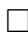

# A SCHUBERT CALCULUS RECURRENCE FROMTHE NONCOMPLEX W-ACTION ON G/B

ALLEN KNUTSON

ABSTRACT. For K a compact Lie group (with a chosen maximal torus T) and G its complexification (with a chosen Borel subgroup B), the diffeomorphism ${ \sf K } / { \sf T } \cong { \sf G } / { \sf B }$ lets one see a noncomplex right action of the Weyl group on this complex manifold.

We calculate the action of simple reflections from W on the cohomology ring, in the basis of Schubert classes, and use it to give a (nonpositive) recurrence on the structure constants.

Our main computational tool is equivariant cohomology, which lets one model cohomology classes by lists of polynomials [A, KK].

# 1. STATEMENT OF RESULTS

Our main result is a recurrence relation on the structure constants for multiplication in the (torus-equivariant) cohomology ring of a generalized flag manifold $G / \bar { \mathsf B }$ . These structure constants, known as “equivariant Schubert calculus”, are known to be positive (for the equivariant statement, see [G]). Using this recurrence and the “descent-cycling” results from [K], we give in this section a recursive algorithm to compute the structure constants (for G finite-dimensional).

Our recurrence is not manifestly positive, alas, though in practice it frequently has no negative terms (see the comment on “anti-Grassmannian permutations” below). Moreover, unlike computations based on representatives for the Schubert classes (e.g. Schubert polynomials, or as in [B]), this algorithm does not require us to compute a full product of two Schubert classes in order to extract just one term.

We briefly recall from [KK] the standard notation we need (with more detail in the next section): the equivariant Schubert classes $\{ \boldsymbol { S } _ { w } \}$ are indexed by the Weyl group W, whose (strong) Bruhat order is denoted $\geq$ with covering relation $\succ$ . Write

$$
S _ {w} S _ {v} = \sum_ {u} c _ {w v} ^ {u} S _ {u}, \quad c _ {w v} ^ {u} \in H _ {T} ^ {*} (p t).
$$

This ring $\mathsf { H } _ { \mathsf { T } } ^ { \ast } ( \mathsf { p t } )$ is the polynomial ring in the simple roots of G (for G adjoint), so any root is naturally an element (in $\mathsf { H } _ { \mathsf { T } } ^ { 2 } ( \mathsf { p t } )$ by convention). The case $\lfloor ( \mathfrak { u } ) = \lfloor ( w ) + \lfloor ( \nu )$ (where l denotes the length function on the Coxeter group W) is called the ordinary (cohomology) case, as those are the only nonvanishing ${ \mathfrak { c } } _ { w \nu } ^ { \mathrm { u } }$ in ordinary, non-equivariant, Schubert calculus.

We now give a recursive algorithm for computing any one ${ \mathfrak { c } } _ { w \nu } ^ { \mathrm { u } } , { \boldsymbol { w } }$ not the longest element $w _ { 0 } ,$ in terms of $\mathfrak { c } _ { w ^ { \prime } \nu ^ { \prime } } ^ { \mathrm { u } ^ { \prime } }$ with $w ^ { \prime } > w$ and/or $\nu ^ { \prime } < \nu$ (in the ordinary case, the latter is not necessary). Let $\boldsymbol { \Upsilon } = \boldsymbol { \Upsilon } _ { \alpha }$ be a reflection through a simple root $\propto$ such that wr $> w ;$ in the case $W = S _ { \mathrm { n } }$ and ${ \boldsymbol { \ r } } = ( \mathrm { i } \ \mathrm { i } + 1 )$ this corresponds to w having an ascent between the ith

and $( \mathfrak { i } + 1 ) \mathfrak { s t }$ positions. (There will exist such an r unless $w = w _ { 0 }$ .) Now consider the two conditions $\nu \mathbf { r } > \nu$ and ur $< \mathfrak { u }$ .

(1) If both $\nu \mathbf { r } ~ > ~ \nu$ and ur < u hold, then ${ \mathfrak { c } } _ { w \nu } ^ { \mathrm { u } } = 0$ . This simple result is called “dctriviality” in [K].   
(2) If exactly one is true, we can replace the Schubert problem by another with a higher w:

$< \mathfrak { u }$ $< \nu ,$ ${ \mathfrak { c } } _ { w \nu } ^ { \mathrm { u } } = { \mathfrak { c } } _ { w \ r , v r } ^ { \mathrm { u } }$   
$\nu \mathbf { r } > \nu$ $> \mathfrak { u } ,$ ${ \mathfrak { c } } _ { w \nu } ^ { \mathrm { u } } = { \mathfrak { c } } _ { w \ r , \nu } ^ { \mathrm { u r } }$

This symmetry was introduced in [K] and is called “descent-cycling”.

(3) If neither is true – so vr $< \nu$ and ur > u – then we use the new recurrence (theorem 2):

$$
c _ {w v} ^ {u} = c _ {w r, v} ^ {u r} + c _ {w r, v r} ^ {u} - (w \cdot \alpha) c _ {w, v r} ^ {u} + \sum_ {w ^ {\prime} \succ w, w ^ {\prime} \neq w r, w ^ {\prime} = w r _ {\beta}} \langle \alpha , \beta \rangle c _ {w ^ {\prime}, v r} ^ {u}.
$$

(Here $\beta$ is a positive root, not necessarily simple, and ${ \boldsymbol { \mathrm { r } } } _ { \beta }$ the reflection through it.)

The first two terms on the right-hand side are more Schubert structure constants. The third is a structure constant times an element of $\mathsf { H } _ { \mathsf { T } } ^ { 2 } ( \mathsf { p t } )$ (that is negative in the sense of [G]); this term drops out when computing ordinary Schubert calculus. The coefficients $\langle \alpha , \beta \rangle : = ( \alpha - \mathtt { r } _ { \beta } \alpha ) / \beta \in \mathbb { Z }$ in the last term are the other possible source of nonpositivity in this recurrence.

The algorithm above applies whenever $w \neq w _ { 0 } ,$ and writes a Schubert structure constant in terms of structure constants with higher $_ w$ and/or lower $\nu$ . Therefore it terminates (assuming that G is finite-dimensional), and only requires that we be able to compute the $\{ \mathbf { c } _ { w _ { 0 } , \nu } ^ { \mathrm { u } } \}$ . These vanish unless $\mu = \displaystyle w _ { 0 }$ . In the ordinary case, the only one met is ${ \mathrm { c } } _ { w _ { 0 } , 1 } ^ { w _ { 0 } } = 1$ .

Our examples will be in $W = S _ { \mathrm { n } } ,$ where we can speak in terms of ascents and descents, and the coefficients $\langle \alpha , \beta \rangle$ are always $\pm 1$ , as follows. If $\alpha = x _ { \mathrm { i } } - x _ { \mathrm { i + } 1 } ,$ each $w ^ { \prime } = w \mathfrak { r } _ { \beta }$ with nonvanishing $\langle \alpha , \beta \rangle$ agrees with $_ w$ except in two places, exactly one of which is the ith or $( \mathrm { i } + 1 ) \mathrm { s t }$ place. If the two places switched straddle the i, $\mathfrak { i } + 1$ divide, the coefficient $\langle \alpha , \beta \rangle$ is $+ 1$ ; if they are both to one side of it, the coefficient is $^ { - 1 }$ .

Example. Let $\mathsf { G } = \mathsf { G L } _ { 4 } ( \mathbb { C } ) , W = \mathsf { S } _ { 4 } ,$ and w = 1234, $\nu = \updownarrow = 2 4 1 3$ (so of course the answer is ${ \mathfrak { c } } _ { w \nu } ^ { \mathrm { u } } = 1 ,$ an ordinary case). We first apply the algorithm with $\boldsymbol { \Upsilon } = \left( 2 3 \right)$ (for illustrative purposes only; in all other cases to follow we will use the ${ \boldsymbol { \ r } } = ( \mathrm { i } , \mathrm { i } + 1 )$ with least i such that $w _ { \mathrm { i } } < w _ { \mathrm { i + } 1 }$ ). It tells us to descent-cycle:

$$
c _ {1 2 | 3 4, 2 4 | 1 3} ^ {2 4 | 1 3} = c _ {1 3 2 4, 2 1 4 3} ^ {2 4 1 3}
$$

In this and all subsequent examples, we put |s in the permutations to indicate the next choice of r used.

Now it is impossible to cycle another descent directly into $_ w$ , so we apply the recurrence with $\Upsilon = \left( 1 2 \right)$ :

$$
c _ {1 | 3 2 4, 2 | 1 4 3} ^ {2 | 4 1 3} = c _ {3 1 2 4, 2 1 4 3} ^ {4 2 1 3} + c _ {3 1 2 4, 1 2 4 3} ^ {2 4 1 3} - c _ {1 4 2 3, 1 2 4 3} ^ {2 4 1 3} + c _ {2 3 1 4, 1 2 4 3} ^ {2 4 1 3}
$$

(The equivariant term would be $( \mathsf { y } _ { 1 } - \mathsf { y } _ { 3 } ) \mathsf { c } _ { 1 3 2 4 , 1 2 4 3 } ^ { 2 4 1 3 } ,$ but since this is an ordinary-case calculation, that term vanishes for degree reasons.) The first three of these terms die:

$$
\begin{array}{l} c _ {3 1 | 2 4, 2 1 | 4 3} ^ {4 2 | 1 3} = 0, \end{array}
$$

$$
\begin{array}{l} c _ {3 1 | 2 4, 1 2 | 4 3} ^ {2 4 | 1 3} = 0, \end{array}
$$

$$
- c _ {1 | 4 2 3, 1 | 2 4 3} ^ {2 | 4 1 3} = - c _ {4 1 | 2 3, 1 2 | 4 3} ^ {4 2 | 1 3} = 0
$$

The fourth term requires the recurrence again, after a descent-cycling:

$$
c _ {2 | 3 1 4, 1 | 2 4 3} ^ {2 | 4 1 3} = c _ {3 2 1 | 4, 1 2 4 | 3} ^ {4 2 1 | 3} = c _ {3 2 4 1, 1 2 4 3} ^ {4 2 3 1} + c _ {3 2 4 1, 1 2 3 4} ^ {4 2 1 3} + c _ {3 4 1 2, 1 2 3 4} ^ {4 2 1 3} + c _ {4 2 1 3, 1 2 3 4} ^ {4 2 1 3}
$$

These terms each simplify quickly, giving us the desired answer 1:

$$
\begin{array}{l} c _ {3 2 | 4 1, 1 2 | 4 3} ^ {4 2 | 3 1} = c _ {3 | 4 2 1, 1 | 2 4 3} ^ {4 | 3 2 1} = 0, \quad \quad \quad c _ {3 2 | 4 1, 1 2 | 3 4} ^ {4 2 | 1 3} = 0, \quad \quad \quad c _ {3 | 4 1 2, 1 | 2 3 4} ^ {4 | 2 1 3} = 0 \\ c _ {4 2 1 | 3, 1 2 3 | 4} ^ {4 2 1 | 3} = c _ {4 2 | 3 1, 1 2 | 3 4} ^ {4 2 | 3 1} = c _ {4 3 2 1, 1 2 3 4} ^ {4 3 2 1} = 1. \\ \end{array}
$$

Call a permutation $w \in S _ { \mathrm { n } }$ anti-Grassmannian if w has at most one ascent, i.e. if $w _ { 0 } w$ is a Grassmannian permutation. Note that if $_ w$ is anti-Grassmannian, and we’re in the ordinary case, then this recurrence relation has no negative terms.

Example. Let $w = 5 3 2 1 6 4 , \nu = 1 3 2 5 4 6 , \mathrm { u } = 6 4 5 2 3 1$ . This ordinary ${ \mathfrak { c } } _ { w \nu } ^ { \mathrm { u } }$ is 2 (this and all other experiments were done with [ACE]). We cannot descent-cycle into $_ w$ , so we apply the recurrence:

6421|53

$$
c _ {5 3 2 1 | 6 4, 1 3 2 5 | 4 6}
$$

$$
= c _ {5 3 2 | 6 1 4, 1 3 2 | 5 4 6} ^ {6 4 2 | 5 1 3} + c _ {5 3 2 | 6 1 4, 1 3 2 | 4 5 6} ^ {6 4 2 | 1 5 3} + c _ {6 3 2 | 1 5 4, 1 3 2 | 4 5 6} ^ {6 4 2 | 1 5 3} + c _ {5 | 6 2 1 | 3 4, 1 | 3 2 4 5 6} ^ {6 | 4 2 | 1 5 3} + c _ {5 3 | 6 1 2, 1 3 | 2 4 5 6} ^ {6 | 2 | 1 5 3} + c _ {5 3 2 | 4 6 1, 1 3 2 | 4 5 6} ^ {6 4 | 2 | 1 5 3}
$$

$$
= c _ {5 3 6 2 4 1, 1 3 2 5 4 6} ^ {6 4 5 2 3 1} + 0 \quad + c _ {6 3 2 5 1 | 4, 1 3 2 4 5 | 6} ^ {6 4 2 5 1 | 3} + 0 \quad + c _ {5 6 3 1 2 | 4, 1 2 3 4 5 | 6} ^ {6 4 2 1 5 | 3} + 0
$$

$$
= c _ {5 3 6 2 4 1, 1 3 2 5 4 6} ^ {6 4 5 2 3 1} + 0 \quad + c _ {6 3 2 | 5 4 1, 1 3 2 | 4 6 5} ^ {6 4 2 | 5 3 1} + 0 \quad + 0 \quad + 0
$$

Then

$$
\begin{array}{l} c _ {5 3 | 6 2 4 1, 1 3 | 2 5 4 6} ^ {6 4 | 5 2 3 1} = \quad c _ {5 | 6 3 2 4 1, 1 | 3 2 5 4 6} ^ {6 | 5 4 2 3 1} + \quad c _ {5 | 6 3 2 4 1, 1 | 2 3 5 4 6} ^ {6 | 4 5 2 3 1} + \quad c _ {6 3 | 5 2 4 1, 1 2 | 3 5 4 6} ^ {6 4 | 5 2 3 1} + \quad c _ {5 4 | 6 2 3 1, 1 2 | 3 5 4 6} ^ {6 4 | 5 2 3 1} \\ = \quad 0 + \quad 0 + \quad c _ {6 5 3 2 4 1, 1 2 3 5 4 6} ^ {6 5 4 2 3 1} + \quad c _ {5 | 6 4 2 3 1, 1 | 2 3 5 4 6} ^ {6 | 5 4 2 3 1} \\ = \quad 0 + \quad 0 + \quad c _ {6 5 3 2 4 1, 1 2 3 5 4 6} ^ {6 5 4 2 3 1} + \quad 0 \\ \end{array}
$$

$$
\begin{array}{l} c _ {6 5 3 2 | 4 1, 1 2 3 5 | 4 6} ^ {6 5 4 | 3 1} = \quad c _ {6 5 3 | 4 2 1, 1 2 3 | 5 4 6} ^ {6 5 4 | 3 2 1} + \quad c _ {6 5 3 | 4 2 1, 1 2 3 | 4 5 6} ^ {6 5 4 | 2 3 1} + \quad c _ {6 5 4 2 | 3 1, 1 2 3 4 | 5 6} ^ {6 5 4 | 2 | 3 1} \\ = \quad 0 + \quad 0 + \quad c _ {6 5 4 3 2 1, 1 2 3 4 5 6} ^ {6 5 4 3 2 1} = \quad 1 \\ \end{array}
$$

and

$$
\begin{array}{l} c _ {6 3 5 2 | 4 1, 1 3 2 4 | 5 6} ^ {6 4 5 2 | 3 1} = \quad c _ {6 3 | 5 4 2 1, 1 3 | 2 4 5 6} ^ {6 4 | 5 3 2 1} \\ = \quad c _ {6 5 3 | 4 2 1, 1 3 2 | 4 5 6} ^ {6 5 4 | 3 2 1} + \quad c _ {6 5 3 | 4 2 1, 1 2 3 | 4 5 6} ^ {6 4 5 | 3 2 1} + \quad c _ {6 4 | 5 3 2 1, 1 2 | 3 4 5 6} ^ {6 4 | 5 3 2 1} \\ = \quad 0 + \quad 0 + \quad c _ {6 5 4 3 2 1, 1 2 3 4 5 6} ^ {6 5 4 3 2 1} = \quad 1. \\ \end{array}
$$

In all, $2 = 1 + 1$ . Each time we used the recurrence in this example, $_ w$ was anti-Grassmannian, and so there were no minus signs.

In equivariant cohomology the base case $c _ { w _ { 0 } , \nu } ^ { w _ { 0 } }$ is harder, but the results of [B, W, GK] can be adapted to compute it (theorem 1 in the next section).

Example. Let $W = \ S _ { 3 } , w = 2 3 1 , \nu = 2 1 3 , \mathrm { u } = 2 3 1$ . This ${ \bf c } _ { 2 3 1 , 2 1 3 } ^ { 2 3 1 } = { \bf y } _ { 2 } - { \bf y } _ { 1 } ,$ and the algorithm computes it (non-[G]-positively) as

$$
\begin{array}{l} c _ {2 | 3 1, 2 | 1 3} ^ {2 | 3 1} = \quad c _ {3 2 1, 2 1 3} ^ {3 2 1} + \quad c _ {3 2 1, 1 2 3} ^ {2 3 1} - \quad (y _ {3} - y _ {2}) c _ {2 | 3 1, 1 | 2 3} ^ {2 | 3 1} \\ = \quad (y _ {3} - y _ {1}) + \quad 0 - \quad (y _ {3} - y _ {2}) c _ {3 2 1, 1 2 3} ^ {3 2 1}. \\ \end{array}
$$

# 2. THE SCHUBERT BASIS OF T -EQUIVARIANT COHOMOLOGY OF G/B

We set up our conventions, and include some standard material on equivariant Schubert calculus from [A, KK].

Fix a pinning $( \mathsf { G } , \mathsf { B } , \mathsf { B } _ { - } , \mathsf { T } ^ { \mathbb { C } } , \mathsf { W } )$ of a complex Lie group; our motivating example is ${ \sf G } =$ $\mathrm { G L } _ { \mathrm { n } } ( \mathbb { C } )$ , B the upper triangulars, $\mathrm { B _ { - } }$ the lower triangulars, ${ \sf T } ^ { \mathbb { C } }$ the diagonals, and $W { \cong } S _ { \mathrm n }$ . For each element $w \in W$ , the Schubert cycle ${ { X } _ { w } }$ is the orbit closure $\overline { { \mathrm { B } \_ w \mathrm { B } } }$ . Being a T - invariant cycle, it induces an element of T-equivariant cohomology; the degree of this cohomology class is $\mathrm { c o d i m } _ { \mathbb { R } } X _ { w } = 2 \mathsf { l } ( w ) .$ , twice the length of the Weyl group element w. The forgetful map $\mathsf { H } _ { \mathsf { T } } ^ { * } ( \mathsf { G } / \mathsf { B } ) \to \mathsf { H } ^ { * } ( \mathsf { G } / \mathsf { B } )$ takes this equivariant Schubert class to the ordinary one, so it is no harm to work in this richer cohomology theory. The equivariant Schubert classes are again a basis for cohomology, but over the base ring $\mathsf { H } _ { \mathsf { T } } ^ { \ast } ( \mathsf { p t } )$ , which (for G adjoint) is just the polynomial ring in the simple roots (each formally given degree 2).

The pullback ring homomorphism from $\mathsf { H } _ { \mathsf { T } } ^ { \ast } ( \mathsf { G } / \mathsf { B } ) \to \mathsf { H } _ { \mathsf { T } } ^ { \ast } ( ( \mathsf { G } / \mathsf { B } ) ^ { \mathsf { T } } ) = \bigoplus _ { W } \mathsf { H } _ { \mathsf { T } } ^ { \ast } ( \mathsf { p t } )$ takes an equivariant class $\Psi$ to $\{ \Psi | _ { w } \} _ { w \in W } ,$ an H∗T(pt)-valued function on W. If $\Psi = \mathsf { S } _ { w } ,$ then the support of this function is $\{ \nu \in W : \nu \geq w \}$ . This upper triangularity implies that the pullback map is 1 : 1. Accordingly, we will do all our calculations with these lists of polynomials.

In [A] was calculated the image of this restriction map: a list $\{ \alpha \vert _ { \nu } \}$ comes from a cohomology class if and only if

$$
\forall v \in v, \beta \in \Delta , \quad \alpha | _ {v} - \alpha | _ {r _ {\beta} v} \text {i s a m u l t i p l e o f} \beta .
$$

These conditions are nowadays viewed in the more general framework of [GKM]. Hereafter we define a class p to be a list $\{ \mathfrak { p } | _ { w } \} _ { w \in W }$ of elements of $\mathsf { H } _ { \mathsf { T } } ^ { \ast } ( \mathsf { p t } )$ , satisfying these GKM conditions.

We also recall a characterization of the Schubert class $S _ { w }$ : it is homogeneous of degree $2 \mathsf { l } ( \boldsymbol { w } )$ , its restriction $\mathsf { S } _ { w } \vert _ { \nu }$ vanishes at $\nu$ shorter or of the same length as $_ w$ (except at w itself), and its restriction $\mathsf { S } _ { w } \vert _ { w }$ at its bottom point is

$$
S _ {w} | _ {w} = \prod_ {\beta \in \Delta_ {+}, r _ {\beta} w <   w} \beta .
$$

Plainly the GKM conditions force a class vanishing below w to be a multiple of this monomial at $w _ { . }$ ; the Schubert class is characterized by this multiple being 1.

At this point we abandon the geometry and work only with this combinatorial model of the equivariant cohomology ring, and its basis of Schubert clases, much as in [KT]. Accordingly, while we will relate our constructions to geometry wherever possible, we will only give proofs of the combinatorial statements.

Lemma 1. The restriction $\mathrm { S } _ { \nu } | _ { w }$ of the class $ { \boldsymbol { \mathsf { S } } } _ { \nu }$ to a point w is an equivariant Schubert structure constant, ${ \mathfrak { c } } _ { w \nu } ^ { w }$ .

Proof. The class $\varsigma _ { w } { S _ { \nu } }$ vanishes when restricted to u unless ${ \mathrm { \Omega } } _ { \mathrm { u } } \geq w$ (since already $S _ { w }$ does), so the upper triangularity tells us that ${ \sf c } _ { w \nu } ^ { w } = ( { \sf S } _ { w } { \sf S } _ { \nu } ) | _ { w } / { \sf S } _ { w } | _ { w }$ . 

Theorem 1. [B, W, GK] Let I be a reduced expression for $w \in W$ , whose ith entry is the reflection ri through the simple root $\alpha _ { \mathrm { i } }$ . Then for each $\nu \in W$ ,

$$
S _ {v} | _ {w} = \sum_ {\mathrm {J} \subseteq \mathrm {I}} \prod_ {\mathrm {I}} \left(\hat {\alpha} _ {i} ^ {[ i \in \mathrm {J} ]} r _ {i}\right) \cdot 1
$$

where the sum is taken over reduced subwords J with product $\nu ,$ and the $\widehat { \alpha } _ { \mathrm { i } }$ are multiplication operators only included in the ordered product if ${ \mathfrak { i } } \in \mathrm { J }$ .

Example. If $\mathrm { I } = \Upsilon _ { 1 2 } \Upsilon _ { 2 3 } \Upsilon _ { 1 2 }$ is a reduced word for $3 2 1 \in S _ { 3 } ,$ then

$$
S _ {2 1 3} | _ {3 2 1} = \widehat {y _ {2} - y _ {1}} r _ {1 2} r _ {2 3} r _ {1 2} \cdot 1 + r _ {1 2} r _ {2 3} \widehat {y _ {2} - y _ {1}} r _ {1 2} \cdot 1 = \widehat {y _ {2} - y _ {1}} \cdot 1 + r _ {1 2} r _ {2 3} \cdot (y _ {2} - y _ {1}) = (y _ {2} - y _ {1}) + (y _ {3} - y _ {2}).
$$

Whereas if we use I = r23r12r23, we’d get

$$
S _ {2 1 3} | _ {3 2 1} = r _ {2 3} \widehat {y _ {2} - y _ {1}} r _ {1 2} r _ {2 3} \cdot 1 = r _ {2 3} \cdot (y _ {2} - y _ {1}) = y _ {3} - y _ {1}.
$$

Combining this lemma and theorem, we have a ([G]-positive) formula for the base case $c _ { w _ { 0 } , \nu } ^ { w _ { 0 } }$ . One special case is worthy of note: in the $W = S _ { \mathrm { n } }$ case, using the lexicographically 0last reduced expression for $w _ { 0 } ,$ the terms J correspond to the rc-graphs for $\nu _ { \iota }$ , and $c _ { w _ { 0 } , \nu } ^ { w _ { 0 } }$ is equal to the double Schubert polynomial for $\nu ,$ evaluated with ${ \tt x } _ { \mathrm { i } }$ set equal to $y _ { \mathrm { n + 1 } }$ −i.

# 3. LEFT AND RIGHT DIVIDED DIFFERENCE OPERATORS

We first define left and right actions of $\boldsymbol { W }$ on the ring of classes:

$$
\left. (w \cdot p) \right| _ {v} := w \cdot \left(p \right| _ {w v})
$$

which uses the action of $\boldsymbol { W }$ on the base ring $\mathsf { H } _ { \mathsf { T } } ^ { \ast } ( \mathsf { p t } )$ , and

$$
(p \cdot w) | _ {v} := p | _ {v w}
$$

which is $\mathsf { H } _ { \mathsf { T } } ^ { \ast } ( \mathsf { p t } )$ -linear.

Proposition 1. If p is a class and $w \in W ,$ , then $w \cdot \mathsf { p }$ and ${ \mathsf { p } } \cdot w$ are classes. Both actions define ring automorphisms, but only the second is an $\mathsf { H } _ { \mathsf { T } } ^ { \ast }$ (pt)-algebra automorphism.

Proof. We need to check the GKM conditions. For the first,

$$
\left. (w \cdot p) | _ {v} - (w \cdot p) | _ {r _ {\beta} v} = w \cdot (p | _ {w v} - p | _ {w r _ {\beta} v}) = w \cdot (p | _ {w v} - p | _ {r _ {w ^ {- 1} \cdot \beta} w v}) \right.
$$

is indeed a multiple of $\beta$ , since $\mathfrak { p } | _ { w \nu } - \mathfrak { p } | _ { \mathfrak { r } _ { w } - 1 . \mu \mathfrak { w } }$ is a multiple of $w ^ { - 1 } \cdot \beta$

For the second,

$$
(p \cdot w) | _ {v} - (p \cdot w) | _ {r _ {\beta} v} = p | _ {v w} - p | _ {r _ {\beta} v w}
$$

is even more obviously a multiple of $\beta$

The ring automorphism statement is obvious. The first fails to be an algebra automorphism, exactly because W is acting on the coefficients. 

There is a geometric reason for this proposition; the first action arises from the left action of N(T ) on $\mathsf { G } / \mathsf { B } .$ , by diffeomorphisms that normalize the T-action, and thereby induce ring automorphisms of T-equivariant cohomology, whereas the second action arises from the right action of W on $\bar { \mathsf { G } } / \mathsf { B } \tilde { \equiv } \mathsf { K } / \mathsf { T } .$ , which commutes with the left T -action (and even K-action), and thereby induce algebra automorphisms.

Note that the right action does not preserve the complex structure on ${ \sf G } / { \sf B } ,$ and does not in general take a Schubert class to a positive combination of other Schubert classes.

For each simple root $\alpha ,$ define the left divided difference operator $\mathfrak { d } _ { \alpha }$ by

$$
\partial_ {\alpha} p := \frac {1}{\alpha} (p - r _ {\alpha} \cdot p).
$$

This is a famous degree $- 2$ endomorphism of $\mathsf { H } _ { \mathsf { T } } ^ { * } ( \mathsf { G } / \mathsf { B } )$ (though not a module homomorphism), and variants of it have long since been used to inductively construct the Schubert classes, as in parts (3) and (4) of proposition 2 below. For us, it only serves to motivate the definition below of the right divided difference operators.

For each simple root $\alpha ,$ define the Chern class $c _ { - \alpha }$ associated to $\propto$ by

$$
\left. c _ {- \alpha} \right| _ {w} := w \cdot (- \alpha).
$$

By construction, it satisfies $\nu \cdot \mathtt { c \_ } _ { \alpha } = \mathtt { c \_ } _ { \alpha }$ for all $\nu \in W$ . This list $c _ { - \alpha }$ is easily seen to satisfy the GKM conditions, so is a class; geometrically, it arises as the equivariant first Chern class of the Borel-Weil line bundle associated to $- \alpha$ .1 That being a G-equivariant line bundle, it is $\mathsf { N } ( \mathsf { T } )$ -equivariant, explaining $c _ { - \alpha }$ ’s W-invariance.

Note that $c _ { - \alpha }$ is not a zero divisor in the ring of classes. With it, we can define the right divided difference operator $\partial ^ { \alpha }$ by

$$
\partial^ {\alpha} p := \frac {1}{c _ {- \alpha}} (p - p \cdot r _ {\alpha}),
$$

and this is an $\mathsf { H } _ { \mathsf { T } } ^ { \ast } ( \mathsf { p t } )$ -module homomorphism. Geometrically, this arises (as in [BGG]) from composing pushforward and pullback of the T-equivariant morphism $\mathrm { G / B } \to \mathrm { G / P } _ { \alpha } .$

Proposition 2. (1) The left and right divided difference operators take classes to classes.

(2) Left divided difference operators commute with right divided difference operators.   
(3) $\partial ^ { \alpha } S _ { w } = S _ { w \Gamma _ { \alpha } }$ if $w \mathfrak { r } _ { \alpha } < w$ , 0 otherwise.   
(4) ${ \partial } _ { \alpha } S _ { w } = S _ { \mathrm { r } _ { \alpha } w }$ if $\Upsilon _ { \alpha } w < w$ , 0 otherwise.   
(5) $\partial ^ { \alpha } ( \mathfrak { p q } ) = ( \mathfrak { p } - \mathfrak { c } _ { - \alpha } \partial ^ { \alpha } \mathfrak { p } ) ( \partial ^ { \alpha } \mathfrak { q } ) + ( \partial ^ { \alpha } \mathfrak { p } ) \mathfrak { q } .$

Readers wondering about the unfortunate minus sign in $c _ { - \alpha }$ can now trace it to our desire to have $\partial ^ { \alpha } S _ { w } = + S _ { w \Gamma _ { \alpha } }$ .

Proof. We first show that $\partial _ { \alpha } , \partial ^ { \alpha }$ take classes to lists of polynomials, not rational functions:

$$
\left(\partial_ {\alpha} p\right) | _ {v} = \frac {1}{\alpha} \left(p | _ {v} - p | _ {r _ {\alpha} v}\right), \quad \left(\partial^ {\alpha} p\right) | _ {v} = \frac {1}{c _ {- \alpha} | _ {v}} \left(p | _ {v} - p | _ {v r _ {\alpha}}\right) = \frac {1}{- v \cdot \alpha} \left(p | _ {v} - p | _ {r _ {v \cdot \alpha} v}\right)
$$

In both cases, these are polynomials because p satisfies the GKM conditions.

Next we look at $( \partial _ { \alpha } \mathsf { p } ) | _ { \nu } - ( \mathsf { 0 } _ { \alpha } \mathsf { p } ) | _ { \mathsf { r } _ { \beta } \nu }$

$$
= \frac {1}{\alpha} \left(p | _ {v} - r _ {\alpha} \cdot \left(p | _ {r _ {\alpha} v}\right) - p | _ {r _ {\beta} v} + r _ {\alpha} \cdot \left(p | _ {r _ {\alpha} r _ {\beta} v}\right)\right) = \frac {1}{\alpha} \left(\left(p | _ {v} - p | _ {r _ {\beta} v}\right) - r _ {\alpha} \cdot \left(p | _ {r _ {\alpha} v} - p | _ {r _ {\alpha} r _ {\beta} v}\right)\right)
$$

If $\alpha = \beta$ , then this is zero. Otherwise $\begin{array} { r } { \mathsf { g c d } ( \alpha , \beta ) = 1 . } \end{array}$ , so we can ignore the $1 / \alpha$ when testing divisibility by $\beta$ , and each the terms inside is a multiple of $\beta$ . So $\partial _ { \alpha } \ p$ satisfies the GKM conditions.

Commutativity follows from the fact that $\boldsymbol { \Upsilon } _ { \alpha } \cdot \boldsymbol { \mathfrak { c } } _ { \beta } = \boldsymbol { \mathfrak { c } } _ { \beta }$ and the fact that left and right multiplication in W commute.

We can use commutativity to prove that $\partial ^ { \alpha } \mathfrak { p }$ is a class:

$$
\left. \left(\partial^ {\alpha} p\right) \right| _ {v} - \left. \left(\partial^ {\alpha} p\right) \right| _ {r _ {\beta} v} = \beta \left(\partial_ {\beta} \partial^ {\alpha} p\right) | _ {v} = \beta \left(\partial^ {\alpha} \partial_ {\beta} p\right) | _ {v}
$$

We already know $ { \partial _ { \beta } }  { \mathsf { p } }$ is a class, and $\partial ^ { \alpha }$ of a class is a list of polynomials, therefore this difference is a multiple of $\beta$ .

Now consider $\partial ^ { \alpha } S _ { w }$ . This vanishes except at $\{ \nu : \nu \geq \varkappa \}$ or $\nu \Upsilon _ { \propto } \geq w \}$ . By the upper triangularity of the Schubert classes, this class is an $\mathsf { H } _ { \mathsf { T } } ^ { \ast } ( \mathsf { p t } )$ -linear combination of $\{ S _ { \nu } : \nu \geq $ w or $\nu \mathrm { r } _ { \alpha } \geq \nu \}$ . All of these $ { \boldsymbol { \mathsf { S } } } _ { \nu }$ have degree higher than that of $\partial _ { \alpha } S _ { w } ,$ unless $\nu = w \mathfrak { r } _ { \alpha } < w$ . We check the value at $w \mathbf { r } _ { \alpha }$ :

$$
(\partial^ {\alpha} S _ {w}) | _ {w r _ {\alpha}} = \frac {1}{c _ {- \alpha}} (S _ {w} - S _ {w} \cdot r _ {\alpha}) | _ {w r _ {\alpha}} = \frac {1}{w \cdot \alpha} (S _ {w} | _ {w r _ {\alpha}} - S _ {w} | _ {w}) = \frac {S _ {w} | _ {w}}{- w \cdot \alpha} = S _ {w r _ {\alpha}} | _ {w r _ {\alpha}}
$$

So by the aforementioned characterization, $\partial ^ { \alpha }  { S _ { w } } =  { S _ { w  { \mathrm { r } } _ { \alpha } } }$ . Whereas if $w \mathfrak { r } _ { \alpha } > \mathfrak { w } ,$ there are no possible terms and $\partial ^ { \alpha } S _ { w } = 0$ . The proof for $\mathfrak { d } _ { \alpha }$ is exactly the same. Alternately, one can prove it for the special case $w = w _ { 0 }$ and use the commutativity.

Finally, we compute

$$
\begin{array}{l} \partial^ {\alpha} (p q) = \frac {1}{c _ {- \alpha}} (p q - (p q) \cdot r _ {\alpha}) = \frac {1}{c _ {- \alpha}} (p q - p (q \cdot r _ {\alpha}) + p (q \cdot r _ {\alpha}) - (p \cdot r _ {\alpha}) (q \cdot r _ {\alpha})) \\ = p \left(\partial^ {\alpha} q\right) + \left(\partial^ {\alpha} p\right) \left(q \cdot r _ {\alpha}\right) = p \left(\partial^ {\alpha} q\right) + \left(\partial^ {\alpha} p\right) \left(q - c _ {- \alpha} \partial^ {\alpha} q\right) = \left(p - c _ {- \alpha} \partial^ {\alpha} p\right) \left(\partial^ {\alpha} q\right) + \left(\partial^ {\alpha} p\right) q \\ \end{array}
$$

as claimed.

3.1. On the left vs. right symmetry. We comment on a deeper algebraic reason, itself from a more trivial geometric reason, for the apparent symmetry between the left and right actions of W. The base ring $\mathsf { H } _ { \mathsf { T } } ^ { * } ( \mathsf { p t } ) \hookrightarrow \mathsf { H } _ { \mathsf { T } } ^ { * } \bar { ( \mathsf { G } / \mathsf { B } ) }$ can be characterized as the right-W-invariant subring of $\mathsf { H } _ { \mathsf { T } } ^ { * } ( \mathsf { G } / \mathsf { B } )$ , and is generated freely by the simple roots. There is another subring $\mathsf C \le \mathsf { H } _ { \mathsf { T } } ^ { * } ( \mathsf { G } / \mathsf { B } )$ of left- $. W .$ -invariant classes, generated freely by the Chern classes $\{ \mathbf { c _ { - \alpha } } \} ,$ , and in particular there is a natural isomorphism $\Phi : \mathsf { H } _ { \mathsf { T } } ^ { \ast } ( \mathsf { p t } ) \cong \mathsf { C }$ taking ${ \mathfrak { p } } \mapsto$ $\mathbf { c } _ { \mathsf { p } } = \{ \mathbf { c } _ { \mathsf { p } } | _ { \nu } : = \nu \cdot \mathsf { p } \} .$ . The Schubert classes $\{ \boldsymbol { \mathsf { S } } _ { w } \}$ are a C-basis also for $\mathsf { H } _ { \mathsf { T } } ^ { * } ( \mathsf { G } / \mathsf { B } )$ (proved using the same upper triangularity), and we can consider the structure constants in

$$
S _ {w} S _ {v} = \sum_ {u} d _ {w v} ^ {u} S _ {u}, \quad d _ {w v} ^ {u} \in C.
$$

Then the best statement is that $\Phi ( { \sf c } _ { w \nu } ^ { \mathrm { u } } ) = { \sf d } _ { w ^ { - 1 } \nu ^ { - 1 } } ^ { \mathrm { u } ^ { - 1 } }$ du−1 w−1v−1 .

We will not need or derive this: the most natural derivation is via “double Schubert calculus”, in which ones multiplies the cohomology classes of G-orbit closures on $( \mathsf { G } / \mathsf { B } ) ^ { 2 } ,$ and then the symmetry comes from switching the two $\mathsf { G } / \mathsf { B }$ factors. We found it simpler to work with a single $\mathsf { G } / \mathsf { B } .$ , at the expense of making the symmetry more mysterious.

# 4. MULTIPLYING BY CHERN CLASSES

Perhaps the main new idea in this paper is a formula for $\mathfrak { c } _ { - \alpha } \mathfrak { S } _ { w }$ . First a lemma:

Lemma 2. Let $w ^ { \prime } = w \mathfrak { r } _ { \beta }$ cover w in the strong Bruhat order, $\beta \in \Delta _ { + }$ . Then

$$
S _ {w ^ {\prime}} | _ {w ^ {\prime}} = S _ {w} | _ {w ^ {\prime}} (w \cdot \beta).
$$

This is quite straightforward using $\partial ^ { \beta }$ if $\beta$ is a simple root (i.e. if the covering relation is in the weak Bruhat order); however we need it for all positive roots.

Proof. Fix I a reduced word for $w ^ { \prime }$ . Since $w ^ { \prime } \succ w$ , there exists a letter $\mathfrak { b } \in \mathrm { I }$ such that $\operatorname { I } \setminus \{ \mathsf { b } \}$ is a reduced word for w. Multiplying out, we can write $w ^ { \prime } = w _ { 1 } \mathfrak { r } _ { \mathfrak { b } } w _ { 2 } ,$ and $w = w _ { 1 } w _ { 2 }$ .

We prove now that such a b is unique (surely a basic fact about the Bruhat order, but one for which we lack a reference). If b is not unique, we can break I up into $\mathrm { I } _ { 1 } \mathrm { b I } _ { 2 } \mathrm { b } ^ { \prime } \mathrm { I } _ { 3 } ,$ with $w = \mathrm { I } _ { 1 } \mathrm { b } \mathrm { I } _ { 2 } \mathrm { I } _ { 3 } = \mathrm { I } _ { 1 } \mathrm { I } _ { 2 } \mathrm { b } ^ { \prime } \mathrm { I } _ { 3 }$ . So $\mathsf { b I } _ { 2 } = \mathrm { I } _ { 2 } \mathsf { b } ^ { \prime }$ , and $\mathsf { b I } _ { 2 } \mathsf { b } ^ { \prime } = \mathrm { I } _ { 2 } ,$ and finally $\mathrm { I } _ { 1 } \mathrm { b I } _ { 2 } \mathrm { b } ^ { \prime } \mathrm { I } _ { 3 } = \mathrm { I } _ { 1 } \mathrm { I } _ { 2 } \mathrm { I } _ { 3 } ,$ contradicting its reducedness.

Now we apply theorem 1:

$$
S _ {w ^ {\prime}} | _ {w ^ {\prime}} = \prod_ {I} \left(\hat {\alpha} _ {i} r _ {i}\right) \cdot 1, \quad S _ {w} | _ {w ^ {\prime}} = \prod_ {I} \left(\hat {\alpha} _ {i} ^ {[ i \neq b ]} r _ {i}\right) \cdot 1
$$

Since $\begin{array} { r } { w ^ { \prime } = w w _ { 2 } ^ { - 1 } \mathfrak { r } _ { \mathfrak { b } } w _ { 2 } = w \mathfrak { r } _ { w _ { 2 } ^ { - 1 } \cdot \alpha _ { \mathfrak { b } } } , } \end{array}$ we have

$$
\frac {S _ {w ^ {\prime}} | _ {w ^ {\prime}}}{S _ {w} | _ {w ^ {\prime}}} = w _ {1} \cdot \alpha_ {b} = w w _ {2} ^ {- 1} \cdot \alpha_ {b} = w \cdot (w _ {2} ^ {- 1} \cdot \alpha_ {b})
$$

as was to be shown.

Proposition 3. Let α be a simple root, $c _ { - \alpha }$ the corresponding Chern class, and $\mathsf { S } _ { w }$ a Schubert class. Then

$$
c _ {- \alpha} S _ {w} = - (w \cdot \alpha) S _ {w} + \sum_ {w ^ {\prime} \succ w, w ^ {\prime} = w r _ {\beta}} \langle \alpha , \beta \rangle S _ {w ^ {\prime}}.
$$

Proof. By degree considerations and the upper triangularity,

$$
c _ {- \alpha} S _ {w} = c _ {- \alpha} | _ {w} S _ {w} + \sum_ {v > w} d _ {v} S _ {v}
$$

for some $\{  { \mathrm { d } } _ { \nu } \in \mathbb { Z } \}$ . Restricting to $w$ , all the $\nu$ -terms vanish, and we see the coefficient on $S _ { w }$ is as claimed. Restricting now to a point $w ^ { \prime } \succ w$ ,

$$
c _ {- \alpha} | _ {w ^ {\prime}} S _ {w} | _ {w ^ {\prime}} = c _ {- \alpha} | _ {w} S _ {w} | _ {w ^ {\prime}} + d _ {w ^ {\prime}} S _ {w ^ {\prime}} | _ {w ^ {\prime}}
$$

Dividing by $\mathsf { S } _ { w } \vert _ { w ^ { \prime } }$ (and using lemma 2), this is

$$
- w ^ {\prime} \cdot \alpha = - w \cdot \alpha + d _ {w ^ {\prime}} (w \cdot \beta)
$$

for $w ^ { \prime } = w \mathfrak { r } _ { \beta }$ . We can further rewrite as

$$
d _ {w ^ {\prime}} = w \cdot \frac {\alpha - r _ {\beta} \alpha}{\beta}
$$

which is essentially the definition of $\langle \alpha , \beta \rangle$ .

In particular, as claimed in the Abstract, we now have a formula for $\boldsymbol { \mathrm { S } } _ { w } \boldsymbol { \cdot } \boldsymbol { \mathrm { r } } _ { \alpha }$

Corollary. If $w \mathrm { r } _ { \propto } > \mathcal { w } ,$ then $\boldsymbol { \mathrm { S } } _ { w } \boldsymbol { \cdot } \boldsymbol { \mathrm { r } } _ { \alpha } = \boldsymbol { \mathrm { S } } _ { w } ;$ otherwise

$$
S _ {w} \cdot r _ {\alpha} = S _ {w} - (w \cdot \alpha) S _ {w r _ {\alpha}} - \sum_ {w ^ {\prime} > w r _ {\alpha}, w ^ {\prime} = w r _ {\alpha} r _ {\beta}} \langle \alpha , \beta \rangle S _ {w ^ {\prime}}.
$$

It is equivalent and in fact more convenient to work with the $\partial ^ { \alpha }$ directly.

# 5. THE RECURRENCE RELATION

In this section we prove the recurrence relation on the Schubert structure constants $\mathbf { c } _ { w v } ^ { \mathrm { u } } \in \mathsf { H } _ { \mathsf { T } } ^ { \ast } ( \mathsf { p t } )$ in $\begin{array} { r } { \mathsf { S } _ { w } \mathsf { S } _ { \nu } \overset { - } { = } \sum _ { \mathrm { \boldsymbol { u } } } \mathsf { c } _ { w \nu } ^ { \mathrm { \boldsymbol { u } } } \mathsf { S } _ { \mathrm { \boldsymbol { u } } } . } \end{array}$ .

Fix a simple root $\alpha ,$ and let ${ \boldsymbol { \Upsilon } } = { \boldsymbol { \Upsilon } } _ { \alpha }$ be the simple reflection through it. We introduce a convenient underline/overline convention, where a term in a sum involving $\overline { { w \mathfrak { r } } }$ (resp. wr) only contributes if wr > w (resp. wr $< w$ ). For example, we have the single equation

$$
\partial^ {\alpha} \mathrm {S} _ {w} = \mathrm {S} _ {\underline {{w r}}}
$$

encompassing both cases $\partial ^ { \alpha } S _ { w } = S _ { w r }$ if $w r < w$ , $\partial ^ { \alpha } S _ { w } = 0$ if wr > w.

The descent-cycling lemmata from [K] are also concisely expressed with this convention: if $w < w r$ , $\nu < \nu r$ , then

$$
c _ {w v} ^ {u} = c _ {w r, v} ^ {\overline {{u r}}} = c _ {w, v r} ^ {\overline {{u r}}}.
$$

If ur $> \mathfrak { u }$ , this is descent-cycling; if ur $< \mathfrak { u } ,$ it is dc-triviality.

Theorem 2. Let ${ \mathfrak { u } } , { \mathfrak { v } } , { \mathfrak { w } } \in W ,$ , and $\boldsymbol { \Upsilon } = \boldsymbol { \Upsilon } _ { \alpha } \boldsymbol { a }$ simple reflection such that ur > u, vr > v, wr > w. Then

$$
c _ {w, v r} ^ {u} = c _ {w r, v r} ^ {u r} + c _ {w r, v} ^ {u} - (w \cdot \alpha) c _ {w v} ^ {u} + \sum_ {w ^ {\prime} > w, w ^ {\prime} \neq w r, w ^ {\prime} = w r _ {\beta}} \langle \alpha , \beta \rangle c _ {w ^ {\prime}, v} ^ {u}.
$$

Proof. We apply $\partial ^ { \alpha }$ to both sides of the equation $\begin{array} { r } { \mathsf { S } _ { w } \mathsf { S } _ { \nu } = \sum _ { \mathrm { u } } \mathsf { c } _ { w \nu } ^ { \mathrm { u } } \mathsf { S } _ { \mathrm { u } } } \end{array}$ and equate terms. We do not yet assume that w, v, u satisfy ur > u, vr > v, wr > w. (In fact $w , \nu$ will not match those in the statement of the theorem.) On the left side:

$$
\begin{array}{l} \partial^ {\alpha} (S _ {w} S _ {v}) = (S _ {w} - c _ {- \alpha} \partial^ {\alpha} S _ {w}) (\partial^ {\alpha} S _ {v}) + (\partial^ {\alpha} S _ {w}) S _ {v} = (S _ {w} - c _ {- \alpha} S _ {\underline {{w r}}}) S _ {\underline {{v r}}} + S _ {\underline {{w r}}} S _ {v} \\ = \left(S _ {w} + (w r \cdot \alpha) S _ {\underline {{w r}}} - \sum_ {w ^ {\prime} > \underline {{w r}}, w ^ {\prime} = w r r _ {\beta}} \langle \alpha , \beta \rangle S _ {w ^ {\prime}}\right) S _ {\underline {{v r}}} + S _ {\underline {{w r}}} S _ {v} \\ = \sum_ {u} S _ {u} \left(c _ {w, \underline {{v r}}} ^ {u} + (w r \cdot \alpha) c _ {\underline {{w r}}, \underline {{v r}}} ^ {u} - \sum_ {w ^ {\prime} \succ \underline {{w r}}, w ^ {\prime} = w r r _ {\beta}} \langle \alpha , \beta \rangle c _ {w ^ {\prime}, \underline {{v r}}} ^ {u} + c _ {\underline {{w r}}, v} ^ {u}\right) \\ \end{array}
$$

(Remember: the underline convention tosses out this sum unless wr $< w$ .)

On the right:

$$
\partial^ {\alpha} \sum_ {u} c _ {w v} ^ {u} S _ {u} = \sum_ {u} c _ {w v} ^ {u} \partial^ {\alpha} S _ {u} = \sum_ {u} c _ {w v} ^ {u} S _ {\underline {{u r}}} = \sum_ {u} c _ {w v} ^ {\overline {{u r}}} S _ {u}
$$

Equating coefficients of $\mathsf { S } _ { \mathrm { u } }$ :

$$
c _ {w, \underline {{v r}}} ^ {u} + (w r \cdot \alpha) c _ {\underline {{w r}}, \underline {{v r}}} ^ {u} - \sum_ {w ^ {\prime} > \underline {{w r}}, w ^ {\prime} = w r r _ {\beta}} \langle \alpha , \beta \rangle c _ {w ^ {\prime}, \underline {{v r}}} ^ {u} + c _ {\underline {{w r}}, v} ^ {u} = c _ {w v} ^ {\overline {{u r}}}
$$

We now consider several special cases. If $\nu \mathbf { r } > \nu ,$ , then this reduces to

$$
c _ {\underline {{w r}}, v} ^ {u} = c _ {v v} ^ {\overline {{u r}}}
$$

which is a particularly eloquent summary of several cases of descent-cycling and dctriviality. In other words, the formula is known in this case, so we will assume vr < v.

Descent-cycling also accounts for the wr $< w$ case (easily shown) and the ur $< \mathfrak { u }$ case (which is harder). So we will assume that wr $< w$ , vr < v, and ur > u. We now switch the names $w  w r$ , $\nu  \nu r$ , to make it consistent across variables $\mathrm { u } , \nu ,  { w } ,$ and also so that

the lengths of the Weyl group elements are reflected in the notation: $\lfloor ( w \boldsymbol { \mathsf { r } } ) = \lfloor ( w ) + 1 .$ , etc. (One drawback: the v in the algorithm in section 1 is the vr of this statement.)

We no longer have need of the over/underline convention, since we already know the relative lengths.

$$
c _ {w r, v} ^ {u} + (w \cdot \alpha) c _ {w, v} ^ {u} - \sum_ {w ^ {\prime} \succ w, w ^ {\prime} = w r _ {\beta}} \langle \alpha , \beta \rangle c _ {w ^ {\prime}, v} ^ {u} + c _ {w, v r} ^ {u} = c _ {w r, v r} ^ {u r}
$$

To go from here to the claimed formula, we move the first three terms over to the right side of the equation, and pull out the $2 \mathrm { c } _ { w \mathrm { r } , \nu } ^ { \mathrm { u } }$ term from the sum (1 of which cancels the first term). 

# 6. THE ORDINARY-COHOMOLOGY CASE

If ${ \mathfrak { u } } , { \mathfrak { v } } , { \mathfrak { w } } \ \in \ { \mathfrak { W } }$ have $\mathsf { l } ( \mathsf { u } ) + \mathsf { l } ( \nu ) + \mathsf { l } ( w ) = \mathsf { d i m } _ { \mathbb { C } } \mathsf { G } / \mathsf { B } ,$ , we can consider the integral $\int _ { \mathsf { G } / \mathsf { B } } \mathsf { S } _ { \mathsf { u } } \mathsf { S } _ { \nu } \mathsf { S } _ { w } = \mathsf { c } _ { w \nu } ^ { w _ { 0 } \mathrm { u } } \in \mathbb { N }$ . In particular, one sees a three-fold symmetry of the ordinary Schubert structure constants not visible in the usual definition; accordingly we denote these integrals by $\{ \mathbf { c } _ { \boldsymbol { w v u } } \}$ .

Corollary. Let u, v, w ∈ W have $\begin{array} { r } { \mathsf { l } ( \mathsf { u } ) + \mathsf { l } ( \nu ) + \mathsf { l } ( w ) = \mathrm { d i m } _ { \mathbb { C } } \mathsf { G } / \mathsf { B } , } \end{array}$ , and ur > u, vr > v, wr > w. Then

$$
c _ {w, v r, u r} = c _ {w r, v r, u} + c _ {w r, v, u r} + \sum_ {w ^ {\prime} > w, w ^ {\prime} \neq w r, w ^ {\prime} = w r _ {\beta}} \langle \alpha , \beta \rangle c _ {w ^ {\prime}, v, u r}
$$

Proof. This is off from theorem 2 by having switched $u  u r$ (since in bringing it from a superscript to a a subscript, the condition ur $> \mathfrak { u }$ gets flipped). And the equivariant term $( \boldsymbol { w } \cdot \boldsymbol { \alpha } ) \boldsymbol { \mathrm { c } } _ { w , \nu , \mathrm { u r } }$ automatically vanishes, since $\mathsf { l } ( w ) + \mathsf { l } ( \nu ) + \bar { \mathsf { l } } ( \mathsf { u r } ) < \mathrm { d i m } _ { \mathbb { C } } \mathsf { G } / \mathsf { B }$ .

# REFERENCES

[A] A. Arabia, Cohomologie T-´equivariant de la vari´et´e de drapeaux d’un groupe de Kac-Moody, Bull. Math. Soc. France 117 (1989), 129–165.   
[ACE] S. Veigneau, ACE, an Algebraic Combinatorics Environment for the computer algebra system MAPLE, User’s Reference Manual, Version 3.0, IGM 98–11, Universit´e de Marne-la-Vall´ee, 1998.   
[B] S. Billey, Kostant polynomials and the cohomology ring of G/B, Duke Math. J. 96 (1999), 205–224.   
[BGG] I. N. Bernstein, I. M. Gel′fand, S. I. Gel′fand, Schubert cells and the cohomology of a flag space, Uspekhi Mat. Nauk 28 (1973), no. 3 (171), 3–26.   
[D] M. Demazure, D´esingularisation des vari´et´es de Schubert g´en´eralis´ees, Ann. Sci. Ecole Norm. Sup. (4) ´ 7 (1974), 53–88.   
[GK] R. Goldin, A. Knutson, in preparation.   
[GKM] M. Goresky, R. Kottwitz, R. MacPherson, Equivariant cohomology, Koszul duality, and the localization theorem. Invent. Math. 131 (1998), no. 1, 25–83.   
[K] A. Knutson, Descent-cycling in Schubert calculus, to appear in Exp. Math. math.CO/0009112   
[KT] A. Knutson, T. Tao, Puzzles and (equivariant) cohomology of Grassmannians, to appear in Duke Math. J. math.AT/0112150   
[KK] B. Kostant, S. Kumar, The nil Hecke ring and cohomology of G/P for a Kac-Moody group G, Advances in Mathematics 62 (1986), no. 3, 187–237.   
[G] W. Graham, Positivity in equivariant Schubert calculus. Duke Math. J. 109 (2001), no. 3, 599–614. math.AG/9908172   
[W] M. Willems, Cohomologie ´equivariante des vari´et´es de Bott-Samelson, preprint. math.GR/0201050

E-mail address: allenk@math.berkeley.edu