# SCHUBERT PUZZLES AND INTEGRABILITY III: SEPARATED DESCENTS

ALLEN KNUTSON AND PAUL ZINN-JUSTIN

ABSTRACT. In paper I of this series we gave positive formulæ for expanding the product ${ \mathfrak { S } } ^ { \pi } { \mathfrak { S } } ^ { \rho }$ of two Schubert polynomials, in the case that both π, ρ had shared descent set of size $\leq 3$ . Here we introduce and give positive formulæ for two new classes of Schubert product problems: separated descent in which π’s last descent occurs at (or before) ρ’s first, and almost separated descent in which π’s last two descents occur at (or before) $\rho ^ { \prime } \mathbf { s }$ first two respectively. In both cases our puzzle formulæ extend to K-theory (multiplying Grothendieck polynomials), and in the separated descent case, to equivariant K-theory. The two formulæ arise (via quantum integrability) from fusion of minuscule quantized loop algebra representations in types A, D respectively.

# CONTENTS

1. Introduction 2   
1.1. Schubert and Grothendieck polynomials 2   
1.2. Descents and overlap 3   
1.3. From strings to permutations, and back 3   
1.4. Separated-descent puzzles 4   
1.5. Almost separated-descent puzzles 7   
1.6. Segre motivic classes 10   
1.7. Plan of the paper 11   
1.8. Relations to prior work 11   
2. Setup of proofs 12   
2.1. Tensor calculus 12   
2.2. Puzzles 12   
2.3. The general theorem 14   
2.4. Flag-type faces 17   
2.5. Schubert classes 18   
3. Separated descents 20   
3.1. The data from §2.1 20   
3.2. Proof of property (b) 21   
3.3. The B-matrix 23   
3.4. The limit ${ \mathsf q } \to 0$ : nonequivariant puzzles 24   
3.5. The limit ${ \mathsf q } \to 0$ : equivariant puzzles 25   
4. Almost-separated descents 26   
4.1. The data from §2.1 26

4.2. The intertwiners 28   
4.3. Proof of property (b) 29   
4.4. The B-matrix 32   
4.5. The limit ${ \mathsf q } \to 0$ 32   
5. Comparison of puzzle rules 35   
5.1. Separated-descent vs. Grassmannian puzzles 35   
5.2. Almost separated descent vs. 2-step puzzles 36   
5.3. Separated descent vs. almost separated puzzles 37   
5.4. Separated-descent vs. Grassmannian puzzles with 10s at the bottom 38   
5.5. Almost-separated-descent vs. 2-step puzzles with 10s/21s at the bottom 39

References 41

# 1. INTRODUCTION

Our references for the classic material in §1.1-1.2 are [AF24], and for the well-studied1 Grothendieck polynomials, [Kir16].

1.1. Schubert and Grothendieck polynomials. Let $\textstyle S _ { \infty } : = \bigcup _ { \mathfrak { n } \geq 0 } S _ { \mathfrak { n } }$ be the infinite symmetric group, where $S _ { \mathfrak { n } } \subset S _ { \mathfrak { n } + 1 }$ in the natural way. Given $\sigma \in S _ { \infty } ,$ we define the Schubert polynomial $\mathfrak { S } ^ { \sigma } \in \mathbb { R } : = \mathbb { Z } [ \mathfrak { x } _ { 1 } , \mathfrak { x } _ { 2 } , \dotsc ]$ inductively by

$$
\mathfrak {S} ^ {\sigma} := \partial_ {i} \mathfrak {S} ^ {\sigma s _ {i}} \qquad \text {f o r} \sigma (i) <   \sigma (i + 1) \qquad \qquad \mathfrak {S} ^ {n... 2 1} := \prod_ {i = 1} ^ {n} x _ {i} ^ {n - i}
$$

where $s _ { \mathrm { i } }$ is the elementary transposition $\mathrm { i }  \mathrm { i } + 1 , \partial _ { \mathrm { i } }$ is the corresponding divided difference operator

$$
\partial_ {i} f := \frac {f - f | _ {x _ {i} \leftrightarrow x _ {i + 1}}}{x _ {i} - x _ {i + 1}} \quad f \in R
$$

and n . . . 21 is the longest element in $S _ { \mathrm { n } }$ . This ${ \mathfrak { S } } ^ { \sigma }$ is a homogeneous polynomial, whose degree is the inversion number $\ell ( \sigma )$ of $\sigma$ defined by

$$
\ell (\sigma) := \# \{i <   j: \sigma_ {i} > \sigma_ {j} \}
$$

The $\{ \mathfrak { S } ^ { \sigma }$ , $\sigma \in { \mathcal S } _ { \infty } \}$ form a $\mathbb { Z }$ -basis of ${ \sf R } ,$ and this basis is compatible with each subring $\bigcap _ { \mathrm { i } \in \mathcal { C } } \ker ( \partial _ { \mathrm { i } } ) \leq { \mathsf { R } }$ defined by a choice of “ascent set” ${ \mathsf { C } } \subseteq { \mathbb { N } } _ { + } ,$ i.e.

$$
\bigcap_ {i \in C} \ker (\partial_ {i}) \quad \text {h a s} \mathbb {Z} \text {- b a s i s} \quad \{\mathfrak {S} ^ {\sigma}: \sigma \in S _ {\infty}, \sigma (i) <   \sigma (i + 1) \forall i \in C \}
$$

Define the Schubert structure constants $c _ { \sigma } ^ { \pi \rho } \in \mathbb { Z }$ by

$$
\mathfrak {S} ^ {\pi} \mathfrak {S} ^ {\rho} = \sum_ {\sigma \in \mathcal {S} _ {\infty}} c _ {\sigma} ^ {\pi \rho} \mathfrak {S} ^ {\sigma}
$$

It is well-known that $c _ { \sigma } ^ { \pi \rho } \in \mathbb { Z } _ { \geq 0 }$ from geometric considerations [AF24, Chapter 19.3]. This prompts the search for a manifestly positive combinatorial formula for the ${ \mathfrak { c } } _ { \sigma } ^ { \pi \rho }$ .

The compatibility of the basis with the subrings has the consequence

$$
\pi (i) <   \pi (i + 1), \rho (i) <   \rho (i + 1), c _ {\sigma} ^ {\pi \rho} \neq 0 \quad \Longrightarrow \quad \sigma (i) <   \sigma (i + 1).
$$

The Schubert polynomial ${ \mathfrak { S } } ^ { \sigma }$ is the top degree part of the inhomogeneous Grothendieck polynomial ${ \mathfrak { G } } ^ { \sigma }$ , where these polynomials are defined by the recursion

$$
\mathfrak {G} ^ {\sigma} := \bar {\partial} _ {i} \mathfrak {G} ^ {\sigma s _ {i}} \qquad \text {f o r} \sigma (i) <   \sigma (i + 1) \qquad \qquad \mathfrak {G} ^ {n... 2 1} := \prod_ {i = 1} ^ {n} (1 - x _ {i}) ^ {n - i}
$$

whose Demazure operator $\bar { \mathsf { \partial } } _ { \mathrm { i } }$ is defined by

$$
\bar {\partial} _ {i} f := \frac {x _ {i + 1} f - x _ {i} f | _ {x _ {i} \leftrightarrow x _ {i + 1}}}{x _ {i + 1} - x _ {i}} \qquad f \in R
$$

There are “double” versions (in that they use two sets of variables) of both the Schubert and Grothendieck polynomials, based on the same operators but with modified initial conditions:

$$
\mathfrak {S} ^ {n \dots 2 1} = \prod_ {i, j \geq 1, i + j \leq n} (x _ {i} - y _ {j}) \quad \mathfrak {G} ^ {n \dots 2 1} = \prod_ {i, j \geq 1, i + j \leq n} (1 - x _ {i} / y _ {j})
$$

1.2. Descents and overlap. The problem of computing the ${ \mathfrak { c } } _ { \sigma } ^ { \pi \rho }$ has a long history; see [AF24, Chapter 1], [Knu22]. In particular, if $\sigma$ has (at most) a single descent at say ${ \sf k } ,$ then ${ \mathfrak { S } } ^ { \sigma }$ is a Schur polynomial in k variables, and if all of π, ρ, σ do then the corresponding ${ \mathfrak { c } } _ { \sigma } ^ { \pi \rho }$ are Littlewood–Richardson coefficients [AF24, Chapter 10.6].

More generally, if we define the descent set of a permutation

$$
D (\sigma) := \{i \in \mathbb {Z} _ {> 0}: \sigma_ {i} > \sigma_ {i + 1} \} \quad \sigma \in S _ {\infty}
$$

then in past work, the complexity of the product rule seemed to increase with $\mathtt { d e s c } ( \pi , \rho ) =$ $\# ( \mathsf { D } ( \pi ) \cup \mathsf { D } ( \rho ) )$ . In particular, in [BKPT16, KZJ17], the cases $\mathrm { d } e s c ( \pi , \rho ) = 2 , \ddagger$ 3 were treated, giving “puzzle rules” for ${ \mathfrak { c } } _ { \sigma } ^ { \pi \rho }$ (only nonequivariantly in the second case), and in [KZJ21] a mildly nonpositive (and nonequivariant) puzzle rule was given for $\mathsf { d e s c } ( \pi , \rho ) = 4$ .

In this paper we measure this complexity in a different way. Given $\pi , \rho \in { \mathcal { S } } _ { \infty } ,$ we introduce the overlap of (the descent sets of) $\pi$ and ρ to be

$$
\mathrm {O} (\pi , \rho) := ((\mathrm {D} (\pi) \cup \mathrm {D} (\rho)) \cap [ \min \mathrm {D} (\pi), \max \mathrm {D} (\rho) ])
$$

and its cardinality $_ { 0 \nu e r } ( \pi , \rho ) : = \# 0 ( \pi , \rho )$ . Note that $\mathsf { o v e r } ( \pi , \rho ) \leq \mathsf { d e s c } ( \pi , \rho )$ .

In what follows we provide two combinatorial formulae for ${ \mathfrak { c } } _ { \sigma } ^ { \pi \rho }$ when ov $\textstyle \cdot e \Upsilon ( \pi , \rho ) \ =$ 1, 2 (only the first of which extends to the equivariant setting). Note that $\mathsf { o v e r } ( \pi , \rho )$ and $\mathsf { o v e r } ( \mathsf { \rho } \mathsf { , } \pi )$ are in general different; since ${ \mathfrak { c } } _ { \sigma } ^ { \pi \ p } = { \mathfrak { c } } _ { \sigma } ^ { \rho \pi } .$ , we have the freedom to interchange $\pi$ and $\rho$ .

1.3. From strings to permutations, and back. Before we formulate our main results, we need a different labeling of Schubert polynomials. Given a totally ordered set $\scriptstyle A ,$ to a string $\lambda \in \mathcal { A } ^ { \mathfrak { n } }$ of n letters in $\mathcal { A }$ we associate a permutation $\mathsf { f } _ { \mathcal { A } } ( \lambda ) \in \mathcal { S } _ { \mathtt { n } }$ as follows. First consider the standardization $\tilde { \lambda }$ of $\lambda$ which is obtained by replacing letters of $\lambda$ with $\{ 1 , \ldots , \mathsf { n } \}$ in such a way that $\lambda _ { \mathrm { i } } \le \lambda _ { \mathrm { j } } \Leftrightarrow \tilde { \lambda } _ { \mathrm { i } } < \tilde { \lambda } _ { \mathrm { j } }$ for all $\mathrm { i } < \mathrm { j }$ . View $\tilde { \lambda }$ as a permutation and define $\operatorname { f } _ { \mathcal { A } } ( \lambda ) = \widetilde { \lambda } ^ { - 1 }$ . For example, if $\mathcal { A } = \{ 0 , 1 , 2 \}$ and $\lambda = 0 2 0 1$ , then $\tilde { \lambda } = \bar { 1 4 } 2 3$ and $\mathsf { f } _ { \mathcal { A } } ( \lambda ) = 1 3 4 2$ .

This $\mathsf { f } _ { \mathcal { A } } : \mathcal { A } ^ { \mathfrak { n } } \to \mathcal { S } _ { \mathfrak { n } }$ is not injective as soon as $\# A > 1$ , e.g., any single-letter string is mapped to the identity permutation. It is however surjective for $\mathcal { A } = \mathbb { Z } _ { \ge 0 } ,$ and in fact any permutation $\sigma \in S _ { \mathrm { n } }$ has a unique preimage in $\mathcal { A } ^ { \mathfrak { n } }$ when $\# \mathcal { A } = \# \mathrm { D } ( \sigma ) + 1$ (this being the minimal value of $\# . A )$ . With the standard choice $\mathcal { A } = \{ 0 , . . . , \mathrm { d } \} ,$ write $\omega = 0 ^ { \mathsf { p } _ { 0 } } \ldots \mathsf { d } ^ { \mathsf { p } _ { \mathrm { d } } } \in$

$\mathcal { A } ^ { \mathfrak { n } }$ , where $\mathfrak { p } _ { \mathrm { { i } } } = \mathfrak { n } _ { \mathrm { { i + 1 } } } - \mathfrak { n } _ { \mathrm { { i } } }$ and ${ \sf D } ( { \sigma } ) = \{ { \sf n } _ { 1 } < \cdots < { \sf n } _ { \mathrm { d } } \} , { \sf n } _ { 0 } = 0 , { \sf n } _ { \mathrm { d } + 1 } = { \sf n }$ $\mathfrak { n } _ { 0 } = 0$ $\mathfrak { n } _ { \mathrm { d } + 1 } = \mathfrak { n }$ . Then $\lambda$ defined by $\lambda _ { \sigma ( \mathrm { i } ) } = \omega _ { \mathrm { i } } , \mathrm { i } = 1 , \ldots , \mathtt { n } ,$ satisfies $\mathsf { f } _ { \mathcal { A } } ( \lambda ) = \sigma$ . For example,

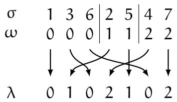

Write $\omega = s o r t ( \lambda )$ in this case and call ω the content of λ. The notion of “content” more usually refers to the multiplicities of the symbols used, but this approach is of equivalent utility; obviously $\lambda , \lambda ^ { \prime }$ have the same content exactly when sort $( \bar { \lambda } ) = s o r t ( \lambda ^ { \prime } )$ .

We can encode σ with more letters in the alphabet by adding gratuitous nondescents to the set $\mathsf { N } = \{ \mathsf { n } _ { 1 } , \ldots , \mathsf { n _ { d } } \}$ . For example, given two permutations π ${ \sf , \sf \rho } \in \mathcal { S } _ { \infty } ,$ it is natural to use the set $\mathsf { N } = \mathsf { D } ( \pi ) \cup \mathsf { D } ( \mathsf { \Lambda } \mathsf { \rho } )$ , leading to strings $\lambda$ and $\mu$ (for π and ρ) with the same content. This is the choice that’s (implicitly) made in [KZJ17, KZJ21], but not in the present work.

1.4. Separated-descent puzzles. Assume given $\pi , \rho \in { S } _ { \mathrm { n } }$ with over $( \pi , \rho ) = 1$ . Writing $\# \mathrm { D } ( \boldsymbol { \rho } ) = \mathbf { k } + 1$ and $\# \mathrm { D } ( \pi ) = \mathrm { d } - \boldsymbol { \mathrm { k } } ,$ we choose the alphabets

$$
\begin{array}{l} \mathcal {A} _ {1} = \left\{\_ <   k + 1 <   \dots <   d \right\} \\ \mathcal {A} _ {2} = \{0 <   \dots <   k <   - \} \tag {1} \\ \end{array}
$$

(the letter is a “blank”2 to describe $\pi$ as a string $\lambda \in \mathcal { A } _ { 1 } ^ { \mathfrak { n } }$ and ρ as a string $\mu \in A _ { 2 } ^ { \mathfrak { n } }$ .

Note that if ${ \cal O } ( \pi , \rho ) = \{ { \bf r } \} ,$ then there are exactly r blanks in λ because min $\boldsymbol { \mathrm { D } } ( \pi ) = \boldsymbol { \mathrm { r } } ,$ , and ${ \mathfrak { n } } - { \mathfrak { r } }$ blanks in $\mu$ because max $\operatorname { D } ( \boldsymbol { \rho } ) = \boldsymbol { \ r }$ .

Here is a practical test for when $( \pi , \rho )$ form a separated-descent pair, and what strings $\lambda , \mu$ to associate to them.

• Invert $\pi$ and ρ to form the initial $\lambda$ , µ.   
• Find a $\updownarrow \in [ \eta ]$ such that the values $1 \ldots \ k$ occur in order in $\lambda ,$ and $\boldsymbol { \mathrm { k } } + \boldsymbol { \mathrm { l } }$ . . . n occur in order in $\mu$ . There may be multiple $\boldsymbol { \mathrm { k } }$ for which this is satisfied. (If there are none, we are not in the separated-descent case.) Erase 1 . . . k from $\lambda$ and k + 1 . . . n from $\mu ,$ leaving blanks in their places.   
• If more numbers in the resulting strings occur in order (3 left of 4 left of 5, say), they can safely be replaced by a single letter (all 3s). The Kogan cases $[ \mathrm { K o g 0 1 } ]$ occur when all of λ’s remaining letters are identifiable, or all of $\mu ^ { \prime } \mathbf { s }$ .

These will be the resulting strings λ, µ in the theorem below.

We need a third alphabet obtained by removing the blank in $\mathcal { A } _ { 1 } \cup \mathcal { A } _ { 2 }$

$$
\mathcal {A} _ {3} = \{0 <   \dots <   d \} \tag {2}
$$

Theorem 1. Given strings $\lambda \in \mathcal { A } _ { 1 } ^ { \mathfrak { n } }$ and $\mu \in \ b { A } _ { 2 } ^ { \mathfrak { n } }$ in the alphabets (1), such that the combined number of blanks in λ and $\mu$ is n, write $\pi = \mathfrak { f } _ { \mathcal { A } _ { 1 } } ( \lambda )$ and $\mathsf { \Omega } \rho = \mathsf { f } _ { \mathcal { A } _ { 2 } } ( \mu ) ,$ ; then for any $\sigma \in S _ { \mathrm { n } } ,$ , ${ \mathfrak { c } } _ { \sigma } ^ { \pi \rho }$ is the number of “puzzles” with boundaries λ, µ, ν such that $\sigma = \mathrm { f } _ { \mathcal { A } _ { 3 } } ( \nu )$ (with $\mathcal { A } _ { 3 }$ given by (2)).

A puzzle means here a size n equilaterial triangle subdivided into size 1 triangles, with labels on edges of the latter, following the patterns

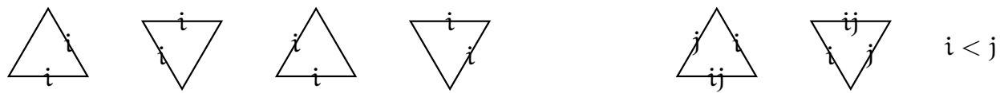

Later, for better visualization, we’ll connect using colored paths those edges of a given triangle with the same label.

For any such puzzle, $\boldsymbol { v } \in A _ { 3 } ^ { \mathfrak { n } }$ , and its content is the concatenation of λ’s with µ’s with the blanks removed.

To compute structure constants for Grothendieck polynomials, allow the following extra “Ktriangles”

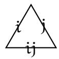

$$
i \leq k <   j
$$

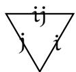

$$
i <   j \leq k o r k <   i <   j
$$

Then $c _ { \sigma } ^ { \pi \rho } = ( - 1 ) ^ { \ell ( \pi ) + \ell ( \rho ) - \ell ( \sigma ) } \# \{ s u c h p u z z l e s \} ,$ realizing the (alternating signed) “K-positivity” guaranteed in [Bri02]. Alternatively, one should consider that each K-triangle contributes a factor of −1 (the contribution of a full puzzle being the product of the contributions of its pieces), insofar as every one of the puzzles has $\ell ( \pi ) + \ell ( \boldsymbol { \rho } ) - \ell ( \boldsymbol { \sigma } )$ K-tiles.

To compute structure constants for double Schubert polynomials, allow an “equivariant rhombus” with all blank edges, as at right. Each such rhombus contributes a factor of ${ \mathfrak { y } } _ { \mathrm { j } } - { \mathfrak { y } } _ { \mathrm { i } }$ where n − i is the distance to the NE side and j is the distance to the NW side. (Practically speaking, draw lines SW and SE from the rhombus, exiting at positions j and i.)

Finally, to compute structure constants for double Grothendieck polynomials, allow both equivariant rhombi and K-triangles; an equivariant rhombus contributes $1 - { \mathfrak { y } } _ { \mathrm { j } } / { \mathfrak { y } } _ { \mathrm { i } } ,$ K-triangles still contribute −1 except the up-pointing K-triangles contribute an extra yj/yi, and so do rhombi of the form at right.

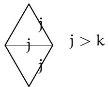

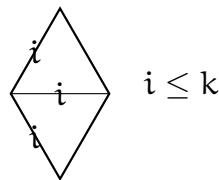

This latter rule manifestly realizes the $^ { \prime \prime } \mathsf { K } _ { \mathsf { T } }$ -positivity” predicted in [AGM11].

Example 1. Let $\pi = 1 3 6 2 5 4 7$ and $\rho = 7 3 2 1 4 5 6 \mathrm { : }$ :

$$
\begin{array}{c c c c c c c c c} \pi & & 1 & 3 & 6 & 2 & 5 & 4 & 7 \\ \omega_ {1} & & - & - & - & 3 & 3 & 4 & 4 \\ \omega_ {3} & & 0 & 1 & 2 & 3 & 3 & 4 & 4 \\ \omega_ {2} & & 0 & 1 & 2 & - & - & - & - \\ \rho & & 7 & 3 & 2 & 1 & 4 & 5 & 6 \end{array}
$$

where the $\omega _ { \mathrm { i } }$ are the contents on the three sides of the puzzles. We read off $\lambda = \leavevmode { 3 . 4 3 . 4 }$ and $\mu = 2 1$ 0. Here are the puzzles computing the product ${ \mathfrak { S } } ^ { \pi } { \mathfrak { S } } ^ { \mathfrak { p } }$ of the single Schubert polynomials:

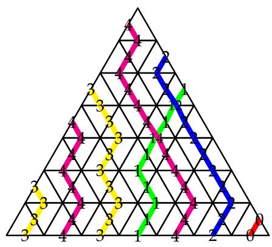

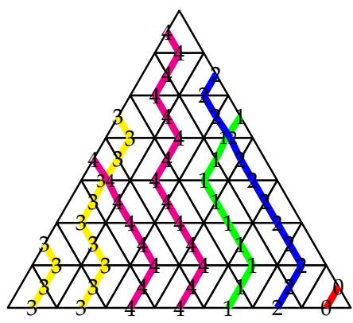

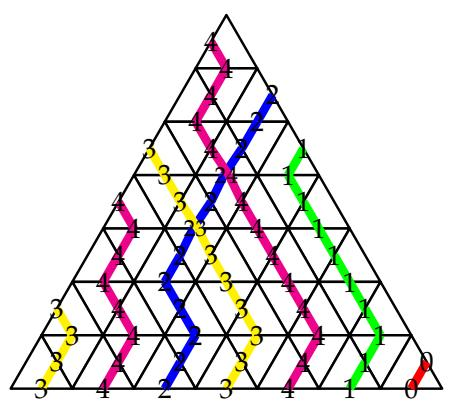

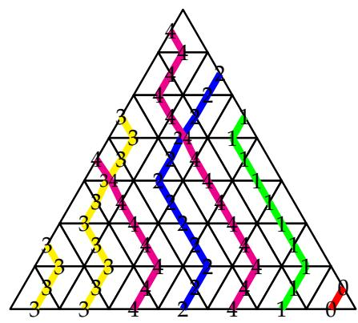

We’ve connected edges of a given triangle with the same label using colored paths for better visualization. We conclude from the puzzle calculation that

$$
\mathfrak {S} ^ {1 3 6 2 5 4 7} \mathfrak {S} ^ {7 3 2 1 4 5 6} = \mathfrak {S} ^ {7 4 6 1 3 2 5} + \mathfrak {S} ^ {7 5 6 1 2 3 4} + \mathfrak {S} ^ {7 6 3 1 4 2 5} + \mathfrak {S} ^ {7 6 4 1 2 3 5} + \dots
$$

where · · · stands for a sum of Schubert polynomials labelled by permutations of size $> 7$ . In order to get the full sum, one needs to go to $n = 1 0$ , i.e., consider $\lambda = { } . 3 . 4 3 . 4 4 4 4$ and $\mu = 2 . 1 . . . 0 . . . ,$ resulting in 24 puzzles.

Remark 1. There is no obligation to pick the minimal alphabets to encode π and ρ: the theorem is valid as stated for any strings satisfying the constraint on the number of blanks. (Moreover, the theorem follows straightforwardly from the case where the alphabets are maximal, i.e., where no number is repeated, in that the pullback of a Schubert class from a partial flag manifold to a less-partial one is again a Schubert class. This independence is not true of the “motivic Segre classes”, cf Lemma 1.) In particular, we can also treat the case over $( \pi , \rho ) = 0$ by e.g. adding max $\operatorname { D } ( \boldsymbol { \rho } )$ to π’s alphabet, or min $\mathrm { D } ( \pi )$ to $\rho ^ { \prime } \mathbf { s }$ .

Remark 2. There is an evident duality on these puzzles, flipping them left-right while taking $\mathrm { ~ i ~ } \mapsto \mathrm { ~ d ~ } - \mathrm { ~ i ~ }$ . This is of course a shadow of Grassmannian duality $( \mathsf { F } _ { 0 } \leq \mathsf { F } _ { 1 } \leq \ldots \leq$ $\mathsf { F } _ { \mathrm { d } } ) \mapsto ( \mathsf { F } _ { \mathrm { d } } ^ { \perp } \leq \mathsf { F } _ { \mathrm { d } - 1 } ^ { \perp } \leq \ldots \leq \mathsf { F } _ { 0 } ^ { \perp } )$ .

Example 2. Let $\pi = 2 4 3 1$ , $\rho = 2 1 3 4$ . Note ${ \displaystyle { \sf D } ( \pi ) = \{ 2 , 3 \} } , { \sf D } ( \rho ) = \{ 1 \} , { \sf O } ( \pi , \rho ) = \emptyset ,$ so we need to add one more nondescent to define our alphabets. There are two choices $( \mathbb { k } = 0 , 1 )$ ) leading to $\lambda = 3 . 2 1$ , 3 2 and $\mu = \mathrm { \_ } 0 _ { \mathrm { - - } } , \tau 0 _ { \mathrm { - - } }$ respectively. For either choice, we draw a row

of corresponding puzzles for double Grothendieck polynomials:

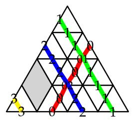  
1 − y2 y1

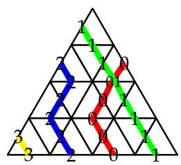  
y2 y1

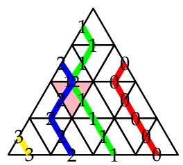  
y2 y1

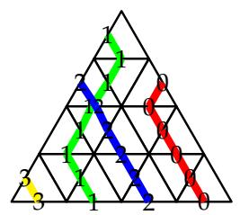  
y2 y1

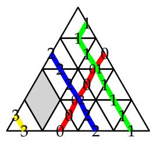  
1 − y2 y1

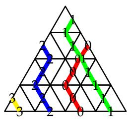  
y2y1

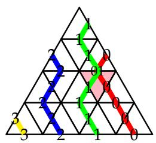  
y2 y1

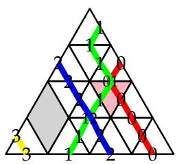  
$- \left( 1 - { \frac { y _ { 2 } } { y _ { 1 } } } \right)$

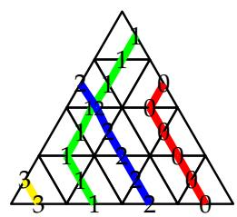  
1

(equivariant rhombi are grey, and K-triangles pink).

Despite the different number of puzzles, we obtain the same structure constants. For an instance of the subtlety of their computation, note the $\oint \mathrm { w i t h } \mathrm { j } = 1$ $\mathrm { j } = 1$ and in position (1, 2) of each of the rightmost puzzles. In the first row $( \boldsymbol { \mathrm { k } } = \boldsymbol { 0 } )$ ), because $\mathrm { ~ j ~ } > \mathsf { k }$ that rhombus contributes a $\mathsf { y } _ { 2 } / \mathsf { y } _ { 1 }$ factor, but in the second row $( \mathsf { k } = \mathsf { l } )$ ) because $\mathrm { ~ j ~ } \ngtr \ k$ it does not.

One can check from the explicit expression of the Laurent polynomials

$$
\mathfrak {G} ^ {2 4 3 1} = \left(1 - x _ {1} / y _ {1}\right) \left(1 - x _ {2} / y _ {1}\right) \left(1 - x _ {3} / y _ {1}\right) \left(1 - x _ {1} x _ {2} / \left(y _ {2} y _ {3}\right)\right)
$$

$$
\mathfrak {G} ^ {2 1 3 4} = 1 - x _ {1} / y _ {1}
$$

$$
\mathfrak {G} ^ {3 4 2 1} = (1 - x _ {1} / y _ {1}) (1 - x _ {2} / y _ {1}) (1 - x _ {3} / y _ {1}) (1 - x _ {2} / y _ {1}) (1 - x _ {2} / y _ {2})
$$

$$
\mathfrak {G} ^ {4 2 3 1} = (1 - x _ {1} / y _ {1}) (1 - x _ {2} / y _ {1}) (1 - x _ {3} / y _ {1}) (1 - x _ {2} / y _ {1}) (1 - x _ {3} / y _ {1})
$$

$$
\mathfrak {G} ^ {4 3 2 1} = (1 - x _ {1} / y _ {1}) (1 - x _ {2} / y _ {1}) (1 - x _ {3} / y _ {1}) (1 - x _ {2} / y _ {1}) (1 - x _ {2} / y _ {2}) (1 - x _ {3} / y _ {1})
$$

that the following identity holds:

$$
\mathfrak {G} ^ {2 4 3 1} \mathfrak {G} ^ {2 1 3 4} = \left(1 - \frac {y _ {2}}{y _ {1}}\right) \mathfrak {G} ^ {2 4 3 1} + \frac {y _ {2}}{y _ {1}} \left(\mathfrak {G} ^ {3 4 2 1} + \mathfrak {G} ^ {4 2 3 1} - \mathfrak {G} ^ {4 3 2 1}\right)
$$

(In particular, unlike in example 1, these puzzles happen to already be large enough to compute the stable expansion; there aren’t additional terms from $\mathsf { S } _ { \mathrm { n } } , \mathsf { n } \geq 5 .$ )

It can happen that multiple puzzle rules cover the same problem, giving different formulæ. For the two versions above of the computation, the $\operatorname* { d e s c } ( \pi , \rho ) = 4$ rule from [KZJ21] and $\mathsf { d e s c } ( \pi , \rho ) = 3$ rule from [KZJ17] (respectively) would serve. However, those do not give $\mathsf { K } _ { \mathsf { T } }$ -positive rules, as we enjoy here.

1.5. Almost separated-descent puzzles. Now assume $\mathsf { o v e r } ( \pi , \rho ) = 2 ,$ which means that ${ \sf O } ( \pi , \rho ) = \{ { \sf r } , s \bar { \sf y }$ with ${ \sf r } = \operatorname* { m i n } { \sf D } ( \pi )$ and s = max D(ρ). Let $\mathsf { N } = \mathsf { D } ( \pi ) \cup \{ s \}$ and $\mathsf { N } ^ { \prime } =$

$\mathsf { D } ( \boldsymbol { \mathsf { \rho } } ) \cup \{ \boldsymbol { \mathsf { r } } \}$ (i.e., if $s \not \in { \sf D } ( \pi )$ , we add a gratuitous nondescent at s, and similarly for D(ρ)). If $\# \mathsf { N } = \mathsf { d } - \mathsf { k } + 1$ and $\# \mathsf { N } ^ { \prime } = \mathsf { k } + 1$ , we choose the alphabets

$$
\mathcal {A} _ {1} = \{0 <   \dots <   k <   - \} \tag {3}
$$

to describe $\rho$ as a string $\lambda \in \mathcal { A } _ { 1 } ^ { \mathfrak { n } }$ and $\pi$ as a string $\mu \in \mathcal { A } _ { 2 } ^ { \mathfrak { n } }$ . The letter k occurs exactly s − r times in both $\lambda$ and $\mu ,$ and that the total number of blanks in λ and $\mu$ is n−(s−r). (Warning: note the switch of $\pi$ and ρ – these puzzles will have small numbers on the NW side and large numbers on the NE side, contrary to the situation in separated-descent. So even though separated-descent Schubert problems will be calculable with almost-separateddescent puzzles, it will not be easy to compare/biject the two resulting kinds of puzzles; compare examples 1 and 7.)

Here is a practical test for when $( \pi , \rho )$ form an almost-separated-descent pair, and what strings to associate to them.

• Invert ρ and $\pi$ to form the initial λ, µ.

• Find a pair ${ \mathfrak { j } } \leq { \mathfrak { k } } \in [ { \mathfrak { n } } ]$ such that the values 1 . . . j occur in order in $\mu ,$ that $\mathbf { k } { + } 1 \ldots \mathbf { n }$ occur in order in $\lambda ,$ and $\mathbf { j } + 1 \ldots \mathbf { k }$ occur in order in both. (In separated-descent we have $\begin{array} { r } { \mathrm { ~ j ~ = ~ k , ~ } } \end{array}$ and the third condition is empty.) There may be multiple pairs $\mathrm { ~ j ~ } \leq \mathrm { ~ k ~ }$ for which this is satisfied. (If there are none, we are not in the almost-separateddescent case.) Erase $\boldsymbol { \mathrm { k } } + \boldsymbol { \mathrm { l } }$ . . . n from λ and 1 . . . j from $\mu ,$ which is backwards from separated-descent, leaving blanks in their place.

• If some numbers in the resulting strings occur in order (3 left of 4 left of 5, say), they can safely be replaced by a single letter (all 3s, say). For example, this was required to be the case for $[ \mathfrak { j } + 1 , \mathtt { k } ] ,$ which we do indeed replace with all ks.

These will be the resulting strings $\lambda , \mu$ in the theorem below.

We also need the third alphabet

$$
\mathcal {A} _ {3} = \{\searrow 0 <   \dots <   \searrow k - 1 <   \operatorname {o d d} <   \nearrow k + 1 <   \dots <   \nearrow d \} \tag {4}
$$

Theorem 2. Given strings $\lambda \in \mathcal { A } _ { 1 } ^ { \mathfrak { n } }$ and $\mu \in A _ { 2 } ^ { \mathfrak { n } }$ in the alphabets (3), such that k occurs with the same multiplicity m in λ and $\mu ,$ and the combined number of blanks in λ and µ is n − m, write $\rho = \mathrm { f } _ { \mathcal { A } _ { 1 } } ( \lambda )$ and $\pi = \mathsf { f } _ { \mathcal { A } _ { 2 } } ( \mu ) ,$ ; then for any $\sigma \in S _ { \mathrm { n } } , \mathrm { c } _ { \sigma } ^ { \pi \rho }$ is the number of “puzzles” with boundaries λ, µ, ν such that $\sigma = \rho _ { \mathcal { A } _ { 3 } } ( \nu )$ (with $\mathcal { A } _ { 3 }$ given by (4)).

The puzzle labels on the diagonal sides of pieces are by subsets $X \subseteq \{ 0 , \ldots , \mathrm { d } \}$ . On the horizontal sides they are  i or  i with i a single number, or the words “even” or “odd”. By “i < X” we mean each $x \in X$ has i $< x ,$ and $\mathrm { ^ { \prime \prime } } X < \mathrm { \mathrm { j } ^ { \prime \prime } }$ similarly. The puzzle pieces are

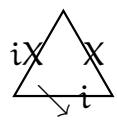  
i < X

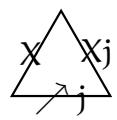  
X < j

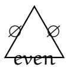

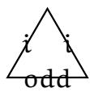

and their $1 8 0 ^ { \circ }$ rotations with arrows inverted. For any such puzzle, $\nu \in \mathcal { A } _ { 3 } ^ { \mathfrak { n } }$ , and its content is that of λ and µ put together, blanks removed, and odds added (to make length n).

To compute structure constants for (single) Grothendieck polynomials, allow the following pieces (which include the ones above):

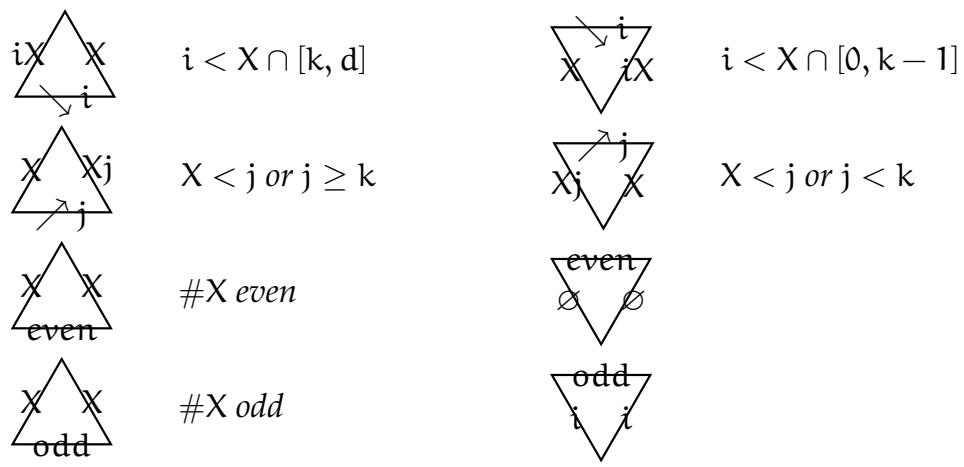

Then $c _ { \sigma } ^ { \pi \rho } = ( - 1 ) ^ { \ell ( \pi ) + \ell ( \rho ) - \ell ( \sigma ) } \# \{ s u c h p u z z l e s \} .$

Once again, the sign can be distributed over the triangles, according to the following rule: define the inversion charge inv of a triangle to be

$$
\operatorname {i n v} (\bigvee_ {i} X) = \operatorname {i n v} (\bigvee_ {X} ^ {\bigvee_ {i} X}) = \# \{x \in X: x <   i \}
$$

$$
\operatorname {i n v} \left(\bigvee_ {\rightarrow j} ^ {\rightarrow x} X j\right) = \operatorname {i n v} \left(\bigvee_ {j} ^ {\rightarrow j} X\right) = \# \{x \in X: x > j \} \tag {5}
$$

$$
\operatorname {i n v} (\bigwedge_ {\text {p a r i t y (\# X)}} ^ {\mathsf {X}}) = \operatorname {i n v} (\bigvee_ {\mathsf {X}} ^ {\text {p a r i t y (\# X)}}) = \lfloor \# \mathsf {X} / 2 \rfloor
$$

Then $\ell ( \pi ) + \ell ( \rho ) - \ell ( \sigma )$ equals the sum of inversion charges of the triangles of every puzzle that contributes to ${ \mathfrak { c } } _ { \sigma } ^ { \pi \rho }$ ; so that assigning to each triangle $( - 1 ) ^ { \mathrm { i n v } }$ produces the desired overall sign.

We emphasize, with regret, that we do not have a version of theorem 2 for double Schubert polynomials (much less double Grothendieck), nor do we expect one.

Example 3. If $\pi = 2 5 4 3 1 6 7$ and $\rho = 4 1 3 2 5 6 7$ , then ${ \cal O } ( \pi , \rho ) = \{ 2 , 3 \} \quad$ :

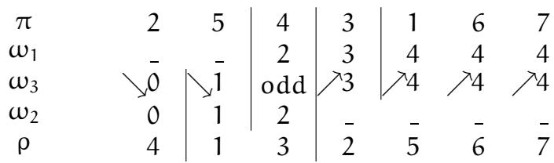

from which we derive $\lambda = 1 . 2 0 .$ and $\mu = 4 . 3 2 . 4 4$ . The seven puzzles computing the product of the Schubert polynomials are these:

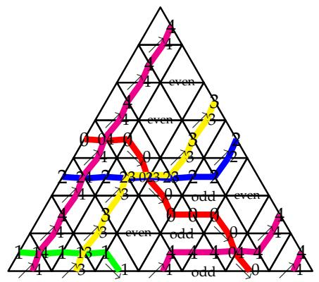

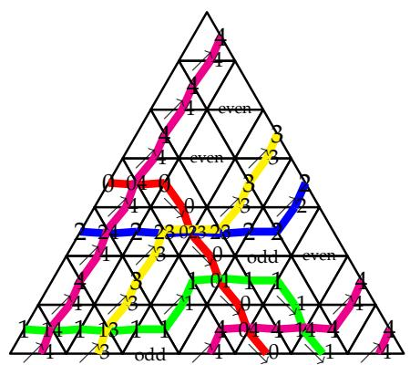

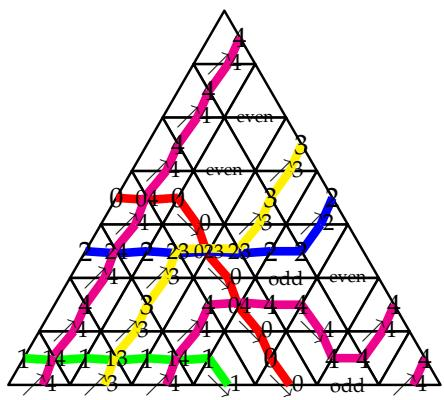

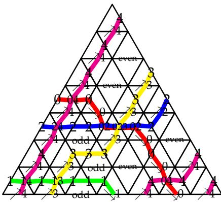

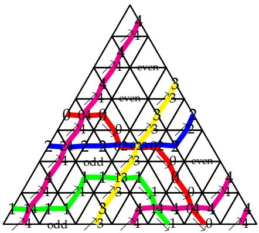

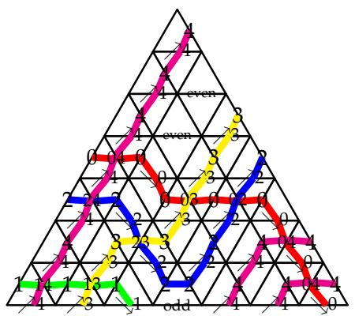

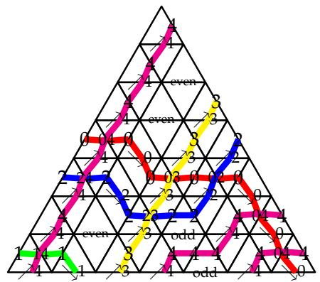

This leads to the following identity:

$$
\mathfrak {S} ^ {2 5 4 3 1 6 7} \mathfrak {S} ^ {4 1 3 2 5 6 7} = \mathfrak {S} ^ {6 3 5 2 1 4 7} + \mathfrak {S} ^ {5 6 3 2 1 4 7} + \mathfrak {S} ^ {5 4 6 2 1 3 7} + \mathfrak {S} ^ {6 4 3 2 1 5 7} + \mathfrak {S} ^ {6 5 2 3 1 4 7} + \mathfrak {S} ^ {7 3 4 2 1 5 6} + \mathfrak {S} ^ {7 2 5 3 1 4 6}
$$

Remark 3. There is an evident duality on the $\mathsf { H } ^ { * }$ puzzles that compute almost-separated descent; it flips them left-right while taking $\mathrm { ~ i ~ } \mapsto \mathrm { ~ d ~ } - \mathrm { i } ,$ and reversing the arrow. Again, this is a shadow of Grassmannian duality. However, this is not a symmetry of the Ktheoretic puzzle pieces computing almost-separated descent (see §5.2); indeed, one can use it to obtain a second, distinct, rule for K-theoretic almost-separated descent Schubert problems.

1.6. Segre motivic classes. In the geometric framework of [KZJ17], (double) Schubert and Grothendieck polynomials represent classes in the appropriate cohomology rings of

flag varieties. However, the quantum integrability pointed to a $\mathsf { q }$ -deformation of Schubert classes, and in [KZJ21] we showed that there exist puzzle formulæ for multiplying the resulting Segre motivic classes.

In fact, our theorems 1 and 2 both follow from more general theorems which can be loosely stated as

Theorem 3. Drop from theorems 1 and 2 the conditions like $\mathrm { i } < \mathrm { j }$ or $\mathbf { i } \leq \mathbf { k } < \mathbf { j }$ in the definition of puzzle piece, thereby allowing more general pieces. Continue to require, as in those theorems, that one’s permutations π, ρ have over $\bar { ( \pi , \rho ) } = 1 , 2$ (for theorems 1,2 respectively).

Then for suitable “fugacities” on the pieces, one obtains puzzle rules for multiplying the equivariant Segre motivic classes of the corresponding Schubert cells $X _ { \circ } ^ { \pi }$ , $X _ { \mathrm { { o } } } ^ { \rho }$ in appropriate partial flag varieties.

To recover Theorems 1 and 2 will require taking ${ \sf q }  0$ , which will work well in separated-descent but will introduce infinities in almost-separated-descent, unless we first give up T-equivariance. As long as we stick to finite q, though, we get an equivariant rule even for the over $( \pi , \rho ) = 2$ almost-separated-descent case.

1.7. Plan of the paper. The details of Theorem 3 will be made more precise in what follows: the necessary setup will be described in §2, see in particular Theorem $3 ^ { \prime }$ (and an application to the computation of Euler characteristics of triple intersections, Theorem 5). We will then realize this setup in two cases: separated descents in §3 and almostseparated descents in $\ S 4$ . In each case, we will show how taking the quantum parameter q to 0 in Theorem 3 reproduces Theorems 1 (see $\ S 3 . 4$ and §3.5) and 2 (see §4.5), respectively.

1.8. Relations to prior work. The two special cases of Theorem 1 that fall within the “Schur times Schubert” (i.e. $\# \mathrm { D } ( \pi ) = 1$ or $\# \mathrm { D } ( \rho ) = 1 ,$ ) problem were first handled in [Kog01] using a bijection on pipe dreams. In [KY04] the $\# \mathsf { D } ( \pi ) = 1$ case was given a streamlined proof using “truncation”, and extended to K-theory; that technique was then rediscovered in [Ass17]. However, the truncation approach doesn’t seem to produce an equivariant formula.

After we announced Theorem 1, an alternate formula (in nonequivariant $\mathsf { H } ^ { * }$ only) counting certain tableaux was given in [Hua21]. Huang and Gao have since3 found a correspondence between Huang’s tableaux and our separated-descent puzzles.

We include another approach to solving separated-descent problems positively, making use of the ring endomorphism from [BS98, §4.3]. Motivated by an embedding Flags $( \mathbb { C } ^ { n } ) \hookrightarrow$ $\mathsf { F l a g s } ( \mathbb { C } ^ { \mathsf { n } + 1 } )$ , those authors define a ring endomorphism

$$
\Psi_ {i} \colon \mathbb {Z} [ x _ {1}, x _ {2}, \ldots ] \to \mathbb {Z} [ x _ {1}, x _ {2}, \ldots ], \qquad \qquad x _ {j} \mapsto \left\{ \begin{array}{l l} x _ {j} & \text {i f i <   j} \\ 0 & \text {i f i = j} \\ x _ {j - 1} & \text {i f i > j} \end{array} \right.
$$

It is easy to prove that

$$
\Psi_ {i} \left(S _ {\pi}\right) = S _ {\pi} \quad \text {i f} \pi^ {\prime} \text {s l a s t d e s c e n t i s} <   i
$$

$$
\Psi_ {i} \left(S _ {I _ {1} \oplus \rho}\right) = \Psi_ {1} \left(S _ {I _ {1} \oplus \rho}\right) = S _ {\rho} \quad \text {i f} \rho^ {\prime} \text {s f i r s t d e s c e n t i s} \geq i
$$

(where $\bigoplus$ is to be interpreted on the permutation matrices). Hence, for $\pi , \rho \in S _ { \mathrm { n } }$ and π’s last descent $\le { \sf k } \le { \sf \rho } ^ { \prime }$ s first descent,

$$
S _ {\pi} S _ {\rho} = \left(\Psi_ {k + 1}\right) ^ {n} \left(S _ {\pi}\right) \left(\Psi_ {k + 1}\right) ^ {n} \left(S _ {I _ {n} \oplus \rho}\right) = \left(\Psi_ {k + 1}\right) ^ {n} \left(S _ {\pi} S _ {I _ {n} \oplus \rho}\right) = \left(\Psi_ {k + 1}\right) ^ {n} \left(S _ {\pi \oplus \rho}\right)
$$

where the latter can be computed positively (in nonequivariant $\mathsf { H } ^ { * }$ ) from the Schubertpositive formula for $\Psi _ { \mathrm { i } } ( S _ { \sigma } )$ given in [BS98, Theorem 4.2.4(i)].

# 2. SETUP OF PROOFS

2.1. Tensor calculus. We use the same tensor calculus as in [KZJ17, KZJ21]. Starting with a quantized loop algebra4 $\mathcal { U } _ { \mathfrak { q } } ( \mathfrak { g } [ z ^ { \pm } ] )$ , we consider three families of representations $\bar { \mathsf { V } } _ { \mathrm { a } } ( z )$ , where $a = 1 , 2 , { \bar { 3 } }$ and $z$ is a formal parameter; an integer $\alpha \in \mathbb { Z }$ is also specified. We then consider intertwiners

$$
\begin{array}{l} \check {R} _ {a, b} \left(z ^ {\prime}, z ^ {\prime \prime}\right): \quad V _ {a} \left(z ^ {\prime}\right) \otimes V _ {b} \left(z ^ {\prime \prime}\right)\rightarrow V _ {b} \left(z ^ {\prime \prime}\right) \otimes V _ {a} \left(z ^ {\prime}\right) \\ U (z): V _ {1} \left(q ^ {\alpha} z\right) \otimes V _ {2} \left(q ^ {- \alpha} z\right)\rightarrow V _ {3} (z) \tag {6} \\ D (z): \quad V _ {3} (z) \rightarrow V _ {2} \left(q ^ {- \alpha} z\right) \otimes V _ {1} \left(q ^ {\alpha} z\right) \\ \end{array}
$$

and these are unique up to normalization (to be specified in each case below). The three intertwiners are related by the factorization property

$$
\check {\mathrm {R}} _ {1, 2} \left(\mathrm {q} ^ {\alpha} z, \mathrm {q} ^ {- \alpha} z\right) = \mathrm {D} (z) \mathrm {U} (z) \tag {7}
$$

Combining these basic intertwiners allows one to build many intertwiners acting on tensor products of the form $\otimes _ { \mathrm { i } } \mathsf { V } _ { \mathrm { a } _ { \mathrm { i } } } ( z _ { \mathrm { i } } )$ . Because for generic $z _ { \mathrm { i } }$ these tensor products are irreducible [Cha02], Schur’s lemma leads to various identities satisfied by these intertwiners, among which are the Yang–Baxter equation for the $\check { \sf R }$ matrices, and other similar relations involving $\check { \mathsf { R } } _ { \mathrm { a , b } }$ , U and D. These identities are best described diagrammatically, and we shall not repeat them here, referring to [KZJ21, Prop. 5] for details.

2.2. Puzzles. We are particularly interested in $\check { \mathsf { R } } _ { 1 , 2 } ,$ for which we will use the graphical depiction

$$
\check {\mathsf {R}} _ {1, 2} = \left\langle \begin{array}{c} \hline \end{array} \right\rangle
$$

Similarly, the U and D matrices will be drawn as U = , D = . Time flows downwards on our diagrams.

Consider a tensor $\mathbf { P }$ built out of $\check { \mathsf { R } } _ { 1 , 2 }$ and U, forming an equilateral triangle of size n, e.g., at ${ \mathfrak { n } } = 4$ ,

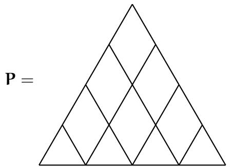

intertwining $\begin{array} { r } { \bigvee _ { 1 } \big ( \mathfrak { q } ^ { \alpha } z _ { 1 } \big ) \otimes \cdot \cdot \cdot \otimes \bigvee _ { 1 } \big ( \mathfrak { q } ^ { \alpha } z _ { n } \big ) \otimes \bigvee _ { 2 } \big ( \mathfrak { q } ^ { - \alpha } z _ { 1 } \big ) \otimes \cdot \cdot \cdot \otimes \bigvee _ { 2 } \big ( \mathfrak { q } ^ { - \alpha } z _ { n } \big ) \longrightarrow \bigvee _ { 3 } \big ( z _ { 1 } \big ) \otimes \cdot \cdot \cdot \otimes \bigvee _ { 3 } \big ( z _ { n } \big ) . } \end{array}$

If we now fix appropriate bases of the various spaces $\mathsf { V } _ { \mathrm { a } } ( z )$ , we can expand P by picking a basis vector for each edge of the diagram; we represent this by marking the edges with the labels of the chosen basis elements, e.g., if the labels are 0, 1, 10, then one of the summands of P is pictured as

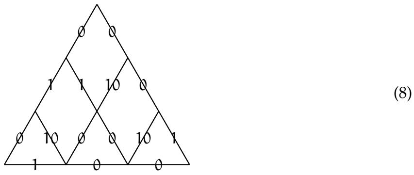

Such a picture is called an (equivariant) puzzle. The fugacity fug(P) of a puzzle P is the product of matrix entries of the individual tensors on the diagram. By convention, we add the requirement that puzzles have nonzero fugacity. We can then state that any matrix element of the tensor $\mathbf { P }$ can be written as

$$
\bigvee_{\nu}^{\mu}:= \langle e^{*}_{\nu},\mathbf{P}\left(e_{\lambda}\otimes e_{\mu}\right)\rangle = \sum_{\substack{\text{puzzles} P\\ \text{with sides}\lambda ,\mu   \nu}}fug(P)
$$

where $\lambda , \mu , \nu$ are three strings of length n in the labels, $e _ { \nu } ^ { \ast } = \otimes _ { \mathrm { k = 1 } } ^ { \mathrm { n } } e _ { 3 , \mathrm { v _ { k } } } ^ { \ast } , e _ { \lambda } = \otimes _ { \mathrm { k = 1 } } ^ { \mathrm { n } } e _ { 1 , \lambda _ { \mathrm { k } } } ,$ $\boldsymbol { e } _ { \mu } = \boldsymbol { \bigotimes } _ { \mathrm { k } = 1 } ^ { \mathrm { n } } \boldsymbol { e } _ { 2 , \mu _ { \mathrm { k } } } ,$ and the $e _ { \mathrm { a } } s$ and $e _ { \mathrm { a } } ^ { \ast } s$ are basis and dual basis elements of the $\mathsf { V } _ { \mathrm { a } } \mathsf { s }$ .

In what follows, we require our representations to have one-dimensional weight spaces5, and our bases to consist of weight vectors.

If we specialize the parameters $z _ { 1 } , \ldots , z _ { n }$ to be equal, then according to factorization property (7), matrix elements of the tensor $\mathbf { P }$ are now expressed as sums over nonequivariant puzzles, e.g.,

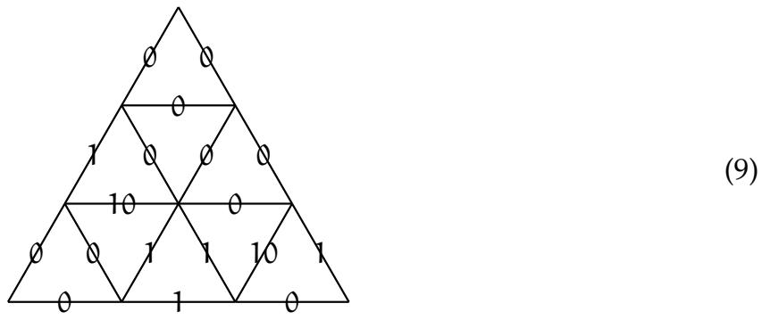

Even for equivariant puzzles, it is customary to draw and label the horizontal diagonal of rhombi if the resulting pair of triangles corresponds to nonzero entries of U and D (such a label will be unique if it exists since weight spaces are one-dimensional, so no

information is added); e.g., for the example (8) above, one would draw

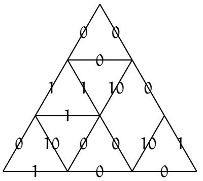

With this convention, equivariant puzzles are now made of two types of puzzle pieces: triangles, and rhombi that cannot be bisected in the way described above. These remaining rhombi are the “equivariant” rhombi, i.e., the ones whose contribution vanishes as one specializes the parameters $z _ { 1 } , \ldots , z _ { n }$ to be equal. The drawback to bisecting a “nonequivariant rhombus” is that its fugacity may not be the product of the nonequivariant fugacities of the two triangles; see e.g. the discussion just after example 2.

2.3. The general theorem. Fix a Cartan subalgebra ${ \mathfrak { h } } \leq { \mathfrak { g } }$ . (We don’t use $\mathrm { t , }$ as we reserve T for the group that acts geometrically, on the partial flag manifold.) The $\mathfrak { h }$ -weights in a representation $\mathsf { V } _ { \mathrm { a } } ( z )$ are independent of $z ,$ and their convex hull is called the representation’s weight polytope. To a face F of the weight polytope, we associate a face subspace of $\mathsf { V } _ { \mathrm { a } } ( z )$ , the direct sum of the weight spaces with weight in F.

For each $\mathtt { a } = 1 , 2 , 3$ , pick a face subspace $V _ { \mathrm { a } } ^ { \mathrm { A } } ( z )$ of $\mathsf { V } _ { \mathrm { a } } ( z )$ . An easy lemma based on the $\mathfrak { h }$ -equivariance of $\check { \mathsf { R } } _ { \mathrm { a , a } } ( { z } ^ { \prime } , { z } ^ { \prime \prime } )$ shows that it sends $\mathrm { V } _ { \mathrm { a } } ^ { \mathrm { A } } ( z ^ { \prime } ) \otimes \mathrm { V } _ { \mathrm { a } } ^ { \mathrm { A } } ( z ^ { \prime \prime } )$ to $\mathrm { V } _ { \mathrm { a } } ^ { \mathrm { A } } \left( z ^ { \prime \prime } \right) \otimes \mathrm { V } _ { \mathrm { a } } ^ { \mathrm { A } } \left( z ^ { \prime } \right)$ .

In what follows we fix an ordered basis (with conditions on the order to come later) of weight vectors of each $V _ { \mathrm { a } } ^ { \mathrm { A } } ( z )$ , with label set $\mathrm { L } _ { \mathrm { a } }$ . Weight spaces of $\bigotimes _ { \mathrm { i = 1 } } ^ { \mathrm { n } } { \mathsf { V } } _ { \mathrm { a } } ^ { \mathrm { A } } \big ( z _ { \mathrm { i } } \big )$ are naturally indexed by weakly increasing strings $\omega _ { \mathrm { a } } \in \mathrm { L } _ { \mathrm { a } } ^ { { \mathrm { n . } } }$ ; let us denote them $\lbrack \bigotimes _ { \mathrm { i = 1 } } ^ { \mathrm { n } } V _ { \mathrm { a } } ^ { \mathrm { A } } \bigl ( z _ { \mathrm { i } } \bigr ) \rbrack _ { \omega _ { \mathrm { a } } }$ .

Pick three such weakly increasing strings $v _ { \mathrm { a } } , \mathbf { a } = 1 , 2 , 3$ whose corresponding weights satisfy $\omega _ { 3 } = \omega _ { 1 } + \omega _ { 2 }$ . We will need the following crucial properties:

(a) P maps $[ \bigotimes _ { \mathrm { i } = 1 } ^ { \mathrm { n } } V _ { 1 } ^ { \mathrm { A } } ( \mathsf { q } ^ { \alpha } z _ { \mathrm { i } } ) ] _ { \omega _ { 1 } } \otimes [ \bigotimes _ { \mathrm { i } = 1 } ^ { \mathrm { n } } V _ { 2 } ^ { \mathrm { A } } ( \mathsf { q } ^ { - \alpha } z _ { \mathrm { i } } ) ] _ { \omega _ { 2 } }$ to $[ \otimes _ { \mathrm { i } = 1 } ^ { \mathrm { n } } \mathsf { V } _ { 3 } ^ { \mathrm { A } } ( z _ { \mathrm { i } } ) ] _ { \omega _ { 3 } }$

This follows straightforwardly from two facts: $\mathbf { P }$ is weight-preserving, and, if ${ \mathsf { V } } ^ { \mathsf { F } } \leq { \mathsf { V } }$ is a face subspace (where the face is given by maximizing dot product against some coweight η) then $( \mathsf { V } ^ { \mathsf { F } } ) ^ { \otimes \mathsf { n } } \leq \mathsf { V } ^ { \otimes \mathsf { n } }$ is again a face subspace (for the same η).

(b) Inversely, $e _ { \omega _ { 3 } } ^ { * } \mathbf { P } | _ { [ \otimes _ { \mathrm { i } = 1 } ^ { \mathrm { n } } V _ { 1 } ^ { A } ( \mathbf { q } ^ { \alpha } z _ { \mathrm { i } } ) ] _ { \omega _ { 1 } } \otimes [ \otimes _ { \mathrm { i } = 1 } ^ { \mathrm { n } } V _ { 2 } ^ { A } ( \mathbf { q } ^ { - \alpha } z _ { \mathrm { i } } ) ] _ { \omega _ { 2 } } } = e _ { \omega _ { 1 } } ^ { * } \otimes e _ { \omega _ { 2 } } ^ { * } .$

In puzzle terms, (a) says that if the NW, NE sides of a puzzle have contents $\omega _ { 1 }$ $\omega _ { 1 } , \omega _ { 2 } ,$ then the S side must have content $\omega _ { 3 . }$ , whereas (b) says that if the S side is actually $\omega _ { 3 }$ (the weakly increasing string) then the NW, NE sides must actually be $\omega _ { 1 } , \omega _ { 2 }$ .

We now fix the normalization of $\check { \mathsf { R } } _ { \mathrm { a , a } } ( z ^ { \prime } , z ^ { \prime \prime } )$ by requiring that it send the highest weight vector of ${ V _ { \mathrm { a } } ^ { A } } \otimes { V _ { \mathrm { a } } ^ { A } }$ to itself. (We’ll see later that this matches the natural geometric normalization of R-matrices.) Denote by $\check { \mathsf { R } } _ { \mathrm { a , a } } ^ { A } \big ( z ^ { \prime } , z ^ { \prime \prime } \big )$ the restriction of $\check { \mathsf { R } } _ { \mathrm { a , a } } ( z ^ { \prime } , z ^ { \prime \prime } )$ to $V _ { \mathrm { a } } ^ { A } ( z ^ { \prime } ) ~ \otimes$ $V _ { \mathrm { a } } ^ { \mathrm { A } } \left( z ^ { \prime \prime } \right) ,$ ; and $W = S _ { \mathrm { n } }$ .

To a permutation $\sigma \in { \mathsf { W } }$ is associated an “Rˇ-matrix” $\check { \mathsf { R } } _ { \sigma , \mathrm { a } } ^ { \mathsf { A } }$ from ${ \cal V } _ { \mathrm { a } } ^ { \cal A } ( z _ { 1 } ) \otimes \cdot \cdot \cdot \otimes { \cal V } _ { \mathrm { a } } ^ { \cal A } ( z _ { \mathrm { n } } )$ to ${ \cal V } _ { \mathfrak { a } } ^ { \cal A } ( z _ { \sigma ^ { - 1 } ( 1 ) } ) \otimes \cdots \otimes { \cal V } _ { \mathfrak { a } } ^ { \cal A } \bigl ( z _ { \sigma ^ { - 1 } ( { \mathfrak { n } } ) } \bigr ) .$ ; explicitly, if $\sigma = s _ { \mathrm { i } _ { 1 } } \ldots s _ { \mathrm { i } _ { \ell } }$ where the $s _ { \mathrm { i } }$ are elementary transpositions, then $\check { \mathsf { R } } _ { \sigma , \mathrm { a } } ^ { \mathsf { A } }$ is the ordered product of $\check { \mathsf { R } }$ -matrices $\check { \mathbf { R } } _ { \mathrm { a } , \mathrm { a } } ^ { A } \big ( z _ { s _ { \mathrm { i } _ { \ell } } \ldots s _ { \mathrm { i } _ { \mathrm { k } + 1 } } ( \mathrm { i } _ { \mathrm { k } } ) } , z _ { s _ { \mathrm { i } _ { \ell } } \ldots s _ { \mathrm { i } _ { \mathrm { k } + 1 } } ( \mathrm { i } _ { \mathrm { k } } + 1 ) } \big )$ acting on the $\mathfrak { i } _ { \mathrm { k } } ^ { \mathrm { t h } }$ and $( \mathrm { i } _ { \mathrm { k } } + 1 ) ^ { \mathrm { t h } }$ spaces of the tensor product.

We consider the matrix elements

$$
\left. S _ {a} ^ {\lambda} \right| _ {\sigma} := \left\langle e _ {\omega} ^ {*}, \check {R} _ {\sigma , a} ^ {A} e _ {\lambda} \right\rangle \tag {10}
$$

where $\lambda \in \mathrm { L } _ { \mathrm { a } } ^ { \mathfrak n } ,$ and $\omega = \mathrm { s o r t } ( \lambda )$ .

One of the key results of [KZJ17] is:

Theorem 4 ([KZJ17, Thm. 5]). In the setup above, conditions (a) and (b) imply, given strings $\lambda \in \mathrm { L } _ { 1 } ^ { \mathfrak { n } }$ and $\mu \in \mathrm { L } _ { 2 } ^ { \mathfrak { n } }$ with sort $( \lambda ) = \omega _ { 1 }$ and sort $( \mu ) = \omega _ { 2 } ,$ for each $\sigma \in W$ , the following puzzle identity in frac $( \mathbb { Z } [ z _ { 1 } , \ldots , z _ { n } , \mathbf { q } ] ) _ { . }$ ):

$$
\sum_ {\nu \in L _ {3} ^ {n}} \bigtriangleup_ {\nu} ^ {\lambda} S _ {3} ^ {\nu} | _ {\sigma} = S _ {1} ^ {\lambda} | _ {\sigma} S _ {2} ^ {\mu} | _ {\sigma} \tag {11}
$$

We will need two more conditions in order to interpret the puzzle identity above in the context of Schubert calculus:

(c) (weak version) The successive differences of the weights in each chosen face should form a type A root subsystem of $\mathfrak { g }$ .

(strong version) $\check { \mathsf { R } } _ { \mathrm { a , a } } ^ { \ A } ( z ^ { \prime } , \dot { z } ^ { \prime \prime } ) _ { \cdot }$ , in the chosen basis, coincides with the type A Rˇ-matrix

$$
\check {R} ^ {A} \left(z ^ {\prime}, z ^ {\prime \prime}\right) _ {i j} ^ {m l} = \frac {1}{1 - q ^ {2} z ^ {\prime \prime} / z ^ {\prime}} \left\{ \begin{array}{l l} 1 - q ^ {2} z ^ {\prime \prime} / z ^ {\prime} & i = j = m = l \\ \left(1 - z ^ {\prime \prime} / z ^ {\prime}\right) q & i = l \neq j = m \\ 1 - q ^ {2} & i = m <   j = l \\ \left(1 - q ^ {2}\right) z ^ {\prime \prime} / z ^ {\prime} & i = m > j = l \\ 0 & \text {e l s e} \end{array} \right. \tag {12}
$$

In proposition 2 we will show that under a natural assumption on the ordering of the basis, the weak version implies the strong version.

(d) Say $\omega _ { \mathrm { a } }$ contains $\mathfrak { p } _ { \mathfrak { a } , \mathrm { i } }$ times the $\mathrm { i } ^ { \mathrm { t h } }$ label of $\mathrm { L } _ { \mathrm { a } }$ . Let $\mathsf { G } = \mathsf { G L } _ { \mathsf { n } } ( \mathbb { C } ) , \mathsf { B } _ { - } < \mathsf { G }$ be the lower triangular matrices, $\mathsf { P } _ { \mathrm { a } } \geq \mathsf { B } _ { - }$ the parabolic subgroups with Levi factors $\Pi _ { \mathrm { i } } \operatorname { G L } _ { \mathfrak { p } _ { \mathrm { a , i } } } ( \mathbb { C } ) .$ , and $\bar { \mathcal { F } } _ { \mathrm { a } } = \mathsf { P } _ { \mathrm { a } } \backslash \mathsf { G }$ the corresponding flag varieties.

Then we require $\mathsf { P } _ { 3 } \leq \mathsf { P } _ { 1 } \cap \mathsf { P } _ { 2 } ,$ i.e., that $\mathcal { F } _ { 3 }$ is a refinement of $\mathcal { F } _ { 1 }$ and $\mathcal { F } _ { 2 }$ .

Write $W _ { \mathrm { a } } = \boldsymbol { W } \cap \mathsf { P } _ { \mathrm { a } }$ . There is a W-equivariant bijection between strings of n labels in $\mathrm { L } _ { \mathrm { a } }$ with content $\omega _ { \mathrm { a } }$ and cosets $W _ { \mathrm { a } } \backslash W ,$ , which sends $\sigma \in W _ { \mathrm { a } } \backslash W$ to $\lambda = ( \omega _ { \mathrm { a } , \sigma \left( \mathrm { i } \right) } ) _ { \mathrm { i } = 1 , \ldots , \mathsf { n } } \in \mathsf { L } _ { \mathrm { a } } ^ { \mathsf { n } } ;$ we identify strings and cosets via this bijection in what follows.

We are now in a position to state our most general Theorem. We consider the map ${ \sf p } = { \sf p } _ { 1 } \times { \sf p } _ { 2 }$ from $\mathcal { F } _ { 3 }$ to $\mathcal { F } _ { 1 } \times \mathcal { F } _ { 2 }$ that to a flag $\mathsf { F } \in \varPsi _ { 3 }$ associates the pair of subflags obtained from F by keeping only the parts that match the dimension vector of $\mathcal { F } _ { 1 } , \mathcal { F } _ { 2 }$ .

The Cartan torus ${ \sf T } = ( \mathbb { C } ^ { \times } ) ^ { \mathfrak { n } } \leq { \sf G }$ acts on each $\mathcal { F } _ { \mathrm { a } }$ . Consider the equivariant K-theory rings ${ \sf K } _ { \sf T } ( \mathcal { F } _ { \mathrm { a } } ) [ { \sf q } ^ { \pm } ]$ .6 They are modules over ${ \sf K } _ { \sf T } ( { \sf p t } ) [ { \sf q } ^ { \pm } ] \cong \mathbb { Z } [ z _ { 1 } ^ { \pm } , \dots , z _ { \mathrm { n } } ^ { \bar { \pm } } , { \sf q } ^ { \pm } ]$ . The various R-matrices have poles, so we need to localize: we choose the extended base ring $\mathcal { R }$ by adding to ${ \sf K } _ { \sf T } ( { \sf p t } ) [ { \sf q } ^ { \pm } ]$ the inverses of $1 - { \mathfrak { q } } ^ { 2 \mathrm { k } } z _ { \mathrm { i } } / z _ { \mathrm { j } } , \mathrm { k } \neq 0 , 1 \leq \mathrm { i } , \mathrm { j } \leq \mathfrak { n }$ . The identity (11) then takes value in $\mathcal { R }$ . Tensoring with $\mathcal { R }$ will be denoted by the superscript loc.

According to [KZJ21, Lemma 2], $S _ { \mathrm { a } } ^ { \lambda } | _ { \sigma }$ only depends on the class of σ in $W _ { \mathrm { a } } \backslash W ;$ we define $S _ { \mathrm { a } } ^ { \lambda } \in \mathsf { K } _ { \mathsf { T } } ^ { \mathrm { l o c } } ( \mathcal { F } _ { \mathrm { a } } ) [ \mathsf { q } ^ { \pm } ]$ by the property that its restriction to each fixed point $\sigma \in W _ { \mathrm { a } } \backslash W$ is given

by $S _ { \mathrm { a } } ^ { \lambda } | _ { \sigma }$ . It is known (see [KZJ21, §2]) that ${ \sf q } ^ { \ell ( \lambda ) } S _ { \mathrm { a } } ^ { \lambda }$ can be identified with the (equivariant) motivic Segre class associated to the Schubert cell $X _ { \circ } ^ { \lambda }$ indexed by λ inside $\mathcal { F } _ { \mathrm { a } }$ . In what follows we ignore this power of $\mathbf { q }$ (essentially a choice of convention) and just call $S _ { \mathrm { a } } ^ { \lambda }$ the motivic Segre class.

As an immediate corollary of Theorem 4, we have the following statement, which is a more precise version of Theorem 3 that was advertised in the introduction:

Theorem ${ \pmb { 3 } } ^ { \prime }$ . In the setup above, conditions $( a ) – ( d )$ imply that motivic Segre classes satisfy the following puzzle identity in ${ \sf K } _ { \sf T } ^ { \mathrm { l o c } } ( \mathcal { F } _ { 3 } ) [ { \sf q } ^ { \pm } ]$ :

$$
p ^ {*} \left(S _ {1} ^ {\lambda} \otimes S _ {2} ^ {\mu}\right) = \sum_ {\nu} \bigtriangleup_ {\nu} ^ {\mu} S _ {3} ^ {\nu} \tag {13}
$$

Proof. By definition ${ \mathfrak { p } } = ( { \mathfrak { p } } _ { 1 } \times { \mathfrak { p } } _ { 2 } ) \circ \Delta ,$ with obvious notations, so $\mathfrak { p } ^ { * } ( \mathbb { S } _ { 1 } ^ { \lambda } \otimes \mathbb { S } _ { 2 } ^ { \mathtt { \scriptscriptstyle \sharp } } ) = \mathfrak { p } _ { 1 } ^ { * } ( \mathbb { S } _ { 1 } ^ { \lambda } ) \mathfrak { p } _ { 2 } ^ { * } ( \mathbb { S } _ { 2 } ^ { \mathtt { \scriptscriptstyle \sharp } } )$ . Furthermore, p is also compatible with restriction to fixed points, in the sense that ${ \mathfrak { p o i } } _ { 3 } =$ $\left( \mathfrak { i } _ { 1 } \times \mathfrak { i } _ { 2 } \right) \circ \mathfrak { p } .$ , where $\mathfrak { i } _ { \mathfrak { a } } : \mathcal { W } \to \mathcal { F } _ { \mathfrak { a } }$ is the inclusion of fixed points. The r.h.s. of (11) is therefore $\left. \mathsf { p } ^ { * } ( \mathsf { S } _ { 1 } ^ { \lambda } \otimes \mathsf { S } _ { 2 } ^ { \mu } ) \right| _ { \sigma }$ . We conclude by using injectivity of the $\mathfrak { i } _ { \mathrm { a } } ^ { \ast }$ . 

In what follows, we shall call such puzzles generic puzzles (corresponding to a generic value of ${ \mathfrak { q } }$ ), to differentiate them from ordinary puzzles which correspond to the limit ${ \mathfrak { q } } \to 0$ .

Theorem $3 ^ { \prime }$ , in contrast to [KZJ21, Thm. 1] which it generalizes, is not a product rule for motivic Segre classes of Schubert cells; rather, we have the following lemma:

Lemma 1. The pullback under $\mathfrak { p } _ { 1 } : \mathcal { F } _ { 3 } \to \mathcal { F } _ { 1 }$ of the Segre motivic class of a Schubert cell is the Segre motivic class of its preimage; equivalently,

$$
p_{1}^{*}(S_{1}^{\lambda}) = \sum_{\mu \in W_{3}\backslash W: p_{1}(\mu) = \lambda}q^{\ell (\mu) - \ell (\lambda)}S_{3}^{\mu}
$$

Proof. This is a combination of

• the result [MNS17, proposition 6.3] about preimages along smooth maps,   
• the additivity of Segre motivic classes under disjoint unions, and   
• careful accounting of the powers of q we threw out before theorem $3 ^ { \prime }$

We give an application of Theorem $3 ^ { \prime }$ and Lemma 1 in the case of nonequivariant cohomology:

Theorem 5. In the same setup as Theorem $3 ^ { \prime }$ , the Euler characteristic of $\mathsf { Y } : = \mathsf { g p } _ { 1 } ^ { - 1 } ( X _ { \circ } ^ { \lambda } ) \cap$ ${ \mathfrak { g } } ^ { \prime } { \mathfrak { p } } _ { 2 } ^ { - 1 } ( X _ { \circ } ^ { \mu } ) \cap { \mathfrak { g } } ^ { \prime \prime } X _ { \circ } ^ { \nu }$ (where g, g′, g′′ are general elements of GL(n)) is $( - 1 ) ^ { \dim \Upsilon }$ times the sum of H-fugacities of nonequivariant puzzles with sides $\lambda , \mu , \overleftarrow { \nu }$ .

Here $\overleftarrow { \boldsymbol { \mathsf { v } } } : = ( \boldsymbol { \mathsf { v } } _ { \mathrm { n } } , \ldots , \boldsymbol { \mathsf { v } } _ { 2 } , \boldsymbol { \mathsf { v } } _ { 1 } ) .$ , and by definition, the H-fugacity of a nonequivariant puzzle is its fugacity at the specialization ${ \mathfrak { q } } = - 1 .$ ; in the two applications that we have in mind, these H-fugacities will be equal to 1, so that $\chi ( \mathsf { Y } )$ is $( - \bar { 1 } ) ^ { \mathrm { c o d i m } \Upsilon }$ times the number of such puzzles.

We omit the proof of Theorem 5, which is identical to that of [KZJ21, Thm. 3], the only new ingredient being the interpretation of the pullbacks of the $S _ { \mathrm { a } } ^ { \lambda }$ in Lemma 1.

2.4. Flag-type faces. Fix a generic (real) coweight ~c. With it, we can choose a Borel subalgebra ${ \mathfrak { b } } \geq { \mathfrak { h } }$ , as containing the roots that pair positively with ${ \vec { \mathrm { c } } } ,$ at which point we can call ~c dominant. We also can put a total order on the vertices of any weight polytope (ordered by their pairing with ~c).

The weight polytope of a $\mathfrak { g }$ -irrep with high weight λ is combinatorially determined (i.e. its face poset, but not its edge lengths) by the set of simple roots perpendicular to λ. Let $\Delta _ { 1 }$ denote ${ \mathfrak { g } } ^ { \prime } { \mathfrak { s } }$ simple roots (the vertices of ${ \mathfrak { g } } ^ { \prime } { \mathfrak { s } }$ Dynkin diagram), let $\mathsf { P } _ { \lambda } \geq \mathsf { B }$ be the standard parabolic generated by B and the negative roots $- \Delta _ { 1 } \cap \lambda ^ { \perp }$ , and let supp(λ) (for “support”) denote $\Delta _ { 1 } \setminus \lambda ^ { \perp } .$ , considered as a subdiagram of g’s Dynkin diagram.

We collect several results, surely well-known to experts, about the combinatorics of the weight polytope hull $( W \cdot \lambda )$ . This is mostly to fix notation, and we will only use the third statement.

Proposition 1. (1) The vertices of hull $( W \cdot \lambda )$ are in correspondence with $W / W _ { \mathsf { P } }$ .

(2) Each subdiagram S of $\Delta _ { 1 } ,$ having the property that every connected component of S meets supp $( \lambda )$ , induces a #S-dimensional face hull $( W _ { \mathbb { S } } \cdot \lambda )$ containing the basepoint λ.   
(3) Each face F of hull $( W \cdot \lambda )$ is of the form $w \cdot W _ { \mathrm { S } } W _ { \mathrm { P } } / W _ { \mathrm { P } }$ for a unique such S, and there is a unique shortest such w.

Say a face of a weight polytope is of flag type if it is, on its own, a standard simplex. In this case S is automatically a type A subdiagram, and, the w from proposition 1(3) is the unique one that corresponds the vertices of F with those of $W _ { \mathrm { { S } } } W _ { \mathrm { { P } } } / W _ { \mathrm { { P } } }$ in an orderpreserving manner. (The terminology arises from the Nakajima quiver variety perspective. To each weight $\mu$ in the polytope, the $\mu$ weight space arises as $\mathsf { K } ( \mathcal { M } )$ for $\mathcal { M }$ a certain quiver variety [Nak01], and $\mu$ lies on a face of flag type iff its $\mathcal { M }$ is the cotangent bundle of a partial flag variety.)

The following result should have a purely representation-theoretic proof, and in particular seems certain to hold for non-simply-laced groups. However, for the two examples in this paper it suffices to consider the simply-laced case (types A, D specifically). Within this case, one can compute using quiver varieties.

Proposition 2. Assume that $\mathfrak { g }$ is simply laced, and that condition (c) holds in the weak version. Assume that the ordering on the basis of $\mathsf { V } _ { \mathrm { a } } ( z )$ is induced by the pairing of its weights with a dominant coweight. Then condition (c) holds in the strong version (equation (12)).

Proof. We recapitulate the proof from [KZJ21, propositions 11,12], which for the most part just quotes literature about Nakajima quiver varieties. The principal things one needs to know about such a variety (for this proof) is that it depends on a graph (or “simply laced Dynkin diagram”) with vertex set I, on two integer vectors $\begin{array} { r } { w , \nu : { \mathrm { I } } \to { \mathbb N } , } \end{array}$ , and on a real vector $\theta : \operatorname { I }  \mathbb { R } _ { }$ also, on this variety $\mathcal { M } _ { \mathrm { I } } ( w , \nu , \theta )$ there is an action of the “flavor group” $\textstyle \prod _ { \mathrm { I } } \mathsf { G L } ( w ^ { \mathrm { i } } )$ . Write $\theta > \vec { 0 }$ if every $\theta ^ { \mathrm i } > 0$ .

(1) When g is simply laced, and its representations $\boldsymbol { \mathrm { V } } , \boldsymbol { W }$ are tensor products of evaluation representations of $\mathcal { U } _ { \mathfrak { q } } ( { \mathfrak { g } } [ z ^ { \pm } ] )$ , then by [Nak01] we can compute the weight spaces of $\boldsymbol { \mathrm { V } } , \boldsymbol { W }$ as the K-groups of type $\mathfrak { g }$ quiver varieties with $\theta > { \overrightarrow { 0 } }$ . More specifically, the weight given to $\mathsf { K } ( \mathcal { M } _ { \mathrm { I } } ( \nu , w , \theta ) )$ i s

$$
\sum_ {i \in I} w ^ {i} \vec {\omega} _ {i} - \sum_ {i \in I} v ^ {i} \vec {\alpha} _ {i}
$$

where $( \alpha _ { \mathrm { i } } , \omega _ { \mathrm { i } } ) _ { \mathrm { i \in I } }$ denote the simple roots and fundamental weights of $\mathfrak { g }$ .

(2) By [Oko15], we can compute the $\check { \sf R }$ -matrix (in quite a subtle way) from the equivariant geometry of those quiver varieties.

(3) It turns out to be obvious from the full definition (which we will not recapitulate) that if $\boldsymbol { \nu } ^ { \mathrm { i } } = 0$ for some vertex $\mathfrak { i } \in \mathrm { I } .$ , deleting that vertex gives an isomorphic quiver variety.

As such, it suffices to show that the type g quiver varieties computing the weight spaces in the face subspaces $\mathsf { V } _ { \mathrm { a } } ( z )$ are isomorphic to the expected type A quiver varieties.

(4) [Nak03] Let $\pi$ be in the Weyl group of ${ \mathfrak { g } } ,$ and define $\nu ^ { \prime }$ by

$$
\pi \cdot \left(\sum_ {i} w ^ {i} \vec {\omega} _ {i} - \sum_ {i} v ^ {i} \vec {\alpha} _ {i}\right) = \sum_ {i} w ^ {i} \vec {\omega} _ {i} - \sum_ {i} v ^ {\prime i} \vec {\alpha} _ {i}
$$

Meanwhile, define $\pi \cdot \theta$ by identifying θ with $\sum _ { \mathrm { i } } \theta ^ { \mathrm { i } } \omega _ { \mathrm { i } }$ (a regular dominant real weight, when $\theta > \vec { 0 }$ ). Then the varieties $\mathcal { M } _ { \mathrm { I } } ( w , \nu ^ { \prime } , \pi \cdot \theta ) , \mathcal { M } _ { \mathrm { I } } ( w , \nu , \theta )$ are $\begin{array} { r } { \prod _ { \mathrm { i } \in \mathrm { I } } \mathsf { G L } ( \boldsymbol { w } ^ { \mathrm { i } } ) . } \end{array}$ equivariantly isomorphic.

(5) [Gin12, Lemma 3.2.3(i)] If $\theta _ { 1 } , \theta _ { 2 }$ are two all-positive choices of real vector, then $\mathcal { M } _ { \mathrm { I } } ( w , \nu , \theta _ { 1 } ) , \mathcal { M } _ { \mathrm { I } } ( w , \nu , \theta _ { 2 } )$ are again equivariantly isomorphic.

Since the weak version of (c) is assumed to hold,

(6) the face F of the weight polytope is a simplex,   
(7) F has vertices $\mathrm { u } \cdot \mathrm { W } _ { \mathrm { S } } \mathrm { W } _ { \mathrm { P } } / \mathrm { W } _ { \mathrm { P } }$ where S is a type A subdiagram, and   
(8) the shortest-length such u corresponds the vertices of $\dot { \mathsf { W } } _ { \mathsf { S } } \mathsf { W } _ { \mathsf { P } } / \mathsf { W } _ { \mathsf { P } }$ with those of F in an order-preserving manner.   
(9) (One can also infer that $w ^ { \mathrm { i } } = 0$ on each ${ \mathfrak { i } } \in S$ except for one end of S.)

One of the equivalent conditions for u to be shortest in its $W _ { \cal S } \backslash W _ { \cal G }$ coset is that $\mathfrak { u } ^ { - 1 } \cdot \mathfrak { \alpha } _ { s }$ is a positive root for each $s \in S$ .

At this point our goal is to show that for λ a weight on ${ \sf F } ,$ the corresponding quiver variety $\mathcal { M } _ { \mathrm { I } } ( w , \nu , \theta > \vec { 0 } )$ is isomorphic to a type A quiver variety with $\theta > \vec { 0 }$ . By (7), we know that $\mathfrak { u } ^ { - 1 } \cdot \lambda$ lies on a $" \mathrm { t o p } ^ { \prime \prime }$ face with vertices $W _ { \mathrm { { S } } } W _ { \mathrm { { P } } } / W _ { \mathrm { { P } } }$ , for S a type A subdiagram. By (4), we know

$$
\mathcal {M} _ {\mathrm {I}} (w, v, \theta) \cong \mathcal {M} _ {\mathrm {I}} (w, v ^ {\prime}, u ^ {- 1} \cdot \theta)
$$

where $\nu ^ { \prime }$ is supported on the subdiagram S. By (3), we can safely delete the remaining vertices. So finally, we want to check that $\mathfrak { u } ^ { - 1 } \cdot \dot { \mathfrak { \theta } }$ is positive on S, i.e. that

$$
0 <   \langle u ^ {- 1} \cdot \theta , \alpha_ {s} \rangle = \langle \theta , u \cdot \alpha_ {s} \rangle
$$

but this inequality follows from the fact that θ is dominant and $\mathfrak { u r } _ { s } > \mathfrak { u } \forall s \in S$

2.5. Schubert classes. Geometrically, Schubert and Grothendieck polynomials arise as polynomial representatives of Schubert classes, and we’ll use the same notation $\mathfrak { S }$ and G for $\mathsf { H } ^ { * }$ - and K-classes of Schubert varieties, respectively. All our classes are equivariant unless otherwise stated, i.e., related to the “double” versions of the polynomials. It is well-known that Schubert classes have the same structure constants ${ \mathfrak { c } } _ { \sigma } ^ { \pi \rho }$ as the corresponding polynomials. Either by explicit computation (as was done in [KZJ21, §3.5]) or from general principles, one can show that motivic Segre classes and K-theoretic Schubert classes are closely related; namely,

$$
\mathfrak {G} ^ {\lambda} = \left(\lim  _ {q \rightarrow 0} q ^ {- \ell (\lambda)} S ^ {\lambda}\right) ^ {\vee} \tag {14}
$$

where $\vee$ is the duality map that takes classes of vector bundles to classes of their duals.

Taking the limit ${ \mathfrak { q } } \to 0$ is done in two steps.

Firstly, one needs to twist the R-matrices in order to absorb into them the powers of $\mathsf { q }$ that appear in (14). The twist typically takes the form $\Omega = { \bf q } ^ { \frac { 1 } { 2 } { \mathrm B } }$ of the exponential of some skew-symmetric form B in the weights. At the level of puzzles, B has the simple meaning that it computes the inversion charge of puzzle pieces: namely, define the inversion charge of a triangle to be one half of the form B applied to the weights of two successive sides in counterclockwise order (by weight conservation, this definition does not depend on which two sides). Similarly, define the inversion charge of a rhombus to be the sum of B applied to the top two edges and B applied to the bottom two edges, counterclockwise. Then the effect of the twist is simply to multiply the fugacity of each puzzle piece by ${ \mathfrak { q } } ^ { \mathrm { i n v } }$ .

It is important to extend slightly what we mean by “weight” at this stage. Each space $\mathsf { V } _ { \mathrm { a } } ( z )$ can be decomposed into weight spaces by diagonalizing the action of the Cartan subalgebra h. All our R-matrices commute with the $\mathfrak { h }$ -action, and therefore preserve weight spaces. It is convenient to enlarge this weight space as follows: we assign an additional weight ${ \mathfrak { y } } _ { \mathfrak { a } }$ to any vector in $V _ { \mathfrak { a } } ( z )$ , ${ \mathrm {  ~ a ~ } } = 1 , 2 ,$ and extend by usual additivity to tensor products, the existence of U and D implying that vectors in $V _ { 3 } ( z )$ must have weight $y _ { 1 } + y _ { 2 }$ .

The skew-symmetric form B then acts on this extended $( \dim { \mathfrak { h } } + 2 )$ -dimensional weight space.

Specifically, let $\tilde { S } _ { \mathrm { a } } ^ { \lambda }$ be defined just like $S _ { \mathrm { a } } ^ { \lambda }$ by (10), but with the R-matrix $\check { \mathsf { R } } _ { \mathrm { a , a } } ^ { \mathrm { A } }$ replaced with its twisted version $\Omega \check { \mathsf { R } } _ { \mathrm { a , a } } ^ { \mathsf { A } } \Omega ^ { - 1 }$ . The required property for B is:

Lemma 2 ([KZJ21, §3.5]). If for any two vectors $e _ { \mathrm { a , i } }$ and $e _ { \mathrm { a , j } }$ of the ordered basis of $\mathrm { \Delta V _ { a } ^ { A } }$ , $\mathtt { a } = 1 , 2 , 3$ one has

$$
\mathrm {B} (w t (e _ {a, i}), w t (e _ {a, j})) = s i g n (i - j) = \left\{ \begin{array}{l l} - 1 & i <   j \\ 0 & i = j \\ 1 & i > j \end{array} \right.
$$

then $\tilde { S } _ { \mathrm { a } } ^ { \lambda }$ satisfies

$$
\tilde {S} _ {a} ^ {\lambda} = q ^ {- \ell (\lambda)} S _ {a} ^ {\lambda}
$$

If Lemma 2 applies, then $\tilde { \mathsf { S } } ^ { \lambda }$ has a limit as ${ \mathsf q } \to 0$ which is related to ${ \mathfrak { S } } ^ { \lambda }$ by the simple duality of (14).

By applying the twist to puzzles (i.e., to $\check { \mathsf { R } } _ { 1 , 2 } , \mathsf { U } , \mathsf { D } )$ , one has a puzzle formula for the $\tilde { \mathsf { S } } ^ { \lambda }$ , and therefore, at this stage, a would-be puzzle formula for K-theoretic Schubert classes by taking ${ \mathfrak { q } } \to 0$ , except for the fact that nothing guarantees that the fugacities of individual puzzles, and of puzzle pieces, remain finite in this limit.

Therefore, secondly, one needs to renormalize the weight vectors (i.e., conjugate $\check { \sf R } _ { 1 , 2 } , \sqcup$ and D by diagonal matrices with powers of $\mathsf { q }$ down the diagonal) in order to render the fugacities of all puzzle pieces finite as ${ \mathsf q } \to 0$ .

Note that even in the first step, there is some freedom in the choice of B – it is not entirely determined by the requirement that it absorb the powers of $\mathsf { q }$ in (14). Ultimately, both steps form a linear programming problem, so a computer can determine whether this procedure

• succeeds (it will for separate descents, see §3.4-3.5), or   
• fails entirely, as happens e.g. for 4-step flag varieties, or

• fails for $\check { \mathsf { R } } _ { 1 , 2 }$ but works for U and D, so that one still has a nonequivariant rule, as was the case for 3-step flag varieties in [KZJ17], and likewise for almost separated descents, as we shall see in $\ S 4 . 5$ .

The same procedure can in principle be repeated for Schubert polynomials (i.e., Schubert classes in $\mathsf { H } ^ { * }$ or $\mathsf { H } _ { \mathsf { T } } ^ { \ast }$ ). However, it is more convenient to take the limit from K-theory to cohomology which corresponds to substituting $\ y _ { \mathrm { i } } \mapsto 1 - \ y _ { \mathrm { i } } $ and expanding at first nontrivial order in the fugacities. If all triangles have nonnegative inversion charge (as is the case in Theorems 1 and 2), a further simplification occurs in this limit: by a simple inversion count, one sees that triangles with nonzero inversion charge cannot occur in cohomological puzzles.

# 3. SEPARATED DESCENTS

3.1. The data from $\ S 2 . 1$ . The algebra is $\mathcal { U } _ { \mathfrak { q } } \big ( \mathfrak { g l } _ { \mathrm { d } + 2 } [ z ^ { \pm } ] \big )$ , the representations $\mathrm { V } _ { 1 , 2 , 3 }$ are $\mathbb { C } ^ { \mathrm { { d } } + 2 } ( z ) .$ , $\mathbb { C } ^ { \mathrm { d } + 2 } ( z ) , \lambda \mathrm { l t } ^ { 2 } \mathbb { C } ^ { \mathrm { d } + 2 } ( z )$ $\mathbb { C } ^ { \mathrm { { d } + 2 } } ( z )$ respectively, and the exponent $\propto$ is 1. The scaling of the intertwiners will be fixed (after proposition 3.2) by $\ S 2 . 3 ^ { \prime } \mathbf { s }$ condition (c).

Put the usual co ¨ordinates on the usual (diagonal) Cartan ${ \mathfrak { h } } \leq { \mathfrak { g l } } _ { \mathrm { d } + 2 } ,$ for ease of computation (though we will renumber below). The weights of $\mathrm { V } _ { 1 , 2 }$ are then $\{ x _ { \mathrm { i } } \} _ { \mathrm { i \in [ 1 , d + 2 ] } } ,$ , and of ${ { \mathrm { V } } _ { 3 } }$ are $\{ x _ { \mathrm { i } } + x _ { \mathrm { j } } \} _ { \mathrm { i , j \in [ 1 , d + 2 ] , i \neq j } }$ . Choose the positive Weyl chamber using $\vec { \mathbf { c } } = ( \mathbf { d } + 2 , \mathbf { d } + 1 , . . . , 1 )$ . The ${ V } _ { \mathrm { i } } ^ { \mathrm { A } }$ faces (as required in $\ S 2 . 3 )$ , with their vertices ordered according to ${ \cdot } \vec { c } ,$ are determined by maximizing dot product with the following coweights:

• $\mathfrak { \eta } _ { 1 } = ( 0 ^ { \mathrm { k + 1 } } , 1 , 1 ^ { \mathrm { d - k } } )$ , so ${ \sf V } _ { 1 } ^ { \sf A }$ has weights $\{ \mathfrak { x } _ { \mathrm { i } } \colon \mathrm { i } \in [ \mathbf { k } + 2 , \mathrm { d } + 2 ] \}$   
• $\eta _ { 2 } = ( 1 ^ { \mathrm { k + 1 } } , 1 , 0 ^ { \mathrm { d - k } } )$ , so $\mathsf { V } _ { 2 } ^ { \mathsf { A } }$ has weights $\{ x _ { \mathrm { i } } \colon \mathrm { i } \in [ 1 , \mathrm { k } + 2 ] \}$   
• $\eta _ { 3 } = ( 1 ^ { \mathrm { k + 1 } } , 2 , 1 ^ { \mathrm { d - k } } )$ , so $\mathsf { V } _ { 3 } ^ { \mathsf { A } }$ has weights $\{ x _ { \mathrm { i } } + x _ { \mathrm { k + 2 } } \colon \mathrm { i } \in [ 1 , \mathrm { d } + 2 ] , \mathrm { i } \neq \mathrm { k } + 2 \}$

With these explicit descriptions, it is easy to check condition (c) in the weak form, which then implies the strong form by proposition 2.

In our estimation, the labeling system giving the nicest puzzles (in a visual, not mathematically precise, sense) includes a blank label. Renumber the $\mathrm { d } + 2$ Cartan co ¨ordinates $0 < \cdots < \mathsf { k } < \mathsf { \_ } < \mathsf { k } + \mathsf { 1 } < \mathsf { \cdots } < \mathsf { d } ,$ at which point the weights become

$$
\begin{array}{c c} V _ {1}, V _ {2} & V _ {3} \\ \{x _ {-} \} \sqcup \{x _ {i}: i \in [ 0, d ] \} & \{x _ {i} + x _ {j}: i, j \in \{- \} \sqcup [ 0, d ], i <   j \} \end{array}
$$

which for $\mathrm { V } _ { 1 } , \mathrm { V } _ { 2 }$ match the internal labels on the diagonal edges and for ${ { \mathrm { V } } _ { 3 } }$ match those on the horizontal edges of the separated-descent puzzles, and

$$
\begin{array}{c c c} V _ {1} ^ {A} & V _ {2} ^ {A} & V _ {3} ^ {A} \\ \left\{x _ {-} \right\} \sqcup \left\{x _ {i}: i \in [ k + 1, d ] \right\} & \left\{x _ {i}: i \in [ 0, k ] \right\} \sqcup \left\{x _ {-} \right\} & \left\{x _ {i} + x _ {-}: i \in [ 0, d ] (i. e. i \neq -) \right\} \end{array}
$$

which are exactly the subsets of labels that we see on the NW, NE, and S sides. (The correspondence between weights and labels will be somewhat trickier in almost-separateddescent puzzles.)

Consider now a triple . Then the coefficient $\boldsymbol { \omega } _ { 1 } + \boldsymbol { \omega } _ { 2 } = \boldsymbol { \omega } _ { 3 }$ of weights, whe and if we write $\omega _ { \mathrm { i } }$ inecessarily ${ V } _ { \mathrm { i } } ^ { \mathrm { A } }$ $\begin{array} { r } { \omega _ { 1 } = \sum _ { \mathrm { i = k + 1 } } ^ { \mathrm { d } } \mathsf { c } _ { \mathrm { i } } \mathsf { x } _ { \mathrm { i } } + ( \mathsf { n } - \sum _ { \mathrm { i = k + 1 } } ^ { \mathrm { d } } \mathsf { c } _ { \mathrm { i } } ) \mathsf { x } _ { \mathrm { . } } } \end{array}$ $x$ $\omega _ { 3 }$ ${ \mathfrak { n } } ,$ and $\begin{array} { r } { \omega _ { 2 } = \sum _ { \mathrm { i } = 0 } ^ { \mathrm { k } } c _ { \mathrm { i } } x _ { \mathrm { i } } + ( \mathbf { n } - \sum _ { \mathrm { i } = 0 } ^ { \mathrm { k } } c _ { \mathrm { i } } ) x _ { \mathrm { - } } } \end{array}$ $\begin{array} { r } { \omega _ { 3 } = \sum _ { \mathrm { i } = 0 } ^ { \mathrm { k } } \mathsf { c } _ { \mathrm { i } } \mathsf { x } _ { \mathrm { i } } + \sum _ { \mathrm { i } = \mathrm { k } + 1 } ^ { \mathrm { d } } \mathsf { \bar { c } } _ { \mathrm { i } } \mathsf { x } _ { \mathrm { i } } + \mathsf { n } \mathsf { x } _ { \mathrm { - } } , } \end{array}$ . To verify property (d) we compute the three standard parabolics, each of which is a group

of block-upper-triangular matrices.

$$
P _ {1} ^ {\prime} \mathrm {s b l o c k s} = \left(\sum_ {i = 0} ^ {k} c _ {i}, c _ {k + 1}, \dots , c _ {d}\right)
$$

$$
P _ {2} ^ {\prime} \mathrm {s b l o c k s} = \left(c _ {0}, \dots , c _ {k}, \sum_ {i = k + 1} ^ {d} c _ {i}\right)
$$

$$
P _ {3} ^ {\prime} \mathrm {s b l o c k s} = \left(c _ {0}, \dots , c _ {k}, c _ {k + 1}, \dots , c _ {d}\right) \quad \text {s o} P _ {3} = P _ {1} \cap P _ {2}
$$

3.2. Proof of property (b). Given a string $\lambda$ in the symbols $\{ 0 , \ldots , \mathrm { d } \}$ define

$\lambda _ { > }$ := the string obtained from λ by replacing every digit $> \mathsf { k }$ with blanks. resp. $\lambda _ { \geq }$ $\geq \mathbb { k }$ $\lambda _ { \leq }$ $\leq \mathtt { k }$

Proposition 3. There is a unique puzzle with a weakly increasing string ω at the ω bottom, and λ (resp. µ) with content $\omega _ { > }$ (resp. ω≤); it has $\lambda = \omega _ { > }$ and $\mu = \omega _ { \leq } ,$ and the labels on diagonal edges are constant along each diagonal (NW/SE or NE/SW).

Proof. Induction on the size of the puzzle. Consider the leftmost bottom label i. Let’s first treat the “generic” case where $\mathfrak { i } \le \mathtt { k }$ . Then we know that the path starting at that bottom edge must exit the puzzle on the NE side, and it can only do NW and NE steps; therefore it must exit at the leftmost edge of the NE side, e.g., if $\mathfrak { i } = 0$ ,

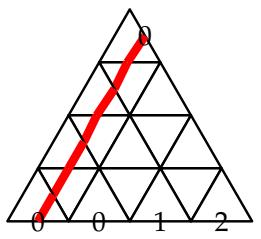

In other words, that first SW/NE diagonal must consist of a at the SW end A

followed as one goes Northeast by (where j is some other label, possibly blank,

that’s not drawn on the picture). Then we apply the induction hypothesis to the puzzle with the completed diagonal removed, noting that the content of the new NW side is that of the old one minus a blank.

If we iterate this process, we’ll eventually reach the case where ${ \mathrm {  ~ i ~ } } > { \mathrm {  ~ k , } }$ i.e., the NE side is entirely made of blanks. We then repeat the same argument but using the rightmost bottom label i (which, by monotonicity of ω, is also $> \mathsf { k }$ ): it must go to the NW side and its only endpoint is the rightmost edge of the NW side. We finally obtain

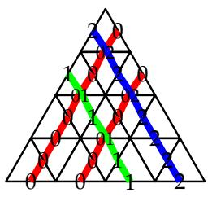

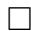

Note that nothing we have discussed so far depended on the normalizations of $\check { \mathsf { R } } _ { 1 , 2 } ( z ) .$ , $\mathrm { U } ( z )$ (which are the building blocks for puzzles). We will need to fix them now in order to satisfy property (b): indeed Proposition 3 says that

$$
e _ {\omega} ^ {*} \mathbf {P} | _ {[ \bigotimes_ {i = 1} ^ {n} V _ {1} ^ {A} (q ^ {\alpha} z _ {i}) ] \omega_ {>} \otimes [ \bigotimes_ {i = 1} ^ {n} V _ {2} ^ {A} (q ^ {- \alpha} z _ {i}) ] \omega_ {\leq}} = C e _ {\omega_ {>} ^ {*}} ^ {*} \otimes e _ {\omega_ {\leq}} ^ {*}
$$

where C is the fugacity of the unique puzzle of the Proposition.

In the present context of separated descents, all our matrices are of type A, which means $\check { \mathsf { R } } _ { 1 , 2 } ( z )$ coincides with (12) up to normalization. We fix the latter by specifying that $\check { \mathsf { R } } _ { 1 , 2 } ( z ) _ { \mathrm { i j } } ^ { \mathrm { m l } } = 1$ for $\mathfrak { i } = \mathfrak { l } \neq \mathfrak { j } = \mathfrak { m } ,$ i.e., with the convenient parametrization $z = { \mathfrak { q } } ^ { - 2 } z ^ { \prime } / z ^ { \prime \prime } .$ ,

$$
\check {R} _ {1, 2} (z) _ {i j} ^ {m l} = \left\langle \begin{array}{l} m \\ i \\ j \end{array} \right\rangle = \left\{ \begin{array}{l l} \frac {q (1 - z)}{1 - q ^ {2} z} & i = j = m = l \\ 1 & i = l \neq j = m \\ - q \frac {(1 - q ^ {2}) z}{1 - q ^ {2} z} & i = m <   j = l \\ - q ^ {- 1} \frac {1 - q ^ {2}}{1 - q ^ {2} z} & i = m > j = l \\ 0 & \text {e l s e} \end{array} \right.
$$

Similarly, starting from factorization property (7), we find that $\mathrm { U } ( z )$ is given by

$$
U (z) _ {a} ^ {i j} = \bigtriangleup_ {a} ^ {i j} = \left\{ \begin{array}{l l} 0 & a \neq i j \\ 1 & i > j \\ - q & i <   j \end{array} \right.
$$

up to normalization, which we fix according to the above formula.

Then ${ \mathrm { ~ C ~ } } = 1$ , and property (b) is satisfied with $\omega _ { 1 } = \omega _ { > } , \omega _ { 2 } = \omega _ { \leq } , \omega _ { 3 } = \omega$ . The corresponding weights are of the form that is discussed at the end of $\ S 3 . 1$ .

We also include $\mathrm { D } ( z )$ for reference, since it appears in nonequivariant puzzles:

$$
D (z) _ {i j} ^ {a} = \bigvee_ {i} \bigvee_ {j} ^ {a} = \left\{ \begin{array}{l l} 0 & a \neq i j \\ 1 & i <   j \\ - q ^ {- 1} & i > j \end{array} \right.
$$

At this stage, we’ve got the setup of §2 working for separated descents; this means that Theorem $3 ^ { \prime }$ applies here, providing a puzzle formula for the product of the pullbacks of two motivic Segre classes of Schubert cells of partial flag varieties $\mathcal { F } _ { 1 }$ and $\mathcal { F } _ { 2 }$ (where the dimensions of $\mathcal { F } _ { 1 }$ are less of equal to those of $\mathcal { F } _ { 2 }$ ) to their common refinement ${ \mathcal { F } } _ { 3 } ,$ where the fugacities of the puzzle pieces are given by the entries of Rˇ, U, D right above.

These generic equivariant puzzles have the simple interpretation that they are colored lattice paths, where the lattice is triangular and the paths go Southwest or Southeast with the only constraint that they cannot share edges (in particular, they are allowed to cross

at horizontal edges). Nonequivariant generic puzzles are the subset of them in which no two lines of the same color cross, and no horizontal edge is empty.

Example 4. There are three nonequivariant puzzles with sides $\lambda = . 2 . 2 , \mu = 1 0 _ { -- } , \nu = 2 1 2 0$ :

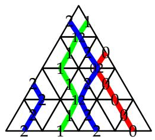

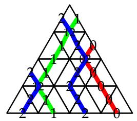

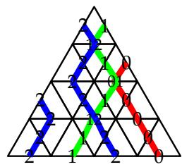

Note that these puzzles contain triangles that are not allowed by Theorem 1, even in Ktheory. As an application of Theorem 5, we compute

$$
\chi \left(g p _ {1} ^ {- 1} \left(X _ {\circ} ^ {2. 2}\right) \cap g ^ {\prime} p _ {2} ^ {- 1} \left(X _ {\circ} ^ {1 0 -}\right) \cap g ^ {\prime \prime} X _ {\circ} ^ {0 2 1 2}\right) = 3
$$

Indeed, given three flags pointi ⊂ linei ⊂ planei $\subset \mathbb { P } ^ { 3 }$ , we have

So $9 \mathsf { p } _ { 1 } ^ { - 1 } ( \mathsf { X } ^ { \ - 2 \ - 2 } ) \cap \mathsf { g } ^ { \prime } \mathsf { p } _ { 2 } ^ { - 1 } ( \mathsf { X } ^ { 1 0 _ { - } } ) \cap \mathsf { g } ^ { \prime \prime } \mathsf { X } ^ { 0 2 1 2 }$ is isomorphic to the variety of lines in $\mathbb { P } ^ { 3 }$ that intersect two given lines in general position (the point being determined by the line as the intersection of that line with plane2), that is to $\bar { \mathbb { P } } ^ { 1 } \times \mathbb { P } ^ { 1 }$ . In particular it is of dimension 2 which fixes the sign in Theorem 5. Next we substract divisors by inclusion/exclusion:

e2})

de plane3})

and find

$$
g p _ {1} ^ {- 1} \left(X _ {\circ} ^ {- 2, 2}\right) \cap g ^ {\prime} p _ {2} ^ {- 1} \left(X _ {\circ} ^ {1 0 -}\right) \cap g ^ {\prime \prime} X ^ {0 2 1 2} \cong \mathbb {P} ^ {1} \times \mathbb {P} ^ {1} - 6 \mathbb {P} ^ {1} + 1 1 \text {p o i n t s}
$$

where in this last equation, the r.h.s. is in the sense of constructible functions. One finds the desired Euler characteristic $2 \times 2 - 6 \times 2 + 1 1 = 3$ .

3.3. The B-matrix. With a view towards the ${ \mathfrak { q } } \to 0$ limit, we now introduce the B-matrix. It acts on a $( \mathrm { d } + 4 )$ -dimensional space, generated by the usual Cartan generators $x _ { \mathrm { i } } , \mathrm { i } \in$ $\{ 0 < \cdots < \mathrm { k } < \ldots < \mathrm { k } + 1 < \cdots < \mathrm { d } \} _ { \mathrm { } } .$ , as well as y1, y2.

We define B to be the skew-symmetric form satisfying

We now check that B satisfies the hypothesis of Lemma 2. We compute $\mathsf { B } \left( \boldsymbol { w } \mathsf { t } \left( \boldsymbol { e } _ { \mathrm { a , i } } \right) , \boldsymbol { w } \mathsf { t } \left( \boldsymbol { e } _ { \mathrm { a , j } } \right) \right)$ case by case:

• ${ \mathfrak { a } } = 1$ : the weights are $x _ { \mathrm { i } } + y _ { \mathrm { l } }$ where $\mathfrak { i } \in \{ 0 < \cdots < \mathfrak { k } < \mathfrak { j } ,$ and one finds

$$
B (x _ {i} + y _ {1}, x _ {j} + y _ {1}) = \left\{ \begin{array}{l l} B (x _ {i}, x _ {j}) = \operatorname {s i g n} (i - j) & i, j \neq - \\ B (x _ {i}, y _ {1}) = - 1 & i \neq -, j = - \\ B (y _ {1}, x _ {j}) = 1 & i = -, j \neq - \\ 0 & i = j = - \end{array} \right.
$$

• ${ \mathfrak { a } } = 2$ : the weights are ${ \mathfrak { x } } _ { \mathrm { i } } + { \mathfrak { y } } _ { 2 }$ where $\mathfrak { i } \in \{ - < \mathtt { k } + 1 < \cdot \cdot \cdot < \mathtt { d } \} ,$ and similarly

$$
B (x _ {i} + y _ {2}, x _ {j} + y _ {2}) = \left\{ \begin{array}{l l} B (x _ {i}, x _ {j}) = \operatorname {s i g n} (i - j) & i, j \neq - \\ B (x _ {i}, y _ {2}) = 1 & i \neq -, j = - \\ B (y _ {2}, x _ {j}) = - 1 & i = -, j \neq - \\ 0 & i = j = - \end{array} \right.
$$

• ${ \mathfrak { a } } = 3$ : the weights are ${ x _ { \mathrm { i } } + x _ { \mathrm { - } } + y _ { 1 } + y _ { 2 } }$ where $\mathfrak { i } \in \{ 0 < \cdot \cdot \cdot < \mathfrak { k } < \mathfrak { k } + 1 < \cdot \cdot \cdot < \mathfrak { d } \} ,$ and one finds

$$
\mathrm {B} \left(x _ {i} + x _ {-} + y _ {1} + y _ {2}, x _ {j} + x _ {-} + y _ {1} + y _ {2}\right) = \mathrm {B} \left(x _ {i}, x _ {j}\right) = \operatorname {s i g n} (i - j)
$$

We are now in a position to take the limit ${ \mathsf q } \to 0$ .

3.4. The limit ${ \mathsf q } \to 0$ : nonequivariant puzzles. For pedagogical reasons we perform the limit ${ \mathsf q } \to 0$ twice, first on U and D only, then on $\check { \mathsf { R } } _ { 1 , 2 }$ .

In order to twist with $\Omega = { \bf q } ^ { \frac { 1 } { 2 } { \mathrm B } }$ , we compute the inversion charges of every triangle; we list up-pointing triangles, only, since inversion charge is invariant under $1 8 0 ^ { \circ }$ rotation:

$$
\operatorname {i n v} (\bigwedge_ {i} ^ {i}) = \operatorname {i n v} (\bigwedge_ {i} ^ {i}) = \operatorname {i n v} (\bigwedge_ {i j} ^ {j _ {i}}) = 0 \quad i <   j
$$

$$
\operatorname {i n v} (\bigoplus_ {i j} ^ {i}) = 1
$$

The twisted intertwiners take the form

$$
\tilde {U} (z) _ {a} ^ {i j} = \bigtriangleup_ {a} ^ {i j} = \left\{ \begin{array}{l l} 0 & a \neq i j \\ 1 & i > j \\ - q ^ {2} & i <   j, i \neq \text {- a n d} j \neq \text {-} \\ - q & i <   j, i = \text {- o r} j = \text {-} \end{array} \right.
$$

$$
\tilde {D} (z) _ {i j} ^ {a} = \bigvee_ {i} \begin{array}{c} a \\ j \end{array} = \left\{ \begin{array}{l l} 0 & a \neq i j \\ 1 & i <   j \\ - 1 & i > j, i \neq \_ \text {a n d} j \neq \_ \\ - q ^ {- 1} & i > j, i = \_ \text {o r} j = \_ \end{array} \right.
$$

Now perform the following change of basis:

$$
\text {i n} V _ {1}: \quad e _ {1, i} ^ {\prime} = - q ^ {- 1} e _ {1, i} \text {f o r} i \leq k
$$

$$
\text {i n} V _ {2}: \quad e _ {2, j} ^ {\prime} = - q ^ {- 1} e _ {2, j} \text {f o r} j \geq k + 1 \tag {15}
$$

$$
\text {i n} V _ {3}: \quad e _ {3, i j} ^ {\prime} = - q ^ {- 1} e _ {3, i j} \text {w h e n} i, j \leq k \text {o r} i, j \geq k + 1
$$

all other basis vectors remaining unchanged. Note that none of the labels above occur on the boundary of puzzles, so the fugacity of the puzzle is unaffected by such transformations.

We find:

$$
\tilde {U} ^ {\prime} (z) _ {a} ^ {i j} = \bigtriangleup_ {a} ^ {i j} = \left\{ \begin{array}{l l} 0 & a \neq i j \\ 1 & i > j \text {o r} i = \_ \text {o r} j = \_ \\ - 1 & i <   \_ <   j \\ - q ^ {2} & i <   j <   \_ \text {o r} \_ <   i <   j \end{array} \right.
$$

$$
\tilde {D} ^ {\prime} (z) _ {i j} ^ {a} = \bigvee_ {i} \bigvee_ {j} ^ {a} = \left\{ \begin{array}{l l} 0 & a \neq i j \\ 1 & i <   j \text {o r} i = - \text {o r} j = - \\ - 1 & i > j > - \text {o r} - > i > j \\ - q ^ {2} & i > - > j \end{array} \right.
$$

At this stage, we can safely take the limit ${ \mathfrak { q } } \to 0$ , resulting in the triangles (including K-triangles) of Theorem 1.

3.5. The limit ${ \mathsf q } \to 0$ : equivariant puzzles. We now repeat the procedure for $\check { \mathsf { R } } _ { 1 , 2 }$ . Here are the inversion charges of the equivariant rhombi:

$$
\operatorname {i n v} \left\langle \right. = - 1
$$

$$
\operatorname {i n v} \left( \begin{array}{c c} i & i \\ i & i \end{array} \right) = 1 \quad i \neq -
$$

Twisting the R-matrix results in

$$
\tilde {R} _ {1, 2} (z) _ {i j} ^ {m l} = \left\langle \begin{array}{l} m \\ i \\ j \end{array} \right\rangle = \left\{ \begin{array}{l l} \frac {q (1 - z)}{1 - q ^ {2} z} \left\{ \begin{array}{l l} q ^ {- 1} & i = - \\ q & \text {e l s e} \end{array} \right. & i = j = m = l \\ \left\{ \begin{array}{l l} 1 & i <   j \text {o r} i = - \text {o r} j = - \\ q ^ {2} & \text {e l s e} \end{array} \right. & i = l \neq j = m \\ \frac {(1 - q ^ {2}) z}{1 - q ^ {2} z} \left\{ \begin{array}{l l} - q & i <   j, i = - \text {o r} j = - \\ - q ^ {2} & i <   j, \text {e l s e} \\ - q ^ {- 1} & i > j, i = - \text {o r} j = - \\ - 1 & i > j, \text {e l s e} \end{array} \right. & i = m \neq j = l \\ 0 & \text {e l s e} \end{array} \right.
$$

We then perform the change of basis above (15), and find the final form:

$$
\tilde {R} _ {1, 2} ^ {\prime} (z) _ {i j} ^ {m l} = \left\langle \begin{array}{l} m \\ i \\ j \end{array} \right\rangle = \left\{ \begin{array}{l l} \frac {1 - z}{1 - q ^ {2} z} \left\{ \begin{array}{l l} 1 & i = - \\ q ^ {2} & \text {e l s e} \end{array} \right. & i = j = m = l \\ \left\{ \begin{array}{l l} 1 & i <   j \text {o r} i = - \text {o r} j = - \\ q ^ {2} & \text {e l s e} \end{array} \right. & i = l \neq j = m \\ \frac {1 - q ^ {2}}{1 - q ^ {2} z} \left\{ \begin{array}{l l} - q ^ {2} z & i <   j <   - \text {o r} - <   i <   j \\ - z & i <   - <   j \\ - 1 & j <   i <   - \text {o r} - <   j <   i \\ - q ^ {2} & j <   - <   i \\ z & i = - <   j \text {o r} i <   j = - \\ 1 & j = - <   i \text {o r} j <   i = - \end{array} \right. & i = m \neq j = l \\ 0 & \text {e l s e} \end{array} \right.
$$

At ${ \mathfrak { q } } = 0 ,$ ,

$$
\left( \begin{array}{l} m \\ i \\ j \end{array} \right) = \left\{ \begin{array}{l l} 1 - z & i = j = m = l = _ {-} \\ 1 & i = l \neq j = m, i <   j \text {o r} i = _ {-} \text {o r} j = _ {-} \\ - z & i = m <   _ {-} <   j = l \\ - 1 & j = l <   i = m <   _ {-} \text {o r} _ {-} <   j = l <   i = m \\ z & j = l, i = m, i = _ {-} <   j \text {o r} i <   j = _ {-} \\ 1 & j = l, i = m, j = _ {-} <   i \text {o r} j <   i = _ {-} \\ 0 & \text {e l s e} \end{array} \right.
$$

which coincides with the equivariant fugacities of Theorem 1.

# 4. ALMOST-SEPARATED DESCENTS

4.1. The data from $\ S 2 . 1$ . The algebra is $\mathcal { U } _ { \mathfrak { q } } \big ( \mathfrak { s o } _ { 2 ( \mathfrak { d } + 2 ) } [ z ^ { \pm } ] \big )$ , which has three minuscule representations $\mathbb { C } ^ { 2 ( \mathrm { d } + 2 ) }$ , spin+, spin−, corresponding to the tail and the two antlers of the Dynkin diagram $\mathrm { D } _ { \mathrm { d } + 2 }$ . We use the standard Cartan subalgebra $\mathfrak { h } : = \oplus ^ { \mathtt { d } + 2 } \mathfrak { s o } _ { 2 } \ \leq \ \mathfrak { g } \ =$ $\mathfrak { s o } _ { 2 ( \mathrm { d } + 2 ) } ,$ , naming its co ¨ordinates $[ 0 , \mathrm { d } ] \sqcup \{ \_ \}$ .

Our three representations and their weights are

<table><tr><td>i</td><td>Vi</td><td colspan="2">its weights</td></tr><tr><td>1</td><td>spin+</td><td>{1/2(±1, ±1, ..., ±1)}</td><td>with evenly many -</td></tr><tr><td>2</td><td>(spin-)*</td><td>{1/2(±1, ±1, ..., ±1)}</td><td>with oddly many +</td></tr><tr><td>3</td><td>C2(d+2)</td><td>{±xi: i ∈ [0, d] ∪ {-}</td><td>}</td></tr></table>

so when we add a weight of ${ \mathfrak { s p i n } } _ { + }$ to a weight of $( s p i n _ { - } ) ^ { * }$ we get an integer vector, whose total is an odd integer (hence has a chance to be a weight of $\mathbb { C } ^ { 2 ( \mathrm { d } + 2 ) } ,$ ). Take $\alpha = \mathrm { d }$ . For notational convenience let $\vec { 1 } : = ( 1 , \ldots , 1 )$ denote the all-1s vector.

To specify a Borel subalgebra (or a positive Weyl chamber) we indicate7 which of $\{ + x , -$ $x _ { i } \} _ { i \in [ 0 , \mathrm { d } ] \sqcup \{ - \} }$ are positive, and then, the order on the positive ones. As the answer is somewhat unintuitive we put off specifying it until later, when it will be more uniquely determined.

The ${ V } _ { \mathrm { i } } ^ { \mathrm { A } }$ faces (as required in §2.3) are determined by maximizing dot product with the following coweights:

$$
\begin{array}{c c c c} x _ {<   k} & x _ {k} & x _ {> k} & x _ {-} \end{array}
$$

• $\mathfrak { \eta } _ { 1 } = \big ( \begin{array} { l l l } & { 1 ^ { \mathrm { k } } , } & { 1 , } &  3 ^ { \mathrm { d - k } } , - 1 \big ) \end{array}$ $\begin{array} { r } { \boldsymbol { \eta } _ { 1 } = \left( \begin{array} { r l } { } & { { } 1 ^ { \mathrm { k } } } \end{array} \right. } \end{array}$ , so ${ \sf V } _ { 1 } ^ { \sf A }$ has weights $\{ \vec { 1 } / 2 - ( x _ { \mathrm { i } } + x _ { - } ) \colon \mathrm { i } \in [ 0 , \mathbf { k } ] \} \sqcup \{ \vec { 1 } / 2 \}$   
• $\mathfrak { \eta } _ { 2 } = \left( - 3 ^ { \mathrm { k } } , - 1 , - 1 ^ { \mathrm { d - k } } , - 1 \right)$ , so $\mathsf { V } _ { 2 } ^ { \mathsf { A } }$ has weights $\{ - \vec { 1 } / 2 + x _ { \mathrm { i } } \colon \mathrm { i } \in [ \mathbf { k } , \mathbf { d } ] \sqcup \{ - \} \}$   
• $\mathfrak { \eta } _ { 3 } = ( - 2 ^ { \mathrm { k } } , ~ 0 , ~ 2 ^ { \mathrm { d - k } } , - 2 )$ , so $\mathsf { V } _ { 3 } ^ { \mathsf { A } }$ has weights $\{ - x _ { \mathrm { i } } \colon \mathrm { i } < \mathsf { k } \} \sqcup \{ + x _ { \mathrm { i } } \colon \mathrm { i } > \mathsf { k } \} \sqcup \{ - x _ { \mathrm { - } } \}$

We have again managed that $\eta _ { 3 } = \eta _ { 1 } + \eta _ { 2 }$ (though not for any useful reason we could come up with). If we give that up, the 0 can in fact be changed to $+ 2$ or $- 2 ,$ , enlarging the third face, but doing so doesn’t get us any extra Schubert calculus in the end.

The way that we draw the weights of $\mathrm { V } _ { 1 , 2 , 3 }$ as edge labels is slightly complicated, and was optimized to have the nicest-looking puzzles.

• On / edges with weight $+ \overrightarrow { 1 } / 2 - \sum _ { \mathrm { i } \in \mathbb { R } } x _ { \mathrm { i } } ,$ we draw the set R (except for ).

Since we know $\# \mathsf { R }$ to be even, we can infer whether is or isn’t in R even though it isn’t drawn. To get the right order, we need $- x _ { 0 } < - x _ { 1 } < . . . < - x _ { \mathrm { k } } < + x _ { \mathrm { \ell } }$ .

• On \ edges with weight $- \bar { \vec { 1 } } / 2 + \sum _ { \mathrm { i } \in \mathsf { S } } \mathsf { x } _ { \mathrm { i } } ,$ we draw the set S (except for ).

Since we know $\# S$ to be odd, we can infer whether is or isn’t in S even though it isn’t drawn. To get the right order, we need $+ x _ { - } < + x _ { \mathrm { k } } < + x _ { \mathrm { k } + 1 } < \ldots < + x _ { \mathrm { d } }$ .

• On − edges with weight $+ x _ { \mathrm { j } }$ we draw $\nearrow \mathbf { j }$ (or even if $\mathrm {  ~ j ~ } = \mathrm {  ~ \underline { ~ } } _ { - } \mathrm {  ~ \Gamma ~ }$ ), and with weight $- x _ { \mathrm { j } }$ we draw $\searrow 1$ (or odd if $\dot { 1 } = \mathbf { \Phi } _ { - }$ ). To get the right order, we need

$$
- x _ {0} <   - x _ {1} <   \dots <   - x _ {k - 1} <   - x _ {-} <   + x _ {k + 1} <   \dots <   + x _ {d}.
$$

Combining these conditions, we get a consistent set of inequalities

$$
\begin{array}{l} x _ {0} > x _ {1} > \dots > x _ {k - 1} \\ > x _ {k} > \pm x _ {-} \\ x _ {d} > x _ {d - 1} > \dots > x _ {k + 1} \\ \end{array}
$$

One of the many ways to achieve this is to take all the $x _ { \mathrm { i } }$ positive (including x ) and order them $0 , \ldots , \ k - 1 , \mathrm { d } , \ldots , \ k ,$ decreasing.

Had we not made the x label blank, it would need to appear on every edge on the NW boundary of a puzzle.

In a triangular puzzle piece we will have $\begin{array} { r } { \left( \vec { 1 } / 2 - \sum _ { \mathrm { i } \in \mathbb { R } } x _ { \mathrm { i } } \right) + \left( - \vec { 1 } / 2 + \sum _ { \mathrm { i } \in \mathbb { S } } x _ { \mathrm { i } } \right) = \pm x _ { \mathrm { j } } , } \end{array}$ so ${ \mathsf { R } } \cap { \mathsf { S } } = \operatorname* { m i n } ( { \mathsf { R } } , { \mathsf { S } } ) \subsetneq \operatorname* { m a x } ( { \mathsf { R } } , { \mathsf { S } } ) = { \mathsf { R } } \cup { \mathsf { S } }$ and the difference is by the one element j.

We check (c), (d), having proven (a) in general. Let $\vec { 9 } : = \vec { 1 } / 2 - x .$ for short. Using our strange order $0 , \ldots , \operatorname { k } - 1 , \mathrm { d } , \ldots , \operatorname { k } ,$ on co ¨ordinates, we have

${ \mathsf { V } } _ { 1 } ^ { \mathsf { A } . }$ ’s weights:

Their differences:

${ \mathsf { V } } _ { 2 } ^ { \mathsf { A } . }$ ’s weights:

Their differences:

${ \mathsf { V } } _ { 3 } ^ { \mathsf { A } . }$ ’s weights:

Their differences:

and in each case the differences form a type $\boldsymbol { \mathsf { A } }$ root subsystem, as needed for the weak version of (c).

To see (d), consider three weights $\boldsymbol { \omega } _ { 1 } + \boldsymbol { \omega } _ { 2 } = \boldsymbol { \omega } _ { 3 }$ with $\omega _ { \mathrm { i } }$ a sum of n weights from ${ V } _ { \mathrm { i } } ^ { \mathrm { A } }$ . Ignoring the $\pm \vec { 1 } / 2$ summands (of which there will obviously be n in $\omega _ { 1 }$ canceling −n in $\omega _ { 2 , }$ ) we get $\omega _ { 1 }$ is −mx minus a sum of m ${ \tt x } _ { \mathrm { i } < { \tt k } } { \tt S }$ (for some $\mathfrak { m } \leq \mathfrak { n }$ ), and $\omega _ { 2 }$ is $\mathfrak { m } ^ { \prime } \mathfrak { x }$ plus a sum of $\mathrm { n } - \mathrm { m } ^ { \prime }$ many $x _ { \mathrm { j } \geq \mathsf { k } } s$ (for some $\mathfrak { m } ^ { \prime } \leq \mathfrak { m } )$ ), totaling $\omega _ { 1 } + \omega _ { 2 }$ which is then a sum of

$\mathsf { n } - ( \mathsf { m } - \mathsf { m } ^ { \prime } ) \mathsf { m a n y } \pm \mathsf { x } _ { \mathrm { i } }$ $\pm x _ { \mathrm { i } }$ minus $( \mathsf { m } - \mathsf { m } ^ { \prime } ) \boldsymbol { x } _ { - }$ . To verify property (d) we compute the three standard parabolics, each of which is a group of block-upper-triangular matrices.

$$
\begin{array}{l} P _ {1} ^ {\prime} \text {s b l o c k s} = \left(\sum_ {i = 0} ^ {k - 1} c _ {i}, \quad c _ {k}, \quad c _ {k + 1}, \dots , c _ {d}\right) \\ \mathrm {P} _ {2} ^ {\prime} \mathrm {s b l o c k s} = \left(c _ {0}, \dots , c _ {k - 1}, \quad c _ {k}, \quad \sum_ {i = k + 1} ^ {d} c _ {i}\right) \\ \mathrm {P} _ {3} ^ {\prime} \mathrm {s b l o c k s} = \left(c _ {0}, \dots , c _ {k - 1}, c _ {k}, c _ {k + 1}, \dots , c _ {d}\right) \quad \text {s o} \mathrm {P} _ {3} = \mathrm {P} _ {1} \cap \mathrm {P} _ {2} \\ \end{array}
$$

4.2. The intertwiners. We now describe the intertwiners $\check { \sf R } _ { 1 , 2 } , \ u$ and D, which are the building blocks of our puzzles. Our reference for this section is [Oka90].

In order to help with the conversion to the unusual labeling of weights of §4.1, we introduce the bijection

$$
w (0, \dots , k - 1, d, \dots , k, \_) := (1, \dots , k, k + 1, \dots , d, d + 1, d + 2) \tag {16}
$$

Write $\tilde { x } _ { \mathrm { j } } = x _ { w ^ { - 1 } \left( \mathrm { j  } }\right)$ . Then the simple roots of ${ \mathfrak { g } } = { \mathfrak { d } } _ { \mathfrak { d } + 2 }$ are $\alpha _ { \mathrm { j } } = \tilde { x } _ { \mathrm { j } } - \tilde { x } _ { \mathrm { j + 1 } } , \mathrm { j } = 1 , \ldots , \mathrm { d } ,$ and $\alpha _ { \pm } = \tilde { \gamma } _ { \mathrm { d } + 1 } \pm \tilde { \gamma } _ { \mathrm { d } + 2 }$ . spinǫ is the fundamental module with highest weight $\begin{array} { r } { \omega _ { \epsilon } = \frac 1 2 ( \tilde { x } _ { 1 } + \cdot \cdot \cdot + } \end{array}$ $\tilde { { \boldsymbol { x } } } _ { \mathrm { d } + 1 } + \epsilon \tilde { { \boldsymbol { x } } } _ { \mathrm { d } + 2 } )$ , the other fundamental weights are $\omega _ { \mathrm { j } } = \tilde { x } _ { 1 } + \cdot \cdot \cdot + \tilde { x } _ { \mathrm { j } } , \mathrm { j } = 1 , \ldots , \mathrm { d }$ . We also introduce the notation $W _ { \mathrm { j } }$ for the irreducible module with highest weight $\tilde { { \boldsymbol { x } } } _ { 1 } + \cdots + \tilde { { \boldsymbol { x } } } _ { \mathrm { d } + 2 - \mathrm { j } } ,$ that is $\omega _ { \mathrm { d } + 2 - j }$ if $1 < \mathrm { j } < \mathrm { d } + 2 , \omega _ { + } + \omega _ { - }$ if $j = 1$ , $2 \omega _ { + }$ if $\mathrm { j } = 0$ .

Recall that ${ \mathsf { V } } _ { 1 } = { \mathsf { s p i n } } _ { + }$ and $\mathsf { V } _ { 2 } = ( \mathsf { s p i n \_ } ) ^ { * }$ . According to [Oka90, Eq. (4.2)], one has the $\mathcal { U } _ { \mathfrak { q } } ( { \mathfrak { g } } )$ -module8 decomposition

$$
\operatorname {s p i n} _ {+} \otimes \operatorname {s p i n} _ {-} ^ {*} = W _ {\mathrm {d} + 1 \bmod 2} \oplus \dots \oplus W _ {\mathrm {d} - 1} \oplus W _ {\mathrm {d} + 1}
$$

In particular $W _ { \mathrm { d } + 1 } \cong V _ { 3 }$ as $\mathcal { U } _ { \mathfrak { q } } ( { \mathfrak { g } } )$ -modules.

The R-matrix from spin $_ + \otimes$ spin∗− to spin∗− ⊗ spin+ is given in terms of operators $\mathsf { P _ { j } }$ which are $\mathcal { U } _ { \mathfrak { q } } ( { \mathfrak { g } } )$ -intertwiners implementing the channels $s \mathrm { p i n } _ { + } \otimes s \mathrm { p i n } _ { - } ^ { * } \to W _ { \mathrm { j } } \to s \mathrm { p i n } _ { - } ^ { * } \otimes$ $_ + \otimes$ spin $^ +$ : [Oka90, §5]

$$
\check {\mathrm {R}} _ {1, 2} (z) = c (z) ^ {- 1} \sum_ {\substack {j = 0 \\ j \equiv d + 1 \pmod{2}}} ^ {d + 1} \rho_ {j} (z) P _ {j} \tag{17}
$$

Here we have introduced an extra normalization factor $\mathtt { c } ( z )$ which will be fixed below. The functions $\rho _ { \mathrm { j } } ( z )$ are given by

$$
\rho_ {j} (z) = \left\{ \begin{array}{l l} \prod_ {\substack {i = 1 \\ (j - 1) / 2}} ^ {j / 2} (q ^ {2 i - 1} - q ^ {- 2 i + 1} z) \prod_ {\substack {i = j / 2 + 1}} ^ {(d + 1) / 2} (q ^ {2 i - 1} z - q ^ {- 2 i + 1}) & j \text {even}, d \text {odd} \\ \prod_ {\substack {i = 1}} ^ {j / 2} (q ^ {2 i} - q ^ {- 2 i} z) \prod_ {\substack {i = (j + 1) / 2}} ^ {d / 2} (q ^ {2 i} z - q ^ {- 2 i}) & j \text {odd}, d \text {even} \end{array} \right.
$$

Note that all $\rho _ { \mathrm { j } } ( z )$ with $\mathrm { j } < \mathrm { d } + 1$ have a factor of $\mathsf { q } ^ { 2 \mathrm { i } - 1 } z - \mathsf { q } ^ { - 2 \mathrm { i } + 1 }$ for $\mathfrak { i } = ( \mathrm { d } + 1 ) / 2$ (d odd), resp. $\mathsf { q } ^ { 2 \mathrm { i } } - \mathsf { x q } ^ { - 2 \mathrm { i } }$ for ${ \mathfrak { i } } = \mathrm { d } / 2$ (d even), but $\rho _ { \mathrm { d } + 1 } ( z )$ doesn’t. This implies that $\check { \mathsf { R } } _ { 1 , 2 } ( z = \mathsf { q } ^ { - 2 \mathrm { d } } )$ is proportional to $\mathsf { P } _ { \mathrm { d } + 1 }$ and therefore the factorization (7) occurs at $\alpha = \mathrm { d }$ . Because $\check { \mathsf { R } } _ { 1 , 2 } \mathopen { } \mathclose \bgroup ( z =$ $\mathsf { q } ^ { - 2 \mathrm { d } } )$ is a $\mathcal { U } _ { \mathfrak { q } } ( \mathfrak { g } [ z ^ { \pm } ] )$ -intertwiner, its image is $\mathcal { U } _ { \mathfrak { q } } ( \mathfrak { g } [ z ^ { \pm } ] )$ -invariant and isomorphic to $V _ { 3 } ( z )$ as a $\mathcal { U } _ { \mathfrak { q } } ( { \mathfrak { g } } [ z ^ { \pm } ]$ -module (there is some arbitrariness in shifting $z \mapsto \mathbf { a } z$ which is fixed by this statement); and therefore we can choose U, D to be $\mathcal { U } _ { \mathfrak { q } } ( \mathfrak { g } [ z ^ { \pm } ] )$ -intertwiners themselves, as in (6).

In fact, one has the following expression for U and D, derivable from the explicit expression of the Pj given in [Oka90, Prop. 5.1]:

$$
\left\langle \epsilon \tilde {x} _ {i}, U (a _ {1}, \dots , a _ {i - 1}, \epsilon / 2, a _ {i}, \dots , a _ {d + 1}) \otimes \right.
$$

$$
\left. \left(- a _ {1}, \dots , - a _ {i - 1}, \epsilon / 2, - a _ {i}, \dots , - a _ {d + 1}\right) \right\rangle = c _ {\mathrm {U}} (- q) ^ {M} \tag {18}
$$

$$
\left\langle \left(a _ {1}, \dots , a _ {i - 1}, \epsilon / 2, a _ {i}, \dots , a _ {d + 1}\right) \otimes \right.
$$

$$
\left. \left(- a _ {1}, \dots , - a _ {i - 1}, \epsilon / 2, - a _ {i}, \dots , - a _ {d + 1}\right), D \epsilon \tilde {x} _ {i} \right\rangle = c _ {D} (- q) ^ {- M} \tag {19}
$$

$$
M:= \sum_{\substack{1\leq j\leq d + 1\\ a_{j} = -1 / 2}}(d + 1 - j)
$$

where vectors are (provisionally) described by their weights, $\mathfrak { a } \in \{ + 1 / 2 , - 1 / 2 \} ^ { \mathrm { d } + 1 }$ and $\epsilon \in \{ + 1 , - 1 \}$ . We shall convert to the labeling of $\ S 4 . 1$ below. The constants $c _ { \mathrm { U } }$ and $c _ { \mathrm { D } }$ will also be fixed below.

Remark 4. As soon as ${ \mathrm { d } } \geq 3$ , the R-matrix (17) has more than 2 terms in its decomposition. This seems somehow related to the lack of an equivariant rule for Schubert classes, as already pointed out in [KZJ17, §1.3] in the context of 3-step Schubert calculus.

# 4.3. Proof of property (b).

Proposition 4. There is a unique puzzle with a weakly increasing string ω at the ω bottom, and λ (resp. µ) with content $\omega _ { \leq } ( r e s p . \stackrel { \cdot \cdot } { \omega } _ { \geq } ) ;$ ; it has $\lambda = \omega _ { \leq } a n d \mu = \omega _ { \geq } ,$ and its labels on diagonal edges are constant along each diagonal (NW/SE or NE/SW).

Proof. Labels form paths that go E, NE or SE. In particular, the path ending on the leftmost bottom edge must come from the leftmost NW edge; and then inductively, because NW edges can only carry a single label, every path ending on the bottom edge must go straight SE. A similar reasoning holds for paths starting on the bottom edge; at this stage we have the following configuration:

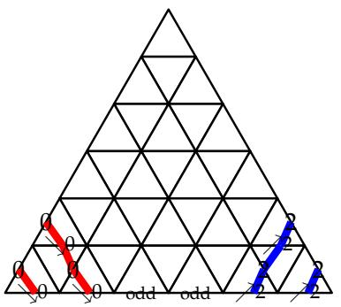

Next, there must an odd number of labels on the sides of the remaining bottom triangles. Because of the content of $\lambda$ and $\mu ,$ only labels k can be used; this means that this odd set of labels is the singleton k. There is then a unique way to complete this into a path labeled k; and we can iterate the process, resulting in the unique puzzle

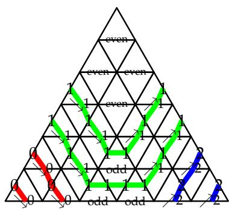

We now fix the normalizing constant $\mathsf { c } ( z )$ in (17) by requiring that the puzzle in the Proposition above have a fugacity of 1. We have the following

Lemma 3. Define

$$
c (z) := \left\{ \begin{array}{l l} \prod_ {\substack {i = 1 \\ d / 2}} ^ {(d + 1) / 2} (q ^ {2 i - 2} z - q ^ {- 2 i + 2}) & d o d d \\ \prod_ {i = 1} ^ {} (q ^ {2 i - 1} z - q ^ {- 2 i + 1}) & d e v e n \end{array} \right.
$$

as well as $\mathrm { c } _ { \mathrm { U } } = \mathrm { c } _ { \mathrm { D } } = 1$ . Then the fugacity of every rhombus and triangle contributing to the puzzle of Proposition 4 is 1.

Proof. Let us pick for example the blank rhombus (the same reasoning applies to all other rhombi in the puzzle, resulting in the same fugacity). Denote $\mathbf { a } _ { \mathrm { j } , \mathrm { d } + 1 } = \langle \boldsymbol { \bar { x } } _ { \mathrm { - } } \otimes \boldsymbol { { x } } _ { \mathrm { - } } , \mathsf { P } _ { \mathrm { j } } \boldsymbol { { x } } _ { \mathrm { - } } \otimes \boldsymbol { { x } } _ { \mathrm { - } } \rangle$ where we emphasize the dependence on d. According to [Oka90, Eq. (5.13)], the following recurrence relation holds:

$$
a _ {j, \ell} = f (- j + 1) a _ {j - 1, \ell - 1} + f (j + 1) a _ {j + 1, \ell - 1}
$$

$$
a _ {j, \ell} = 0 \quad j <   0 \text {o r} j > \ell
$$

$$
f (j) = \left\{ \begin{array}{l l} 1 & j = 0 \\ (- 1) ^ {j + 1} / (q ^ {j} + q ^ {- j}) & j > 0 \\ (- 1) ^ {j} / (q ^ {j} + q ^ {- j}) & j <   0 \end{array} \right.
$$

This recurrence can be easily solved; writing $[ \mathsf { m } ] = \mathsf { q } ^ { \mathsf { m } } - \mathsf { q } ^ { - \mathsf { m } }$ , one has

$$
a _ {j, \ell} = (- 1) ^ {\lfloor j / 2 \rfloor} \frac {\prod_ {i = 1} ^ {\lceil \ell / 2 \rceil} [ 2 i - 1 ]}{\prod_ {i = 1} ^ {(\ell - j) / 2} [ 2 i ] \prod_ {i = \lceil (\ell + 1) / 2 \rceil} ^ {(\ell + j) / 2} [ 2 i ]} \left\{ \begin{array}{l l} \frac {[ 2 j ]}{[ j ]} & j > 0 \\ 1 & j = 0 \end{array} \right. \quad j \equiv \ell \pmod {2}
$$

Finally, consider

$$
c(z) - \sum_{\substack{j = 0\\ j\equiv d + 1\pmod{2}}^{d + 1}}\rho_{j}(z)  a_{j,d + 1}
$$

where $\mathsf { c } ( z )$ is given as in the Lemma. This is a polynomial of degree at most $\lceil \mathrm { d } / 2 \rceil$ in $z ,$ and its evaluation at $z = { \mathsf { q } } ^ { - 2 { \mathsf { d } } + 4 \mathrm { i } }$ , $\mathfrak { i } = 0 , . . . , \lceil \mathrm { d } / 2 \rceil ,$ is easily seen to be zero. Therefore it is zero and

$$
\left\langle x _ {-} \otimes x _ {-}, \check {R} _ {1, 2} (z) x _ {-} \otimes x _ {-} \right\rangle = 1
$$

The analysis is simpler for the bottom row of up-pointing triangles. There are three types of triangles, which we convert to the notation of (18):

• i where $\begin{array} { r } { \mathrm { i } < \mathrm { k } , } \end{array}$ with fugacity ${ \Big \langle } { - } x _ { \mathrm { i } } , { \mathsf { U } } ( { \textstyle \frac { 1 } { 2 } } { \vec { \mathsf { I } } } - x _ { \mathrm { i } } - x _ { \mathrm { - } } ) \otimes ( - { \textstyle \frac { 1 } { 2 } } { \vec { \mathsf { I } } } + x _ { \mathrm { - } } ) { \Big \rangle } .$   
ց i• oddk k with fugacity ${ \Big \langle } { - } \mathfrak { x } _ { \mathrm { d } + 2 } , \mathrm { U } ( \textstyle \frac { 1 } { 2 } \vec { 1 } - \mathfrak { x } _ { \mathrm { k } } - \mathfrak { x } _ { \mathrm { - } } ) \otimes ( - \textstyle \frac { 1 } { 2 } \vec { 1 } + \mathfrak { x } _ { \mathrm { k } } ) { \Big \rangle } .$   
where j > k, with fugacity $\Big \langle x _ { \mathrm { j } } , \mathsf { U } ( \textstyle \frac { 1 } { 2 } \vec { \mathsf { I } } ) \otimes ( { - \frac { 1 } { 2 } \vec { \mathsf { I } } + x _ { \mathrm { j } } } ) \Big \rangle .$

Paying attention to the ordering of the labels, one checks in each case from (18) that the matrix entry is 1 provided $\mathfrak { c } _ { \mathrm { { U } } } = 1$ . Imposing $\check { \mathsf { R } } _ { 1 , 2 } ( z = \mathsf { q } ^ { - 2 \mathrm { d } } ) = \mathsf { D } \mathsf { U }$ also fixes ${ \mathfrak { c } } _ { \mathrm { { D } } } = 1$ . 

This concludes the proof of all the required properties of §2, which means Theorem $3 ^ { \prime }$ provides us with a puzzle formula for the product of the pullbacks of two (equivariant) motivic Segre classes in $\mathcal { F } _ { 1 }$ and $\mathcal { F } _ { 2 }$ (where the flag dimensions satisfy the “almost separated descent” condition, i.e., the overlap of dimensions of $\mathcal { F } _ { 1 }$ and $\mathcal { F } _ { 2 }$ is at most 2) to their common refinement $\mathcal { F } _ { 3 }$ . We have not provided the explicit fugacities of the rhombi (the entries of $\check { \mathsf { R } } _ { 1 , 2 }$ ), though they can be extracted from [Oka90, §5]. In what follows, we only ever consider the nonequivariant case of the theorem, which requires the knowledge of the entries of U and D only, given in (18) and (19) respectively.

Such nonequivariant generic puzzles can be described as follows: they are colored lattice paths going East, NorthEast or SouthEast, with only two constraints: paths of the same color cannot touch, and in a given triangle at most one path can deviate from the horizontal.

Furthermore, note that in the limit to ordinary cohomology (given by setting q to −1), the fugacities of all triangles become 1, so that ${ \mathfrak { c } } _ { \sigma } ^ { \pi \rho }$ is simply the number of puzzles with sides π, ρ, σ.

Example 5. Consider $\pi = 1 5 3 4 2$ and $\rho = 2 1 4 3 5$ , with ${ \cal O } ( \pi , \rho ) = \{ 2 , 3 \}$ :

$$
\begin{array}{c c c c c c c} \pi & & 1 & 5 & 3 & 4 & 2 \\ \omega_ {A} & & \overline {{}} & \overline {{}} & 2 & 3 & 4 \\ \omega_ {C} & & \searrow 0 & \searrow 1 & \text {o d d} & \nearrow 3 & \nearrow 4 \\ \omega_ {B} & & 0 & 1 & 2 & \overline {{}} & \overline {{}} \\ \rho & & 2 & 1 & 4 & 3 & 5 \end{array}
$$

Let us also choose $\sigma = 1 3 2 5 4 .$ , so the corresponding strings are $\lambda = 1 0 . 2 \mathrm { . , ~ } \mu = . 4 2 3 \mathrm { . }$ $\overleftarrow { \boldsymbol { v } } = \nearrow 3 \nearrow 4 \searrow 1$ odd 0; there are 3 nonequivariant generic puzzles:

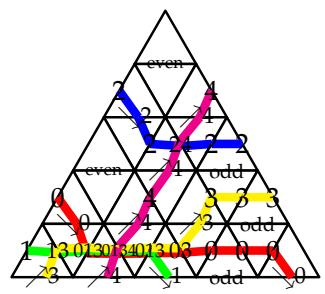

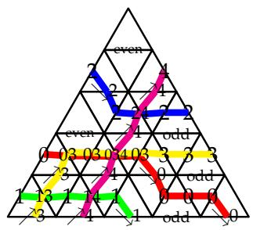

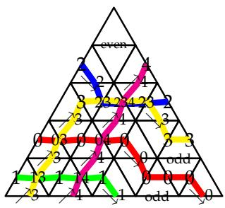

One can check that the triple intersection of the rotated preimage of the Schubert cell $X _ { \circ } ^ { \pi }$ in $\mathsf { G r } ( 1 , 2 , 3 ; 5 )$ (resp. $X _ { \mathrm { { o } } } ^ { \rho }$ in $\mathsf { G r } ( 2 , 3 , 4 ; 5 ) \rangle$ and of the Schubert cell $X _ { \circ } ^ { \sigma }$ in the full flag variety of $\mathbb { C } ^ { 5 }$ is a $\mathbb { P } ^ { 1 }$ minus 5 points, which has Euler characteristic −3, as predicted by Theorem 5.

4.4. The B-matrix. Let B be the skew-symmetric form with

$$
\mathrm {B} \left(x _ {\mathrm {i}}, x _ {\mathrm {j}}\right) = \operatorname {s i g n} (\mathrm {i} - \mathrm {j})
$$

$$
\mathrm {B} \left(x _ {\mathrm {i}}, x _ {-}\right) = 0
$$

$$
\mathrm {B} (x _ {i}, y _ {1}) = \frac {d + 1}{2} - i
$$

$$
B (x _ {-}, y _ {1}) = \frac {1}{2}
$$

$$
B (x _ {i}, y _ {2}) = i - \frac {d - 1}{2}
$$

$$
B (x _ {-}, y _ {2}) = - \frac {1}{2}
$$

$$
B (y _ {1}, y _ {2}) = - \frac {d}{2}
$$

where $\mathfrak { i , j } = 0 , \ldots , \mathtt { d }$

Once again, we need to check Lemma 2. To help with the calculation, we first calculate

$$
B (\vec {1} / 2 + y _ {1}, x _ {i}) = - 1 / 2
$$

$$
i = 0, \dots , d
$$

$$
B (- \vec {1} / 2 + y _ {2}, x _ {i}) = - 1 / 2
$$

We then compute $\mathsf { B } \left( { w } \mathsf { t } ( e _ { \mathrm { a , i } } ) , { w } \mathsf { t } ( e _ { \mathrm { a , j } } ) \right)$ case by case:

• ${ \mathfrak { a } } = 1$ : the weights are $\vec { 1 } / 2 - ( x _ { \mathrm { i } } + x _ { \mathrm { - } } ) + y _ { 1 }$ for $\mathfrak { i } = 0 < \dots < \mathtt { k }$ and $\vec { 1 } / 2 + \ y _ { 1 }$ for $\dot { \iota } = .$ $( > \mathsf { a l l } )$ :

$$
\begin{array}{l} B (\vec {1} / 2 - (x _ {i} + x _ {-}) + y _ {1}, \vec {1} / 2 - (x _ {j} + x _ {-}) + y _ {1}) = B (\vec {1} / 2 - x _ {-} + y _ {1}, x _ {j}) + B (x _ {i}, \vec {1} / 2 - x _ {-} + y _ {1}) + B (x _ {i}, x _ {j}) \\ = \operatorname {s i g n} (i - j) \\ \end{array}
$$

$$
B (\vec {1} / 2 - (x _ {i} + x _ {-}) + y _ {1}, \vec {1} / 2 + y _ {1}) = 1 / 2 + 1 / 2 = 1
$$

• ${ \mathfrak { a } } = 2$ : the weights are $- { \vec { 1 } } / 2 + x _ { \mathrm { i } } + y _ { 2 }$ for $\mathfrak { i } = \_ < \mathfrak { k } < \cdot \cdot \cdot < \mathrm { d }$

$$
B \left(- \vec {1} / 2 + x _ {-} + y _ {2}, - \vec {1} / 2 + x _ {i} + y _ {2}\right) = - 1 / 2 - 1 / 2 = - 1
$$

$$
\begin{array}{l} B \left(- \vec {1} / 2 + x _ {i} + y _ {2}, - \vec {1} / 2 + x _ {j} + y _ {2}\right) = B \left(\vec {1} / 2 + y _ {2}, x _ {j}\right) + B \left(x _ {i}, \vec {1} / 2 + y _ {2}\right) + B \left(x _ {i}, x _ {j}\right) i, j \neq - \\ = \operatorname {s i g n} (i - j) \\ \end{array}
$$

• ${ \mathfrak { a } } = 3$ : the weights are $- x _ { \mathrm { i } } + y _ { 1 } + y _ { 2 } , \mathrm { i } = 0 < \dots < \mathrm { k } - 1 , - x _ { \scriptscriptstyle - } + y _ { 1 } + y _ { 2 }$ for $\ i = \ o { \mathrm { o } } \mathrm { d } \mathrm { d }$ (which for ordering purposes is like k), and $+ x _ { \mathrm { i } } + y _ { 1 } + y _ { 2 }$ for $\mathfrak { i } = \mathfrak { k } + 1 < \cdot \cdot \cdot < \mathfrak { d }$ .

$$
B \left(- x _ {i} + y _ {1} + y _ {2}, - x _ {j} + y _ {1} + y _ {2}\right) = \operatorname {s i g n} (i - j)
$$

$$
B \left(- x _ {i} + y _ {1} + y _ {2}, - x _ {-} + y _ {1} + y _ {2}\right) = - 1
$$

$$
B \left(x _ {i} + y _ {1} + y _ {2}, - x _ {-} + y _ {1} + y _ {2}\right) = + 1
$$

$$
B \left(- x _ {i} + y _ {1} + y _ {2}, x _ {j} + y _ {1} + y _ {2}\right) = 1 - 2 = - 1 \quad i <   k <   j
$$

$$
B \left(x _ {i} + y _ {1} + y _ {2}, x _ {j} + y _ {1} + y _ {2}\right) = \operatorname {s i g n} (i - j)
$$

4.5. The limit ${ \mathsf q } \to 0$ . We are now ready to perform the limit ${ \mathfrak { q } } \to 0$ . We start from the expressions (18) and (19) for U and D. Define for convenience

$$
r (X) = \sum_ {j \in X} (d + 1 - w (j))
$$

where w was defined in (16). More explicitly

$$
r (X) = r _ {<  } (X) + r _ {>} (X) \quad r _ {<  } (X) = \sum_ {a \in X, a <   k} (d - a) \quad r _ {>} (X) = \sum_ {a \in X, a > k} (a - k)
$$

This allows us to rephrase the matrix entries of U and D in terms of the “unintuitive” indexing of §4.1.

We focus on U first. Since all entries are powers of $- \mathbf { q } ,$ , we only write those powers below:

$$
\begin{array}{l} \log_ {- q} U _ {\searrow i} ^ {i X, X} = \log_ {- q} i \xrightarrow [ ]{X} r (X) + \# \{a \in X: w (a) > w (i) \} \\ = r (X) + \left\{ \begin{array}{l l} \# \{a \in X: a > i \} & i <   k \\ \# \{a \in X: k \leq a <   i \} & i \geq k \end{array} \right. \\ \end{array}
$$

$$
\begin{array}{l} \log_ {- q} U _ {\nearrow j} ^ {X, X j} = \log_ {- q} \bigwedge_ {\nearrow j} X j = r (X) + \# \{a \in X: w (a) > w (j) \} \\ = r (X) + \left\{ \begin{array}{l l} \# \{a \in X: a > j \} & j <   k \\ \# \{a \in X: k \leq a <   j \} & j \geq k \end{array} \right. \\ \end{array}
$$

$$
\begin{array}{l} \log_ {- q} U _ {e v e n} ^ {X, X} = \log_ {- q} \bigwedge_ {e v e n} ^ {X, X} = r (X) \\ \log_ {- q} U _ {\text {o d d}} ^ {X, X} = \log_ {- q} \bigoplus_ {\text {o d d}} ^ {X} X = r (X) \\ \end{array}
$$

Next we are supposed to apply the twist, and conjugate the matrices. For reasons which will become clear below, it is more convenient to apply those two (commuting) operations in the reverse order. Introduce two more notations:

$$
s _ {<  } (X) := \# \{a \in X, a <   k \}
$$

$$
s _ {\geq} (X) := \# \{a \in X, a > k \}
$$

The change of basis is then given by:

$$
\text {i n} V _ {1}: \quad e _ {1, X} ^ {\prime} = (- q) ^ {\lfloor s _ {<  } (X) ^ {2} / 4 \rfloor + \lceil s _ {<  } (X) s _ {\geq} (X) / 2 \rceil - \lfloor (s _ {\geq} (X) - 1) ^ {2} / 4 \rfloor} e _ {1, X}
$$

$$
\text {i n} V _ {2}: \quad e _ {2, X} ^ {\prime} = (- q) ^ {\lfloor (s _ {<  } (X) - 1) ^ {2} / 4 \rfloor + \lceil (s _ {<  } (X) - 1) s _ {\geq} (X) / 2 \rceil - \lfloor (s _ {\geq} (X) - 1) ^ {2} / 4 \rfloor} e _ {2, X} \tag {20}
$$

$$
\text {i n} V _ {3}: \quad e _ {3, \nearrow i} ^ {\prime} = (- q) ^ {r <   (i)} e _ {3, \nearrow i} \text {a n d} e _ {3, \searrow i} ^ {\prime} = (- q) ^ {r > (i)} e _ {3, \searrow i}
$$

Note that none of the basis vectors in $\mathsf { V } _ { \mathrm { a } } ^ { \mathrm { A } }$ are affected by such a transformation.

It is a tedious but elementary exercise to check that after this conjugation, the powers of −q look like

$$
\begin{array}{l} \log_ {- q} U _ {\searrow i} ^ {\prime i X, X} = \log_ {- q} i \bigotimes_ {\searrow i} X = \sum_ {a \in X: a <   i} (- 1) ^ {[ a <   k ]} \\ = \left\{ \begin{array}{l l} - \# \{a \in X: a <   i \} & i <   k \\ - \# \{a \in X: a <   k \} + \# \{a \in X: k \leq a <   i \} & i \geq k \end{array} \right. \\ \end{array}
$$

$$
\begin{array}{l} \log_ {- q} U _ {\nearrow j} ^ {\prime X, X j} = \log_ {- q} \bigvee_ {\nearrow j} X j = \# \{a \in X: a > j \} (- 1) ^ {[ j \geq k ]} \\ \log_ {- q} U _ {e v e n} ^ {\prime X, X} = \log_ {- q} \bigvee_ {e v e n} ^ {X} = - \# X / 2 \\ \log_ {- q} U _ {\text {o d d}} ^ {\prime X, X} = \log_ {- q} \bigotimes_ {\text {o d d}} ^ {X} = - (\# X - 1) / 2 \\ \end{array}
$$

where [true] := 1, [false] := 0.

Finally, we apply the twist by computing the inversion charges of triangles; one has from $\ S 4 . 4$

$$
\mathrm {B} (e _ {2, Y}, e _ {1, X}) = \frac {1}{2} \sum_ {x \in X, y \in Y} \operatorname {s i g n} (x - y) + \frac {1}{8} ((- 1) ^ {\# X} + (- 1) ^ {\# Y}) + \frac {1}{4} (\# X + \# Y - 1)
$$

so that

$$
\begin{array}{l} \operatorname {i n v} (\bigwedge_ {\text {p a r i t y (\# X)}} ^ {\mathsf {X}}) = \frac {1}{4} (- 1) ^ {\# X} + \frac {1}{2} \# X - \frac {1}{4} = \lfloor \# X / 2 \rfloor \\ \operatorname {i n v} (\biguplus_ {\underset {\sim} {X}} \biguplus_ {i}) = \frac {1}{2} \sum_ {y \in X} \operatorname {s i g n} (i - y) + \frac {1}{2} \# X = \# \{y \in X: y <   i \} \\ \operatorname {i n v} (\bigwedge_ {\lambda \atop j} ^ {X}) = \frac {1}{2} \sum_ {x \in X} \operatorname {s i g n} (x - j) + \frac {1}{2} \# X = \# \{x \in X: x > j \} \\ \end{array}
$$

This matches with what was announced in (5).

After twisting, the entries of U will acquire an extra power of q, which we write as $( - 1 ) \times ( - { \sf q } )$ , and set aside the $( - 1 ) ^ { \mathrm { i n v } }$ , resulting in:

$$
\tilde {U} ^ {\prime i X, X} _ {\searrow i} = i \bigotimes_ {\searrow i} X = (- 1) ^ {\text {i n v}} (- q) ^ {2 \# \{a \in X: k \leq a <   i \}}
$$

$$
\tilde {\mathsf {U}} _ {e v e n} ^ {\prime \mathrm {X}, \mathrm {X}} = \bigwedge_ {e v e n} ^ {\mathrm {X}} = (- 1) ^ {\mathrm {i n v}}
$$

$$
\tilde {\mathsf {U}} _ {\nearrow j} ^ {\prime X, X j} = \bigwedge_ {\nearrow j} ^ {X j} = (- 1) ^ {\text {i n v}} (- q) ^ {2 \# \{a \in X: a > j \} [ j <   k ]}
$$

$$
\tilde {\mathcal {U}} _ {\mathrm {o d d}} ^ {\prime X, \mathsf {X}} = \bigwedge_ {\mathrm {o d d}} ^ {\mathsf {X}} = (- 1) ^ {\mathrm {i n v}}
$$

which clearly leads at ${ \mathfrak { q } } \to 0$ to the rule as stated in Theorem 2.

We must perform the same calculation for D. Comparing the entries (19) of D to those (18) of U, we note that the powers of $- \mathbf { q }$ are opposite. Furthermore, changes of basis affect U and D in opposite ways, so the same fact holds for the modified entries $\mathrm { U } ^ { \prime }$ and $\mathsf { D } ^ { \prime }$ . On the other hand, the twist of a down pointing triangle is the same as that of its

180 degree rotated/arrow reverted version, and it affects U and D identically; so we only have to redo the last step of the computation for D, and we obtain

$$
\tilde {D} _ {X, i X} ^ {\prime \backslash , i} = \overbrace {x \sqrt [ x ]{i x}} ^ {i} = (- 1) ^ {\text {i n v}} (- q) ^ {2 \# \{a \in X: a <   \min  (i, k) \}}
$$

$$
\tilde {D} _ {X j, X} ^ {\prime \nearrow j} = \overbrace {x ; \sqrt [ n ]{x}} ^ {\nearrow j} = (- 1) ^ {\text {i n v}} (- q) ^ {2 \# \{a \in X: a > j \} [ j \geq k ]}
$$

$$
\tilde {\mathrm {D}} _ {X, X} ^ {\prime \text {e v e n}} = \bigvee_ {X} ^ {\text {e v e n}} = (- 1) ^ {\text {i n v}} (- q) ^ {\# X}
$$

$$
\tilde {D} _ {X, X} ^ {\prime \mathrm {o d d}} = \overbrace {x} ^ {\mathrm {o d d}} x = (- 1) ^ {\mathrm {i n v}} (- q) ^ {\# X - 1}
$$

Again, we recover at ${ \mathsf q } \to 0$ the K-pieces of Theorem 2.

# 5. COMPARISON OF PUZZLE RULES

5.1. Separated-descent vs. Grassmannian puzzles. Grassmannian puzzles [KT03] are based on the algebra ${ \mathfrak { a } } _ { 2 }$ (this fact was known as early as [ZJ09], though it was only properly explained in [KZJ17]); separated descent puzzles are based on ${ \mathfrak { a } } _ { \mathrm { d } + 1 }$ . Furthermore, the separated descent condition o $\nu e r ( \pi , \rho ) \leq 1$ is implied by the more restrictive Grassmannian condition $\mathsf { d e s c } ( \pi , \rho ) \leq 1$ . Therefore one expects a relation between the two rules.

Indeed, there is a simple bijection that converts Knutson–Tao puzzles to separated descent puzzles (with ${ \sf k } = 0$ , $\mathrm { d } = 1$ ): replace edge labels as follows

Grassmannian: 0 1 10 0 1 10 0 1 10nt: 1 0 0 1 0 1 01 Separated desce

The triangles match

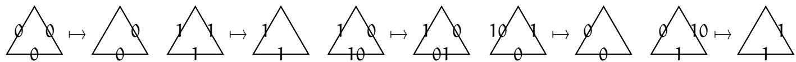

and similarly for down-pointing triangles; the K-triangle [Vak06] becomes

$$
\bigoplus_ {1 0} ^ {1 0} \bigoplus_ {1 0} ^ {1 0} \mapsto \bigoplus_ {0 1} ^ {0}
$$

while the generic puzzle rule also allows for the corresponding down-pointing triangle; and the equivariant rhombus becomes

$$
\left\langle \begin{array}{l} 0 \\ 1 \\ 0 \end{array} \right\rangle \mapsto \left\langle \begin{array}{l} 1 \\ 0 \end{array} \right\rangle
$$

while the generic puzzle rule as stated in [KZJ21, §4.1] also allows

$$
\left( \begin{array}{l} 1 0 \\ 0 \\ 0 \\ 1 0 \end{array} \right) \mapsto \left( \begin{array}{l} 0 \\ 0 \\ 0 \end{array} \right) \quad \left( \begin{array}{l} 1 \\ 1 0 \\ 1 \end{array} \right) \mapsto \left( \begin{array}{l} 1 \\ 1 \\ 1 \end{array} \right)
$$

One can check that all fugacities match the various versions of the rule.

The original 0, 10, 1 labeling makes evident the $Z _ { 3 }$ -symmetry of the rule computing the coefficients $\int _ { \mathsf { G r } ( \mathsf { k } ; \mathsf { n } ) } \mathsf { S } ^ { \lambda } \mathsf { S } ^ { \mathsf { \mu } } \mathsf { S } ^ { \mathsf { v } }$ (although the question itself enjoys $S _ { 3 }$ -symmetry). The new

0, 1, 2, 01, 02, 12 labeling is more natural in the sense that it displays the conservation laws (the continuity of the colored pipes) more explicitly.

5.2. Almost separated descent vs. 2-step puzzles. In a similar vein, 2-step puzzles [BKPT16] are based on ${ \mathfrak { d } } _ { 4 }$ [KZJ17], almost separated descent puzzles are based on $\mathfrak { d } _ { \mathrm { d } + 2 } ,$ and the almost separated descent condition over $\left( \pi , \rho \right) \leq 2$ is implied by the 2-step condition de $\operatorname { \varepsilon } s c ( \pi , \rho ) \leq 2$ .

We can once again convert 2-step puzzle labels (with ${ \mathrm { k } } = 1$ , ${ \mathrm { d } } = 2$ ) using the following dictionary:

<table><tr><td>2-step:</td><td>∅</td><td>1/</td><td>2</td><td>10</td><td>20</td><td>21</td><td>2(10)</td><td>(21)0</td></tr><tr><td>Almost separated descent:</td><td>∅</td><td>1/</td><td>/</td><td>01</td><td>02</td><td>2</td><td>1/2</td><td>01/2</td></tr><tr><td>2-step:</td><td>∅</td><td>1/</td><td>2</td><td>10</td><td>20</td><td>21</td><td>2(10)</td><td>(21)0</td></tr><tr><td>Almost separated descent:</td><td>\</td><td>1/</td><td>2</td><td>0</td><td>02</td><td>12</td><td>012</td><td>01</td></tr><tr><td>2-step:</td><td>-0</td><td>-1</td><td>-2</td><td>-10</td><td>-20</td><td>-21</td><td>2(10)</td><td>(21)0</td></tr><tr><td>Almost separated descent:</td><td>\ y0</td><td>odd</td><td>λ2</td><td>y1</td><td>even</td><td>λ1</td><td>λ0</td><td>y2</td></tr></table>

Example 6. The example $\mathbf { c } _ { 0 2 1 0 } ^ { 0 1 0 2 , 0 2 0 1 }$ of [KZJ17, §1.2] becomes

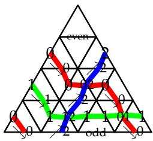

We now list the K-pieces according to Theorem 2:

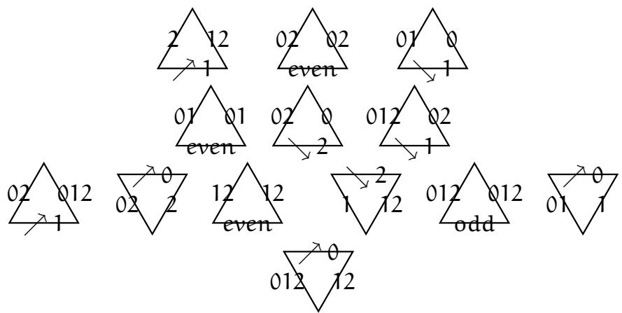

If one compares with the list in [KZJ17, Thm. 2], one finds that the two sets of pieces are related by the duality that takes a triangle to its mirror image with labels inverted according to $\mathrm { i } \mapsto 2 - \mathrm { i }$ . As already noted in §1.5, there is also a duality of almost separated descent puzzles (mirror image combined with $\mathfrak { i } \mapsto \mathfrak { d } - \mathfrak { i } )$ ; it generalizes the duality of 2-step puzzles, in the sense that duality commutes with the bijection of labels described

above. It is therefore the dual K-theoretic almost-separated descent puzzle rule which generalizes the $\mathrm { d } = 2$ rule that is stated in [KZJ17, Thm. 2].

5.3. Separated descent vs. almost separated puzzles. The almost separated descent rule applies to any pairs of permutations $\pi$ and $\rho$ with ove $\lceil \pi , \rho \rceil \leq 2$ (adding gratuitous nondescents if $\mathsf { o v e r } ( \pi , \rho ) < 2 )$ , so it looks like it supersedes the separated descent rule which only covers the cases $\mathsf { o v e r } ( \pi , \rho ) \leq 1$ . A few comments should be made:

• Although this statement is strictly true at the level of motivic Segre classes, once one takes the limit ${ \mathfrak { q } } \to 0$ , only the separated descent rule allows preserving equivariance (and therefore, a rule for double Schubert polynomials).   
• As already mentioned in $\ S 1 . 5 ,$ because the two rules have the strings $\lambda$ and $\mu$ switched between Northwest and Northeast sides, there is little hope of a bijection between them – also, almost-separated descent puzzles tend to look significantly more complicated.

We illustrate the last point below. But first we must decide, when ove $\operatorname { \varepsilon } r ( \pi , \rho ) = 1$ , where to add the gratuitous nondescent: in principle there are multiple choices, anywhere from ρ’s second to last descent to π’s second descent. However, it is more natural to formally set it equal to their common descent: nothing prevents, in the statement of Theorem 2, from having no occurrence of the letter k (i.e., no paths crossing from the NW side to the NE side); and since the rule does not differentiate between the varous labels $\geq \ k ,$ it is simpler to reindex $\begin{array} { r } { \mathrm { i } > \mathsf { k } \mapsto \mathrm { i } - 1 , } \end{array}$ , without any change to the puzzle rule. In this case, the strings match exactly the ones from the separated descent rule, making comparison easy. (A further advantage of this choice is that it works even for generic puzzles, since the underlying partial flag varieties are the same.)

Example 7. We redo Example 1 using the almost separated descent puzzle rule:

5.4. Separated-descent vs. Grassmannian puzzles with 10s at the bottom. In [HKZJ18, Thm. 2], it was pointed out that Grassmannian puzzles can be generalized to compute products of pull-backs of Schubert classes from two different Grassmannians to a 2-step flag variety, on condition that one allow 10s on the bottom side of the puzzles (i.e., the bottom alphabet is $0 < 1 0 < 1$ ). The result is only stated in equivariant cohomology, though it works equally well in equivariant K-theory, and even more generally for motivic Segre classes; such puzzle rules fit in the framework of §2, and we skip the proof, which is yet another simple variation on the existing results.

Let π be a (Grassmannian) permutation with single descent at j, and ρ be a (Grassmannian) permutation with single descent at $\mathrm { ~ k , ~ j ~ } < \mathrm { ~ k ~ }$ . Clearly over $( \pi , \rho ) = 2 -$ in fact, $\mathsf { d e s c } ( \pi , \rho ) = 2$ so we can of course use 2-step puzzles (or almost-separated-descent puzzles) to solve this problem – but more interestingly, over $( \rho , \pi ) = { \bar { 0 } } .$ , which means this problem is also amenable to a separated-descent solution. We let the interested reader try to figure out possible bijections between these various puzzles (with the warning that there is a switch of $\pi$ and ρ between some of them).

Example 8. We use the same permutations $\pi = 2 1 3$ , $\rho = 2 3 \tau$ as in [HKZJ18, Ex. 3] except we consider equivariant K-theoretic Schubert classes. Here are the puzzles with 10s at the bottom:

as well as the corresponding 2-step puzzles:

In each case, the two puzzles have fugacity $1 - { \mathfrak { y } } _ { 2 } / { \mathfrak { y } } _ { 1 }$ and $y _ { 2 } / y _ { 1 }$ , respectively.

After switching π and ρ, we have two choices of separation of descents, leading respectively to

and

Here are the corresponding 2-step puzzles:

In the last two sets of puzzles, the fugacities are $1 - \mathfrak { y } _ { 2 } / \mathfrak { y } _ { 1 } , - ( 1 - \mathfrak { y } _ { 2 } / \mathfrak { y } _ { 1 } ) , 1$ , respectively.

5.5. Almost-separated-descent vs. 2-step puzzles with 10s/21s at the bottom. There is a 2-step version of [HKZJ18, Thm. 2], in which we allow either 10s or 21s (but not both) on the bottom side. We provide the version with 10s at the bottom (the version with 21s follows the same pattern, and can also be obtained by duality).

Let π (resp. ρ) be a permutation with descent set $\mathsf { D } ( \pi ) = \{ \mathsf { j } , \mathsf { k } \}$ (resp. $\mathsf { D } ( \mathsf { \boldsymbol { \mathsf { \rho } } } ) = \{ \mathsf { j } ^ { \prime } , \mathsf { k } \} )$ , with $\mathrm { j } > \mathrm { j } ^ { \prime }$ . We encode them with strings in $\{ 0 , 1 , 2 \}$ (though their contents are different). Then one has a product rule using 2-step puzzles (as defined in the various papers [BKPT16, KZJ17, KZJ21] depending on the cohomology theory and the choice of classes), except the bottom permutation uses the alphabet $0 < 1 0 < 1 < 2$ .

Alternatively, since $\mathsf { o r e r } ( \pi , \rho ) = 2 ,$ one can use almost-separated-descents (for equivariant motivic Segre classes; for Schubert classes, only nonequivariantly). Since there is no need to swap $\pi$ and $\rho$ in this case, a bijection might seem possible (though still nonobvious).

Example 9. Let us consider $\pi = 1 4 3 2$ and $\rho = 2 1 4 3$ , and generic nonequivariant puzzles. In the modified 2-step puzzle rule, one finds:

where the first two puzzles are ordinary nonequivariant puzzles. If instead we use almostseparated-descents, one has:

# REFERENCES

[AF24] David Anderson and William Fulton, Equivariant cohomology in algebraic geometry, Cambridge University Press, 2024, https://people.math.osu.edu/anderson.2804/ecag/index.html.   
[AGM11] Dave Anderson, Stephen Griffeth, and Ezra Miller, Positivity and Kleiman transversality in equivariant K-theory of homogeneous spaces, J. Eur. Math. Soc. (JEMS) 13 (2011), no. 1, 57–84, arXiv:0808.2785, doi:10.4171/JEMS/244. MR2735076.   
[Ass17] Sami Assaf, Multiplication of a Schubert polynomial by a Stanley symmetric polynomial, 2017, arXiv:1702.00132.   
[BKPT16] Anders S. Buch, Andrew Kresch, Kevin Purbhoo, and Harry Tamvakis, The puzzle conjecture for the cohomology of two-step flag manifolds, 2016, pp. 973–1007, arXiv:1401.1725, doi:10.1007/s10801-016-0697-3. MR3566227.   
[Bri02] Michel Brion, Positivity in the Grothendieck group of complex flag varieties, J. Algebra 258 (2002), 137–159, Special issue in celebration of Claudio Procesi’s 60th birthday.   
[BS98] Nantel Bergeron and Frank Sottile, Schubert polynomials, the Bruhat order, and the geometry of flag manifolds, Duke Math. J. 95 (1998), no. 2, 373–423. MR1652021.   
[Cha02] Vyjayanthi Chari, Braid group actions and tensor products, Int. Math. Res. Not. (2002), no. 7, 357– 382, arXiv:math/0106241, doi:10.1155/S107379280210612X. MR1883181.   
[Gin12] Victor Ginzburg, Lectures on Nakajima’s quiver varieties, Geometric methods in representation theory. I, S´emin. Congr., vol. 24, Soc. Math. France, Paris, 2012, pp. 145–219, arXiv:0905.0686.   
[GS] Daniel Grayson and Michael Stillman, Macaulay2, a software system for research in algebraic geometry, Available at http://www.math.uiuc.edu/Macaulay2/.   
[HKZJ18] Iva Halacheva, Allen Knutson, and Paul Zinn-Justin, Restricting Schubert classes to symplectic Grassmannians using self-dual puzzles, Proceedings of the 5th Conference on Formal Power Series and Algebraic Combinatorics (Ljubljana, 2019), 2018, arXiv:1811.07581.   
[Hua21] Daoji Huang, Schubert products for permutations with separated descents, 2021, arXiv:2105.01591.   
[Kir16] Anatol N. Kirillov, Notes on Schubert, Grothendieck and key polynomials, 2016, pp. Paper No. 034, 56, arXiv:1501.07337, doi:10.3842/SIGMA.2016.034.   
[Knu22] Allen Knutson, Schubert calculus and quiver varieties, Proceedings of the International Congress of Mathematicians, 2022.   
[Kog01] Mikhail Kogan, RC-graphs and a generalized Littlewood–Richardson rule, Internat. Math. Res. Notices (2001), no. 15, 765–782. MR1849481.   
[KT03] Allen Knutson and Terence Tao, Puzzles and (equivariant) cohomology of Grassmannians, Duke Math. J. 119 (2003), no. 2, 221–260, arXiv:math/0112150, doi:10.1215/S0012-7094-03-11922-5.   
[KY04] Allen Knutson and Alexander Yong, A formula for K-theory truncation Schubert calculus, Int. Math. Res. Not. (2004), no. 70, 3741–3756. MR2101981.   
[KZJ17] Allen Knutson and Paul Zinn-Justin, Schubert puzzles and integrability I: invariant trilinear forms, 2017, arXiv:1706.10019.   
[KZJ21] Schubert puzzles and integrability II: multiplying motivic Segre classes, 2021, arXiv:2102.00563.   
[MNS17] Leonardo C. Mihalcea, Hiroshi Naruse, and Changjian Su, Left Demazure-Lusztig operators on equivariant (quantum) cohomology and K-theory, 2017, arXiv:2008.12670.   
[MS05] Ezra Miller and Bernd Sturmfels, Combinatorial commutative algebra, Graduate Texts in Mathematics, vol. 227, Springer-Verlag, New York, 2005. MR2110098.   
[Nak01] Hiraku Nakajima, Quiver varieties and finite-dimensional representations of quantum affine algebras, J. Amer. Math. Soc. 14 (2001), no. 1, 145–238, arXiv:math/9912158, doi:10.1090/S0894-0347-00-00353-2. MR1808477.   
[Nak03] , Reflection functors for quiver varieties and Weyl group actions, Mathematische Annalen 327 (2003), no. 4, 671–721, doi:10.1007/s00208-003-0467-0.   
[Oka90] Masato Okado, Quantum R matrices related to the spin representations of $\mathtt { B _ { n } }$ and $\mathrm { D } _ { \mathfrak { n } }$ , Comm. Math. Phys. 134 (1990), 467–486.   
[Oko15] Andrei Okounkov, Lectures on K-theoretic computations in enumerative geometry, 2015, arXiv:1512.07363.   
[Vak06] Ravi Vakil, A geometric Littlewood–Richardson rule, Ann. of Math. (2) 164 (2006), no. 2, 371–421, Appendix A written with A. Knutson, arXiv:math.AG/0302294, doi:10.4007/annals.2006.164.371. MR2247964.

[ZJ09] Paul Zinn-Justin, Littlewood–Richardson coefficients and integrable tilings, Electron. J. Combin. 16 (2009), Research Paper 12, arXiv:0809.2392.

, The CotangentSchubert Macaulay2 package, 2021, https://www.unimelb-macaulay2.cloud.edu.au/#tut

ALLEN KNUTSON, CORNELL UNIVERSITY, ITHACA, NEW YORK

Email address: allenk@math.cornell.edu

PAUL ZINN-JUSTIN, SCHOOL OF MATHEMATICS AND STATISTICS, THE UNIVERSITY OF MELBOURNE, VICTORIA 3010, AUSTRALIA

Email address: pzinn@unimelb.edu.au