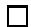

# A CLASSIFICATION OF TOPOLOGICALLY STABLE POISSON STRUCTURES ON A COMPACT ORIENTED SURFACE

OLGA RADKO

A bstra
t . Poisson stru
tures vanishing linearly on a set of smooth losed disjoint 
urves are generi
 in the set of all Poisson stru
tures on a 
ompa
t 
onne
ted oriented surfa
e. We 
onstru
t a 
omplete set of invariants 
lassifying these stru
tures up to an orientation-preserving Poisson isomorphism. We show that there is a set of non-trivial innitesimal deformations whi
h generate the se
ond Poisson 
ohomology and such that each of the deformations changes exactly one of the classifying invariants.As an example,we consider Poisson structures on the sphere whi
h vanish linearly on a set of smooth 
losed disjoint 
urves.

# 1. Introdu
tion

Re
ently several results were obtained 
on
erning the lo
al 
lassi
ation of Poisson stru
tures on a manifold. A

ording to the Splitting Theorem [10℄, the problem of lo
al 
lassi
ation 
an be redu
ed to the 
lassi
ation of stru
tures vanishing at a point. In dimension 2, V. Arnold [1℄ obtained a hierar
hy of normal forms of germs of Poisson stru
tures degenerate at a point (see also a paper by P. Monnier [6℄ for a detailed exposition.) Using the notion of the modular ve
tor eld of a Poisson stru
ture, J.-P. Dufour and A. Haraki [2℄ and Z.-J. Liu and P. Xu [5℄ obtained a 
omplete lo
al lassi
ation of quadrati
 Poisson stru
tures in dimension 3. Some results related to lo
al 
lassi
ation of Poisson stru
tures in dimensions 3 and 4 were also obtained by J. Grabowski, G. Marmo and A. M. Perelomov in [4℄.

However, not mu
h is known in relation to the global 
lassi
ation of Poisson stru
tures on a given manifold (i.e., 
lassi
ation up to a Poisson isomorphism, see [12℄ for a general dis
ussion). In this paper we give an expli
it example of a global 
lassi
ation of a 
ertain set of Poisson stru
tures on a 
ompa
t oriented surfa
e $\Sigma$ .

For a 
ompa
t 
onne
ted oriented surfa
e $\Sigma$ and $n \geq 0$ we 
onsider the set $\mathcal { G } _ { n } ( \Sigma )$ of Poisson stru
tures on $\Sigma$ whi
h vanish linearly on a set of $n$ smooth simple 
losed non-interse
ting (in short, disjoint) 
urves. In parti
ular, $\mathcal { G } _ { 0 } ( \Sigma )$ is the spa
e of symple
ti
 stru
tures. The set $\begin{array} { r } { \mathcal { G } ( \Sigma ) \doteq \bigl \lfloor _ { n \ge 0 } \mathcal { G } _ { n } ( \Sigma ) } \end{array}$ is dense in the ve
tor spa
e $\Pi ( \Sigma )$ of all Poisson stru
tures on $\Sigma$ . We 
all Poisson stru
tures in $\mathcal { G } ( \Sigma )$ topologi
al ly stable sin
e the topology of their zero sets is un
hanged under small perturbations. Lo
ally around a point on a zero

urve these stru
tures have the rst order of degenera
y in the lo
al Arnold lassi
ation.

The main result of this paper is a 
omplete 
lassi
ation of the topologially stable stru
tures $\mathcal { G } ( \Sigma )$ up to an orientation-preserving Poisson isomorphism. We 
onstru
t the set of invariants of a stru
ture $\pi \in \mathcal { G } _ { n } ( \Sigma )$ whi
h onsists of

• the topologi
al arrangement of the zero 
urves $\gamma _ { 1 } , \dots , \gamma _ { n }$ of $\pi$ taken with orientations dened by $\pi$ (up to an orientation-preserving dieomorphism);   
• the periods of the restri
tion of a modular ve
tor eld $X ^ { \omega _ { 0 } } ( \pi )$ with respe
t to a volume form $\omega _ { 0 }$ to the zero 
urves of $\pi$ ;   
• the volume invariant of $\pi$ generalizing the Liouville volume for a symple
ti
 stru
ture.

We prove that two stru
tures $\pi , \pi ^ { \prime } \in \mathcal G _ { n } ( \Sigma )$ are globally equivalent via an orientation-preserving Poisson isomorphism if and only if all the invariants for these stru
tures 
oin
ide.

The question of global equivalen
e of Poisson stru
tures by orientationreversing Poisson isomorphisms 
an be redu
ed to the orientation-preserving ase. Let $\nu : \Sigma \ \to \ \Sigma$ be an orientation-reversing dieomorphism of $\Sigma$ . Two Poisson stru
tures $\pi , \pi ^ { \prime } \in \mathcal G _ { n } ( \Sigma )$ are globally equivalent via an orientation-reversing dieomorphism i $\nu _ { * } \pi$ and $\pi ^ { \prime }$ are globally equivalent via an orientation-preserving diffeomorphism.

We 
ompute the Poisson 
ohomology of a given Poisson stru
ture $\pi \in$ $\mathcal { G } _ { n } ( \Sigma )$ on a 
ompa
t oriented surfa
e $\Sigma$ of genus $g$ . The zeroth 
ohomology (interpreted as the spa
e of Casimir fun
tions) is generated by 
onstant fun
tions and is one-dimensional. The rst 
ohomology (interpreted as the spa
e of Poisson ve
tor elds modulo Hamiltonian ve
tor elds) has dimension $2 g + n$ and is generated by the image of the rst de Rham 
ohomology of $\Sigma$ under the inje
tive homomorphism $\tilde { \pi } : H ^ { \ast } ( \Sigma ) \to H _ { \pi } ^ { \ast } ( \Sigma )$ and by the following $n$ ve
tor elds:

$$
X ^ {\omega_ {0}} (\pi) \cdot \{\text {b u m p f u n c t i o n a r o u n d} \gamma_ {i} \}, \quad i = 1, \dots n.
$$

(The map $\tilde { \pi }$ on the level of 
ohomology is indu
ed by the 
anoni
al bundle map $\tilde { \pi } : T ^ { * } \Sigma  T \Sigma$ asso
iated to the Poisson stru
ture $\pi$ in the following way: $\beta ( { \tilde { \pi } } ( \alpha ) ) ( x ) \doteq \pi ( \alpha , \beta ) ( x )$ , where $\alpha , \beta \in \Gamma ( T ^ { * } \Sigma )$ , $x \in \Sigma$ .)

The se
ond 
ohomology is generated by a non-degenerate Poisson stru
- ture $\pi _ { 0 }$ on $\Sigma$ and $n$ Poisson stru
tures of the form

$$
\pi_ {i} = \pi \cdot \{\mathrm {b u m p f u n c t i o n a r o u n d} \gamma_ {i} \}, \quad i = 1, \dots , n.
$$

Ea
h of the generators of the se
ond 
ohomology 
orresponds to a oneparameter family of innitesimal deformations of the Poisson stru
ture whi
h ae
ts exa
tly one of the numeri
 
lassifying invariants. The deformation $\pi \mapsto \pi + \varepsilon \cdot \pi _ { 0 }$ hanges the regularized Liouville volume. For ea
h $i = 1 , \ldots , n$ the deformation $\pi \mapsto \pi + \varepsilon \cdot \pi _ { i }$ hanges the modular period around the 
urve $\gamma _ { i }$ . This shows that the number of numeri
 
lassifying invariants $( n + 1 )$ for

$\mathcal { G } _ { n } ( \Sigma ) ,$ ) equals to the dimension of the se
ond Poisson 
ohomology, and is, therefore,optimal.

As an example we 
onsider the topologi
ally stable Poisson stru
tures $\mathcal { G } ( S ^ { 2 } )$ on the sphere. In this 
ase, an expli
it des
ription of the moduli spa
e of topologi
ally stable Poisson stru
tures up to an orientation-preserving Poisson isomorphism is obtained.

Sin
e topologi
ally stable Poisson stru
tures 
onsidered in the present paper have degenera
ies of the simplest kind, our work 
an be 
onsidered as a rst step in the dire
tion of global 
lassi
ation of Poisson stru
tures having higher-order degenera
ies in terms of the Arnold hierar
hy of germs of Poisson stru
tures. We plan to pursue this dire
tion in our future work.

A
know ledgement. I would like to thank my advisor, Prof. A.Weinstein, for proposing this problem and for many fruitful dis
ussions.

# 2.TOPOLOGICALLY STABLE POISSON STRUCTURES AND THEIR INVARIANTS

First we re
all the 
lassi
ation of symple
ti
 stru
tures on 
ompa
t oriented surfaces which follows from Moser's theorem.

2.1. Classi
ation of symple
ti
 stru
tures. A

ording to Darboux's theorem, all symple
ti
 stru
tures on a given manifold $M$ are lo
ally equivalent: for ea
h symple
ti
 form $\omega$ and a point $p \in \textit { M } ^ { 2 n }$ , there exist a 
oordinate system (U, x1, · · · , xn, $\begin{array} { r } { \omega = \sum _ { i = 1 } ^ { n } d x _ { i } \wedge d y _ { i } } \end{array}$ on $U$ . Therefore, the dimension of the underlying mani- $y _ { 1 } , \cdots , y _ { n }$ ) 
entered at $p$ su
h that fold is the only lo
al invariant of a symple
ti
 stru
ture.

Denition 1. Two symple
ti
 forms $\omega$ and $\omega ^ { \prime }$ on $M$ are global ly equivalent if there is a symple
tomorphism $\varphi : ( M , \omega )  ( M , \omega ^ { \prime } )$ .

In 
ertain 
ases the following theorem of Moser allows one to 
lassify symple
ti
 forms on a given manifold up to global equivalen
e:

Theorem 1. (Moser, [7℄) Let $\omega$ and $\omega ^ { \prime }$ be symple
ti
 forms on a 
ompa
t onne
ted manifold $M$ . Suppose that $[ \omega ] = [ \omega ^ { \prime } ] \in H ^ { 2 } ( M )$ and that the 2- form $\omega _ { t } \doteq ( 1 - t ) \omega + t \omega ^ { \prime }$ is symple
ti
 for ea
h $t \in [ 0 , 1 ]$ . Then there is a symple
tomorphism $\varphi : ( M , \omega )  ( M , \omega ^ { \prime } )$ .

The total Liouville volume $V ( \omega ) \doteq \int _ { M } \underbrace { \omega \wedge \cdot \cdot \cdot \wedge \omega } _ { n }$ asso
iated to a symple
ti
 stru
ture $\omega$ on $M$ is a global invariant. That is, if symple
ti
 forms $\omega$ and $\omega ^ { \prime }$ on a manifold $M$ with $\mathrm { d i m } ( M ) = 2 n$ are globally equivalent, their Liouville volumes are equal, $V ( \omega ) = V ( \omega ^ { \prime } )$ .

In the 
ase of a 
ompa
t 2-dimensional manifold Moser's theorem implies

Corollary 1. On a 
ompa
t 
onne
ted oriented surfa
e $\Sigma$ two symple
ti stru
tures $\omega$ , $\omega ^ { \prime }$ are global ly equivalent i the asso
iated Liouvil le volumes are equal: $\begin{array} { r } { \int _ { \Sigma } \omega = \int _ { \Sigma } \omega ^ { \prime } } \end{array}$ .

2.2. Des
ription of the set $\mathcal { G } ( \Sigma )$ of topologi
ally stable stru
tures on $\Sigma$ . Let $\Sigma$ be a 
ompa
t 
onne
ted oriented 2-dimensional surfa
e. Sin
e there are no non-trivial 3-ve
tor elds, any bive
tor eld gives rise to a Poisson stru
ture. Thus, Poisson stru
tures on $\Sigma$ form a ve
tor spa
e $\Pi ( \Sigma )$ .

For $n \geq 0$ let $\mathcal { G } _ { n } ( \Sigma ) \subset \Pi ( \Sigma )$ be the set of Poisson stru
tures $\pi$ on $\Sigma$ su
h that

• the zero set $Z ( \pi ) \doteq \{ p \in \Sigma | \pi ( p ) = 0 \}$ of $\pi \in { \mathcal { G } } _ { n } ( \Sigma )$ onsists of $n$ smooth disjoint 
urves $\gamma _ { 1 } ( \pi ) , \cdot \cdot \cdot , \gamma _ { n } ( \pi )$ ;   
• $\pi$ vanishes linearly on ea
h of the 
urves $\gamma _ { 1 } ( \pi ) , \cdot \cdot \cdot , \gamma _ { n } ( \pi )$

In parti
ular, $\mathcal { G } _ { 0 } ( \Sigma )$ is the set of symple
ti
 stru
tures on $\Sigma$ . Let ${ \mathcal { G } } ( \Sigma ) \doteq$ $\begin{array} { r } { \bigcup _ { n \geq 0 } \mathcal { G } _ { n } ( \Sigma ) } \end{array}$ . The symple
ti
 leaves of a Poisson stru
ture $\pi \in { \mathcal { G } } ( \Sigma )$ are the points in $\textstyle Z ( \pi ) = \bigcup _ { i = 1 } ^ { n } \gamma _ { i }$ (the 0-dimensional leaves) and the 
onne
ted omponents of $\Sigma \backslash Z ( \pi )$ (the 2-dimensional leaves.) We 
all Poisson stru
tures in $\mathcal { G } ( \Sigma )$ topologi
al ly stable sin
e the topology of their zero sets is un
hanged under small perturbations.

Unless indi
ated otherwise, throughout the paper we denote by $\omega _ { 0 }$ a symple
ti
 form 
ompatible with the orientation of $\Sigma$ and by $\pi _ { 0 }$ the 
orresponding Poisson bive
tor. Sin
e any $\pi$ an be written as $\pi = f \cdot \pi _ { 0 }$ for a fun
tion $f \in C ^ { \infty } ( \Sigma )$ , we have $\Pi ( \Sigma ) = C ^ { \infty } ( \Sigma ) \cdot \pi _ { 0 }$ . The subspa
e $\mathcal { G } _ { n } ( \Sigma )$ orresponds in this way to the produ
t $\mathcal { F } _ { n } ( \Sigma ) \cdot \pi _ { 0 }$ , where ${ \mathcal { F } } _ { n } ( \Sigma )$ is the spa
e of smooth fun
tions for whi
h 0 is a regular value and whose zero set 
onsists of $n$ smooth disjoint 
urves.

A

ording to the Elementary Transversality Theorem (see, e.g., Corollary 4.12 in [3℄), the set $\begin{array} { r } { \mathcal { F } ( \Sigma ) = \bigsqcup _ { n \geq 0 } \mathcal { F } _ { n } ( \Sigma ) } \end{array}$ of fun
tions for whi
h $0 \in \mathbb { R }$ is a regular value forms an open dense subset of $C ^ { \infty } ( \Sigma )$ in the Whitney $C ^ { \infty }$ topology. Therefore, we have the following

Proposition 1. The set of Poisson stru
tures $\mathcal { G } ( \Sigma )$ is generi
 inside of $\Pi ( \Sigma )$ , i.e. $\mathcal { G } ( \Sigma )$ is an open dense subset of the spa
e $\Pi ( \Sigma )$ of al l Poisson stru
tures on $\Sigma$ endowed with the Whitney $C ^ { \infty }$ topology.

Of 
ourse, for some sets of disjoint 
urves on a surfa
e there are no fun
- tions (and, therefore, no Poisson stru
tures) vanishing linearly on that set and not zero elsewhere. For example, su
h is the 
ase of one non-separating urve on a 2-torus.

We will use the following denition

Definition 2. Two Poisson structures $\pi$ and $\pi ^ { \prime }$ on an oriented manifold $P$ are global ly equivalent if there is an orientation-preserving Poisson isomorphism $\varphi : ( P , \pi ) \to ( P , \pi ^ { \prime } )$ .

The main goal of this paper is to 
lassify the set $\mathcal { G } ( \Sigma )$ of topologi
ally stable Poisson stru
tures up to global equivalen
e.

First, we will need the following

Lemma 1. A topologi
al ly stable Poisson stru
ture $\pi \in { \mathcal { G } } _ { n } ( \Sigma )$ denes an orientation on ea
h of its zero 
urves $\gamma _ { i } \in Z ( \pi )$ , $i = 1 , \ldots , n$ . Moreover, this

indu
ed orientation on the zero 
urves of π does not depend on the 
hoi
e of orientation of $\Sigma$

Proof. Let $\omega _ { 0 }$ be a symple
ti
 form on $\Sigma$ , and $\pi _ { 0 } = ( \tilde { \omega } _ { 0 } ^ { - 1 } \otimes \tilde { \omega } _ { 0 } ^ { - 1 } ) ( \omega _ { 0 } )$ be the orresponding Poisson bive
tor. Sin
e $\pi = f \cdot \pi _ { 0 }$ and $f$ vanishes linearly on ea
h of $\gamma _ { i } \in Z ( \pi )$ and nowhere else, $f$ has 
onstant sign on ea
h of the 2- dimensional symple
ti
 leaves of $\pi$ . In parti
ular, $f$ has the opposite signs on two leaves having a 
ommon bounding 
urve $\gamma _ { i }$ . This denes an orientation on $\gamma _ { i }$ in the following way. For a non-vanishing ve
tor eld $X$ tangent to the 
urve $\gamma _ { i }$ , we say that $X$ is positive if $\omega _ { 0 } ( X , Y ) \ge 0$ for all ve
tor elds $Y$ su
h that $L _ { Y } f \ge 0$ . We say that $X$ is negative if $- X$ is positive.

Suppose that $X$ is a ve
tor eld tangent to $\gamma _ { i }$ and positive on $\gamma _ { i }$ with respe
t to the 
hosen orientation of $\Sigma$ . If $\omega _ { 0 } ^ { \prime }$ is a symple
ti
 form indu
ing the opposite orientation on $\Sigma$ , then $\omega _ { 0 } ^ { \prime } = - \alpha \cdot \omega _ { 0 }$ with $\alpha \in C ^ { \infty } ( \Sigma )$ , $\alpha > 0$ , and $\pi = - \alpha \cdot f \cdot \pi _ { 0 }$ . Sin
e for $Y ^ { \prime }$ su
h that $L _ { Y ^ { \prime } } ( - \alpha \cdot f ) \geq 0$ we have $L _ { Y ^ { \prime } } f \leq 0$ , it follows that $\omega _ { 0 } ( X , Y ^ { \prime } ) \leq 0$ and, therefore,

$$
\omega_ {0} ^ {\prime} (X, Y ^ {\prime}) = - \alpha \cdot \omega_ {0} (X, Y ^ {\prime}) \geq 0.
$$

Hence,if $X$ is positive on $\gamma _ { i }$ with respect to a chosen orientation of $\Sigma$ ，itis also positive on $\gamma _ { i }$ with respe
t to the reverse orientation of $\Sigma$ . □

We will refer to this orientation of $\gamma _ { i } \in Z ( \pi )$ as the orientation dened by $\pi$ .

2.3. Dieomorphism equivalen
e of sets of disjoint oriented 
urves. We will use the following denition:

Denition 3. Two sets of smooth disjoint oriented 
urves $( \gamma _ { 1 } , \ldots , \gamma _ { n } )$ and $( \gamma _ { 1 } ^ { \prime } , \ldots , \gamma _ { n } ^ { \prime } )$ on an oriented surfa
e $\Sigma$ are 
alled dieomorphism equivalent (denoted by $( \gamma _ { 1 } , \dots , \gamma _ { n } ) \sim ( \gamma _ { 1 } , \dots , \gamma _ { n } ^ { \prime } ) )$ if there is an orientation-preserving dieomorphism $\varphi : \Sigma  \Sigma$ mapping the rst set onto the se
ond one and preserving the orientations of 
urves. That is to say, for ea
h $i \in { 1 , \dots , n }$ , there exists $j \in { 1 , \dots , n }$ , su
h that $\varphi ( \gamma _ { i } ) = \gamma _ { j } ^ { \prime }$ (as oriented 
urves.)

Let $\mathcal { C } _ { n } ( \Sigma )$ be the spa
e of $n$ disjoint oriented 
urves on $\Sigma$ and ${ \mathcal { M } } _ { n } ( \Sigma )$ be the moduli space of $n$ disjoint oriented curves on $\Sigma$ modulo the diffeomorphism equivalen
e relation, $\mathcal { M } _ { n } ( \Sigma ) = \mathcal { C } _ { n } ( \Sigma ) / \sim$ . For a set of disjoint oriented 
urves $( \gamma _ { 1 } , \cdots , \gamma _ { n } )$ , let $[ ( \gamma _ { 1 } , \cdot \cdot \cdot , \gamma _ { n } ) ] \in \mathcal { M } _ { n } ( \Sigma )$ denote its 
lass in the moduli spa
e ${ \mathcal { M } } _ { n } ( \Sigma )$ . If $\textstyle \bigcup _ { i = 1 } ^ { n } \gamma _ { i } \ = \ Z ( \pi )$ for a Poisson stru
ture $\pi$ , we will also write $\smash { [ Z ( \pi ) ] \ \in \ \mathcal { M } _ { n } }$ to denote the 
lass of the set of 
urves $( \gamma _ { 1 } , \ldots , \gamma _ { n } )$ taken with the orientations dened by $\pi$ .

The topology of the in
lusion $Z ( \pi ) \subset \Sigma$ and the orientations of the zero urves of a topologi
ally stable Poisson stru
ture $\pi \in { \mathcal { G } } ( \Sigma )$ are 
learly invariant under orientation-preserving Poisson isomorphisms. In other words, if $\pi , \pi ^ { \prime } \in \mathcal G _ { n } ( \Sigma )$ are globally equivalent, $[ Z ( \pi ) ] = [ Z ( \pi ^ { \prime } ) ] \in \mathcal { M } _ { n } ( \Sigma )$ .

2.4. Modular period invariants. Re
all the denition and some properties of a modular vector field of a Poisson manifold, introduced by A.Weinstein in [11℄.

Denition 4. (Weinstein, [11℄) For a volume form $\Omega$ on an orientable Poisson manifold $( P , \pi )$ the modular ve
tor eld $X ^ { \Omega }$ of $( P , \pi )$ with respe
t to $\Omega$ is dened by

$$
X ^ {\Omega} \cdot h \doteq \frac {L _ {X _ {h}} \Omega}{\Omega}, \qquad h \in C ^ {\infty} (P).
$$

Here $X _ { h } = \tilde { \pi } ( d h )$ is the hamiltonian vector field of $h$ ，where $\tilde { \pi } : T ^ { * } M \to T M$ is the 
anoni
al bundle map asso
iated to the Poisson bive
tor $\pi$ .

Modular ve
tor elds have the following properties (see [11℄ for details):

1. $X ^ { \Omega } = 0$ i $\Omega$ is invariant under the ows of all hamiltonian ve
tor elds of $\pi$ ;   
2. For any other $\Omega ^ { \prime }$ the dieren
e $X ^ { \Omega ^ { \prime } } - X ^ { \Omega }$ is the hamiltonian ve
tor eld Xlog|Ω′/Ω|; $X _ { \log | \Omega ^ { \prime } / \Omega | }$   
3. The ow of $X ^ { \Omega }$ preserves $\pi$ and $\Omega$ , i.e., $L _ { X ^ { \Omega } } \pi = 0$ and $L _ { X ^ { \Omega } } \Omega = 0$   
4. $X ^ { \Omega }$ is tangent to the symple
ti
 leaves of maximal dimension.

Let now $\pi \in \mathcal { G } _ { n } ( \Sigma )$ be a topologically stable Poisson structure on a surface $\Sigma$ as above. A symple
ti
 form $\omega _ { 0 }$ ompatible with the orientation of $\Sigma$ is also a volume form on $\Sigma$ . Sin
e the modular ve
tor eld $X ^ { \omega _ { 0 } }$ preserves $\pi$ , it follows that the restri
tion of $X ^ { \omega _ { 0 } }$ to a 
urve $\gamma _ { i } \in Z ( \pi )$ is tangent to $\gamma _ { i }$ for each $i \in { 1 , \dots , n }$ . Since for another volume form $\omega _ { 0 } ^ { \prime }$ the difference $X ^ { \omega _ { 0 } } - X ^ { \omega _ { 0 } ^ { \prime } }$ is a hamiltonian ve
tor eld and, therefore, vanishes on the zero set of $\pi$ , it follows that the restri
tions of $X ^ { \omega _ { 0 } }$ to $\gamma _ { 1 } , \cdots , \gamma _ { n }$ are independent of the hoi
e of volume form. It is apparent from the denition of the modular ve
tor eld that it is un
hanged if the orientation of the surfa
e is reversed.

Suppose that $\pi \in \Pi ( \Sigma )$ vanishes linearly on a 
urve $\gamma$ . On a small neighborhood of , let $\theta$ be the 
oordinate along the ow of the modular ve
tor $\gamma$ eld $X ^ { \omega _ { 0 } }$ with respe
t to $\omega _ { 0 }$ su
h that $X ^ { \omega _ { 0 } } = \partial _ { \theta }$ . Sin
e $\pi$ vanishes linearly on $\gamma$ , there exists an annular 
oordinate neighborhood $( U , z , \theta )$ of the 
urve $\gamma$ such that

(1)   
(2)   
(3)   
(4)

Using this 
oordinates, it is easy to verify the following

Claim 1. The restri
tion of a modular ve
tor eld to a zero 
urve $\gamma \in Z ( \pi )$ on whi
h the Poisson stru
ture vanishes linearly is positive with respe
t to the orientation on $\gamma$ dened by $\pi$ (see Lemma 1 for the denition of this orientation.)

Denition 5. (see also [8℄) For a Poisson stru
ture $\pi \in \Pi ( \Sigma )$ vanishing linearly on a 
urve $\gamma \in Z ( \pi )$ dene the modular period of $\pi$ around $\gamma$ to be

$$
T _ {\gamma} (\pi) \dot {=} \text {p e r i o d} X ^ {\omega_ {0}} | _ {\gamma},
$$

where $X ^ { \omega _ { 0 } }$ is the modular ve
tor eld of $\pi$ with respe
t to a volume form $\omega _ { 0 }$ . Sin
e $X ^ { \omega _ { 0 } } | _ { \gamma }$ is independent of 
hoi
e of $\omega _ { 0 }$ , the modular period is welldened.

Using the 
oordinate neighborhood $( U , z , \theta )$ of the 
urve $\gamma$ , we obtain

$$
T _ {\gamma} (\pi) = \frac {2 \pi}{c}, \tag {5}
$$

where $c > 0$ is as in (4.)

It turns out that the modular period of the Poisson stru
ture (4) on an annulus $U$ is the only invariant under Poisson isomorphisms:

Lemma 2. Let $U ( R ) \ = \ \{ ( z , \theta ) | | z | \ < \ R , \ \theta \ \in \ [ 0 , 2 \pi ] \}$ and $U ^ { \prime } ( R ^ { \prime } ) =$ $\{ ( z ^ { \prime } , \theta ^ { \prime } ) | | z ^ { \prime } | < R ^ { \prime } , \theta ^ { \prime } \in [ 0 , 2 \pi ] \}$ be open annuli with the orientations indu
ed by the symple
ti
 forms $\omega _ { 0 } ~ = ~ d z \wedge d \theta$ and $\omega _ { 0 } ^ { \prime } = d z ^ { \prime } \wedge d \theta ^ { \prime }$ respe
- tively. Let $\pi = c z \partial _ { z } \wedge \partial _ { \theta }$ , $c > 0$ and $\pi ^ { \prime } = c ^ { \prime } z ^ { \prime } \partial _ { z ^ { \prime } } \wedge \partial _ { \theta ^ { \prime } }$ , $c ^ { \prime } > 0$ be Poisson stru
tures on $U ( R )$ and $U ^ { \prime } ( R ^ { \prime } )$ for whi
h the modular periods around the zero 
urves $\gamma = \{ ( z , \theta ) | z = 0 \}$ and $\gamma ^ { \prime } = \{ ( z ^ { \prime } , \theta ^ { \prime } ) | z ^ { \prime } = 0 \}$ are equal, $T _ { \gamma } ( \pi ) = T _ { \gamma ^ { \prime } } ( \pi ^ { \prime } )$ . Then there is an orientation-preserving Poisson isomorphism $\Phi : ( U ( R ) , \pi ) \to ( U ^ { \prime } ( R ^ { \prime } ) , \pi ^ { \prime } )$ .

Proof. Sin
e the modular periods are equal, we have $c = c ^ { \prime }$ . The map $\Phi$ : $( U ( R ) , \pi ) \to ( U ^ { \prime } ( R ^ { \prime } ) , \pi ^ { \prime } )$ given by

$$
\Phi (z, \theta) = \left(\frac {R ^ {\prime}}{R} z, \theta\right)
$$

is a Poisson isomorphism sin
e $\begin{array} { r } { \frac { R ^ { \prime } } { R } z \cdot \frac { R } { R ^ { \prime } } \partial _ { z } \wedge \partial _ { \theta } = z \partial _ { z } \wedge \partial _ { \theta } } \end{array}$ . It is easy to see that $\Phi$ preserves the orientation. □

The fa
t that this Poisson isomorphism allows to 
hange the radius of an annuli will be used later in the proof of the classification theorem.

2.5. The regularized Liouville volume invariant. To 
lassify the topologi
ally stable Poisson stru
tures $\mathcal { G } ( \Sigma )$ up to orientation-preserving Poisson isomorphisms, we need to introdu
e one more invariant.

Let $\omega = ( \tilde { \pi } ^ { - 1 } \otimes \tilde { \pi } ^ { - 1 } ) ( \pi )$ . This form is smooth only on $\Sigma \setminus Z ( \pi )$ and defines there a symplectic structure.The symplectic volume of each of the 2-dimensional symple
ti
 leaves is innite be
ause the form $\omega$ blows up on the 
urves $\gamma _ { 1 } , \cdot \cdot \cdot , \gamma _ { n } \in Z ( \pi )$ . However, there is a way to asso
iate a 
ertain nite volume invariant to a Poisson stru
ture in $\mathcal { G } ( \Sigma )$ , given by the prin
ipal value of the integral

$$
V (\pi) = P. V. \int_ {\Sigma} \omega .
$$

More pre
isely, let $h \in C ^ { \infty } ( \Sigma )$ be a fun
tion vanishing linearly on $\gamma _ { 1 } , \cdots , \gamma _ { n }$ and not zero elsewhere. Let $\mathcal { L }$ be the set of 2-dimensional symple
ti
 leaves of $\pi$ . For $L \in { \mathcal { L } }$ the boundary $\partial L$ is a union of 
urves $\gamma _ { i _ { 1 } } , \dotsc , \gamma _ { i _ { k } } \in Z ( \pi )$ .

(Note that a leaf $L$ annot approa
h the same 
urve from both sides.) The function $h$ has constant sign on each of the leaves $L \in \mathcal { L }$ . Define

$$
V _ {h} ^ {\varepsilon} (\pi) \doteq \int_ {| h | > \varepsilon} \omega = \sum_ {L \in \mathcal {L}} \int_ {L \cap h ^ {- 1} ((- \infty , - \varepsilon) \cup (\varepsilon , \infty))} \omega .
$$

Theorem 2. The limit $\begin{array} { r } { V ( \pi ) \doteq \operatorname* { l i m } _ { \varepsilon \to 0 } V _ { h } ^ { \varepsilon } ( \pi ) } \end{array}$ exists and is independent of the 
hoi
e of fun
tion $h$ .

Proof. To show that the limit in the denition of $V ( \pi )$ exists and is welldened, it is enough to argue lo
ally, in a neighborhood of the zero set of the Poisson stru
ture.

For $i = 1 , \ldots , n$ , let $U _ { i } = \{ ( z _ { i } , \theta _ { i } ) | | z _ { i } | < R _ { i } , \theta _ { i } \in [ 0 , 2 \pi ] \}$ be annular oordinate neighborhoods of 
urves $\gamma _ { i }$ su
h that the restri
tion of $\pi$ on $U _ { i }$ is given by $\pi _ { | U _ { i } } = c _ { i } z _ { i } \partial _ { z _ { i } } \wedge \partial _ { \theta _ { i } }$ , $c _ { i } > 0$ and $U _ { i } \cap Z ( \pi ) = \gamma _ { i }$ . Let $\textstyle { \mathcal { U } } = \bigcup _ { i = 1 } ^ { n } U _ { i }$ . Let $h$ be a fun
tion vanishing linearly on the 
urves $\gamma _ { 1 } , \cdots , \gamma _ { n }$ and not zero elsewhere. Let $z _ { i } ^ { \pm }$ be fun
tions of $\theta _ { i }$ su
h that $h ( \theta _ { i } , z _ { i } ^ { \pm } ) = \pm \varepsilon$ . It su
es to show that the limit

$$
\lim _ {\varepsilon \rightarrow 0} \mathrm {P . V .} \int_ {0} ^ {2 \pi} \int_ {z _ {i} ^ {-}} ^ {z _ {i} ^ {+}} \frac {c _ {i} d z _ {i} \wedge d \theta_ {i}}{z _ {i}}
$$

is equal to zero. Indeed, this limit is equal to

$$
\int_ {0} ^ {2 \pi} \left(\lim _ {\varepsilon \to 0} \mathrm {P . V .} \int_ {z _ {i} ^ {-}} ^ {z _ {i} ^ {+}} \frac {c _ {i} d z _ {i}}{z _ {i}}\right) d \theta_ {i} = c _ {i} \int_ {0} ^ {2 \pi} \lim _ {\varepsilon \to 0} \ln \left| \frac {z _ {i} ^ {+}}{z _ {i} ^ {-}} \right| d \theta_ {i} = 0.
$$

Hence $V ( \pi ) \in \mathbb { R }$ is a global equivalence invariant of a Poisson structure $\pi \in$ $\mathcal { G } ( \Sigma )$ on an oriented surfa
e whi
h we 
all the regularized Liouvil le volume since in the case of a symplectic structure (i.e., $\pi \in \mathcal { G } _ { 0 } ( \Sigma )$ ）it is exactly the Liouville volume. If we reverse the orientation of $\Sigma$ ，the regularized volume invariant 
hanges sign.

3.A CLASSIFICATION OF TOPOLOGICALLY STABLE POISSON STRUCTURES

Theorem 3. Topologi
al ly stable Poisson stru
tures $\mathcal { G } _ { n } ( \Sigma )$ on a 
ompa
t onne
ted oriented surfa
e $\Sigma$ are 
ompletely 
lassied (up to an orientationpreserving Poisson isomorphism) by the fol lowing data:

1. The equivalen
e 
lass $[ Z ( \pi ) ] \in { \mathcal { M } } _ { n } ( \Sigma )$ of the set $\textstyle Z ( \pi ) = \bigcup _ { i = 1 } ^ { n } \gamma _ { i }$ of zero 
urves with orientations dened by $\pi$ ;   
2. The modular periods around the zero 
urves $\{ \gamma _ { i } \mapsto T _ { \gamma _ { i } } ( \pi ) | i =$ $1 , \ldots , n \}$ ;   
3. The regularized Liouvil le volume $V ( \pi )$ .

In other words, two Poisson stru
tures $\pi$ , $\pi ^ { \prime } \in \mathcal { G } _ { n } ( \Sigma )$ are global ly equivalent if and only if their sets of oriented zero 
urves are dieomorphism equivalent, the modular periods around the 
orresponding 
urves are the same, and the regularized Liouvil le volumes are equal.

To prove this result we will need the following

Lemma 3. Let $D$ be a 
onne
ted 2-dimensional manifold, and $\omega _ { 1 }$ , $\omega _ { 2 }$ be two symple
ti
 forms on $D$ indu
ing the same orientation and su
h that

• $\omega _ { 1 } | _ { D \backslash K } = \omega _ { 2 } | _ { D \backslash K }$ for a 
ompa
t set $K \subset D$ ;   
• $\begin{array} { r } { \int _ { D } \omega _ { 1 } = \int _ { D } \omega _ { 2 } } \end{array}$

Then there exists a symple
tomorphism $\varphi : ( D , \omega _ { 1 } ) \ :  \ : ( D , \omega _ { 2 } )$ su
h that $\varphi | _ { D \backslash K } = i d$ .

Proof. (Moser's tri
k.) Let $\omega _ { t } \doteq \omega _ { 1 }$ · $( 1 - t ) + \omega _ { 2 } \cdot t$ for $t \in [ 0 , 1 ]$ . Sin
e $\omega _ { 1 } | _ { D \backslash K } =$ $\omega _ { 2 } { \big \vert } _ { D \backslash K }$ , the form $\Delta ( \omega ) \doteq \omega _ { 2 } - \omega _ { 1 }$ is 
ompa
tly supported $( \operatorname { s u p p } ( \Delta ( \omega ) ) \subseteq K$ .) Sin
e $\begin{array} { r } { \int _ { D } \omega _ { 1 } = \int _ { D } \omega _ { 2 } } \end{array}$ , the 
lass of $\Delta ( \omega )$ in the se
ond de Rham 
ohomology with 
ompa
t support $H _ { \mathrm { c } } ^ { 2 } ( D )$ is trivial. Hen
e $\Delta ( \omega ) = d \mu$ for a 1-form $\mu \in \Omega _ { \mathrm { c } } ^ { 1 } ( D )$ . Then for $v _ { t } \doteq - \tilde { \omega } _ { t } ^ { - 1 } ( \mu )$ we have

$$
L _ {v _ {t}} \omega_ {t} = d \iota_ {v _ {t}} \omega_ {t} + \iota_ {v _ {t}} d \omega_ {t} = d \iota_ {v _ {t}} \omega_ {t} = - \Delta (\omega).
$$

Therefore,

$$
L _ {v _ {t}} \omega_ {t} + \frac {d \omega_ {t}}{d t} = 0. \tag {6}
$$

Let $\rho _ { t }$ be the ow of the time-dependent ve
tor eld $v _ { t }$ . Sin
e

$$
\frac {d}{d t} (\rho_ {t} ^ {*} \omega_ {t}) = \rho_ {t} ^ {*} \left(L _ {v _ {t}} \omega_ {t} + \frac {d \omega_ {t}}{d t}\right) = 0,
$$

$\rho _ { t } ^ { * } \omega _ { t } = \omega _ { 1 }$ for all $t \in [ 0 , 1 ]$ . Sin
e $v _ { t } ~ = ~ 0$ outside of $K$ , it follows that $\rho _ { t } | _ { D \backslash K } = \mathrm { i d }$ . Dene $\varphi = \rho _ { 1 }$ . Then $\varphi _ { | D \backslash K } = \operatorname { i d }$ and $\varphi ^ { * } \omega _ { 2 } = \rho _ { 1 } ^ { * } \omega _ { 2 } = \omega _ { 1 }$ as desired. □

We now have all of the ingredients for the proof of Theorem 3.

Proof. (of Theorem 3.) Let $\pi$ and $\pi ^ { \prime }$ be two topologi
ally stable Poisson structures. Clearly, the coincidence of all of the invariants listed in the theorem is necessary for $\pi$ and $\pi ^ { \prime }$ to be isomorphic.

Conversely, assume that all the invariants are the same. Then the zero sets $Z ( \pi ) \subset \Sigma$ and $Z ( \pi ^ { \prime } ) \subset \Sigma$ are dieomorphi
 and, therefore, we may assume that $Z ( \pi ) = Z ( \pi ^ { \prime } )$ by repla
ing $\pi ^ { \prime }$ with an isomorphi
 stru
ture. Sin
e both $\pi = f \cdot \pi _ { 0 }$ and $\pi ^ { \prime } = f ^ { \prime } \cdot \pi _ { 0 }$ vanish linearly on ea
h 
onne
ted 
omponent $\gamma \subset$ $Z ( \pi ) = Z ( \pi ^ { \prime } )$ , we 
an, by on
e again repla
ing $\pi ^ { \prime }$ by a Poisson-isomorphi structure,assume that in an annular coordinate neighborhood $U _ { i } \simeq S ^ { 1 } \times$ $( - 1 , 1 ) = \{ ( z _ { i } , \theta _ { i } ) | \theta _ { i } \in [ 0 , 2 \pi ]$ , $| z _ { i } | < R _ { i } \}$ of $\gamma _ { i }$ we have

$$
\pi | _ {U _ {i}} = c _ {i} z _ {i} \partial_ {z _ {i}} \wedge \partial_ {\theta}, c _ {i} \neq 0,
$$

$$
\pi^ {\prime} | _ {U _ {i}} = c _ {i} ^ {\prime} z _ {i} \partial_ {z _ {i}} \wedge \partial_ {\theta}, c _ {i} ^ {\prime} \neq 0.
$$

Sin
e the modular periods of $\pi$ and $\pi ^ { \prime }$ around the 
orresponding 
urves are assumed to be the same, we have $2 \pi / { | c _ { i } | } = 2 \pi / { | c _ { i } ^ { \prime } | }$ , whi
h implies $| c _ { i } | = | c _ { i } ^ { \prime } |$ . The fa
t that the orientations of the 
onne
ted 
omponents of $Z ( \pi )$ and $Z ( \pi ^ { \prime } )$ indu
ed by modular ve
tor elds are the same implies that $c _ { i } = c _ { i } ^ { \prime }$ . Hen
e $\pi$ and $\pi ^ { \prime }$ are equal in a neighborhood of $Z ( \pi )$ . By repla
ing $\pi ^ { \prime }$ with

an isomorphi
 stru
ture we may assume that $\pi = \pi ^ { \prime }$ on a neighborhood $U$ of $Z ( \pi )$ .

Consider the non-
ompa
t manifold $N \doteq \Sigma \setminus Z ( \pi )$ . The desired isomorphism of $\pi$ and $\pi ^ { \prime }$ on $\Sigma$ would follow if we 
ould argue that $\pi$ and $\pi ^ { \prime }$ are isomorphi
 on $N$ via a dieomorphism $\varphi$ whi
h is an identity on $N \cap U$ . Indeed, $\varphi$ ould then be extended to a dieomorphism $\bar { \varphi }$ of $\Sigma$ by setting $\varphi ( p ) = p$ for $p \in Z ( \pi )$ and we would 
learly have $\bar { \varphi } _ { \ast } ( \pi ) = \pi ^ { \prime }$ . Sin
e $\pi$ and $\pi ^ { \prime }$ are nonzero on $N$ , they 
ome from symple
ti
 stru
tures $\textstyle { \frac { \omega _ { 0 } } { f } }$ and $\frac { \omega _ { 0 } } { f ^ { \prime } }$ on $N$ . These 2-forms 
oin
ide on $N \cap U$ . Moreover, $\begin{array} { r } { \int _ { N } ( \frac { \omega _ { 0 } } { f } - \frac { \omega _ { 0 } } { f ^ { \prime } } ) = V ( \pi ) - V ( \pi ^ { \prime } ) = 0 } \end{array}$ . Hen
e $\textstyle { \frac { \omega _ { 0 } } { f } }$ and $\textstyle { \frac { \omega _ { 0 } } { f ^ { \prime } } }$ dene the same 
lass in the 
ompa
tly-supported de Rham cohomology of $N$ . It is now a matter of imitating the proof of Moser's theorem to 
onstru
t a time-dependent ve
tor eld supported on $N \backslash U$ and whose ow at time 1 
arries $\textstyle { \frac { \omega _ { 0 } } { f } }$ into $\frac { \omega _ { 0 } } { f ^ { \prime } }$ . Taking $\varphi$ to be that ow at time 1 we nd that we have obtained the desired isomorphism. □

Remark 1. Given $\pi , \pi ^ { \prime } \in \mathcal { G } _ { n } ( \Sigma )$ , one 
an ask if $( \Sigma , \pi )$ and $( \Sigma , \pi ^ { \prime } )$ are equivalent by an arbitrary (possibly orientation-reversing) Poisson isomorphism. Fix an orientation-reversing dieomorphism $\nu : \Sigma  \Sigma$ . Then $\pi$ and $\pi ^ { \prime }$ are equivalent by an orientation-reversing dieomorphism if and only if $\nu _ { * } \pi$ and $\pi ^ { \prime }$ are equivalent by an orientation-preserving diffeomorphism. It is not hard to see that $T _ { \gamma _ { i } } ( \pi ) = T _ { \nu ( \gamma _ { i } ) } ( \nu _ { * } \pi )$ for all $\gamma _ { i } \in Z ( \pi )$ and $V ( \pi ) = - V ( \nu _ { * } \pi )$ . Thus the question of equivalen
e by orientation reversing maps 
an be redu
ed to the orientation-preserving 
ontext of Theorem 3.

Example 1. Let $\omega$ and $\omega ^ { \prime } = - \omega$ be two symple
ti
 stru
tures on a 
ompa
t oriented surfa
e. Then $\omega$ and $\omega ^ { \prime }$ are Poisson isomorphi
 by an orientationreversing dieomorphism, but not by an orientation-preserving dieomorphism.

There are, of 
ourse, similar examples of stru
tures with non-trivial sets of linear degenera
y. Consider the unit 2-sphere $S ^ { 2 }$ with the 
ylindri
al polar coordinates $( z , \theta )$ away from its poles. Let $\omega _ { 0 } = d z \wedge d \theta$ be a symplectic form on $S ^ { 2 }$ with the 
orresponding Poisson bive
tor $\pi _ { 0 }$ . Let $\pi$ , $\pi ^ { \prime } \in \mathcal { G } _ { 2 } ( S ^ { 2 } )$ be the Poisson stru
tures given by

$$
\pi = (z - a) (z - b) \partial_ {z} \wedge \partial_ {\theta}, \quad - 1 <   b <   a <   1
$$

and $\pi ^ { \prime } = - \pi$ . Choose $a$ and $b$ in su
h a way that $V ( \pi ) = V ( \pi ^ { \prime } ) = 0$ . Let $\gamma _ { 1 } = \{ ( z , \theta ) | z = a \}$ and $\gamma _ { 2 } = \{ ( z , \theta ) | z = b \}$ be the zero 
urves of $\pi$ , $\pi ^ { \prime }$ . On both $\gamma _ { 1 }$ and $\gamma _ { 2 }$ the orientations dened by $\pi$ and $\pi ^ { \prime }$ are opposite to ea
h other. Let $L _ { \mathrm { t o p } } = \{ ( z , \theta ) | a < z < 1 \}$ , $L _ { \mathrm { m i d d l e } } = \{ ( z , \theta ) | b < z < a \}$ and $L _ { \mathrm { b o t t o m } } = \{ ( z , \theta ) | - 1 < z < b \}$ be the 2-dimensional leaves (
ommon for both stru
tures). The stru
tures $\pi$ and $\pi ^ { \prime }$ an not be Poisson isomorphi
 in an orientation-preserving way since such a diffeomorphism would have to exhange the two-dimensional disks $L _ { \mathrm { t o p } }$ and $L _ { \mathrm { { b o t t o m } } }$ with the annulus $L _ { \mathrm { m i d d l e } }$ . On the other hand, $( S ^ { 2 } , \pi )$ and $( S ^ { 2 } , \pi ^ { \prime } )$ are 
learly Poisson isomorphi
 by an orientation-reversing dieomorphism $( z , \theta ) \mapsto ( z , - \theta )$ .

# 4. Poisson 
ohomology of topologi
ally stable Poisson stru
tures

In this se
tion we 
ompute the Poisson 
ohomology of a given topologially stable Poisson stru
ture on a 
ompa
t 
onne
ted oriented surfa
e and des
ribe its relation to the innitesimal deformations and the 
lassifying invariants introdu
ed above. (For generalities on Poisson 
ohomology see, e.g., [9℄.)

First, re
all the following

Lemma 4. (e.g., Roytenberg [8℄) The Poisson 
ohomology of an annular neighborhood $U = \{ ( z , \theta ) | | z | < R$ , $\theta \in [ 0 , 2 \pi ] \}$ of a zero 
urve $\gamma$ on whi
h $\pi _ { | U } = z \partial _ { z } \wedge \partial _ { \theta }$ is given by

$$
H _ {\pi} ^ {0} (U, \pi_ {| U}) = s p a n \langle 1 \rangle = \mathbb {R},
$$

$$
H _ {\pi} ^ {1} (U, \pi_ {| U}) = s p a n \langle \partial_ {\theta}, z \partial_ {z} \rangle = \mathbb {R} ^ {2},
$$

$$
H _ {\pi} ^ {2} (U, \pi_ {| U}) = s p a n \langle z \partial_ {z} \wedge \partial_ {\theta} \rangle = \mathbb {R}.
$$

Thus, $H _ { \pi } ^ { 0 } ( U )$ is generated by 
onstant fun
tions. The rst 
ohomology $H _ { \pi } ^ { 1 } ( U )$ is generated by the modular 
lass ( $\partial _ { \theta }$ is the modular ve
tor eld of $\pi _ { | U | }$ with respe
t to $\omega _ { 0 } = d z \wedge d \theta$ ) and the image of the rst de Rham 
ohomology lass of $U$ (spanned by $d \theta$ ) under the homomorphism $\tilde { \pi } : H ^ { 1 } ( U ) \to H _ { \pi } ^ { 1 } ( U )$ , whi
h is inje
tive in this 
ase. The se
ond 
ohomology is generated by $\pi _ { | U | }$ .

Let $\pi \in { \mathcal { G } } _ { n } ( \Sigma )$ be a topologi
ally stable Poisson stru
ture on $\Sigma$ . Sin
e a Casimir fun
tion on $\Sigma$ must be 
onstant on all 
onne
ted 
omponents of $\Sigma \setminus Z ( \pi )$ , by 
ontinuity it must be 
onstant everywhere. Hen
e $H _ { \pi } ^ { 0 } ( \Sigma ) =$ $\mathbb { R } = \operatorname { s p a n } \langle 1 \rangle$ .

We will (indu
tively) use the Mayer-Vietoris sequen
e of Poisson 
ohomology (see, e.g., [9℄) to 
ompute $H _ { \pi } ^ { 1 } ( \Sigma )$ and $H _ { \pi } ^ { 2 } ( \Sigma )$ .

Let $U _ { i }$ be an annular neighborhood of the 
urve $\gamma _ { i } ~ \in ~ Z ( \pi )$ su
h that $U _ { i } \cap Z ( \pi ) \ : = \ : \gamma _ { i }$ . Let $V _ { 0 } \doteq \Sigma$ and dene indu
tively $V _ { i } \doteq V _ { i - 1 } \setminus \gamma _ { i }$ for $i = 1 , \ldots , n$ . Consider the 
over of $V _ { i - 1 }$ by open sets $U _ { i }$ and $V _ { i }$ . Consider the exa
t Mayer-Vietoris sequen
e of Poisson 
ohomology asso
iated to this over:

$$
\begin{array}{l} 0 \to H _ {\pi} ^ {0} (V _ {i - 1}) \stackrel {{\alpha_ {i} ^ {0}}} {{\to}} H _ {\pi} ^ {0} (U _ {i}) \oplus H _ {\pi} ^ {0} (V _ {i}) \stackrel {{\beta_ {i} ^ {0}}} {{\to}} H _ {\pi} ^ {0} (U _ {i} \cap V _ {i}) \stackrel {{\delta_ {i} ^ {0}}} {{\to}} \\ \rightarrow H _ {\pi} ^ {1} (V _ {i - 1}) \stackrel {{\alpha_ {i} ^ {1}}} {{\rightarrow}} H _ {\pi} ^ {1} (U _ {i}) \oplus H _ {\pi} ^ {1} (V _ {i}) \stackrel {{\beta_ {i} ^ {1}}} {{\rightarrow}} H _ {\pi} ^ {1} (U _ {i} \cap V _ {i}) \stackrel {{\delta_ {i} ^ {1}}} {{\rightarrow}} \\ \rightarrow H _ {\pi} ^ {2} (V _ {i - 1}) \stackrel {{\alpha_ {i} ^ {2}}} {{\rightarrow}} H _ {\pi} ^ {2} (U _ {i}) \oplus H _ {\pi} ^ {2} (V _ {i}) \stackrel {{\beta_ {i} ^ {2}}} {{\rightarrow}} H _ {\pi} ^ {2} (U _ {i} \cap V _ {i}) \rightarrow 0. \\ \end{array}
$$

By exa
tness, $H _ { \pi } ^ { 1 } ( V _ { i - 1 } ) \simeq \mathrm { I m } \left( \delta _ { i } ^ { 0 } \right) \oplus \mathrm { k e r } \beta _ { i } ^ { 1 }$ , where

$$
\beta_ {i} ^ {1} \left([ \chi ] _ {U _ {i}}, [ \nu ] _ {V _ {i}}\right) = [ \chi - \nu ] _ {U _ {i} \cap V _ {i}}, \quad \chi \in \mathcal {X} _ {\pi} ^ {1} (U _ {i}), \nu \in \mathcal {X} _ {\pi} ^ {1} (V _ {i}), d _ {\pi} \chi = d _ {\pi} \nu = 0,
$$

and $[ X ] _ { W }$ denotes the 
lass of the (Poisson) ve
tor eld $X | _ { W }$ in $H _ { \pi } ^ { 1 } ( W )$ .

By Lemma 4, $H _ { \pi } ^ { 1 } ( U _ { i } ) \simeq \tilde { \pi } ( H ^ { 1 } ( U _ { i } ) ) \oplus \mathrm { s p a n } \langle \partial _ { \theta _ { i } } \rangle \simeq \mathbb { R } ^ { 2 }$ . Sin
e $U _ { i } \cap V _ { i }$ is a union of two symple
ti
 annuli, $H _ { \pi } ^ { 1 } ( U _ { i } \cap V _ { i } ) = \tilde { \pi } ( H ^ { 1 } ( U _ { i } \cap V _ { i } ) ) = \mathbb { R } ^ { 2 }$ .

Therefore,

$$
(7) \quad H _ {\pi} ^ {1} (V _ {i - 1}) \simeq \delta_ {i} ^ {0} \left(H _ {\pi} ^ {0} \left(U _ {i} \cap V _ {i}\right)\right) \oplus \operatorname {s p a n} \left\langle \partial_ {\theta_ {i}} \right\rangle \oplus \ker \left(\beta_ {i} ^ {1} | _ {\tilde {\pi} \left(H ^ {1} \left(U _ {i}\right)\right) \oplus H _ {\pi} ^ {1} \left(V _ {i}\right)}\right).
$$

Consider also the long exa
t sequen
e in de Rham 
ohomology asso
iated to the same 
over

$$
\begin{array}{l} 0 \to H ^ {0} (V _ {i - 1}) \xrightarrow {a _ {i} ^ {0}} H ^ {0} (U _ {i}) \oplus H ^ {0} (V _ {i}) \xrightarrow {b _ {i} ^ {0}} H ^ {0} (U _ {i} \cap V _ {i}) \xrightarrow {d _ {i} ^ {0}} \\ \rightarrow H ^ {1} (V _ {i - 1}) \stackrel {{a _ {i} ^ {1}}} {{\to}} H ^ {1} (U _ {i}) \oplus H ^ {1} (V _ {i}) \stackrel {{b _ {i} ^ {1}}} {{\to}} H ^ {1} (U _ {i} \cap V _ {i}) \stackrel {{d _ {i} ^ {1}}} {{\to}} \\ \rightarrow H ^ {2} (V _ {i - 1}) \stackrel {{a _ {i} ^ {2}}} {{\rightarrow}} H ^ {2} (U _ {i}) \oplus H ^ {2} (V _ {i}) \stackrel {{b _ {i} ^ {2}}} {{\rightarrow}} H ^ {2} (U _ {i} \cap V _ {i}) \rightarrow 0. \\ \end{array}
$$

By exa
tness, we have $H ^ { 1 } ( V _ { i - 1 } ) \simeq \mathrm { I m } \left( d _ { i } ^ { 0 } \right) \oplus \mathrm { k e r } b _ { i } ^ { 1 }$ . Sin
e $V _ { n } = \Sigma \setminus Z ( \pi )$ is symple
ti
, $H _ { \pi } ^ { * } ( V _ { n } ) = \tilde { \pi } ( H ^ { * } ( V _ { n } ) )$ . This together with $H _ { \pi } ^ { 0 } ( U _ { n } ) \simeq H ^ { 0 } ( U _ { n } )$ , $H _ { \pi } ^ { 0 } ( U _ { n } \cap V _ { n } ) = { \tilde { \pi } } ( H ^ { 0 } ( U _ { n } \cap V _ { n } ) )$ implies $\operatorname { I m } ( \delta _ { n } ^ { 0 } ) = \tilde { \pi } ( \operatorname { I m } ( d _ { n } ^ { 0 } ) )$ and, therefore,

$$
\ker \left(\beta_ {n} ^ {1} | _ {\tilde {\pi} (H ^ {1} (U _ {n}) \oplus H _ {\pi} ^ {1} (V _ {n}))}\right) = \tilde {\pi} (\ker (b _ {n} ^ {1})).
$$

Hen
e, from (7) it follows that

$$
H _ {\pi} ^ {1} \left(V _ {n - 1}\right) \simeq \tilde {\pi} \left(\operatorname {I m} \left(d _ {n - 1}\right)\right) \oplus \operatorname {s p a n} \left\langle \partial_ {\theta_ {n}} \right\rangle \oplus \tilde {\pi} \left(H ^ {1} \left(V _ {n - 1}\right)\right).
$$

For $i = n - 2$ , we have

$$
\begin{array}{l} H _ {\pi} ^ {1} \left(V _ {n - 2}\right) \simeq \operatorname {s p a n} \left\langle \partial_ {\theta_ {n - 1}} \right\rangle \oplus \ker \left(\beta_ {n - 1} ^ {1} | _ {\tilde {\pi} \left(H ^ {1} \left(U _ {n - 1}\right) \oplus \left(\tilde {\pi} \left(H ^ {1} \left(V _ {n - 1}\right)\right) \oplus \tilde {\pi} \left(\operatorname {I m} \left(d _ {i} ^ {0}\right)\right)\right)\right)} = \right. \\ = \operatorname {s p a n} \left\langle \partial_ {\theta_ {n - 1}} \right\rangle \oplus \operatorname {s p a n} \left\langle \partial_ {\theta_ {n}} \right\rangle \oplus \tilde {\pi} \left(H ^ {1} \left(V _ {n - 2}\right)\right). \\ \end{array}
$$

Working indu
tively (from $i = n - 1$ to $i = 0$ ), we obtain

$$
H _ {\pi} ^ {1} (\Sigma) \simeq \mathbb {R} ^ {2 g + n} = H ^ {1} (\Sigma) \oplus \bigoplus_ {i = 1} ^ {n} \operatorname {s p a n} \langle \partial_ {\theta_ {i}} \rangle ,
$$

where $g$ is the genus of the surfa
e $\Sigma$ .

For the se
ond Poisson 
ohomology, we have $H _ { \pi } ^ { 2 } ( U _ { i } \cap V _ { i } ) = 0$ , $H _ { \pi } ^ { 2 } ( U _ { i } ) = \mathbb { R }$ for all $i = 1 , \ldots , n$ and $H _ { \pi } ^ { 2 } ( V _ { n } ) = 0$ . Therefore, applying the Mayer-Vietoris sequen
e indu
tively, we obtain

$$
H _ {\pi} ^ {2} (V _ {i - 1}) \simeq \mathbb {R} \oplus H _ {\pi} ^ {2} (U _ {i}) \oplus H _ {\pi} ^ {2} (V _ {i}),
$$

where $\mathbb { R }$ is generated by the image of $( r _ { i } \partial _ { r _ { i } } , - r _ { i } \partial _ { r _ { i } } ) \in H _ { \pi } ^ { 1 } ( U _ { i } \cap V _ { i } )$ under the onne
ting homomorphism $\delta _ { i } ^ { \mathrm { 0 } }$ . One 
an show (similarly to Lemma 4.3.1 in [8℄) that the 
lass of the standard non-degenerate Poisson stru
ture $\pi _ { 0 } | _ { V _ { i - 1 } }$ is not trivial in $H _ { \pi } ^ { 2 } ( V _ { i - 1 } )$ . Therefore,

$$
H _ {\pi} ^ {2} (\Sigma) \simeq \mathbb {R} ^ {n + 1} = \bigoplus_ {i = 1} ^ {n} H _ {\pi} ^ {2} (U _ {i}) \oplus \mathbb {R},
$$

where the rst $n$ generators are the Poisson stru
tures of the form

$$
\pi_ {i} \doteq \pi \cdot \left\{\text {b u m p f u n c t i o n a r o u n d t h e c u r v e} \gamma_ {i} \right\}, \quad i = 1, \dots , n, \tag {8}
$$

and the last generator is the standard non-degenerate Poisson stru
ture $\pi _ { 0 }$ on $\Sigma$ . Therefore, we have proved the following

Theorem 4. Let $\pi \in \mathcal { G } _ { n } ( \Sigma )$ be a topologi
al ly stable Poisson stru
ture on a ompa
t 
onne
ted oriented surfa
e $\Sigma$ of genus g. The Poisson 
ohomology of $\pi$ is given by

$$
H _ {\pi} ^ {0} (\Sigma , \pi) = s p a n \langle 1 \rangle = \mathbb {R},
$$

$$
H _ {\pi} ^ {1} (\Sigma , \pi) = s p a n \langle X ^ {\omega_ {0}} (\pi_ {1}), \dots , X ^ {\omega_ {0}} (\pi_ {n}) \rangle \oplus \tilde {\pi} (H _ {d e R h a m} ^ {1} (\Sigma)) = \mathbb {R} ^ {n + 2 g},
$$

$$
H _ {\pi} ^ {2} (\Sigma , \pi) = s p a n \left\langle \pi_ {0}; \pi_ {1}, \dots , \pi_ {n} \right\rangle = \mathbb {R} ^ {n + 1},
$$

where $\pi _ { 0 }$ is a non-degenerate Poisson structure on $\Sigma$ $\pi _ { i } ~ \in ~ \mathcal { G } _ { 1 } ( \Sigma )$ , $i \ =$ $1 , \ldots , n$ is a Poisson stru
ture vanishing linearly on $\gamma _ { i } \in Z ( \pi )$ and identically zero outside of a neighborhood of $\gamma _ { i }$ ; and $X ^ { \omega _ { 0 } } ( \pi _ { i } )$ is the modular vector eld of $\pi _ { i }$ with respe
t to the standard symple
ti
 form $\omega _ { 0 }$ on $\Sigma$ .

Noti
e that the dimensions of the 
ohomology spa
es depend only on the number of the zero curves and not on their positions. In particular， the Poisson 
ohomology as a ve
tor spa
e does not depend on the homology lasses of the zero 
urves of the stru
ture. Re
all (see, e.g., [9℄) that the Poisson 
ohomology spa
e $H _ { \pi } ^ { * } ( P )$ has the stru
ture of an asso
iative graded ommutative algebra indu
ed by the operation of wedge multipli
ation of multive
tor elds. A dire
t 
omputation veries the following

Proposition 2. The wedge produ
t on the 
ohomology spa
e $H _ { \pi } ^ { * } ( \Sigma , \pi )$ of a topologi
al ly stable Poisson stru
ture on $\Sigma$ is determined by

$$
[ 1 ] \wedge [ \chi ] = [ \chi ], \quad [ \chi ] \in H _ {\pi} ^ {*} (\Sigma , \pi),
$$

$$
\left[ X ^ {\omega_ {0}} \left(\pi_ {i}\right) \right] \wedge \left[ X ^ {\omega_ {0}} \left(\pi_ {j}\right) \right] = 0, \quad i, j = 1, \dots , n,
$$

$$
[ X ^ {\omega_ {0}} (\pi_ {i}) ] \wedge [ \tilde {\pi} (\alpha) ] = [ \alpha (X ^ {\omega_ {0}} (\pi_ {i})) \cdot \pi_ {i} ] = \left(\frac {1}{T _ {\gamma_ {i}} (\pi)} \int_ {\gamma_ {i}} \alpha\right) \cdot [ \pi_ {i} ],
$$

$$
\left[ \tilde {\pi} (\alpha) \right] \wedge \left[ \tilde {\pi} \left(\alpha^ {\prime}\right) \right] = \tilde {\pi} \left(\bar {\alpha} \wedge \bar {\alpha^ {\prime}}\right),
$$

$$
[ \chi ] \wedge H _ {\pi} ^ {2} (\Sigma , \pi) = 0, \quad [ \chi ] \in H _ {\pi} ^ {1} (\Sigma) \oplus H _ {\pi} ^ {2} (\Sigma),
$$

where $\alpha , \alpha ^ { \prime } \in \Omega ^ { 1 } ( \Sigma ) , \ d \alpha = d \alpha ^ { \prime } = 0$ .

(Here bar denotes the 
lass of its argument in the de Rham 
ohomology and the bra
kets [ ] denote the 
lass in the Poisson 
ohomology.) We should mention that the wedge produ
t $\wedge$ in de Rham 
ohomology is dual to the interse
tion produ
t in homology.

This 
omputation allows one to 
ompute the number of zero 
urves $\gamma _ { k }$ , whi
h determine non-zero homology 
lasses. To see this, we note that $[ \pi _ { k } ] \in$ $H _ { \pi } ^ { 1 } ( \Sigma ) \land H _ { \pi } ^ { 1 } ( \Sigma )$ i there exists a 1-form $\alpha$ su
h that $\textstyle \int _ { \gamma _ { k } } \alpha \neq 0$ , i.e., $\gamma _ { k }$ is nonzero in homology. If $\Sigma$ is not a sphere, $H _ { \mathrm { d e R h a m } } ^ { 1 } ( \Sigma )$ is non-zero. Sin
e the interse
tion form on $H _ { \mathrm { d e R h a m } } ^ { 1 } ( \Sigma )$ is non-degenerate (implementing Poin
are duality), it follows that $H _ { \mathrm { d e R h a m } } ^ { 1 } ( \Sigma ) \land H _ { \mathrm { d e R h a m } } ^ { 1 } ( \Sigma ) \neq 0$ . Thus in the 
ase that $\Sigma$ is not a sphere, $H _ { \pi } ^ { 1 } ( \Sigma ) \land H _ { \pi } ^ { 1 } ( \Sigma )$ has the set

$$
\{\pi_ {0} \} \cup \{\pi_ {k}: \gamma_ {k} \text {i s n o n t r i v i a l i n h o m o l o g y} \}
$$

as a basis and so the number of 
urves $\gamma _ { k }$ , whi
h are non-trivial in homology, is just $\dim ( H _ { \pi } ^ { 1 } ( \Sigma ) \land H _ { \pi } ^ { 1 } ( \Sigma ) ) - 1$ . In the 
ase that $\Sigma$ is a sphere, all $\gamma _ { k }$ are of ourse topologi
ally trivial.

We 
an now interpret the generators of $H _ { \pi } ^ { 2 } ( \Sigma , \pi )$ as innitesimal deformations of the Poisson structure $\pi$ and find out how these deformations affect the classifying invariants.

Corollary 2. Let $\pi \in { \mathcal { G } } _ { n } ( \Sigma )$ , $\textstyle Z ( \pi ) = \bigcup _ { i = 1 } ^ { n } \gamma _ { i }$ . The fol lowing $n + 1$ oneparameter families of innitesimal deformations form a basis of $H _ { \pi } ^ { 2 } ( \Sigma , \pi )$

(1) $\pi \mapsto \pi + \varepsilon \cdot \pi _ { 0 }$ ;   
(2) $\pi \mapsto \pi + \varepsilon \cdot \pi _ { i } , i = 1 , \ldots , n$ .

Ea
h of these deformations 
hanges exa
tly one of the 
lassifying invariants of the Poisson structure: $\pi \mapsto \pi + \varepsilon \cdot \pi _ { 0 }$ changes the regularized Liouville volume and $\pi \mapsto \pi + \varepsilon \cdot \pi _ { i }$ hanges the modular period around the 
urve $\gamma _ { i }$ for ea
h $i = 1 , \ldots , n$ .

# 5. Example: topologi
ally stable Poisson stru
tures on the sphere

It would be interesting to des
ribe the moduli spa
e of the spa
e of topologically stable Poisson structures on an oriented surface up to orientationpreserving diffeomorphisms. The first step would be the description of the moduli spa
e ${ \mathcal { M } } _ { n }$ of $n$ disjoint oriented 
urves on $\Sigma$ . However, this problem is already quite difficult for a general surface. Here we will consider the simplest example of topologi
ally stable Poisson stru
tures on the sphere.

Let $( \gamma _ { 1 } , \cdots , \gamma _ { n } )$ be a set of disjoint 
urves on $S ^ { 2 }$ . Let $\mathcal { S } _ { 1 } , \cdots , \mathcal { S } _ { n + 1 }$ be the 
onne
ted 
omponents of $S ^ { 2 } \backslash ( \gamma _ { 1 } , \cdots , \gamma _ { n } )$ . To the 
onguration of 
urves $( \gamma _ { 1 } , \cdots , \gamma _ { n } )$ we asso
iate a graph $\Gamma ( \gamma _ { 1 } , \cdots , \gamma _ { n } )$ in the following way. The verti
es $v _ { 1 } , \ldots , v _ { n + 1 }$ of the graph 
orrespond to the 
onne
ted 
omponents $\mathcal { S } _ { 1 } , \ldots , \mathcal { S } _ { n + 1 }$ . Two verti
es $v _ { i }$ and $v _ { j }$ are 
onne
ted by an edge $e _ { k }$ i $\gamma _ { k }$ is the 
ommon bounding 
urve of the regions $\mathcal { S } _ { i }$ and ${ \mathcal { S } } _ { j }$ .

Claim 2. For a set of disjoint 
urves $\gamma _ { 1 } , \ldots , \gamma _ { n }$ on $S ^ { 2 }$ the graph $\Gamma ( \gamma _ { 1 } , \dots , \gamma _ { n } )$ is a tree.

Proof. Let $e _ { i } \in E ( \Gamma ( \gamma _ { 1 } , \dots , \gamma _ { n } ) )$ be an edge of the graph 
orresponding to the 
urve $\gamma _ { i }$ . Sin
e $S ^ { 2 } \setminus \gamma _ { i }$ is a union of two open sets, it follows that $\Gamma ( \gamma _ { 1 } , \dots , \gamma _ { n } ) \setminus e _ { i }$ (i.e., the graph $\Gamma ( \gamma _ { 1 } , \dots , \gamma _ { n } )$ with the edge $e _ { i }$ removed) is a union of two disjoint graphs. Sin
e this is true for any $e _ { i }$ , $i = 1 , \ldots , n$ , the graph is a tree. □

Choose an orientation on $S ^ { 2 }$ and a symple
ti
 form $\omega _ { 0 }$ (with the Poisson bive
tor $\boldsymbol { \mathscr { n } } _ { 0 }$ ) whi
h indu
es this orientation. Let $\pi \in \mathcal { G } _ { n } ( \Sigma )$ be a topologi
ally stable Poisson stru
ture. The fun
tion $f = \pi / \pi _ { 0 }$ has 
onstant signs on the 2-dimensional symple
ti
 leaves. Let $\Gamma ( \gamma _ { 1 } , \dots , \gamma _ { n } )$ be the tree asso
iated to the zero 
urves $\gamma _ { 1 } , \dots , \gamma _ { n }$ of $\pi$ as des
ribed above. Assign to ea
h vertex $v _ { i }$ a sign (plus or minus) equal to the sign of the fun
tion $f$ on the 
orresponding symple
ti
 leaf $\mathcal { S } _ { i }$ of $\pi$ . The properties of $\pi$ imply that for any edge of this

tree its ends are assigned the opposite signs. We will call the tree associated to the zero 
urves of $\pi$ with signs asso
iated to its verti
es the signed tree $\Gamma ( \pi )$ of the Poisson stru
ture $\pi$ .

Consider the map $T _ { e } ( \pi ) : E ( \Gamma ( \pi ) ) \to \mathbb { R } ^ { + }$ whi
h for ea
h edge $e \in E ( \Gamma ( \pi ) )$ gives a period $T _ { e } ( \pi )$ of a modular ve
tor eld of $\pi$ around the zero 
urve orresponding to this edge. The 
lassi
ation Theorem 3 implies

Theorem 5. The topologi
al ly stable Poisson stru
tures $\pi \in \mathcal { G } _ { n } ( S ^ { 2 } )$ on the sphere are 
ompletely 
lassied (up to an orientation-preserving Poisson isomorphism) by the signed tree $\Gamma ( \pi )$ , the map $e \mapsto T _ { e } ( \pi )$ , $e \in E ( \Gamma ( \pi ) )$ and the regularized Liouvil le volume $V ( \pi )$ . In other words, $\pi _ { 1 }$ , $\pi _ { 2 } \in \mathcal { G } _ { n } ( S ^ { 2 } )$ are global ly equivalent if and only if the 
orresponding $\Gamma ( \pi _ { i } )$ , $\{ e \mapsto T _ { e } ( \pi _ { i } ) \}$ , $V ( \pi _ { i } )$ are the same (up to automorphisms of signed trees with positive numbers atta
hed to their edges.)

The moduli spa
e of generi
 Poisson stru
tures in $\mathcal { G } _ { n } ( S ^ { 2 } )$ up to Poisson isomorphisms is

$$
\mathcal {G} _ {n} (S ^ {2}) / (\text {P o i s s o n i s o m o r p h i s m s}) \simeq \left(\bigsqcup_ {\Gamma_ {n + 1}} (\mathbb {R} ^ {+}) ^ {n} / \operatorname {A u t} (\Gamma , T _ {e})\right) \times \mathbb {R},
$$

where $\mathrm { A u t } ( \Gamma , T _ { e } )$ is the automorphism group of the signed tree $\Gamma$ with $n + 1$ verti
es and with positive numbers $T _ { e }$ atta
hed to its edges $e \in E ( \Gamma ( \pi ) )$ . The moduli spa
e has dimension $n + 1$ and is 
oordinatized by $\{ T _ { e } ( \pi ) | e \in$ $E ( \Gamma ( \pi ) ) \}$ and $V ( \pi )$ .

A parti
ular 
ase of topologi
ally stable Poisson stru
tures on $S ^ { 2 }$ , the $S U ( 2 )$ -
ovariant stru
tures vanishing on a 
ir
le on $S ^ { 2 }$ , were 
onsidered by D.Roytenberg in [8℄. In the 
oordinates $( z , \theta )$ on the unit sphere these stru
- tures are given by

$$
\pi_ {b} = a (z - b) \partial_ {z} \wedge \partial_ {\theta} \qquad \text {f o r} | b | <   1, a > 0.
$$

The modular period around the zero 
urve (a horizontal 
ir
le $\gamma \quad =$ $\{ ( z , \theta ) | z = b \}$ ) and the regularized Liouville volume are given by

$$
T _ {\gamma = \{(z, \theta) | z = b \}} (\pi) = \frac {2 \pi}{a},
$$

$$
V (\pi) = \frac {2 \pi}{a} \ln \frac {1 + b}{1 - b}.
$$

Note that for a non-degenerate Poisson stru
ture $\pi _ { b } = a ( z - b ) \partial _ { z } \wedge \partial _ { \theta }$ , $| b | > 1$ the total Liouville volume is given by the same formula, $\begin{array} { r } { V ( \pi ) = \frac { 2 \pi } { a } \ln \left| \frac { 1 + b } { 1 - b } \right| } \end{array}$

Corollary 3. Let $T \in \mathbb { R } ^ { + }$ and $V \in \mathbb { R }$ . A Poisson stru
ture $\pi \in \mathcal { G } _ { 1 } ( S ^ { 2 } )$ with the modular period $T$ and the regularized total volume $V$ is global ly equivalent to the Poisson stru
ture whi
h in 
oordinates $( z , \theta )$ on $S ^ { 2 }$ is given by

$$
\pi (T, V) = \frac {2 \pi}{T} \left(z - \frac {e ^ {V / T} - 1}{e ^ {V / T} + 1}\right) \partial_ {z} \wedge \partial_ {\theta}
$$

z = eV/T −1 $\begin{array} { r } { z = \frac { e ^ { V / T } - 1 } { e ^ { V / T } + 1 } } \end{array}$ .

Utilizing Poisson 
ohomology, D. Roytenberg [8, Corollary 4.3.3, 4.3.4℄ has previously obtained that the stru
tures $\pi _ { b }$ , $- 1 < b < 1$ are non-trivial innitesimal deformations of ea
h other. Similarly, he proved that for ea
h $b$ , $\pi _ { b }$ admits no innitesimal res
alings. Using Theorem 3, we get the following improvement of his results:

Corollary 4. (a) The Poisson stru
tures $\pi _ { b }$ and $\pi _ { b ^ { \prime } }$ are global ly equivalent ff $b = b ^ { \prime }$

(b) For $\alpha \in \mathbb { R } \backslash \{ 0 \}$ , the Poisson stru
tures $\pi _ { b }$ and $\alpha \pi _ { b }$ are equivalent via an orientation-preserving Poisson isomorphism (respe
tively, arbitrary Poisson isomorphism) if and only if $\alpha = 1$ (respe
tively, $| \alpha | = 1$ .) In parti
ular, $\pi _ { b }$ admits no res
alings.

# Referen
es

1. V. Arnold, Mathemati
al methods of 
lassi
al me
hani
s, Graduate Texts in Mathemati
s, vol. 60, Springer-Verlag, New York, 1978.   
2. J.-P. Dufour and A. Haraki, Rotationnels et stru
tures de Poisson quadratiques, C.R. A
ad. S
i. Paris t. 312 (1991), 137140.   
3. M. Golubitsky and V. Guillemin, Stable mappings and their singularities, Graduate Texts in Mathemati
s, vol. 14, Springer-Verlag New York, 1973.   
4. J. Grabowski, G. Marmo, and A.M. Perelomov, Poisson stru
tures: towards a 
lassiation, Modern Phys. Let. A 8 (1993), no. 18, 17191733.   
5. Z.-J. Liu and P. Xu, On quadrati
 Poisson stru
tures, Lett. Math. Phys. 26 (1992), 3342.   
6. P. Monnier, Poisson 
ohomology in dimension 2, preprint math.DG/000526.   
7. J. Moser, On the volume elements on a manifold, Trans. AMS 120 (1965), no. 2, 286294.   
8. D. Roytenberg, Poisson 
ohomology of $S U ( 2 )$ -
ovariant ne
kla
e Poisson stru
tures on $S ^ { 2 }$ , submitted to J. Nonlinear Math. Physi
s.   
9. I. Vaisman, Le
tures on the geometry of Poisson manifolds, Birkhäuser Verlag, Basel, 1994.   
10. A. Weinstein, The lo
al stru
ture of Poisson manifolds, J.Di. Geom. (1983), no. 18, 523557.   
11. , The modular automorphism group of a Poisson manifold, J. Geom. Phys. 23 (1997), no. 3-4, 379394.   
12. , Poisson geometry, Di. Geom. Appl. (1998), no. 9, 213238.