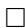

# On D. Peterson’s comparison formula for Gromov-Witten invariants of $G / P$

Christopher T. Woodward

Abstract. We prove a formula of Dale Peterson comparing Gromov-Witten (GW) invariants of $G / P$ to those of $G / B$ using canonical reductions of bundles.

An unpublished formula of Dale Peterson describes how 3-point, genus 0 Gromov-Witten invariants of $G / P$ compare with those of $G / B$ . Our purpose in this note is to describe an explanation, and in particular a proof, of this formula using ideas from moduli of principal bundles over curves. The quantum product with respect to the Schubert basis in $G / B$ can be computed either recursively using Peterson’s quantum Chevalley formula, proved in [7], or using polynomial representatives for the Schubert classes in the Givental-Kim presentation of the small quantum cohomology [5], [13]. Together these results give a practicable method for computing the small quantum cohomology in the Schubert basis for arbitrary $G / P$ , although there are much more effective methods in many special cases [2, 3, 4, 12, 11, 15].

The idea of the proof is the following. Given a morphism $\varphi$ of $\mathbb { P } ^ { 1 }$ to a partial flag variety $X$ of a certain degree $d$ , we can pull back the tautological bundles over $X$ . Giving a lift $\varphi ^ { \prime }$ of degree $d ^ { \prime }$ of $\varphi$ to a partial flag variety $X ^ { \prime }$ dominating $X$ is equivalent to giving filtrations of the pull-back of the tautological bundles, by sub-bundles of ranks and degrees determined by the data $X ^ { \prime } , d ^ { \prime }$ . It turns out that for general $\varphi$ one can determine the degree $d ^ { \prime }$ of the lift corresponding to the Harder-Narasimhan filtration. This produces a birational equivalence between the space of morphisms ${ \mathrm { H o m } } _ { d } ( \mathbb { P } ^ { 1 } , X )$ of degree $d$ to $X$ , and the space of morphisms of degree $d ^ { \prime }$ to $X ^ { \prime }$ . Playing a similar game with the Jordan-H¨older filtration relates this moduli space to a moduli space of morphisms of $\mathbb { P } ^ { 1 }$ to the full flag variety. The idea for arbitrary $G / P$ is the same but uses the parabolic reductions of Atiyah-Bott and Ramanathan for principal bundles over curves, which generalize the Harder-Narasimhan and Jordan-H¨older filtrations for vector bundles.

We adopt the notation of our joint paper with W. Fulton [7]. In particular, $G$ is a connected, simply connected, semisimple complex Lie group with Borel subgroup $B$ , opposite Borel subgroup $B ^ { - }$ , maximal torus $T$ , and Weyl group $W$ . Let $w _ { o }$ be the longest element of $W$ . Let $P$ be a standard parabolic subgroup, corresponding to a subset $\Delta _ { P }$ of the simple roots. Let $R _ { P } ^ { + }$ denote the set of roots that are

combinations of elements of $\Delta _ { P }$ . For any $u \in W / W _ { P }$ , the opposite Schubert variety is $Y ( u ) = \overline { { B ^ { - } u P / P } }$ . Its class in the integral cohomology ring $H ^ { \bullet } ( G / P )$ is denoted by $\sigma _ { u }$ . The dual cohomology class is $\sigma ^ { u } : = \sigma _ { w _ { o } u }$ . Let $n \geq 3$ be an integer, $p _ { 1 } , \dotsc , p _ { n } \in \mathbb { P } ^ { 1 }$ distinct points, and $g _ { 1 } , \dotsc , g _ { n } \in G$ general elements. For any $u _ { 1 } , \ldots , u _ { n } \in W / W _ { P }$ , define

$\langle \sigma _ { u _ { 1 } } , \ldots , \sigma _ { u _ { n } } \rangle _ { d } = \# \{ \varphi : \mathbb { P } ^ { 1 } \to G / P , \ \deg ( \varphi ) = d , \ \varphi ( p _ { i } ) \in g _ { i } Y ( u _ { i } ) \ \mathrm { f o r } \ i = 1 , \ldots , n \}$ if this number is finite, and zero otherwise. These invariants may also be defined as pairings in the Kontsevich-Manin moduli space ${ \overline { { M } } } _ { 0 , n } ( G / P , d )$ of degree d $n$ -pointed genus 0 stable maps. Namely, let

$$
f: \overline {{\mathcal {M}}} _ {0, n} (G / P, d) \rightarrow \overline {{\mathcal {M}}} _ {0, n}, e _ {i}: \overline {{\mathcal {M}}} _ {0, n} (G / P, d) \rightarrow G / P
$$

denote the forgetful morphism to the moduli space of stable $n$ -pointed genus 0 curves, resp. the $i$ -th evaluation map. Then $\langle \sigma _ { u _ { 1 } } , \ldots , \sigma _ { u _ { n } } \rangle _ { d }$ is the coefficient of the point class in $f _ { \ast } ( e _ { 1 } ^ { \ast } \sigma _ { u _ { 1 } } \cdot \dots \cdot e _ { n } ^ { \ast } \sigma _ { u _ { n } } )$ .

Define a deformation of the cohomology ring of $G / P$ as follows. Let $s _ { 1 } , \ldots , s _ { r }$ be the simple reflections in $W$ not in $W _ { P }$ . The classes $\sigma ^ { [ s _ { 1 } ] } , \ldots , \sigma ^ { [ s _ { r } ] }$ form a basis for $H ^ { \mathrm { d i m } ( G / P ) - 2 } ( G / P )$ which we identify with $H _ { 2 } ( G / P )$ . For any degree $\begin{array} { r } { d = \sum _ { i = 1 } ^ { r } d _ { i } \sigma ^ { [ s _ { i } ] } } \end{array}$ set $q ^ { d } = q _ { 1 } ^ { d _ { 1 } } \cdot . . . \cdot q _ { r } ^ { d _ { r } }$ in $\mathbb { Z } [ q ] : = \mathbb { Z } [ q _ { 1 } , . . . , q _ { r } ]$ . The quantum multiplication formula

$$
\sigma_ {u _ {1}} \star \dots \star \sigma_ {u _ {n - 1}} = \sum_ {d} q ^ {d} \sum_ {u _ {n}} \left\langle \sigma_ {u _ {1}}, \dots , \sigma_ {u _ {n}} \right\rangle_ {d} \sigma^ {u _ {n}}
$$

defines an associative, commutative, $\mathbb { Z } [ q ]$ -linear product on

$$
Q H ^ {\bullet} (G / P) = H ^ {\bullet} (G / P) \otimes_ {\mathbb {Z}} \mathbb {Z} [ q ]
$$

the small quantum cohomology ring of $G / P$ . We call the structure coefficients $\langle \sigma _ { u _ { 1 } } , \ldots , \sigma _ { u _ { n } } \rangle _ { d }$ the small GW-invariants of $G / P$ . These invariants, are defined using the pull-back of the point class on the moduli space of stable maps, and should not be confused with the $n$ -point GW-invariants of $G / P$ that play a role in the large quantum cohomology and are less well understood.

Actually it is somewhat misleading to call the ring $Q H ^ { \bullet } ( G / P )$ cohomology, since it is not functorial: A morphism $h : \ X \to X ^ { \prime }$ does not induce a morphism $Q H ^ { \bullet } ( X ^ { \prime } )  Q H ^ { \bullet } ( X )$ unless $h$ is an isomorphism. In particular, the projection $G / B \to G / P$ does not induce a morphism $Q H ^ { \bullet } ( G / P ) \to Q H ^ { \bullet } ( G / B )$ . Peterson’s comparison formula (1) below fills this gap: it expresses the degree $d _ { P }$ invariants of $G / P$ in terms of degree $d _ { B }$ invariants for $G / B$ . Unfortunately the definition of $d _ { B }$ , which follows, is not very explicit. Let

$$
\phi_ {P / B}: G / B \to G / P
$$

be the projection. For any weight $\mu$ , let $L ( \mu )$ denote the corresponding line bundle over $G / B$ and $c _ { 1 } ( L ( \mu ) ) \in H ^ { 2 } ( G / B )$ its first Chern class. We denote by $\displaystyle ( \ , \ )$ the pairing of homology and cohomology.

Lemma/Definition 1. For any $d _ { P } \in H _ { 2 } ( G / P )$ , there exists a unique $d _ { B } \in$ $H _ { 2 } ( G / B )$ such that $( \phi _ { P / B } ) _ { * } d _ { B } = d _ { P }$ and

$$
\left(d _ {B}, c _ {1} (L (\alpha)) \in \{0, 1 \}, \quad \forall \alpha \in R _ {P} ^ {+}. \right.
$$

Furthermore, if ${ \mathrm { H o m } } _ { d _ { P } } ( \mathbb { P } ^ { 1 } , G / P )$ is non-empty then so is ${ \mathrm { H o m } } _ { d _ { B } } ( \mathbb { P } ^ { 1 } , G / B )$ .

Proof. Denote by $\pi _ { B } ^ { * }$ the isomorphism from $H ^ { 2 } ( G / B )$ to the weight lattice

$$
\pi_ {B} ^ {*}: H ^ {2} (G / B) \to \Lambda^ {*}, \quad c _ {1} (L (\mu)) \mapsto \mu
$$

and by $\pi _ { B }$ the dual isomorphism $\pi _ { B } : \Lambda \to H _ { 2 } ( G / B )$ . For any parabolic subgroup $P \subset G$ we have similar isomorphisms

$$
\pi_ {P} ^ {*}: H ^ {2} (G / P) \to (\Lambda^ {*}) ^ {W _ {P}}, \quad \pi_ {P}: \Lambda^ {P} \to H _ {2} (G / P)
$$

where $\Lambda ^ { P } : = ( ( \Lambda ^ { * } ) ^ { W _ { P } } ) ^ { * }$ . Let $r _ { P } : \Lambda \cong \Lambda ^ { * * } \to \Lambda ^ { P }$ denote the map given by restriction. Let $\Lambda _ { P }$ denote the coweight lattice for the semi-simple part of the Levi factor of $P$ , and $W _ { P } ^ { \mathrm { a f f } } = W _ { P } \ltimes \Lambda _ { P }$ the affine Weyl group for $P$ . The inverse image $r _ { P } ^ { - 1 } ( \lambda _ { P } )$ is invariant under the action of $W _ { P } ^ { \mathrm { a f f } }$ , and

$$
\mathfrak {A} _ {P} = \left\{\xi \in \Lambda \otimes_ {\mathbb {Z}} \mathbb {Q}, 0 \leq \alpha (\xi) \leq 1, \forall \alpha \in R _ {P} ^ {+} \right\}
$$

is a fundamental domain for the action of $W _ { P } ^ { \mathrm { a f f } }$ ; see e.g. [9, p. 90]. So there is a lift $\lambda _ { B }$ of $\lambda _ { P }$ in ${ \mathfrak { A } } _ { P }$ . Let $d _ { B } = \pi _ { B } ( \lambda _ { B } )$ .

It follows from e.g. the discussion in [6] that ${ \mathrm { H o m } } _ { d _ { P } } ( \mathbb { P } ^ { 1 } , G / P )$ is non-empty if and only if $d _ { P }$ is a non-negative combination of the classes $\sigma ^ { [ s _ { i } ] }$ for $\alpha _ { i } \in R _ { P } ^ { + }$ . Suppose that the latter holds. By e.g. localization [7, Lemma 2.1], $\sigma ^ { s _ { i } } = \pi _ { B } ( - h _ { i } )$ , where $h _ { i }$ is the coroot of $\alpha _ { i }$ . Write $\lambda _ { B } = c _ { 1 } h _ { 1 } + \ldots c _ { n } h _ { n }$ . We may assume without loss of generality that the only positive coefficients are $c _ { 1 } , c _ { 2 } , \ldots , c _ { k }$ , for some $k \leq j$ . Let $\alpha$ denote the highest root for the parabolic subgroup defined by this subset. Then $( \alpha , h _ { j } ) \ge 0$ for $j \le k$ and $( \alpha , h _ { j } ) \leq 0$ for $j > k$ . This implies $( \lambda _ { B } , \alpha ) \ge 2$ . We have $c _ { i } = ( \lambda _ { B } , \omega _ { i } ) = ( \lambda _ { P } , \omega _ { i } ) \leq 0$ for $\alpha _ { i } \notin \Delta _ { P }$ , where $\omega _ { i }$ is the corresponding fundamental weight. Therefore the simple roots $\alpha _ { 1 } , \ldots , \alpha _ { k }$ are in $\Delta _ { P }$ and $\alpha \in$ $R _ { P } ^ { + }$ which contradicts the definition of $\lambda _ { B }$ . This shows that $\lambda _ { B }$ is a non-positive combination of the simple coroots, so $d _ { B }$ is a non-negative combination of the classes $\boldsymbol { \sigma } ^ { s _ { i } }$ , so ${ \mathrm { H o m } } _ { d _ { B } } ( \mathbb { P } ^ { 1 } , G / B )$ is non-empty. 

In some cases one can find simple formulas for $d _ { B }$ :

Example 1. Suppose $G = S L ( 3 )$ , $P = P _ { \omega _ { 1 } }$ . Then $G / P = \mathbb { P } ^ { 2 }$ and $H _ { 2 } ( G / P ) \cong$ $\mathbb { Z }$ , with generator $\sigma ^ { [ s _ { 1 } ] } = [ \mathbb { P } ^ { 1 } ]$ . Let $h _ { 1 } , h _ { 2 } \in \Lambda$ denote the simple coroots. Given a degree $d _ { P } = d _ { 1 } \sigma ^ { [ s _ { 1 } ] }$ , we have $\lambda _ { P } = - d _ { 1 } r _ { P } ( h _ { 1 } )$ . The lifts of $\lambda _ { P }$ are of the form $\lambda _ { B } = - d _ { 1 } h _ { 1 } - d _ { 2 } h _ { 2 }$ . To find $d _ { B }$ , we solve for $d _ { 2 }$ so that

$$
\left(\alpha_ {2}, \lambda_ {B}\right) = d _ {1} - 2 d _ {2} \in \{0, 1 \}.
$$

The solution is $d _ { 2 } = d _ { 1 } / 2$ , if $d _ { 1 }$ is even, and $d _ { 2 } = ( d _ { 1 } - 1 ) / 2$ , if $d _ { 1 }$ is odd.

Define $P ^ { \prime }$ to be the parabolic subgroup of $G$ so that $\Delta _ { P ^ { \prime } } = \{ \alpha \in \Delta _ { P }$ , $\alpha ( \lambda _ { B } ) =$ $0 \}$ . Let $d _ { P ^ { \prime } }$ denote the image of $d _ { B }$ under the projection $H _ { 2 } ( G / B ) \to H _ { 2 } ( G / P ^ { \prime } )$ and $\lambda _ { P ^ { \prime } } = \pi _ { P ^ { \prime } } ^ { - 1 } ( d _ { P ^ { \prime } } )$ . Let $w _ { P ^ { \prime } }$ denote the longest element of the Weyl group $W _ { P ^ { \prime } }$ . For any $u \in W / W _ { P }$ , let $\tilde { u } \in W$ denote its minimal length lift.

Theorem 2 (Peterson’s Comparison Formula). Let $u _ { 1 } , \ldots , u _ { n } \in W / W _ { P }$ . For any degree $d _ { P } \in H _ { 2 } ( G / P )$ we have for the degree $d _ { B }$ defined by Lemma $\mathit { 1 }$ ,

$$
\left\langle \sigma_ {u _ {1}}, \dots , \sigma_ {u _ {n}} \right\rangle_ {d _ {P}} = \left\langle \sigma_ {\tilde {u} _ {1}}, \dots , \sigma_ {\tilde {u} _ {n - 1}}, \sigma_ {\tilde {u} _ {n} w _ {P ^ {\prime}}} \right\rangle_ {d _ {B}}. \tag {1}
$$

Example 2. Let $G / P = S L ( 3 ) / P _ { \omega _ { 1 } } = \mathbb { P } ^ { 2 }$ and $d _ { P } = \sigma ^ { [ s _ { 1 } ] }$ be the generator of $H _ { 2 } ( \mathbb { P } ^ { 2 } )$ . Then $\sigma _ { [ s _ { 1 } ] }$ is the cohomology class of a line and $\sigma _ { [ s _ { 2 } s _ { 1 } ] }$ is the class of a point. Since there is a unique line passing through a line and two points in general position in $\mathbb { P } ^ { 2 }$ , $\langle \sigma _ { [ s _ { 1 } ] } , \sigma _ { [ s _ { 2 } s _ { 1 } ] } , \sigma _ { [ s _ { 2 } s _ { 1 } ] } \rangle _ { d _ { P } } = 1$ . The lift $d _ { B } = \sigma ^ { s _ { 1 } }$ in $H _ { 2 } ( G / B )$ ,

by Example 1. Hence $P ^ { \prime } = B$ and $w _ { P ^ { \prime } } = e$ is the identity in $W$ . One can check that $\langle \sigma _ { s _ { 1 } } , \sigma _ { s _ { 2 } s _ { 1 } } , \sigma _ { s _ { 2 } s _ { 1 } } \rangle _ { d _ { B } } = 1$ using the Peterson’s quantum Chevalley formula [7], or explicitly as follows: The intersection $e _ { 1 } ^ { - 1 } ( Y ( s _ { 2 } s _ { 1 } ) ) \cap e _ { 2 } ^ { - 1 } ( w _ { o } Y ( s _ { 2 } s _ { 1 } ) ) \subset$ $\overline { { M } } _ { 0 , 3 } ( G / B , d _ { B } )$ is proper, and maps isomorphically under $e _ { 3 }$ onto $s _ { 1 } Y ( s _ { 1 } s _ { 2 } )$ . The latter meets $Y ( s _ { 1 } )$ properly at $x ( s _ { 2 } s _ { 1 } ) \in G / P$ , which implies that the GW-invariant is 1. Here $x ( s _ { 2 } s _ { 1 } )$ denotes the $T$ -fixed point corresponding to $s _ { 2 } s _ { 1 } \in W$ .

We prove Theorem 2 at the end of the paper using Theorem 3 below. Recall that the set ${ \mathrm { H o m } } _ { d _ { P } } ( \mathbb { P } ^ { 1 } , G / P )$ of degree $d _ { P }$ morphisms $\mathbb { P } ^ { 1 } \to G / P$ has the structure of a smooth, quasi-projective variety. Denote by $\phi _ { P ^ { \prime } / B }$ , $\phi _ { P / P ^ { \prime } }$ the projections

$$
\phi_ {P ^ {\prime} / B}: G / B \rightarrow G / P ^ {\prime}, \phi_ {P / P ^ {\prime}}: G / P ^ {\prime} \rightarrow G / P. \tag {2}
$$

We denote by $\mathrm { H o m } _ { d _ { P ^ { \prime } } } ( G / P ^ { \prime } ) \times _ { G / P ^ { \prime } } G / B$ the fiber product over $G / P ^ { \prime }$ via evaluation at 0 and $\phi _ { P ^ { \prime } / B }$ .

Theorem 3. The morphism

$$
(3) \quad \operatorname {H o m} _ {d _ {B}} (G / B) \rightarrow \operatorname {H o m} _ {d _ {P ^ {\prime}}} (G / P ^ {\prime}) \times_ {G / P ^ {\prime}} G / B, \quad \varphi \mapsto \left(\phi_ {P ^ {\prime} / B} \circ \varphi , \varphi (0)\right)
$$

is an open, dense immersion. The morphism

$$
\operatorname {H o m} _ {d _ {P ^ {\prime}}} \left(G / P ^ {\prime}\right)\rightarrow \operatorname {H o m} _ {d _ {P}} \left(G / P\right), \quad \varphi \mapsto \phi_ {P / P ^ {\prime}} \circ \varphi \tag {4}
$$

is birational.

Theorems 2 and 3 were both stated in [14] without proof. We will prove them using basic facts on semistability of principal bundles over curves. Recall that a vector bundle $E  X$ over a curve $C$ is semistable if every sub-bundle $E ^ { \prime } \subset E$ has slope $\mu ( E ^ { \prime } ) = \deg ( E ^ { \prime } ) / \operatorname { r a n k } ( E ^ { \prime } )$ at most the slope $\mu ( E )$ of $E$ . If $E$ is not semistable, there is a unique sub-bundle $E ^ { \prime }$ of maximal slope that is maximal rank among sub-bundles of slope $\mu ( E ^ { \prime } )$ . Applying this fact inductively leads to the Harder-Narasimhan filtration, which is the unique filtration with the given degrees and ranks.

In order to make what follows more readable, we will first prove the theorem for a simple example. Consider the case that $G = S L ( 3 )$ , $P = P _ { \omega _ { 1 } }$ , and $\lambda _ { P } = r _ { P } ( h _ { 1 } )$ so that $d _ { P }$ is the degree of a line in $G / P = \mathbb { P } ^ { 2 }$ . Over $\mathbb { P } ^ { 2 }$ we have the quotient vector bundle $Q$ and the tautological bundle $R$ , of ranks 2, 1 respectively, given by

$$
R _ {[ z ]} = [ z ], \quad Q _ {[ z ]} = \mathbb {C} ^ {3} / [ z ], \quad [ z ] \in \mathbb {P} ^ {2}.
$$

Any morphism $\varphi _ { P } : \mathbb { P } ^ { 1 } \to \mathbb { P } ^ { 2 }$ of degree $d _ { P }$ maps $\mathbb { P } ^ { 1 }$ isomorphically onto a line in $\mathbb { P } ^ { 2 }$ . A theorem of Grothendieck states that any vector bundle splits over $\mathbb { P } ^ { 1 }$ ; in this example $\varphi _ { P } ^ { * } Q \cong \mathcal { O } ( 1 ) \oplus \mathcal { O } ( 0 )$ , $\varphi _ { P } ^ { * } R \cong \mathcal { O } ( - 1 )$ . One way of seeing this is to note that $Q \otimes R ^ { - 1 }$ is the tangent bundle $T \mathbb { P } ^ { 2 }$ of $\mathbb { P } ^ { 2 }$ ; the pull-back $\varphi ^ { * } T \mathbb { P } ^ { 2 }$ is the sum of the tangent bundle $T \mathbb { P } ^ { 1 } \cong { \mathcal { O } } ( 2 )$ to $\mathbb { P } ^ { 1 }$ and the normal bundle $N { \mathbb { P } } ^ { 1 } \cong { \mathcal { O } } ( 1 )$ . It follows that the Harder-Narasimhan filtration of $\varphi _ { P } ^ { * } Q$ is has a single non-trivial term given by the line bundle $S$ isomorphic to $\mathcal { O } ( 1 )$ . The choice of a line sub-bundle of $Q$ defines a lift $\varphi _ { B } : \mathbb { P } ^ { 1 } \to G / B = { \mathrm { F l a g } } ( \mathbb { C } ^ { 3 } )$ of $\varphi _ { P }$ as follows. Let $\pi _ { [ w ] } : \mathbb { C } ^ { 3 } \to \mathbb { C } ^ { 3 } / \varphi _ { P } ( [ w ] )$ denote the projection. Define

$$
\varphi_ {B} ([ w ]) = \left(\varphi_ {P} ^ {*} R _ {[ w ]} \subset \pi_ {[ w ]} ^ {- 1} S _ {[ w ]}\right).
$$

A little yoga with the definition of degree shows that the element $\lambda _ { B } = \pi _ { B } ^ { - 1 } ( \deg ( \varphi _ { B } ) )$ satisfies

$$
\left(\lambda_ {B}, \omega_ {1}\right) = c _ {1} \left(\varphi_ {P} ^ {*} R\right) = - 1, \quad \left(\lambda_ {B}, \omega_ {2}\right) = c _ {1} \left(\varphi_ {P} ^ {*} R \oplus S\right) = 0
$$

which implies $\lambda _ { B } = - h _ { 1 }$ . The fact that the Harder-Narasimhan filtration is the unique filtration with given degrees implies that $\varphi _ { B }$ is the unique lift of $\varphi _ { P }$ of degree $d _ { B } = \pi _ { B } ( \lambda _ { B } )$ . Since this is true for any map $\varphi _ { B } : \mathbb { P } ^ { 1 } \to \mathbb { P } ^ { 2 }$ of degree $d _ { P }$ , the map

$$
\operatorname {H o m} (\mathbb {P} ^ {1}, \operatorname {F l a g} (\mathbb {C} ^ {3})) _ {d _ {B}} \to \operatorname {H o m} (\mathbb {P} ^ {1}, \mathbb {P} ^ {2}) _ {d _ {P}}, \quad \varphi_ {B} \mapsto \varphi_ {P} := \phi_ {P / B} \circ \varphi_ {B}
$$

is a bijection. Since both varieties are smooth it is an isomorphism; this is a special case of Theorem 3. In this example, $P ^ { \prime } = B$ , so (3) is a tautology. In general, the proof of (3) involves the Jordan-H¨older filtration, as we explain below.

In order to prove Theorem 3 in general, we need some terminology for principal $G$ -bundles over a variety $X$ . First, a principal $G$ -bundle ${ \mathcal { E } }  X$ is a right $G$ -variety over $X$ that is locally trivial; in our situation we may assume local triviality in the Zariski topology. For any principal $G$ -bundle $\mathcal { E }  X$ and morphism $\varphi : X ^ { \prime } \to X$ , we denote by $\varphi ^ { * } \mathcal { E }$ the pull-back bundle. For any left $G$ -variety $F$ we denote the associated fiber bundle by $\mathcal { E } ( F )$ . Let $G ^ { \prime } \subset G$ be a subgroup. A reduction of $\varepsilon$ to $G ^ { \prime }$ is a section $\sigma$ of the fiber bundle $\mathcal { E } ( G / G ^ { \prime } )$ . A special role is played by reductions to maximal parabolic subgroups $P \subset G$ . In the case $G = G L ( V )$ , the maximal parabolic subgroups are the stabilizers of subspaces $V ^ { \prime } \subset V$ . A parabolic reduction $\sigma : \ X \to { \mathcal { E } } ( G / P )$ is equivalent to a sub-bundle of the associated vector bundle ${ \mathcal { E } } ( V )$ with fiber $V ^ { \prime }$ .

Semistability of principal $G$ -bundles is defined as follows. For any standard maximal parabolic $P$ , let $\omega _ { P }$ be the fundamental weight such that $\Delta _ { P }$ is the set of simple roots vanishing on $\omega _ { P }$ . A principal $G$ -bundle ${ \mathcal { E } }  X$ is called semistable if and only if for any reduction $\sigma : \mathrm { ~ } C \to \mathcal { E } / P$ to a standard maximal parabolic $P$ , the degree of the associated line bundle $\sigma ^ { * } { \mathcal { E } } ( \omega _ { P } )$ is non-positive. For $G = S L ( n )$ , semistability of $\varepsilon$ is equivalent to semistability of the associated vector bundle (see Ramanathan [16] or Atiyah-Bott [1, Section 10]). For any $G$ , semistability of $\varepsilon$ is equivalent to semistability of the vector bundle $\mathcal { E } ( { \mathfrak { g } } )$ associated to the adjoint representation $^ { 9 }$ . If $\varepsilon$ is not semistable, there is a canonical Atiyah-Bott parabolic reduction $\sigma _ { \mathscr { E } } : \mathscr { C }  \mathscr { E } / P _ { \mathscr { E } }$ , where the parabolic subgroup $P _ { \mathcal { E } }$ has Lie algebra ${ \mathfrak { p } } \varepsilon$ isomorphic to the fiber of the degree-zero term $\mathcal { E } ( { \mathfrak { g } } ) _ { 0 }$ in the Harder-Narasimhan filtration of $\mathcal { E } ( { \mathfrak { g } } )$ . The canonical reduction has a uniqueness property generalizing that of the Harder-Narasimhan filtration: For any reduction $\sigma : \mathrm { ~ } X \to \mathcal { E } / P$ , define the slope $\mu$ of $\sigma$ to be the homomorphism from characters $\chi$ of $P$ to $\mathbb { Z }$ given by mapping $\chi$ to the degree of the associated line bundle $\sigma _ { \mathcal { E } } ^ { * } \mathcal { E } ( \chi )$ .

Proposition 4. (see e.g. [17, pp.11-12]) $\sigma \varepsilon$ is the unique reduction of $\varepsilon$ to $P _ { \mathcal { E } }$ with slope $\mu \varepsilon$ .

If a degree 0 vector bundle $E  C$ is semistable, there is a Jordan-H¨older filtration on $E$ characterized by the property that the associated graded bundle $\mathrm { G r } ( E )$ is semistable, and the filtration is maximal among filtrations of this type. The Jordan-H¨older filtration is not unique; however, $\mathrm { G r } ( E )$ is unique up to isomorphism. The corresponding notion for principal bundles was introduced by Ramanathan [16]: A reduction $\sigma : \mathrm { ~ } C \to \mathcal { E } / P$ is called admissible if $\sigma$ has slope 0. Let $L$ denote the standard Levi subgroup of $P$ and $\pi _ { L } : P \to L$ and $\iota _ { L } : \ L \to G$ denote the homomorphisms given by projection and inclusion respectively.

Proposition 5. [16, 3.5.11] Let $\sigma : \mathrm { ~ } C \to \mathcal { E } / P$ be an admissible reduction of $\varepsilon$ . $( \iota _ { L } ) _ { * } ( \pi _ { L } ) _ { * } \sigma ^ { * } \mathcal { E }$ is semistable if and only if $\varepsilon$ is semistable.

If $\sigma$ is admissible and $( \pi _ { L } ) _ { * } \sigma ^ { * } \mathcal { E }$ is stable, call $\sigma$ a Ramanathan reduction. By [16, Proposition 3.12], Ramanathan reductions exist for any bundle $\varepsilon$ . Define an equivalence relation on principal $G$ -bundles by ${ \mathcal E } \sim ( \iota _ { L } ) _ { * } ( \pi _ { L } ) _ { * } \sigma ^ { * } { \mathcal E } ( G )$ , where $\sigma$ is a Ramanathan reduction. Ramanathan [16] constructs a coarse moduli space for equivalence classes of semistable principal bundles. In genus zero, the moduli problem is trivial, for the following reason which is an easy consequence of Grothendieck’s theorem that any principal $G$ -bundle over $\mathbb { P } ^ { 1 }$ admits a reduction to $T$ [8]:

Theorem 6. Any semistable principal $G$ -bundle $\mathcal { E } \to \mathbb { P } ^ { 1 }$ is trivial: ${ \mathcal { E } } \cong \mathbb { P } ^ { 1 } \times G$ .

These results have straightforward generalizations to the case that $G$ is reductive.

We apply these results to pull-backs of bundles on $G / P$ . Let $\varphi _ { P } : X \to G / P$ be a morphism and $\displaystyle { \mathcal { E } } _ { P }$ the principal $P$ -bundle $G  G / P$ . For any parabolic subgroup $P ^ { \prime } \subseteq P$ , lifts $\varphi _ { P ^ { \prime } } : X \to G / P ^ { \prime }$ of $\varphi _ { P } : X \to G / P$ are in one-to-one correspondence with reductions $\sigma _ { P ^ { \prime } } : X  \varphi _ { P } ^ { * } \mathcal { E } _ { P } ( P / P ^ { \prime } )$ .

Our goal is to prove Theorem 3 by thinking of it as a statement about reductions of bundles. Let $P = L U$ and $P ^ { \prime } = L ^ { \prime } U ^ { \prime }$ denote the standard Levi decompositions. We study the semistability of the principal $L$ -bundle $( \pi _ { L } ) _ { * } \varphi _ { P } ^ { * } \mathcal { E } _ { P }$ .

Lemma 7. Suppose there exists a lift $\varphi _ { B } : \mathbb { P } ^ { 1 } \to G / B$ of $\varphi _ { P }$ of degree $d _ { B }$ . Then the Atiyah-Bott canonical reduction of $( \pi _ { L } ) _ { * } \varphi _ { P } ^ { * } \mathcal { E } _ { P }$ corresponds to the lift $\varphi _ { P ^ { \prime } } =$ $\phi _ { P ^ { \prime } / B } \circ \varphi _ { B }$ .

Proof. Let $B$ act on $L$ via $\pi _ { L }$ . Because of the isomorphisms

$$
\varphi_ {P} ^ {*} \mathcal {E} _ {P} (P / P ^ {\prime}) \rightarrow \varphi_ {B} ^ {*} \mathcal {E} _ {B} (P / P ^ {\prime}) \rightarrow \varphi_ {B} ^ {*} \mathcal {E} _ {B} (L / L \cap P ^ {\prime}),
$$

the map $\varphi _ { P ^ { \prime } }$ defines a reduction of $\varphi _ { B } ^ { * } { \mathcal { E } } _ { B } ( L )$ to $L \cap P ^ { \prime }$ . The filtration $\{ \cap \mathfrak { u } ^ { \prime } \subset \mathfrak { M } \mathfrak { p } ^ { \prime } \subset \mathfrak { l }$ is $B$ -stable. We claim that

$$
\varphi_ {B} ^ {*} \mathcal {E} _ {B} (\mathfrak {l} \cap \mathfrak {u} ^ {\prime}) \subseteq \varphi_ {B} ^ {*} \mathcal {E} _ {B} (\mathfrak {l} \cap \mathfrak {p} ^ {\prime}) \subseteq \varphi_ {B} ^ {*} \mathcal {E} _ {B} (\mathfrak {l}) \tag {5}
$$

is the Harder-Narasimhan filtration of $\varphi _ { B } ^ { * } \mathcal { E } _ { B } ( \mathfrak { l } )$ . We have $\deg \varphi _ { B } ^ { * } \mathcal E _ { B } ( \mathfrak l _ { \mu } ) = ( \lambda _ { B } , \mu )$ . Using the definition of the Peterson lift, if $\mu$ is a positive (resp. negative) root of l that is not a root of $\boldsymbol { \mathrm { \Sigma } } ^ { \prime }$ then $( \lambda _ { B } , \mu ) = 1$ resp. $^ { - 1 }$ ; otherwise $( \lambda _ { B } , \mu ) = 0$ . It follows that the Harder-Narasimhan filtration is (5), and has slope-zero term $\varphi _ { B } ^ { * } \mathcal E _ { B } ( \mathfrak { l } \cap \mathfrak { p ^ { \prime } } )$ . 

Corollary 8. Suppose that $\varphi _ { P }$ lifts to a map $\varphi _ { B } : \mathbb { P } ^ { 1 } \to G / B$ of degree $d _ { B }$ . Then the composition $\varphi _ { P ^ { \prime } }$ of $\varphi _ { B }$ with the projection to $G / P ^ { \prime }$ is the unique lift of $\varphi _ { P }$ to $G / P ^ { \prime }$ of degree $d _ { P ^ { \prime } }$ .

Proof. By Lemma 7 and Proposition 4.

We now consider the comparison between $G / P ^ { \prime }$ and $G / B$ . Let $\varphi _ { P ^ { \prime } } : \mathbb { P } ^ { 1 } \to $ $G / P ^ { \prime }$ be a morphism of degree $d _ { P ^ { \prime } }$ . Let $L ^ { \prime } \subset P ^ { \prime }$ be the standard Levi subgroup of $P ^ { \prime }$ , $Z ( L ^ { \prime } )$ its center, and $L _ { \mathrm { s s } } ^ { \prime } = L ^ { \prime } / Z ( L ^ { \prime } )$ . Let $\pi _ { L _ { \mathrm { s s } } ^ { \prime } } : P ^ { \prime } \to L _ { \mathrm { s s } } ^ { \prime }$ denote the projection, and $B _ { \mathrm { s s } } ^ { \prime }$ the image of $B \cap L ^ { \prime }$ under $\pi _ { L _ { \mathrm { s s } } ^ { \prime } }$ . Since both the standard unipotent subgroup $U ^ { \prime } \subset P ^ { \prime }$ and $Z ( L ^ { \prime } )$ act trivially on $P ^ { \prime } / B$ , we have $\mathcal { E } _ { P ^ { \prime } } ( P ^ { \prime } / B ) \cong \mathcal { E } _ { P ^ { \prime } } ( L _ { \mathrm { s s } } ^ { \prime } / B _ { \mathrm { s s } } ^ { \prime } )$ .

Lemma 9. Suppose that there exists a lift $\varphi _ { B }$ of $\varphi _ { P ^ { \prime } }$ to $G / B$ of degree $d _ { B }$ . Then the corresponding reduction $\sigma _ { B } : \mathbb { P } ^ { 1 } \to \varphi _ { P ^ { \prime } } ^ { * } \mathcal { E } _ { P ^ { \prime } } ( L _ { \mathrm { s s } } ^ { \prime } / B _ { \mathrm { s s } } ^ { \prime } )$ is a Ramanathan reduction of $\varphi _ { P ^ { \prime } } ^ { * } \mathcal { E } _ { P ^ { \prime } } ( L _ { \mathrm { s s } } ^ { \prime } )$ .

Proof. Any weight for $L _ { \mathrm { s s } } ^ { \prime }$ defines a weight $\mu$ for $L ^ { \prime }$ in the span of the roots of $L ^ { \prime }$ . Hence $( \lambda _ { B } , \mu ) = 0$ and the line bundle $\varphi _ { B } ^ { * } L ( \mu ) \cong \sigma _ { B } ^ { * } \varphi _ { P ^ { \prime } } ^ { * } \mathcal { E } _ { P ^ { \prime } } ( \mu )$ is trivial. This implies that $\sigma _ { B }$ is admissible. 

Corollary 10. If there exists a lift $\varphi _ { B }$ of $\varphi _ { P ^ { \prime } }$ to $G / B$ of degree $d _ { B }$ , then the bundle $\varphi _ { P ^ { \prime } } ^ { * } \mathcal { E } _ { P ^ { \prime } } ( P ^ { \prime } / B )$ is trivial.

Proof. By Lemma 9, Theorem 6 and Proposition 5.

Now we prove Theorem 3. The morphism (3) is an injection. Indeed, by Lemma 9 any lift $\varphi _ { B }$ gives a Ramanathan reduction of $\varphi _ { B } ^ { * } \mathcal { E } _ { B } ( L _ { \mathrm { s s } } ^ { \prime } )$ . A Ramanathan reduction of the trivial bundle $\mathbb { P } ^ { 1 } \times L _ { \mathrm { { s s } } } ^ { \prime }$ is a constant morphism $\mathbb { P } ^ { 1 } \to L _ { \mathrm { s s } } ^ { \prime } / B _ { \mathrm { s s } } ^ { \prime }$ , and is therefore specified uniquely by its value at any point in $\mathbb { P } ^ { 1 }$ . The dimension of ${ \mathrm { H o m } } _ { d _ { B } } ( G / B )$ is

$$
\begin{array}{l} \dim (\operatorname {H o m} _ {d _ {B}} (\mathbb {P} ^ {1}, G / B)) = \dim (G / B) + \left(c _ {1} (G / B), d _ {B}\right) \\ = \quad \dim (G / B) + \sum_ {\alpha \in R ^ {+}} (\alpha , \lambda_ {B}) \\ = \dim (G / P ^ {\prime}) + \dim (P ^ {\prime} / B) + \sum_ {\alpha \in R ^ {+} \setminus R _ {P ^ {\prime}} ^ {+}} (\alpha , \lambda_ {B}) \\ = \dim (G / P ^ {\prime}) + \left(c _ {1} \left(G / P ^ {\prime}\right), d _ {P ^ {\prime}}\right) + \dim \left(P ^ {\prime} / B\right) \\ = \dim (\operatorname {H o m} _ {d _ {P ^ {\prime}}} (\mathbb {P} ^ {1}, G / P ^ {\prime})) + \dim (P ^ {\prime} / B). \\ \end{array}
$$

It follows that (3) is injective. Since the domain and codomain are smooth, irreducible ([10],[18]) and the same dimension, (3) is an open, dense immersion.

Similarly, by Lemma 7, the morphism (4) is injective on the image of (3). The domain and codomain have the same dimension, since

$$
\begin{array}{l} \dim (\operatorname {H o m} _ {d _ {P ^ {\prime}}} (\mathbb {P} ^ {1}, G / P ^ {\prime})) = \dim (G / P ^ {\prime}) + \sum_ {\alpha \in R _ {P ^ {\prime}} ^ {+}} (\alpha , \lambda_ {B}) \\ = \dim (G / P ^ {\prime}) + \sum_ {\alpha \in R _ {P} ^ {+}} (\alpha , \lambda_ {B}) - \# R _ {P} ^ {+} \setminus R _ {P ^ {\prime}} ^ {+} \\ = \dim (G / P) + \sum_ {\alpha \in R _ {P} ^ {+}} (\alpha , \lambda_ {B}) \\ = \dim (\operatorname {H o m} _ {d _ {P}} (\mathbb {P} ^ {1}, G / P)). \\ \end{array}
$$

Since the varieties are smooth and irreducible, (4) is an open, dense immersion on an open subset, and therefore birational.

Theorem 3 and Lemma 7 imply the following curious fact.

Proposition 11. For general $\varphi _ { P } \in \mathrm { H o m } _ { d _ { P } } ( \mathbb { P } ^ { 1 } , G / P )$ , the pull-back $\varphi _ { P } ^ { * } { \mathcal { E } } _ { P } ( L )$ is semistable if and only if $\lambda _ { B }$ is $W _ { P }$ -fixed, that is, $P = P ^ { \prime }$ .

Example 3. Let $G = S L ( 3 , \mathbb { C } )$ and $P = { \cal P } _ { \omega 1 }$ . Under the correspondence between principal bundle and vector bundles, the bundle $\mathcal { E } _ { P } ( L )$ corresponds to $Q \oplus$ $R$ . Since (semi)stability is preserved by tensoring with line bundles, semistability of $Q$ is equivalent to semistability of $T \mathbb { P } ^ { 2 }$ . Therefore, a general degree $d _ { P }$ morphism $\varphi _ { P } : \mathbb { P } ^ { 1 } \to \mathbb { P } ^ { 2 }$ has $\varphi _ { P } ^ { * } T \mathbb { P } ^ { 2 }$ semistable (hence trivial) if and only if $d _ { P }$ is even.

Now we prove Theorem 2. Recall the maps $\phi _ { P ^ { \prime } / B } , \phi _ { P / P ^ { \prime } }$ from (2). For any $u \in W / W _ { P }$ , we have the identities

$$
\left(\phi_ {P / B}\right) ^ {*} \sigma_ {u} = \sigma_ {\tilde {u}}, \quad \sigma_ {u} = \left(\phi_ {P / B}\right) _ {*} \sigma_ {\tilde {u} w _ {P}}. \tag {6}
$$

Composing with the projection and collapsing the unstable components produces morphisms

$$
h _ {P ^ {\prime} / B}: \overline {{M}} _ {0, n + 1} (G / B, d _ {B}) \to \overline {{M}} _ {0, n + 1} (G / P ^ {\prime}, d _ {P ^ {\prime}}) \times_ {G / P ^ {\prime}} G / B,
$$

$$
h _ {P / P ^ {\prime}}: \overline {{M}} _ {0, n + 1} (G / P ^ {\prime}, d _ {P ^ {\prime}}) \to \overline {{M}} _ {0, n + 1} (G / P, d _ {P}).
$$

The existence of $h _ { P / P ^ { \prime } }$ is proved by the same arguments that construct the forgetful morphism $f$ , see [6]. Theorem 3 implies that these morphisms are birational. Let $\phi _ { 1 } , \phi _ { 2 }$ denote the projections so that

$$
\phi_ {1} \times \phi_ {2}: \overline {{M}} _ {0, n + 1} (G / P ^ {\prime}, d _ {P ^ {\prime}}) \times_ {G / P ^ {\prime}} G / B \rightarrow \overline {{M}} _ {0, n + 1} (G / P ^ {\prime}, d _ {P ^ {\prime}}) \times G / B
$$

is the canonical inclusion. Let $u _ { j } ^ { \prime } \in W / W _ { P ^ { \prime } }$ denote the coset of $\bar { u } _ { j }$ . We denote by superscript $_ B$ objects, maps etc. for $G / B$ , and by $P ^ { \prime }$ those for $G / P ^ { \prime }$ . From (6) and the identities

$$
\phi_ {P ^ {\prime} / B} \circ e _ {i} ^ {B} = e _ {i} ^ {P ^ {\prime}} \circ \phi_ {1} \circ h _ {P ^ {\prime} / B}, f ^ {B} = f ^ {P ^ {\prime}} \circ \phi_ {1} \circ h _ {P ^ {\prime} / B}
$$

it follows that for any $w \in W$ ,

(7) $f _ { * } ^ { B } ( ( e _ { 1 } ^ { B } ) ^ { * } \sigma _ { \tilde { u } _ { 1 } } \cdot . . . \cdot ( e _ { n - 1 } ^ { B } ) ^ { * } \sigma _ { \tilde { u } _ { n - 1 } } \cdot ( e _ { n } ^ { B } ) ^ { * } \sigma _ { w } )$

$$
= f _ {*} ^ {P ^ {\prime}} \big ((e _ {1} ^ {P ^ {\prime}}) ^ {*} \sigma_ {u _ {1} ^ {\prime}} \cdot \ldots \cdot (e _ {n - 1} ^ {P ^ {\prime}}) ^ {*} \sigma_ {u _ {n - 1} ^ {\prime}} \cdot (e _ {n} ^ {P ^ {\prime}}) ^ {*} (\phi_ {P ^ {\prime} / B}) _ {*} \sigma_ {w} \big).
$$

In particular,

$$
f _ {*} ^ {B} \left(\left(e _ {1} ^ {B}\right) ^ {*} \sigma_ {\tilde {u} _ {1}} \cdot \ldots \cdot \left(e _ {n - 1} ^ {B}\right) ^ {*} \sigma_ {\tilde {u} _ {n - 1}} \cdot \left(e _ {n} ^ {B}\right) ^ {*} \sigma_ {\tilde {u} _ {n} w _ {P ^ {\prime}}}\right) = f _ {*} ^ {P ^ {\prime}} \left(\left(e _ {1} ^ {P ^ {\prime}}\right) ^ {*} \sigma_ {u _ {1} ^ {\prime}} \cdot \ldots \cdot \left(e _ {n} ^ {P ^ {\prime}}\right) ^ {*} \sigma_ {u _ {n} ^ {\prime}}\right).
$$

Taking the coefficient of the point class in $H ^ { \bullet } ( \overline { { M } } _ { 0 , n } )$ gives

$$
\left\langle \sigma_ {u _ {1} ^ {\prime}}, \dots , \sigma_ {u _ {n} ^ {\prime}} \right\rangle_ {d _ {P ^ {\prime}}} = \left\langle \sigma_ {\tilde {u} _ {1}}, \dots , \sigma_ {\tilde {u} _ {n - 1}}, \sigma_ {\tilde {u} _ {n} w _ {P ^ {\prime}}} \right\rangle_ {d _ {B}}.
$$

A similar but easier argument shows $\langle \sigma _ { u _ { 1 } } , \ldots \sigma _ { u _ { n } } \rangle _ { d _ { P } } = \langle \sigma _ { u _ { 1 } ^ { \prime } } , \ldots , \sigma _ { u _ { n } ^ { \prime } } \rangle _ { d _ { P ^ { \prime } } }$ , which completes the proof.

# References

[1] M. F. Atiyah and R. Bott. The Yang-Mills equations over Riemann surfaces. Phil. Trans. Roy. Soc. London Ser. A, 308:523–615, 1982.   
[2] A. Bertram. Quantum Schubert calculus. Adv. Math., 128:289–305, 1997.   
[3] A. Bertram, I. Ciocan-Fontanine, and W. Fulton. Quantum multiplication of Schur polynomials. J. Algebra, 219(2):728–746, 1999.   
[4] I. Ciocan-Fontanine. On quantum cohomology rings of partial flag varieties. Duke Math. J., 98(3):485–524, 1999.   
[5] Sergey Fomin, Sergei Gelfand, and Alexander Postnikov. Quantum Schubert polynomials. J. Amer. Math. Soc., 10(3):565–596, 1997.   
[6] W. Fulton and R. Pandharipande. Notes on stable maps and quantum cohomology. In Algebraic geometry—Santa Cruz 1995, pages 45–96. Amer. Math. Soc., Providence, RI, 1997.   
[7] W. Fulton and C. Woodward. On the quantum product of Schubert classes. J. Algebraic Geom., 13(4):641–661, 2004.   
[8] A. Grothendieck. Sur la classification des fibr´es holomorphes sur la sph`ere de Riemann. Amer. J. Math., 79:121–138, 1957.   
[9] J. E. Humphreys. Reflection groups and Coxeter groups. Cambridge University Press, Cambridge, 1990.

[10] B. Kim and R. Pandharipande. The connectedness of the moduli space of maps to homogeneous spaces. In Symplectic geometry and mirror symmetry (Seoul, 2000), pages 187–201. World Sci. Publishing, River Edge, NJ, 2001.   
[11] Andrew Kresch and Harry Tamvakis. Quantum cohomology of the Lagrangian Grassmannian. J. Algebraic Geom., 12(4):777–810, 2003.   
[12] Andrew Kresch and Harry Tamvakis. Quantum cohomology of orthogonal Grassmannians. Compos. Math., 140(2):482–500, 2004.   
[13] A.-L. Mare. Polynomial representatives of Schubert classes in $Q H ^ { * } ( G / B )$ . Math. Res. Lett., 9(5-6):757–769, 2002.   
[14] D. Peterson. Lectures on quantum cohomology of G/P. M.I.T., 1997.   
[15] A. Postnikov. Affine approach to quantum Schubert calculus. math.CO/0205165.   
[16] A. Ramanathan. Moduli for principal bundles over algebraic curves. I. Proc. Indian Acad. Sci. Math. Sci., 106(3):301–328, 1996.   
[17] C. Teleman and C. Woodward. Parabolic bundles, products of conjugacy classes and Gromov-Witten invariants. Ann. Inst. Fourier (Grenoble), 53(3):713–748, 2003.   
[18] J. F. Thomsen. Irreducibility of ${ \overline { { M } } } _ { 0 , n } ( G / P , \beta )$ . Internat. J. Math., 9(3):367–376, 1998.

Department of Mathematics, Hill Center, Rutgers University, 110 Frelinghuysen Road, Piscataway, New Jersey 08854-8019.

E-mail address: ctw@math.rutgers.edu