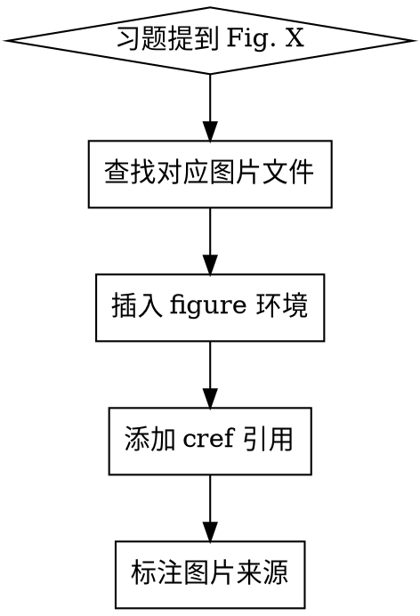

# LaTeX 习题图片引用规范

## 核心原则

当习题引用教材图片时，必须同时完成两件事：
1. 用 `\cref{}` 引用图片标签
2. 用 `\includegraphics{}` 插入图片

## 工作流程



## 步骤

### 1. 识别图片引用

教材中常见表述：
- "Fig. 1.3" / "Figure 1.3"
- "shown in Fig. 2"
- "(see Fig. 3.5)"

### 2. 查找/创建图片文件

使用 `figure_extractor.py` 提取对应图片：
```bash
python figure_extractor.py page-XX.png -o figures/chapter1/
```

### 3. 在习题前插入 figure 环境

```latex
\begin{figure}[H]
\subfloat[渐伸线 (Evolute)]{\label{fig:evolute}\includegraphics[width=0.6\textwidth]{figures/chapter1/fig_1-17.png}}
\end{figure}
```

### 4. 在习题中添加 \cref 引用

```latex
\begin{exercise}{(原文 Exercise 1-5, 7)}
The evolute ... (见 \cref{fig:evolute}):
...
\end{exercise}
```

### 5. 标注图片来源（可选但推荐）

```latex
% 图片来源：Do Carmo, Fig. 1.17
```

## 常见图片标签命名

| 教材引用 | 标签 | 文件名 |
|----------|------|--------|
| Fig. 1-7 | fig:cycloid | fig_1-7.png |
| Fig. 1-8 | fig:cissoid | fig_1-8.png |
| Fig. 1-9 | fig:tractrix | fig_1-9.png |
| Fig. 1-10 | fig:folium | fig_1-10.png |
| Fig. 1-11 | fig:log-spiral | fig_1-11.png |
| Fig. 1-17 | fig:evolute | fig_1-17.png |

## Do Carmo Chapter 1 习题图片完整列表

**Exercise 1-3：**
| 习题 | 图片 | 说明 |
|------|------|------|
| 1-3, #2 | Fig. 1-7 | cycloid 旋轮线 |
| 1-3, #3 | Fig. 1-8 | cissoid 蔓叶线 |
| 1-3, #4 | Fig. 1-9 | tractrix 曳物线 |
| 1-3, #5 | Fig. 1-10 | folium 叶形线 |
| 1-3, #6 | Fig. 1-11 | logarithmic spiral 对数螺旋线 |
| 1-3, #8 | Fig. 1-12 | 弧长几何意义 |

**Exercise 1-5：**
| 习题 | 图片 | 说明 |
|------|------|------|
| 1-5, #7 | Fig. 1-17 | evolute 渐伸线 |

**Exercise 1-7：**
| 习题 | 图片 | 说明 |
|------|------|------|
| 1-7, #2 | Fig. 1-35 | 等周问题 |
| 1-7, #4 | Fig. 1-36 | 曲率几何意义 |
| 1-7, #6 | Fig. 1-37 | parallel curve 平行曲线 |
| 1-7, #9 | Fig. 1-38 | convex set 凸集 |
| 1-7, #11 | Fig. 1-39 | convex hull 凸包 |
| 1-7, #12 | Fig. 1-40 | 弦长概率 |
| 1-7, #13 | Fig. 1-41 | 自交曲线旋转角 |

## 常见错误

| 错误 | 修正 |
|------|------|
| 只加 `\cref{}` 不加图片 | 必须同时插入 `\includegraphics{}` |
| 忘记设置 graphicspath | 在主文件或章节开头设置 `\graphicspath{{figures/}}` |
| 图片路径用 `../` | 使用相对路径如 `figures/chapter1/fig_1-X.png` |
| 标签命名不一致 | 统一使用 `fig:描述` 格式 |

## 示例

### 错误做法
```latex
\begin{exercise}{(原文 Exercise 1-3, 5)}
Compute the length of the curve shown in Fig. 1.7.
\end{exercise}
```

### 正确做法
```latex
\begin{figure}[H]
\subfloat[旋轮线 (Cycloid)]{\label{fig:cycloid}\includegraphics[width=0.6\textwidth]{figures/chapter1/fig_1-7.png}}
\end{figure}

\begin{exercise}{(原文 Exercise 1-3, 5)}
Compute the length of the curve shown in \cref{fig:cycloid}.
\end{exercise}
```

## 快速检查清单

- [ ] 习题提到 Fig. X？
- [ ] 已插入对应 figure 环境？
- [ ] 已用 \cref{} 引用？
- [ ] 图片文件存在于 figures/ 目录？
